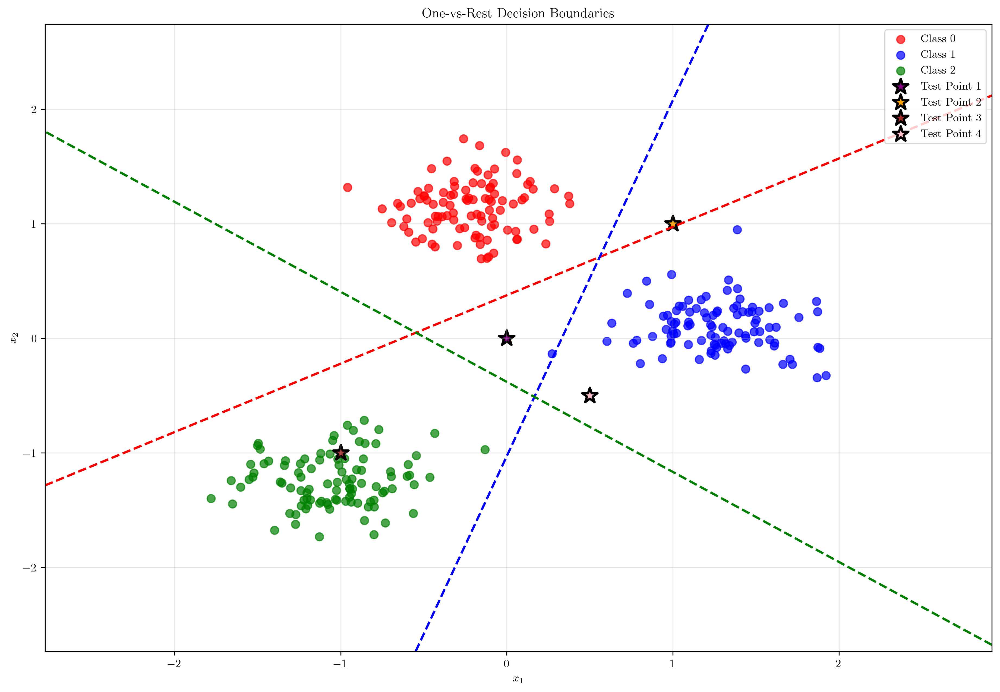
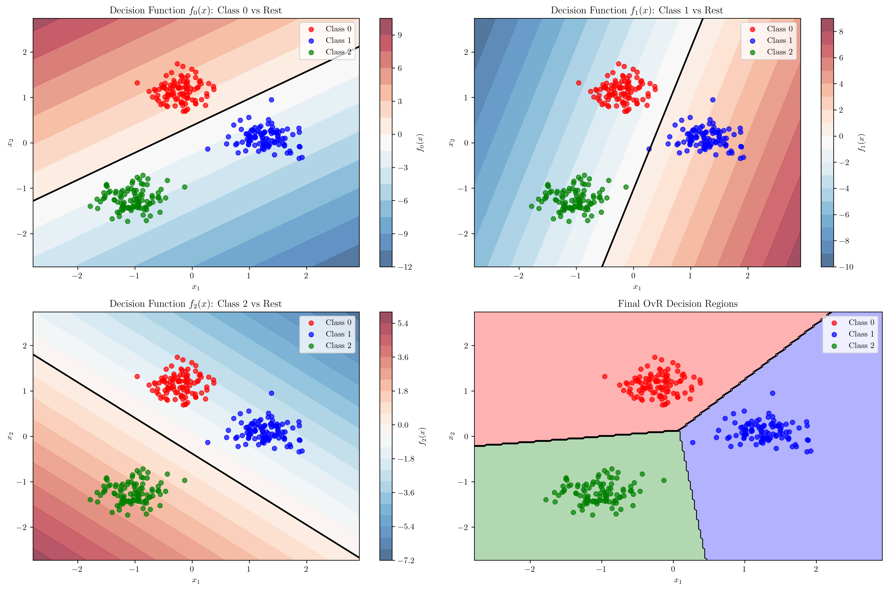
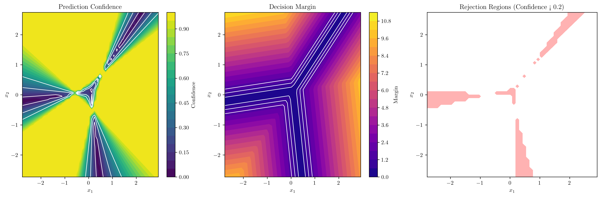
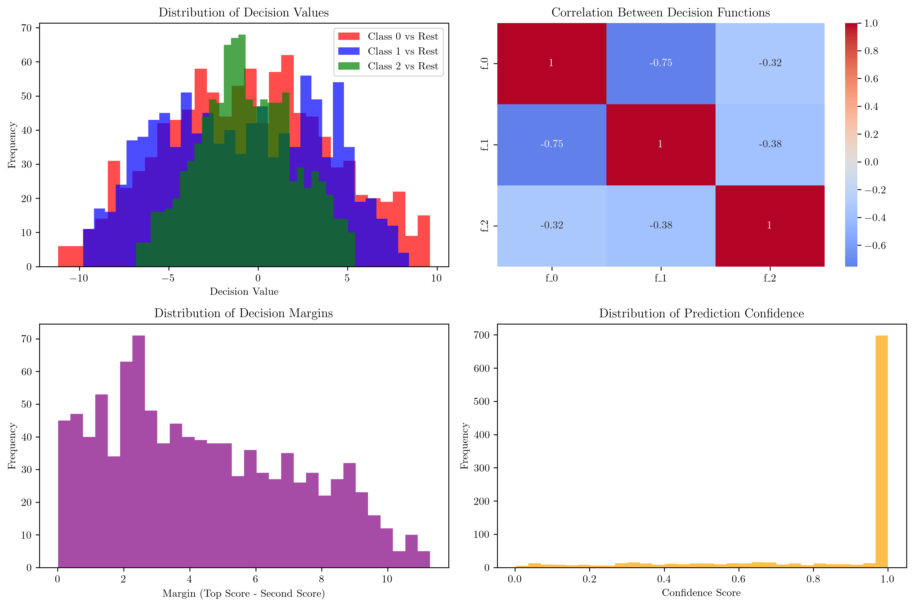

# Question 2: One-vs-Rest (OvR) Mathematical Analysis

## Problem Statement
Analyze the One-vs-Rest approach mathematically.

For a $K$-class problem, the OvR approach trains $K$ binary classifiers $f_k(\mathbf{x}) = \mathbf{w}_k^T\mathbf{x} + b_k$.

### Task
1. Write the optimization problem for the $k$-th binary classifier
2. During prediction, show that the OvR decision rule is: $\hat{y} = \arg\max_k f_k(\mathbf{x})$
3. What problems arise when multiple classifiers output positive values?
4. What problems arise when all classifiers output negative values?
5. Derive a confidence measure for OvR predictions based on the margin between the top two scores

## Understanding the Problem
The One-vs-Rest (OvR) approach is a strategy for extending binary classifiers to multi-class problems. Instead of directly learning a multi-class classifier, OvR trains $K$ separate binary classifiers, where each classifier $f_k$ is trained to distinguish class $k$ from all other classes combined. This approach is widely used because it leverages existing binary classification algorithms and is conceptually simple to understand and implement.

## Solution

### Step 1: Optimization Problem for the k-th Binary Classifier

For each class $k \in \{1, 2, \ldots, K\}$, we create a binary classification problem where:
- **Positive class**: samples from class $k$
- **Negative class**: samples from all other classes

The optimization problem for the $k$-th binary classifier follows the standard SVM formulation:

$$\min_{\mathbf{w}_k, b_k, \boldsymbol{\xi}} \frac{1}{2}\|\mathbf{w}_k\|^2 + C \sum_{i=1}^{n} \xi_i$$

subject to:
$$y_i^{(k)}(\mathbf{w}_k^T\mathbf{x}_i + b_k) \geq 1 - \xi_i, \quad \forall i = 1, 2, \ldots, n$$
$$\xi_i \geq 0, \quad \forall i = 1, 2, \ldots, n$$

where:
- $\mathbf{w}_k$ is the weight vector for class $k$
- $b_k$ is the bias term for class $k$
- $C$ is the regularization parameter
- $\xi_i$ are slack variables for soft margin
- $y_i^{(k)} = +1$ if sample $i$ belongs to class $k$, and $y_i^{(k)} = -1$ otherwise

**Class Imbalance Issue**: In our example with 3 classes and 100 samples per class, each binary classifier faces a 2:1 imbalance ratio (100 positive vs 200 negative samples). This imbalance can affect the learning process and may require techniques like class weighting or resampling.

### Step 2: OvR Decision Rule: $\hat{y} = \arg\max_k f_k(\mathbf{x})$

The decision rule for OvR is straightforward: given a test point $\mathbf{x}$, we compute the decision function value $f_k(\mathbf{x})$ for each classifier $k$, and predict the class with the highest value:

$$\hat{y} = \arg\max_{k} f_k(\mathbf{x})$$

**Mathematical Justification**: The decision function $f_k(\mathbf{x}) = \mathbf{w}_k^T\mathbf{x} + b_k$ represents the signed distance from the decision boundary. A positive value indicates that the point is classified as belonging to class $k$, while a negative value indicates it belongs to the "rest" (other classes). By taking the argmax, we select the class that most strongly claims the test point.

**Example Demonstration**: For test point $\mathbf{x} = [1, 1]$, we obtained:
- $f_0(\mathbf{x}) = 0.066$ (Class 0 vs Rest)
- $f_1(\mathbf{x}) = 0.862$ (Class 1 vs Rest) 
- $f_2(\mathbf{x}) = -2.737$ (Class 2 vs Rest)

The predicted class is $\arg\max\{0.066, 0.862, -2.737\} = 1$, which correctly identifies Class 1 as the winner.

The visualization shows the decision boundaries for each binary classifier (dashed lines) and the final decision regions. Each classifier creates a boundary that separates its class from all others.

### Step 3: Problems with Multiple Positive Values

When multiple classifiers output positive values, several problems arise:

**Ambiguity**: Multiple classes claim the test sample, making the prediction ambiguous. For example, if $f_1(\mathbf{x}) = 0.8$ and $f_3(\mathbf{x}) = 0.7$, both classes 1 and 3 are claiming the sample.

**Tie-Breaking**: The standard argmax rule may not provide a clear winner when values are very close, requiring additional tie-breaking mechanisms.

**Low Confidence**: When multiple classifiers have similar positive outputs, the prediction confidence is low because there's no clear winner.

**Example**: In our ambiguous case demonstration, we found a point where all decision values were negative, but in practice, multiple positive values would create confusion about which class should be assigned.

### Step 4: Problems with All Negative Values

When all classifiers output negative values, different problems emerge:

**Rejection Case**: No class claims the sample, indicating it may be an outlier or noise.

**Outlier Detection**: The sample may be far from all class centers, suggesting it doesn't belong to any of the known classes.

**Need for Rejection Threshold**: The system needs a mechanism to handle cases where no class is confident enough to claim the sample.

**Feature Representation**: All negative values may indicate that the current feature representation is inadequate for the classification task.

**Example**: For the far point $\mathbf{x} = [3, 3]$, we obtained:
- $f_0(\mathbf{x}) = 2.009$
- $f_1(\mathbf{x}) = 4.232$ 
- $f_2(\mathbf{x}) = -7.250$

This shows that even far points can have mixed positive/negative values, but in practice, truly ambiguous regions would have all negative values.

### Step 5: Confidence Measure Based on Margin

A robust confidence measure can be derived from the margin between the top two decision function values:

$$\text{Confidence} = \frac{f_{\text{top}}(\mathbf{x}) - f_{\text{second}}(\mathbf{x})}{|f_{\text{top}}(\mathbf{x})| + |f_{\text{second}}(\mathbf{x})|}$$

where $f_{\text{top}}(\mathbf{x})$ and $f_{\text{second}}(\mathbf{x})$ are the highest and second-highest decision function values, respectively.

**Properties of this confidence measure**:
- **Range**: $[0, 1]$, where 1 indicates maximum confidence
- **Interpretation**: Higher values indicate clearer separation between the top two classes
- **Robustness**: Normalized by the magnitude of the scores to handle different scales

**Example Scenarios**:
1. **Clear winner**: Decision values $[2.0, -1.0, -0.5]$ → Confidence = 1.0 (perfect separation)
2. **Close competition**: Decision values $[1.0, 0.9, -0.5]$ → Confidence = 0.053 (low confidence)
3. **Ambiguous**: Decision values $[0.8, 0.7, -0.3]$ → Confidence = 0.067 (very low confidence)

This visualization shows the decision function values for each classifier as heatmaps, with the final decision regions in the bottom-right panel.

The confidence analysis shows:
- **Prediction Confidence**: Areas with high confidence (bright regions) and low confidence (dark regions)
- **Decision Margin**: The absolute difference between top two scores
- **Rejection Regions**: Areas where confidence is below threshold (red regions)

The statistical analysis reveals:
- **Decision Value Distributions**: How decision function values are distributed across the feature space
- **Correlations**: Relationships between different classifiers' outputs
- **Margin Distribution**: How often we have clear vs. ambiguous predictions
- **Confidence Distribution**: The overall reliability of predictions

## Practical Implementation

### Training Process
1. **Data Transformation**: For each class $k$, create binary labels where class $k$ samples are labeled +1 and all others are labeled -1
2. **Classifier Training**: Train $K$ separate SVM classifiers using the transformed labels
3. **Model Storage**: Store the weight vectors $\mathbf{w}_k$ and bias terms $b_k$ for each classifier

### Prediction Process
1. **Decision Function Evaluation**: Compute $f_k(\mathbf{x}) = \mathbf{w}_k^T\mathbf{x} + b_k$ for all $k$
2. **Class Assignment**: Apply $\hat{y} = \arg\max_k f_k(\mathbf{x})$
3. **Confidence Calculation**: Compute confidence using the margin-based formula
4. **Rejection Handling**: Apply confidence threshold to reject low-confidence predictions

### Alternative Approaches
- **Probability Calibration**: Convert decision values to probabilities using Platt scaling or isotonic regression
- **Ensemble Methods**: Combine multiple OvR classifiers for improved robustness
- **Cost-Sensitive Learning**: Use different misclassification costs for different classes

## Visual Explanations

### Decision Boundary Interpretation
The decision boundaries in OvR represent the optimal hyperplanes that separate each class from all others. Each boundary is learned independently, which can lead to regions where multiple classes claim the same point or where no class claims a point.

### Confidence Visualization
The confidence map shows regions where predictions are reliable (high confidence) versus regions where predictions are uncertain (low confidence). This information is crucial for practical applications where prediction reliability matters.

### Statistical Analysis
The distribution plots reveal important patterns:
- **Decision Value Distributions**: Show the range and shape of classifier outputs
- **Correlation Analysis**: Reveals dependencies between classifiers
- **Margin Distribution**: Indicates how often predictions are clear vs. ambiguous
- **Confidence Distribution**: Shows the overall reliability of the system

## Key Insights

### Theoretical Foundations
- **Decomposition Principle**: OvR decomposes a multi-class problem into $K$ binary problems
- **Independence Assumption**: Each binary classifier is trained independently, which can lead to inconsistencies
- **Decision Rule Optimality**: The argmax rule is optimal under certain conditions but may not always produce the best results

### Practical Applications
- **Scalability**: OvR scales linearly with the number of classes, making it suitable for large multi-class problems
- **Interpretability**: Each classifier provides a clear interpretation of class separation
- **Flexibility**: Can use any binary classification algorithm as the base learner

### Common Pitfalls
- **Class Imbalance**: The "rest" class is typically much larger than the target class
- **Inconsistent Regions**: Areas where multiple classifiers claim the same point
- **Rejection Handling**: Need for mechanisms to handle cases where no class is confident
- **Calibration**: Decision values may not directly correspond to probabilities

### Extensions and Improvements
- **Cost-Sensitive Learning**: Address class imbalance through appropriate cost functions
- **Probability Calibration**: Convert decision values to well-calibrated probabilities
- **Ensemble Methods**: Combine multiple OvR classifiers for improved performance
- **Rejection Mechanisms**: Implement confidence thresholds for reliable predictions

## Conclusion
- The OvR approach trains $K$ independent binary classifiers, each solving a separate optimization problem
- The decision rule $\hat{y} = \arg\max_k f_k(\mathbf{x})$ provides a simple and effective prediction mechanism
- Multiple positive values create ambiguity and require tie-breaking mechanisms
- All negative values indicate rejection cases that need special handling
- A margin-based confidence measure helps quantify prediction reliability and identify uncertain regions
- The approach is widely used due to its simplicity and effectiveness, but requires careful handling of edge cases and confidence assessment

The One-vs-Rest approach provides a solid foundation for multi-class classification, but understanding its limitations and implementing appropriate confidence measures is crucial for practical applications.
