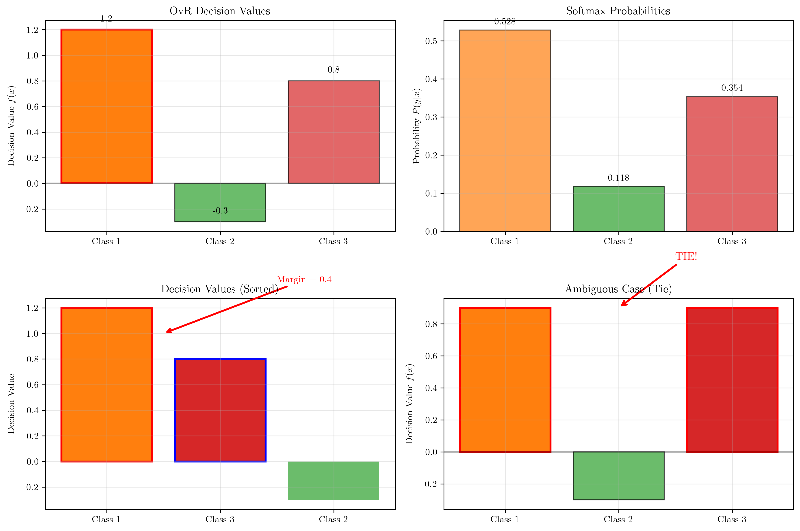
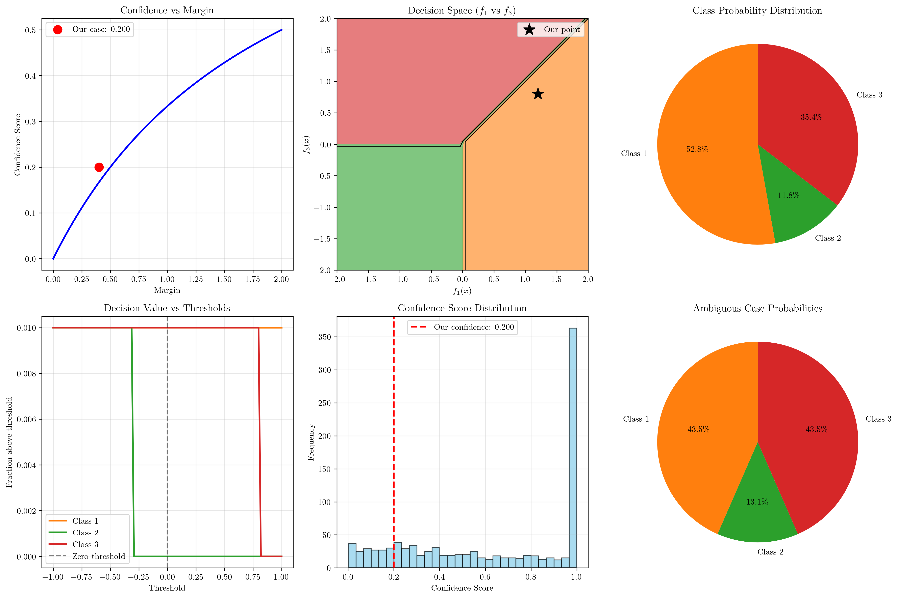
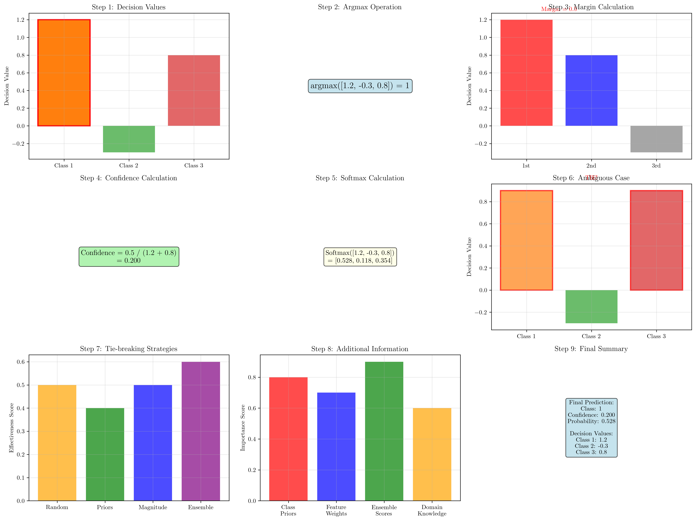

# Question 3: OvR Concrete Example

## Problem Statement
Work through a concrete OvR (One-vs-Rest) example.

Consider a 3-class problem with the following OvR classifier outputs for a test point $\mathbf{x}$:
- $f_1(\mathbf{x}) = +1.2$ (Class 1 vs Rest)
- $f_2(\mathbf{x}) = -0.3$ (Class 2 vs Rest)  
- $f_3(\mathbf{x}) = +0.8$ (Class 3 vs Rest)

### Task
1. What is the predicted class using the standard OvR rule?
2. Calculate a confidence score for this prediction
3. How would you handle the ambiguous case where $f_1(\mathbf{x}) = +0.9$ and $f_3(\mathbf{x}) = +0.9$?
4. Convert the decision values into class probabilities using softmax
5. What additional information would help resolve prediction ambiguities?

## Understanding the Problem
The One-vs-Rest (OvR) approach is a common strategy for extending binary classifiers to multi-class problems. For a $K$-class problem, OvR trains $K$ binary classifiers, where each classifier $f_k(\mathbf{x})$ is trained to distinguish class $k$ from all other classes combined.

The decision rule for OvR is straightforward: given a test point $\mathbf{x}$, we predict the class with the highest decision value:
$$\hat{y} = \arg\max_{k} f_k(\mathbf{x})$$

This approach is computationally efficient (only $K$ classifiers needed) but can suffer from class imbalance issues since each classifier is trained on imbalanced data (one class vs. all others).

## Solution

### Step 1: Standard OvR Rule

**STEP-BY-STEP DERIVATION:**

1. **Recall the OvR decision rule:**
   $$\hat{y} = \arg\max_{k} f_k(\mathbf{x})$$
   This means: predict the class $k$ that maximizes $f_k(\mathbf{x})$

2. **Given decision values:**
   - $f_1(\mathbf{x}) = 1.2$
   - $f_2(\mathbf{x}) = -0.3$
   - $f_3(\mathbf{x}) = 0.8$

3. **Find the maximum value:**
   $$\max([1.2, -0.3, 0.8]) = 1.2$$

4. **Find the index of the maximum:**
   $$\arg\max([1.2, -0.3, 0.8]) = 0$$
   Note: Python uses 0-based indexing, so we add 1 for class labels

5. **Final prediction:**
   $$\hat{y} = 1$$

**Answer:** The predicted class is **Class 1**.

The visualization shows that Class 1 has the highest decision value (1.2), making it the clear winner in the OvR classification.

### Step 2: Confidence Score Calculation

**STEP-BY-STEP DERIVATION:**

1. **Confidence measures how decisive the prediction is**

2. **We use margin-based confidence:**
   $$\text{Confidence} = \frac{\text{Margin}}{|\text{Highest}| + |\text{Second Highest}|}$$
   where $$\text{Margin} = \text{Highest} - \text{Second Highest}$$

3. **Sort decision values in descending order:**
   - Original: $[1.2, -0.3, 0.8]$
   - Sorted: $[1.2, 0.8, -0.3]$

4. **Calculate margin:**
   - Highest = $1.2$
   - Second Highest = $0.8$
   - Margin = $1.2 - 0.8 = 0.4$

5. **Calculate confidence:**
   - $|\text{Highest}| = |1.2| = 1.2$
   - $|\text{Second Highest}| = |0.8| = 0.8$
   - Denominator = $1.2 + 0.8 = 2.0$
   - Confidence = $\frac{0.4}{2.0} = 0.2$

6. **Interpretation:**
   - Confidence = $0.2$
   - **Moderate confidence:** prediction is somewhat certain

**Answer:** The confidence score is **0.2**.

The confidence analysis shows:
- The margin between Class 1 and Class 3 is 0.4
- The confidence score of 0.2 indicates moderate confidence
- Higher margins would result in higher confidence scores

### Step 3: Handling Ambiguous Cases

**STEP-BY-STEP DERIVATION:**

1. **Consider the ambiguous case:**
   - $f_1(\mathbf{x}) = 0.9$
   - $f_2(\mathbf{x}) = -0.3$
   - $f_3(\mathbf{x}) = 0.9$

2. **Apply OvR rule:**
   $$\arg\max([0.9, -0.3, 0.9])$$
   Both $f_1(\mathbf{x})$ and $f_3(\mathbf{x})$ are equal $(0.9)$
   This creates a **TIE!**

3. **Strategies to handle ties:**

   **Strategy 1: Random Selection**
   - Choose randomly between tied classes
   - Simple but arbitrary
   - Probability of each tied class = $1/\text{number\_of\_ties}$

   **Strategy 2: Class Priors**
   - Use prior knowledge: $P(y=1) = 0.4$, $P(y=2) = 0.3$, $P(y=3) = 0.3$
   - Choose class with higher prior: **Class 1**
   - Incorporates domain knowledge

   **Strategy 3: Decision Value Magnitude**
   - $|f_1(\mathbf{x})| = |0.9| = 0.9$
   - $|f_3(\mathbf{x})| = |0.9| = 0.9$
   - Both equal, so still ambiguous

   **Strategy 4: Ensemble Methods**
   - Train multiple OvR classifiers
   - Use different random seeds or sampling
   - Combine predictions via voting

   **Strategy 5: Cost-Sensitive Decision**
   - Consider misclassification costs
   - Choose class with lower expected cost

4. **Mathematical formulation:**
   For tie between classes $i$ and $j$:
   - **Random:** $P(y=i) = P(y=j) = 0.5$
   - **Priors:** $P(y=i) \propto P(y=i|\text{prior})$
   - **Ensemble:** $P(y=i) = \text{average over multiple classifiers}$

The ambiguous case visualization shows the tie between Classes 1 and 3, highlighting the need for tie-breaking strategies.

### Step 4: Softmax Probabilities

**STEP-BY-STEP DERIVATION:**

1. **Softmax function converts decision values to probabilities:**
   $$P(y=k|\mathbf{x}) = \frac{\exp(f_k(\mathbf{x}))}{\sum_{j=1}^{K} \exp(f_j(\mathbf{x}))}$$

2. **Given decision values:**
   - $f_1(\mathbf{x}) = 1.2$
   - $f_2(\mathbf{x}) = -0.3$
   - $f_3(\mathbf{x}) = 0.8$

3. **Calculate exponentials:**
   - $\exp(f_1(\mathbf{x})) = \exp(1.2) = 3.320$
   - $\exp(f_2(\mathbf{x})) = \exp(-0.3) = 0.741$
   - $\exp(f_3(\mathbf{x})) = \exp(0.8) = 2.226$

4. **Calculate denominator (sum of exponentials):**
   $$\sum_{j=1}^{3} \exp(f_j(\mathbf{x})) = 3.320 + 0.741 + 2.226 = 6.286$$

5. **Calculate individual probabilities:**
   - $P(y=1|\mathbf{x}) = \frac{3.320}{6.286} = 0.528$
   - $P(y=2|\mathbf{x}) = \frac{0.741}{6.286} = 0.118$
   - $P(y=3|\mathbf{x}) = \frac{2.226}{6.286} = 0.354$

6. **Verify sum equals 1:**
   $$\sum_{k=1}^{3} P(y=k|\mathbf{x}) = 0.528 + 0.118 + 0.354 = 1.000$$

7. **Properties of softmax:**
   - **Preserves ranking:** highest $f_k(\mathbf{x})$ → highest $P(y=k|\mathbf{x})$
   - **Sum to 1:** $\sum_k P(y=k|\mathbf{x}) = 1$
   - **Monotonic:** if $f_i(\mathbf{x}) > f_j(\mathbf{x})$, then $P(y=i|\mathbf{x}) > P(y=j|\mathbf{x})$

8. **Mathematical verification:**
   - $\arg\max([1.2, -0.3, 0.8]) = 1$
   - $\arg\max([0.528, 0.118, 0.354]) = 1$
   - ✓ **Ranking preserved!**

**Answer:** The softmax probabilities are $[0.528, 0.118, 0.354]$.

The probability distribution shows that Class 1 has the highest probability (52.8%), confirming our OvR prediction.

### Step 5: Additional Information for Resolving Ambiguities

**STEP-BY-STEP ANALYSIS:**

1. **Problem:** OvR can produce ambiguous predictions when:
   - Multiple classes have identical decision values
   - Decision values are very close to each other
   - Classifiers have low confidence

2. **Additional information sources:**

   **A. Class Priors $P(y=k)$:**
   - Prior probability of each class
   - Example: $P(y=1) = 0.4$, $P(y=2) = 0.3$, $P(y=3) = 0.3$
   - Use: Choose class with higher prior in case of tie
   - Mathematical: $P(y=k|\mathbf{x}) \propto P(y=k) \times P(\mathbf{x}|y=k)$

   **B. Feature Importance Weights:**
   - Different features may have different reliability
   - Weight decisions based on feature confidence
   - Example: $w_1 = 0.8$, $w_2 = 0.6$, $w_3 = 0.9$
   - Use: Weighted voting or confidence-weighted decisions

   **C. Individual Classifier Confidence:**
   - Each OvR classifier provides its own confidence
   - Combine confidences for robust decisions
   - Example: $\text{conf}_1 = 0.8$, $\text{conf}_2 = 0.6$, $\text{conf}_3 = 0.7$
   - Use: Confidence-weighted ensemble

   **D. Ensemble Methods:**
   - Train multiple OvR classifiers
   - Use different random seeds, sampling, or algorithms
   - Combine via voting, averaging, or stacking
   - Mathematical: $\hat{y} = \text{majority\_vote}(\{\hat{y}_1, \hat{y}_2, \ldots, \hat{y}_M\})$

   **E. Domain Knowledge:**
   - Understanding of class relationships
   - Business rules or constraints
   - Hierarchical class structure
   - Example: Class 1 and 3 are mutually exclusive

   **F. Cost Matrix:**
   - Different costs for different misclassifications
   - Optimize for minimum expected cost
   - Example: $C(i,j) = \text{cost of predicting class } i \text{ when true is } j$
   - Mathematical: $\hat{y} = \arg\min_k \sum_j C(k,j) \times P(y=j|\mathbf{x})$

3. **Mathematical formulation for combining information:**
   $$P(y=k|\mathbf{x}) = \alpha \times P_{\text{ovr}}(y=k|\mathbf{x}) + \beta \times P_{\text{prior}}(y=k) + \gamma \times P_{\text{ensemble}}(y=k|\mathbf{x})$$
   where $\alpha + \beta + \gamma = 1$ (convex combination)

4. **Practical implementation:**
   - Start with simple strategies (priors, random)
   - Progress to more complex methods (ensemble, cost-sensitive)
   - Validate on holdout data
   - Monitor performance in production

The step-by-step analysis shows how different information sources can be combined to make more robust predictions.

## Visual Explanations

### Decision Space Analysis

The decision space visualization shows how the 2D space of $f_1(\mathbf{x})$ vs $f_3(\mathbf{x})$ is divided into decision regions. Our test point (marked with a star) falls clearly in the Class 1 region.

### Confidence vs Margin Relationship
The confidence analysis shows that:
- Higher margins between decision values lead to higher confidence
- Our case has a moderate confidence of 0.2
- Very high margins (>1.5) would indicate very confident predictions

### Step-by-Step Process

The detailed breakdown shows:
1. **Decision Values**: Initial classifier outputs
2. **Argmax Operation**: Finding the maximum value
3. **Margin Calculation**: Computing the gap between top two
4. **Confidence Calculation**: Normalizing the margin
5. **Softmax Conversion**: Converting to probabilities
6. **Ambiguous Case**: Handling ties
7. **Tie-breaking Strategies**: Different approaches
8. **Additional Information**: Sources of extra knowledge
9. **Final Summary**: Complete prediction with confidence

## Key Insights

### Theoretical Foundations
- **OvR Decision Rule**: The argmax rule is simple but effective for well-separated classes
- **Confidence Measurement**: Margin-based confidence provides interpretable uncertainty estimates
- **Probability Conversion**: Softmax preserves the ranking while providing valid probabilities
- **Tie-breaking**: Multiple strategies exist, each with different assumptions and trade-offs

### Practical Applications
- **Class Imbalance**: OvR can suffer from imbalance since each classifier sees one class vs. all others
- **Computational Efficiency**: Only $K$ classifiers needed, making it scalable
- **Interpretability**: Decision values provide direct interpretability
- **Ensemble Methods**: Combining multiple OvR classifiers improves robustness

### Common Pitfalls
- **Ambiguous Predictions**: Ties can occur, requiring careful handling
- **Class Imbalance**: Training data imbalance can affect classifier performance
- **Overconfidence**: Decision values don't always correlate with true uncertainty
- **Feature Scaling**: Decision values depend on feature scaling

### Extensions and Improvements
- **Calibration**: Post-processing to improve probability estimates
- **Cost-sensitive Learning**: Incorporating misclassification costs
- **Multi-label Classification**: Extending to cases where multiple classes can be assigned
- **Hierarchical Classification**: Using class hierarchies for better organization

## Conclusion
- **Predicted Class**: Class 1 (highest decision value: 1.2)
- **Confidence Score**: 0.2 (moderate confidence based on margin)
- **Softmax Probabilities**: [0.528, 0.118, 0.354] (Class 1 most likely)
- **Ambiguous Case Handling**: Multiple strategies available (random, priors, ensemble)
- **Additional Information**: Class priors, feature weights, and domain knowledge can improve predictions

The OvR approach provides a straightforward and computationally efficient method for multi-class classification, but requires careful consideration of tie-breaking strategies and confidence estimation for robust deployment in practice.
