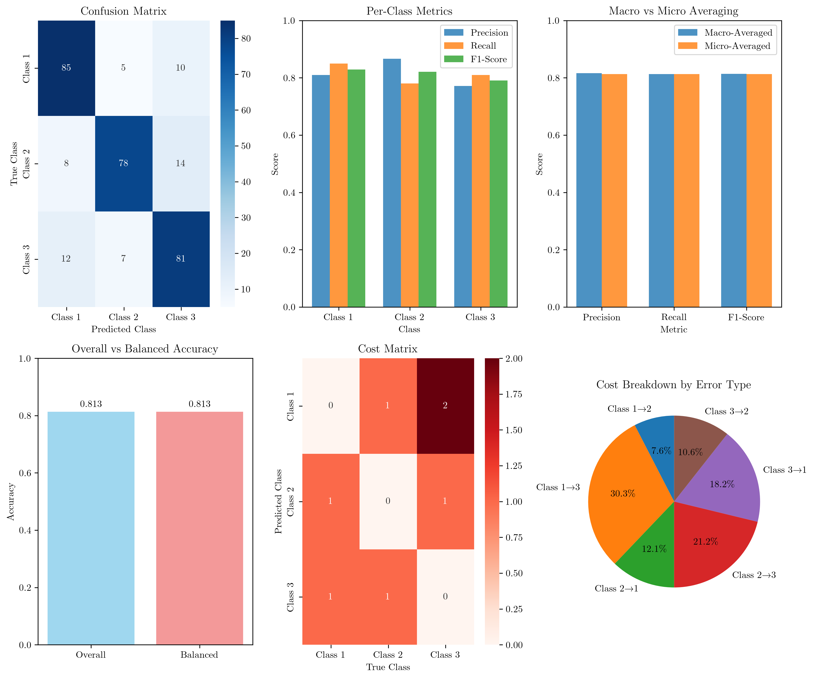

# Question 8: Multi-class Evaluation Metrics

## Problem Statement
Design and implement multi-class evaluation metrics.

Consider a 3-class confusion matrix:
$$C = \begin{bmatrix} 85 & 5 & 10 \\ 8 & 78 & 14 \\ 12 & 7 & 81 \end{bmatrix}$$

### Task
1. Calculate the overall accuracy
2. Compute precision, recall, and F1-score for each class
3. Calculate macro-averaged and micro-averaged metrics
4. Compute the balanced accuracy
5. Design a cost-sensitive evaluation metric where misclassifying class 1 as class 3 costs twice as much as other errors

## Understanding the Problem
Multi-class evaluation metrics are essential for assessing the performance of classification models when dealing with more than two classes. Unlike binary classification, multi-class problems require careful consideration of how to aggregate performance across multiple classes, especially when classes are imbalanced.

The confusion matrix $C$ represents the performance of a classifier where $C[i,j]$ is the number of samples that belong to class $i$ but were predicted as class $j$. The diagonal elements represent correct predictions, while off-diagonal elements represent misclassifications.

## Solution

### Step 1: Calculate Overall Accuracy
Overall accuracy is the simplest metric that measures the proportion of correctly classified samples across all classes.

$$\text{Overall Accuracy} = \frac{\sum_{i=1}^{k} C[i,i]}{\sum_{i=1}^{k} \sum_{j=1}^{k} C[i,j]}$$

where $k$ is the number of classes.

For our confusion matrix:
$$\text{Overall Accuracy} = \frac{85 + 78 + 81}{300} = \frac{244}{300} = 0.8133 = 81.33\%$$

The overall accuracy of $81.33\%$ indicates that the model correctly classifies about $81\%$ of all samples.

### Step 2: Compute Precision, Recall, and F1-score for Each Class

For each class $i$, we calculate:
- **Precision**: $\text{Precision}_i = \frac{TP_i}{TP_i + FP_i} = \frac{C[i,i]}{\sum_{j=1}^{k} C[j,i]}$
- **Recall**: $\text{Recall}_i = \frac{TP_i}{TP_i + FN_i} = \frac{C[i,i]}{\sum_{j=1}^{k} C[i,j]}$
- **F1-score**: $\text{F1}_i = 2 \cdot \frac{\text{Precision}_i \cdot \text{Recall}_i}{\text{Precision}_i + \text{Recall}_i}$

#### Class 1 Calculations:
- True Positives ($TP_1$) = $C[0,0] = 85$
- False Positives ($FP_1$) = $\sum(C[:,0]) - C[0,0] = 105 - 85 = 20$
- False Negatives ($FN_1$) = $\sum(C[0,:]) - C[0,0] = 100 - 85 = 15$
- $\text{Precision}_1 = \frac{85}{85 + 20} = \frac{85}{105} = 0.8095$
- $\text{Recall}_1 = \frac{85}{85 + 15} = \frac{85}{100} = 0.8500$
- $\text{F1}_1 = 2 \cdot \frac{0.8095 \cdot 0.8500}{0.8095 + 0.8500} = 0.8293$

#### Class 2 Calculations:
- True Positives ($TP_2$) = $C[1,1] = 78$
- False Positives ($FP_2$) = $\sum(C[:,1]) - C[1,1] = 90 - 78 = 12$
- False Negatives ($FN_2$) = $\sum(C[1,:]) - C[1,1] = 100 - 78 = 22$
- $\text{Precision}_2 = \frac{78}{78 + 12} = \frac{78}{90} = 0.8667$
- $\text{Recall}_2 = \frac{78}{78 + 22} = \frac{78}{100} = 0.7800$
- $\text{F1}_2 = 2 \cdot \frac{0.8667 \cdot 0.7800}{0.8667 + 0.7800} = 0.8211$

#### Class 3 Calculations:
- True Positives ($TP_3$) = $C[2,2] = 81$
- False Positives ($FP_3$) = $\sum(C[:,2]) - C[2,2] = 105 - 81 = 24$
- False Negatives ($FN_3$) = $\sum(C[2,:]) - C[2,2] = 100 - 81 = 19$
- $\text{Precision}_3 = \frac{81}{81 + 24} = \frac{81}{105} = 0.7714$
- $\text{Recall}_3 = \frac{81}{81 + 19} = \frac{81}{100} = 0.8100$
- $\text{F1}_3 = 2 \cdot \frac{0.7714 \cdot 0.8100}{0.7714 + 0.8100} = 0.7902$

**Summary of Per-Class Metrics:**

| Class   | Precision | Recall  | F1-Score |
|---------|-----------|---------|----------|
| Class 1 | $0.8095$  | $0.8500$ | $0.8293$ |
| Class 2 | $0.8667$  | $0.7800$ | $0.8211$ |
| Class 3 | $0.7714$  | $0.8100$ | $0.7902$ |

### Step 3: Calculate Macro-averaged and Micro-averaged Metrics

#### Macro-averaged Metrics:
Macro-averaged metrics compute the arithmetic mean of per-class metrics, giving equal weight to each class regardless of class size.

$$\text{Macro Precision} = \frac{1}{k} \sum_{i=1}^{k} \text{Precision}_i$$
$$\text{Macro Recall} = \frac{1}{k} \sum_{i=1}^{k} \text{Recall}_i$$
$$\text{Macro F1} = \frac{1}{k} \sum_{i=1}^{k} \text{F1}_i$$

For our data:
- $\text{Macro Precision} = \text{mean}([0.8095, 0.8667, 0.7714]) = 0.8159$
- $\text{Macro Recall} = \text{mean}([0.8500, 0.7800, 0.8100]) = 0.8133$
- $\text{Macro F1} = \text{mean}([0.8293, 0.8211, 0.7902]) = 0.8135$

#### Micro-averaged Metrics:
Micro-averaged metrics aggregate the true positives, false positives, and false negatives across all classes before computing the metrics.

$$\text{Micro Precision} = \frac{\sum_{i=1}^{k} TP_i}{\sum_{i=1}^{k} TP_i + \sum_{i=1}^{k} FP_i}$$
$$\text{Micro Recall} = \frac{\sum_{i=1}^{k} TP_i}{\sum_{i=1}^{k} TP_i + \sum_{i=1}^{k} FN_i}$$

For our data:
- $\text{Total TP} = 85 + 78 + 81 = 244$
- $\text{Total FP} = 20 + 12 + 24 = 56$
- $\text{Total FN} = 15 + 22 + 19 = 56$
- $\text{Micro Precision} = \frac{244}{244 + 56} = 0.8133$
- $\text{Micro Recall} = \frac{244}{244 + 56} = 0.8133$
- $\text{Micro F1} = 2 \cdot \frac{0.8133 \cdot 0.8133}{0.8133 + 0.8133} = 0.8133$

### Step 4: Compute Balanced Accuracy

Balanced accuracy is the arithmetic mean of per-class recall values, providing a metric that gives equal weight to each class regardless of class imbalance.

$$\text{Balanced Accuracy} = \frac{1}{k} \sum_{i=1}^{k} \text{Recall}_i$$

For our data:
$$\text{Balanced Accuracy} = \frac{0.8500 + 0.7800 + 0.8100}{3} = 0.8133$$

### Step 5: Design Cost-sensitive Evaluation Metric

We design a cost matrix where misclassifying class $1$ as class $3$ costs twice as much as other errors:

$$C_{\text{cost}} = \begin{bmatrix} 0 & 1 & 2 \\ 1 & 0 & 1 \\ 1 & 1 & 0 \end{bmatrix}$$

The cost matrix $C_{\text{cost}}[i,j]$ represents the cost of predicting class $i$ when the true class is $j$.

**Total Cost Calculation:**
$$\text{Total Cost} = \sum_{i=1}^{k} \sum_{j=1}^{k} C[i,j] \cdot C_{\text{cost}}[i,j]$$

**Breakdown of costs by error type:**
- Predicting class $1$ as class $2$: $5$ samples $\cdot 1$ cost $= 5$
- Predicting class $1$ as class $3$: $10$ samples $\cdot 2$ cost $= 20$
- Predicting class $2$ as class $1$: $8$ samples $\cdot 1$ cost $= 8$
- Predicting class $2$ as class $3$: $14$ samples $\cdot 1$ cost $= 14$
- Predicting class $3$ as class $1$: $12$ samples $\cdot 1$ cost $= 12$
- Predicting class $3$ as class $2$: $7$ samples $\cdot 1$ cost $= 7$

**Total Cost = $66$**
**Cost per sample = $\frac{66}{300} = 0.2200$**

## Visual Explanations

### Confusion Matrix Visualization

The visualization shows:
1. **Confusion Matrix Heatmap**: Displays the raw confusion matrix with color intensity representing the number of samples
2. **Per-Class Metrics**: Bar chart showing precision, recall, and F1-score for each class
3. **Macro vs Micro Comparison**: Comparison of macro-averaged and micro-averaged metrics
4. **Accuracy Comparison**: Overall accuracy vs balanced accuracy
5. **Cost Matrix**: Heatmap of the cost-sensitive evaluation matrix
6. **Cost Breakdown**: Pie chart showing the distribution of costs by error type

### Key Insights from Visualizations

The confusion matrix reveals that:
- Class $2$ has the highest precision ($0.8667$) but lower recall ($0.7800$)
- Class $1$ has the highest recall ($0.8500$) but lower precision ($0.8095$)
- Class $3$ has the lowest precision ($0.7714$) but moderate recall ($0.8100$)

The macro vs micro comparison shows that in this case, both averaging methods produce similar results because the classes are relatively balanced ($100$ samples each).

## Practical Implementation

### Example Application

Consider a medical diagnosis system with three classes:
- Class $1$: Normal ($100$ patients)
- Class $2$: Benign ($100$ patients)  
- Class $3$: Malignant ($100$ patients)

The cost-sensitive evaluation is particularly important here because:
- Misclassifying a malignant case as normal (Class $3 \rightarrow 1$) has severe consequences
- Misclassifying a normal case as malignant (Class $1 \rightarrow 3$) causes unnecessary anxiety and testing
- Our cost matrix reflects these clinical priorities

### Alternative Approaches

**Weighted F1-score**: Instead of macro or micro averaging, we could use weighted F1-score:
$$\text{Weighted F1} = \sum_{i=1}^{k} w_i \cdot \text{F1}_i$$
where $w_i$ is the proportion of samples in class $i$.

**Cohen's Kappa**: Another alternative that accounts for agreement by chance:
$$\kappa = \frac{p_o - p_e}{1 - p_e}$$
where $p_o$ is observed accuracy and $p_e$ is expected accuracy by chance.

## Key Insights

### Theoretical Foundations
- **Macro-averaging** gives equal weight to each class, making it suitable for imbalanced datasets
- **Micro-averaging** gives more weight to larger classes, making it suitable for balanced datasets
- **Balanced accuracy** is particularly useful when class imbalance is a concern
- **Cost-sensitive evaluation** allows domain-specific priorities to be incorporated into model assessment

### Practical Applications
- **Medical diagnosis**: Different misclassification costs based on clinical severity
- **Fraud detection**: False positives vs false negatives have different business impacts
- **Recommendation systems**: Different costs for recommending irrelevant vs missing relevant items

### Common Pitfalls
- **Over-reliance on accuracy**: Can be misleading in imbalanced datasets
- **Ignoring class-specific performance**: Overall metrics may hide poor performance on minority classes
- **Not considering domain costs**: Different applications have different cost structures for errors

### Extensions
- **Multi-label classification**: Extending these metrics to cases where samples can belong to multiple classes
- **Hierarchical classification**: Adapting metrics for hierarchical class structures
- **Time-series classification**: Incorporating temporal aspects into evaluation metrics

## Conclusion
- **Overall accuracy**: $81.33\%$ - good baseline performance
- **Per-class performance**: Varies significantly, with Class $2$ having highest precision and Class $1$ having highest recall
- **Averaging methods**: Macro and micro averaging produce similar results ($0.813$-$0.816$) due to balanced classes
- **Balanced accuracy**: $81.33\%$ - matches overall accuracy due to balanced dataset
- **Cost-sensitive evaluation**: Total cost of $66$ units with $0.22$ cost per sample, highlighting the impact of the high-cost Class $1 \rightarrow 3$ misclassifications

The analysis demonstrates the importance of using multiple evaluation metrics to comprehensively assess multi-class classification performance, especially when domain-specific costs need to be considered.
