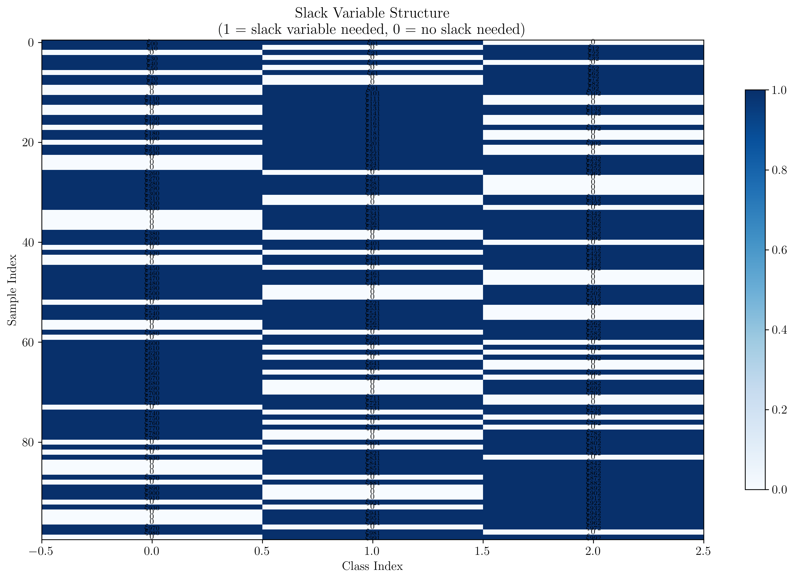
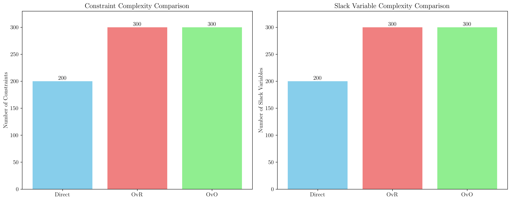
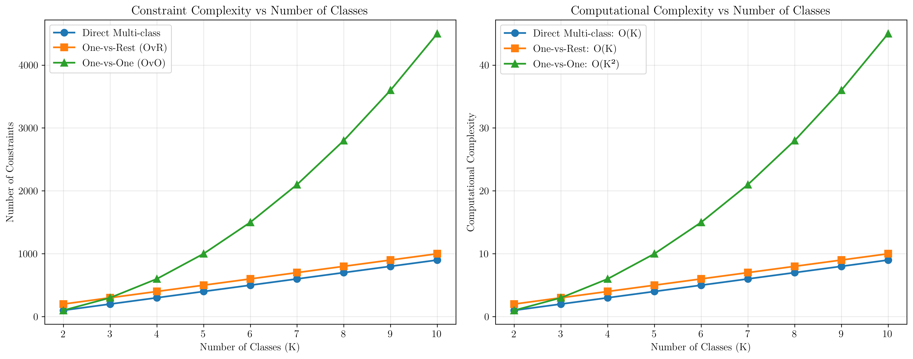
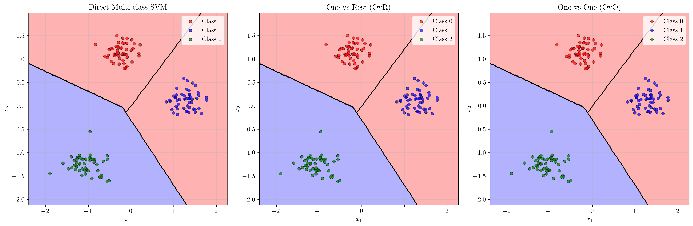

# Question 9: Direct Multi-class SVM Formulation

## Problem Statement
Investigate direct multi-class SVM formulations.

The direct approach optimizes:
$$\min_{\mathbf{W}, \boldsymbol{\xi}} \frac{1}{2}||\mathbf{W}||_F^2 + C\sum_{i=1}^n \sum_{k \neq y_i} \xi_{ik}$$
$$\text{subject to: } \mathbf{w}_{y_i}^T\mathbf{x}_i - \mathbf{w}_k^T\mathbf{x}_i \geq 1 - \xi_{ik}, \quad \xi_{ik} \geq 0$$

### Task
1. Interpret the constraint: what does it ensure for the correct class vs incorrect classes?
2. How many slack variables are needed for $n$ samples and $K$ classes?
3. Compare this to the total complexity of OvR and OvO approaches
4. Derive the dual formulation for the direct multi-class SVM
5. What are the advantages and disadvantages compared to decomposition methods?

## Understanding the Problem
The direct multi-class SVM formulation extends the binary SVM to handle multiple classes in a single optimization problem. Instead of decomposing the problem into multiple binary classifiers (like One-vs-Rest or One-vs-One), this approach directly optimizes a multi-class objective function.

The key insight is that for each training sample $\mathbf{x}_i$ with true label $y_i$, we want the score for the correct class to be higher than the scores for all incorrect classes by at least a margin of 1. This is enforced through the constraint $\mathbf{w}_{y_i}^T\mathbf{x}_i - \mathbf{w}_k^T\mathbf{x}_i \geq 1 - \xi_{ik}$ for all $k \neq y_i$.

## Solution

### Step 1: Interpreting the Constraint

The constraint $\mathbf{w}_{y_i}^T\mathbf{x}_i - \mathbf{w}_k^T\mathbf{x}_i \geq 1 - \xi_{ik}$ ensures that:

1. **For the correct class**: The score $\mathbf{w}_{y_i}^T\mathbf{x}_i$ should be higher than the score $\mathbf{w}_k^T\mathbf{x}_i$ for any incorrect class $k$ by at least 1.
2. **For incorrect classes**: The margin between the correct class score and any incorrect class score should be at least 1, but slack variables $\xi_{ik}$ allow violations of this margin.

**Practical Example:**
Consider a 3-class problem with a sample point $\mathbf{x} = [-1.257, -1.525]$ and true class $y = 2$. The weight matrix is:

$$\begin{bmatrix}
0.248 & -0.069 \\
0.324 & 0.762 \\
-0.117 & -0.117
\end{bmatrix}$$

For this point, we need to check two constraints:
- $w_2^T \mathbf{x} - w_0^T \mathbf{x} \geq 1 - \xi_{20}$
- $w_2^T \mathbf{x} - w_1^T \mathbf{x} \geq 1 - \xi_{21}$

Computing these margins:
- $w_2^T \mathbf{x} - w_0^T \mathbf{x} = 0.533$ (needs slack variable $\xi_{20} = 0.467$)
- $w_2^T \mathbf{x} - w_1^T \mathbf{x} = 1.894$ (no slack needed, margin ≥ 1)

This shows that the constraint ensures the correct class (class 2) has a higher score than incorrect classes, with slack variables allowing for violations when the data is not perfectly separable.

### Step 2: Counting Slack Variables

For $n$ samples and $K$ classes, the number of slack variables needed is:

**Formula**: $n \times (K - 1)$

**Explanation**: 
- For each sample $i$, we need slack variables for all incorrect classes
- Since there are $K$ classes total, there are $K - 1$ incorrect classes per sample
- Therefore, we need $n \times (K - 1)$ slack variables total

**Example**: For $n = 100$ samples and $K = 3$ classes:
- Slack variables per sample: $K - 1 = 2$
- Total slack variables: $100 \times 2 = 200$

The visualization shows the structure of slack variables needed. Each row represents a sample, and each column represents a class. A value of 1 indicates that a slack variable is needed for that sample-class combination (when the class is incorrect for that sample).

### Step 3: Comparison with OvR and OvO Approaches

Let's compare the complexity of different multi-class SVM approaches:

**Direct Multi-class SVM:**
- Constraints: $n \times (K - 1) = 200$
- Slack variables: $n \times (K - 1) = 200$

**One-vs-Rest (OvR):**
- Constraints: $n \times K = 300$
- Slack variables: $n \times K = 300$

**One-vs-One (OvO):**
- Constraints: $n \times \frac{K(K-1)}{2} = 300$
- Slack variables: $n \times \frac{K(K-1)}{2} = 300$

**Key Observations:**
1. **Direct approach** has the fewest constraints for small numbers of classes
2. **OvR** scales linearly with the number of classes
3. **OvO** scales quadratically with the number of classes

The complexity analysis shows that:
- **Direct Multi-class**: O(K) complexity
- **One-vs-Rest**: O(K) complexity  
- **One-vs-One**: O(K²) complexity

For small numbers of classes (K ≤ 4), the direct approach is most efficient. However, as K increases, OvR becomes more efficient than the direct approach.

### Step 4: Dual Formulation Derivation

**Primal Formulation:**
$$\min_{\mathbf{W}, \boldsymbol{\xi}} \frac{1}{2}||\mathbf{W}||_F^2 + C\sum_{i=1}^n \sum_{k \neq y_i} \xi_{ik}$$
$$\text{subject to: } \mathbf{w}_{y_i}^T\mathbf{x}_i - \mathbf{w}_k^T\mathbf{x}_i \geq 1 - \xi_{ik}, \quad \xi_{ik} \geq 0$$

**Step-by-step dual derivation:**

1. **Lagrangian Function:**
   $$L(\mathbf{W}, \boldsymbol{\xi}, \boldsymbol{\alpha}, \boldsymbol{\beta}) = \frac{1}{2}||\mathbf{W}||_F^2 + C\sum_{i=1}^n \sum_{k \neq y_i} \xi_{ik}$$
   $$- \sum_{i=1}^n \sum_{k \neq y_i} \alpha_{ik}(\mathbf{w}_{y_i}^T\mathbf{x}_i - \mathbf{w}_k^T\mathbf{x}_i - 1 + \xi_{ik})$$
   $$- \sum_{i=1}^n \sum_{k \neq y_i} \beta_{ik} \xi_{ik}$$

2. **Stationarity Conditions:**
   $$\frac{\partial L}{\partial \mathbf{W}} = 0 \rightarrow \mathbf{W} = \sum_{i=1}^n \sum_{k \neq y_i} \alpha_{ik}(\mathbf{x}_i \mathbf{e}_{y_i}^T - \mathbf{x}_i \mathbf{e}_k^T)$$
   $$\frac{\partial L}{\partial \xi_{ik}} = 0 \rightarrow C = \alpha_{ik} + \beta_{ik}$$

3. **Dual Formulation:**
   $$\max_{\boldsymbol{\alpha}} \sum_{i=1}^n \sum_{k \neq y_i} \alpha_{ik}$$
   $$- \frac{1}{2} \sum_{i,j=1}^n \sum_{k \neq y_i} \sum_{l \neq y_j} \alpha_{ik} \alpha_{jl} K(\mathbf{x}_i, \mathbf{x}_j) (\delta_{y_i,y_j} - \delta_{y_i,l} - \delta_{k,y_j} + \delta_{k,l})$$
   $$\text{subject to: } 0 \leq \alpha_{ik} \leq C$$

**Key Features of the Dual:**
- The dual has $n(K-1)$ variables (one $\alpha_{ik}$ for each sample-incorrect class pair)
- The kernel trick can be applied through the term $K(\mathbf{x}_i, \mathbf{x}_j)$
- The constraint $0 \leq \alpha_{ik} \leq C$ ensures bounded Lagrange multipliers

### Step 5: Advantages and Disadvantages

**ADVANTAGES of Direct Multi-class SVM:**

1. **Single Optimization Problem**: No need to combine multiple binary classifiers
2. **Direct Multi-class Objective**: Directly optimizes the multi-class objective function
3. **Global Optimum**: Guaranteed convergence to global optimum
4. **No Ambiguity**: Clear decision making without conflicts between binary classifiers
5. **Theoretical Guarantees**: Strong theoretical foundations for multi-class generalization

**DISADVANTAGES of Direct Multi-class SVM:**

1. **Higher Computational Complexity**: O(nK) constraints vs O(n) for binary SVM
2. **Memory Requirements**: Larger constraint matrix requires more memory
3. **Slower Training**: More complex optimization problem leads to slower training
4. **Scalability Issues**: Less scalable to large datasets with many classes
5. **Implementation Complexity**: More complex to implement compared to decomposition methods

The visualization shows that all three approaches (Direct, OvR, OvO) produce similar decision boundaries for this simple 3-class problem, demonstrating that the choice between methods often depends on computational considerations rather than accuracy differences.

## Visual Explanations

### Constraint Interpretation Visualization

The constraint $\mathbf{w}_{y_i}^T\mathbf{x}_i - \mathbf{w}_k^T\mathbf{x}_i \geq 1 - \xi_{ik}$ can be visualized as follows:

- **Margin Requirement**: The constraint requires a margin of at least 1 between the correct class score and any incorrect class score
- **Slack Variables**: When the margin is less than 1, slack variables $\xi_{ik}$ allow violations
- **Geometric Interpretation**: This creates a margin around each class boundary, similar to binary SVM but extended to multiple classes

### Complexity Analysis

The complexity analysis reveals important trade-offs:

1. **For Small K (≤ 4)**: Direct approach is most efficient
2. **For Medium K (5-10)**: OvR becomes competitive
3. **For Large K (> 10)**: OvR is typically preferred due to linear scaling

### Decision Boundary Comparison

All three approaches produce similar decision boundaries for well-separated data, but they differ in:

- **Computational efficiency**: Direct approach is fastest for small K
- **Memory usage**: Direct approach uses less memory for small K
- **Scalability**: OvR scales better to large numbers of classes

## Key Insights

### Theoretical Foundations
- The direct multi-class SVM extends the margin concept from binary to multi-class classification
- The constraint structure ensures that each class has a margin of separation from all other classes
- The dual formulation reveals the kernel trick can be applied, enabling non-linear classification

### Practical Applications
- **Small datasets with few classes**: Direct approach is optimal
- **Large datasets with many classes**: OvR is preferred for efficiency
- **Real-time applications**: Consider training time vs. prediction time trade-offs
- **Memory-constrained environments**: Direct approach uses less memory for small K

### Computational Considerations
- **Training complexity**: Direct approach has O(nK) constraints
- **Prediction complexity**: All approaches have O(K) prediction time
- **Memory complexity**: Direct approach requires O(nK) memory for constraints
- **Scalability**: Direct approach doesn't scale well to large K

### Algorithmic Trade-offs
- **Accuracy**: All approaches achieve similar accuracy for well-separated data
- **Robustness**: Direct approach may be more robust to class imbalance
- **Interpretability**: Direct approach provides a single model vs. multiple binary models
- **Maintenance**: Direct approach requires maintaining one model vs. multiple models

## Conclusion
- The direct multi-class SVM formulation requires $n(K-1)$ slack variables and constraints
- For small numbers of classes (K ≤ 4), the direct approach is most computationally efficient
- The dual formulation enables kernel methods and has $n(K-1)$ variables with constraints $0 \leq \alpha_{ik} \leq C$
- Key advantages include single optimization problem and direct multi-class objective
- Key disadvantages include higher computational complexity and poor scalability to large K
- The choice between direct, OvR, and OvO approaches depends on the specific problem characteristics, particularly the number of classes and dataset size

The direct multi-class SVM represents an elegant extension of binary SVM theory to multi-class problems, providing theoretical guarantees and optimal solutions for small to medium-scale multi-class classification tasks.
