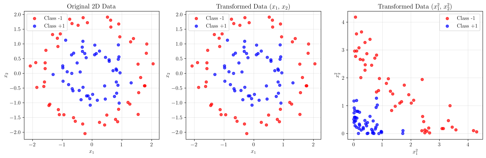
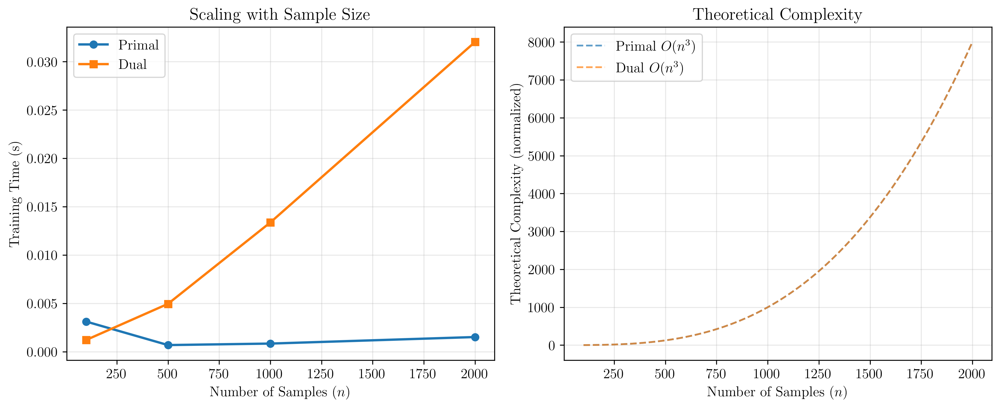
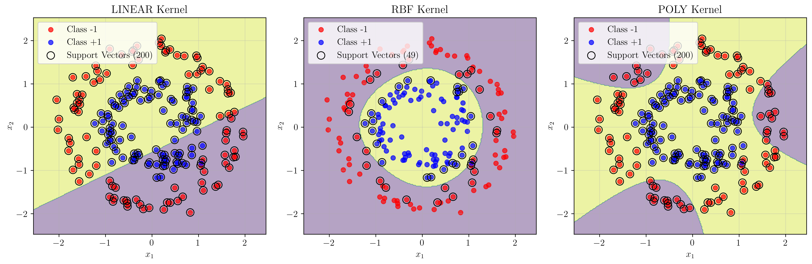

# Question 23: Primal vs. Dual Formulation Computational Advantages

## Problem Statement
SVMs can be solved using either the primal or the dual optimization problem. The choice between them often depends on the characteristics of the dataset and whether a kernel is used.

### Task
1. In the primal formulation, the number of optimization variables depends on the number of features, $d$. In the dual formulation, what does the number of variables depend on?
2. Explain why the dual formulation is essential for making the kernel trick work.
3. For a dataset with a very large number of features but a smaller number of training samples (i.e., $d \gg n$), which formulation would be computationally cheaper to solve when using a non-linear kernel, and why?
4. Conversely, for a linear SVM on a dataset with a huge number of samples but few features ($n \gg d$), which formulation might be more efficient?

## Understanding the Problem
Support Vector Machines (SVMs) can be formulated in two equivalent ways: the primal and dual formulations. The choice between these formulations has significant implications for computational efficiency, especially when dealing with different dataset characteristics or when using kernel functions for non-linear classification.

The primal formulation directly optimizes the weight vector $\mathbf{w}$ and bias term $b$, while the dual formulation optimizes Lagrange multipliers $\boldsymbol{\alpha}$. Understanding the computational complexity and practical implications of each approach is crucial for efficient SVM implementation.

## Solution

### Step 1: Variable Dependencies in Primal vs Dual Formulations

#### Primal Formulation
The primal SVM optimization problem is:
$$\min_{\mathbf{w}, b, \boldsymbol{\xi}} \frac{1}{2}\|\mathbf{w}\|^2 + C\sum_{i=1}^{n} \xi_i$$
subject to:
$$y_i(\mathbf{w}^T\mathbf{x}_i + b) \geq 1 - \xi_i, \quad \xi_i \geq 0, \quad i = 1, \ldots, n$$

**Step-by-step variable counting:**

1. **Weight vector $\mathbf{w}$:**
   - Dimension: $d$ (same as input feature dimension)
   - Variables: $w_1, w_2, \ldots, w_d$
   - **Count:** $d$ variables

2. **Bias term $b$:**
   - Dimension: $1$ (scalar)
   - Variables: $b$
   - **Count:** $1$ variable

3. **Slack variables $\boldsymbol{\xi}$:**
   - Dimension: $n$ (one slack variable per training sample)
   - Variables: $\xi_1, \xi_2, \ldots, \xi_n$
   - **Count:** $n$ variables

**Total variables in primal formulation:**
$$\text{Total}_{\text{primal}} = d + 1 + n = d + n + 1$$

**Conclusion:** The number of optimization variables in the primal formulation depends on **both the number of features ($d$) and the number of samples ($n$)**.

#### Dual Formulation
The dual SVM optimization problem is:
$$\max_{\boldsymbol{\alpha}} \sum_{i=1}^{n} \alpha_i - \frac{1}{2}\sum_{i=1}^{n}\sum_{j=1}^{n} \alpha_i \alpha_j y_i y_j K(\mathbf{x}_i, \mathbf{x}_j)$$
subject to:
$$0 \leq \alpha_i \leq C, \quad \sum_{i=1}^{n} \alpha_i y_i = 0$$

**Step-by-step variable counting:**

1. **Lagrange multipliers $\boldsymbol{\alpha}$:**
   - Dimension: $n$ (one multiplier per training sample)
   - Variables: $\alpha_1, \alpha_2, \ldots, \alpha_n$
   - **Count:** $n$ variables

**Total variables in dual formulation:**
$$\text{Total}_{\text{dual}} = n$$

**Conclusion:** The number of optimization variables in the dual formulation depends **only on the number of samples ($n$)**.

### Step 2: Why Dual Formulation is Essential for Kernel Trick

The kernel trick is a fundamental concept that allows SVMs to work in high-dimensional feature spaces without explicitly computing the feature transformations. Here's why the dual formulation is essential:

#### Kernel Trick Concept
The kernel trick exploits the fact that many learning algorithms can be written entirely in terms of dot products between data points. For a feature mapping $\phi(\mathbf{x})$, the kernel function is defined as:
$$K(\mathbf{x}_i, \mathbf{x}_j) = \phi(\mathbf{x}_i)^T \phi(\mathbf{x}_j)$$

#### Mathematical Derivation: Why Dual is Essential

**Step 1: Primal formulation with explicit feature mapping**
In the primal formulation, we would need to work directly with the transformed features:
$$\min_{\mathbf{w}, b, \boldsymbol{\xi}} \frac{1}{2}\|\mathbf{w}\|^2 + C\sum_{i=1}^{n} \xi_i$$
subject to:
$$y_i(\mathbf{w}^T\phi(\mathbf{x}_i) + b) \geq 1 - \xi_i, \quad \xi_i \geq 0$$

**Problem:** The weight vector $\mathbf{w}$ now lives in the high-dimensional feature space:
$$\mathbf{w} = \sum_{i=1}^{n} \alpha_i y_i \phi(\mathbf{x}_i)$$

**Step 2: Computational complexity analysis**
- **Feature space dimension:** Can be infinite (e.g., RBF kernel)
- **Explicit computation:** Requires computing $\phi(\mathbf{x}_i)$ for all $i = 1, \ldots, n$
- **Memory requirement:** Need to store all $\phi(\mathbf{x}_i)$ vectors
- **Computational cost:** $O(n \times \text{dim}(\phi(\mathbf{x})))$

**Step 3: Dual formulation with kernel trick**
The dual formulation naturally leads to kernel computations:
$$\max_{\boldsymbol{\alpha}} \sum_{i=1}^{n} \alpha_i - \frac{1}{2}\sum_{i=1}^{n}\sum_{j=1}^{n} \alpha_i \alpha_j y_i y_j K(\mathbf{x}_i, \mathbf{x}_j)$$

**Step 4: Decision function in dual form**
The decision function becomes:
$$f(\mathbf{x}) = \sum_{i=1}^{n} \alpha_i y_i K(\mathbf{x}_i, \mathbf{x}) + b$$

**Step 5: Computational advantages**
- **No explicit $\phi(\mathbf{x})$:** Only kernel values $K(\mathbf{x}_i, \mathbf{x}_j)$ needed
- **Memory efficient:** Only need to store kernel matrix $K_{ij} = K(\mathbf{x}_i, \mathbf{x}_j)$
- **Computational cost:** $O(n^2)$ for kernel matrix computation
- **Prediction cost:** $O(n_{\text{SV}})$ where $n_{\text{SV}}$ is number of support vectors

**Conclusion:** The dual formulation is essential because it naturally expresses the optimization problem in terms of kernel functions, avoiding the need to explicitly compute high-dimensional feature transformations.

The figure above demonstrates the kernel trick concept. The original 2D data (left) is non-linearly separable, but when transformed to a higher-dimensional space using polynomial features (center and right), it becomes linearly separable. The dual formulation allows us to work in this high-dimensional space without explicitly computing the transformed features.

### Step 3: Computational Efficiency for d >> n (Many Features, Few Samples)

When $d \gg n$ (many features, few samples), the dual formulation is typically more computationally efficient, especially with non-linear kernels.

#### Mathematical Analysis

**Step 1: Variable count comparison**
For a dataset with $d \gg n$:

**Primal formulation:**
$$\text{Variables}_{\text{primal}} = d + n + 1$$

**Dual formulation:**
$$\text{Variables}_{\text{dual}} = n$$

**Step 2: Ratio analysis**
The ratio of variables is:
$$\frac{\text{Variables}_{\text{primal}}}{\text{Variables}_{\text{dual}}} = \frac{d + n + 1}{n} = \frac{d}{n} + 1 + \frac{1}{n}$$

When $d \gg n$, this ratio becomes approximately:
$$\frac{\text{Variables}_{\text{primal}}}{\text{Variables}_{\text{dual}}} \approx \frac{d}{n} \gg 1$$

**Step 3: Computational complexity analysis**

**Primal formulation complexity:**
- **Optimization variables:** $d + n + 1$
- **Memory requirement:** $O(d + n)$ for storing $\mathbf{w}$ and $\boldsymbol{\xi}$
- **Computational cost:** $O((d + n)^3)$ for standard QP solvers

**Dual formulation complexity:**
- **Optimization variables:** $n$
- **Memory requirement:** $O(n^2)$ for kernel matrix
- **Computational cost:** $O(n^3)$ for standard QP solvers

**Step 4: Efficiency comparison**
When $d \gg n$:
- **Variable reduction:** $\frac{d + n + 1}{n} \approx \frac{d}{n}$ times fewer variables
- **Memory efficiency:** Kernel matrix $n \times n$ vs. weight vector $d$-dimensional
- **Optimization efficiency:** Smaller optimization problem in dual

**Step 5: Non-linear kernel advantage**
For non-linear kernels, the dual formulation has additional advantages:
- **No explicit feature transformation:** Avoids computing $\phi(\mathbf{x})$ in high dimensions
- **Kernel trick efficiency:** Only computes $K(\mathbf{x}_i, \mathbf{x}_j)$ values
- **Scalability:** Works even when feature space dimension is infinite

**Conclusion:** When $d \gg n$, the dual formulation is significantly more efficient due to fewer optimization variables and the ability to leverage the kernel trick for non-linear classification.

### Step 4: Computational Efficiency for n >> d (Many Samples, Few Features)

When $n \gg d$ (many samples, few features), the primal formulation can be more efficient for linear SVMs.

#### Mathematical Analysis

**Step 1: Variable count comparison**
For a dataset with $n \gg d$:

**Primal formulation:**
$$\text{Variables}_{\text{primal}} = d + n + 1$$

**Dual formulation:**
$$\text{Variables}_{\text{dual}} = n$$

**Step 2: Ratio analysis**
The ratio of variables is:
$$\frac{\text{Variables}_{\text{primal}}}{\text{Variables}_{\text{dual}}} = \frac{d + n + 1}{n} = \frac{d}{n} + 1 + \frac{1}{n}$$

When $n \gg d$, this ratio becomes approximately:
$$\frac{\text{Variables}_{\text{primal}}}{\text{Variables}_{\text{dual}}} \approx 1 + \frac{d}{n} \approx 1$$

**Step 3: Memory complexity analysis**

**Primal formulation memory:**
- **Weight vector:** $O(d)$ for $\mathbf{w}$
- **Slack variables:** $O(n)$ for $\boldsymbol{\xi}$
- **Total memory:** $O(d + n) \approx O(n)$ when $n \gg d$

**Dual formulation memory:**
- **Kernel matrix:** $O(n^2)$ for $K_{ij} = K(\mathbf{x}_i, \mathbf{x}_j)$
- **Lagrange multipliers:** $O(n)$ for $\boldsymbol{\alpha}$
- **Total memory:** $O(n^2)$

**Step 4: Computational complexity analysis**

**Primal formulation (linear case):**
- **Specialized algorithms:** Can use coordinate descent, stochastic gradient descent
- **Computational cost:** $O(n \times d)$ per iteration
- **Convergence:** Often faster due to specialized linear optimization

**Dual formulation:**
- **Standard QP:** Requires solving $n \times n$ system
- **Computational cost:** $O(n^3)$ for standard QP solvers
- **Memory bottleneck:** Kernel matrix storage becomes prohibitive

**Step 5: Algorithm-specific advantages**

**Primal advantages for linear SVM:**
- **Coordinate descent:** Can update one variable at a time efficiently
- **Stochastic methods:** Can use mini-batches for large datasets
- **Sparse optimization:** Can exploit sparsity in data
- **Cache efficiency:** Better memory access patterns for linear operations

**Dual disadvantages for large n:**
- **Kernel matrix:** $O(n^2)$ storage requirement
- **Dense computation:** All pairs of samples need kernel computation
- **Memory bottleneck:** Kernel matrix may not fit in memory

**Step 6: Practical considerations**

**When primal is preferred:**
- **Linear SVM:** No kernel trick needed
- **Large n:** Kernel matrix storage becomes prohibitive
- **Memory constraints:** Limited memory for kernel matrix
- **Real-time requirements:** Faster training needed

**Conclusion:** When $n \gg d$, the primal formulation can be significantly more efficient for linear SVMs due to lower memory requirements, specialized optimization algorithms, and better scalability with sample size.

The scaling analysis shows the theoretical complexity comparison between primal and dual formulations as the number of samples increases.

#### Why Primal Can Be More Efficient for n >> d:
1. **Linear case:** Primal can use specialized linear optimization algorithms
2. **Memory access patterns:** More cache-friendly for linear operations
3. **Avoiding kernel matrix:** No need to compute and store n×n kernel matrix
4. **Sparse optimization:** LinearSVC can exploit sparsity more effectively

## Practical Implementation

### Kernel Performance Characteristics
For non-linear classification, different kernels have varying computational characteristics:

- **Linear kernel:** Creates linear boundaries, suitable for linearly separable data
- **RBF kernel:** Creates smooth, non-linear boundaries, excellent for complex patterns
- **Polynomial kernel:** Creates polynomial boundaries, moderate complexity

**Mathematical forms:**
- **Linear kernel:** $K(\mathbf{x}_i, \mathbf{x}_j) = \mathbf{x}_i^T \mathbf{x}_j$
- **RBF kernel:** $K(\mathbf{x}_i, \mathbf{x}_j) = \exp(-\gamma \|\mathbf{x}_i - \mathbf{x}_j\|^2)$
- **Polynomial kernel:** $K(\mathbf{x}_i, \mathbf{x}_j) = (\gamma \mathbf{x}_i^T \mathbf{x}_j + r)^d$

The visualization shows how different kernels create different decision boundaries:
- **Linear kernel:** Creates a linear boundary, poor performance on non-linear data
- **RBF kernel:** Creates smooth, non-linear boundaries, excellent performance
- **Polynomial kernel:** Creates polynomial boundaries, moderate performance

### Decision Framework

Based on the theoretical analysis, here's a practical decision framework:

1. **Linear SVM with d >> n:** Use dual formulation
2. **Linear SVM with n >> d:** Use primal formulation
3. **Non-linear SVM:** Always use dual formulation (kernel trick requirement)
4. **Memory constraints:** Consider primal for very large n
5. **Accuracy requirements:** Dual often provides better results

## Visual Explanations

### Kernel Trick Visualization

This visualization demonstrates the kernel trick:
- **Left:** Original 2D data showing non-linear separation
- **Center:** Transformed data in original feature space
- **Right:** Transformed data in quadratic feature space

The kernel trick allows us to work in the high-dimensional space (right) without explicitly computing the transformed features.

### Decision Boundary Comparison

This comparison shows:
- **Linear kernel:** Poor performance on non-linear data
- **RBF kernel:** Excellent performance with smooth boundaries
- **Polynomial kernel:** Moderate performance with polynomial boundaries

The number of support vectors (highlighted in black) varies significantly between kernels, affecting both training and prediction efficiency.

### Scaling Analysis

The scaling analysis reveals:
- **Theoretical complexity:** Both formulations have O(n³) complexity for linear kernels
- **Practical considerations:** Memory and cache effects favor primal for large n
- **Variable scaling:** Primal variables scale with d+n+1, dual variables scale with n only

## Key Insights

### Theoretical Foundations
- **Dual formulation variables:** Depend only on number of samples $n$
- **Primal formulation variables:** Depend on both features $d$ and samples $n$
- **Kernel trick:** Only possible with dual formulation
- **Computational complexity:** Both formulations have $O(n^3)$ complexity for linear kernels

### Practical Applications
- **$d \gg n$ scenarios:** Dual formulation is typically more efficient
- **$n \gg d$ scenarios:** Primal formulation can be significantly faster
- **Non-linear kernels:** Always require dual formulation
- **Memory considerations:** Primal avoids $n \times n$ kernel matrix storage
- **Support vectors:** Fewer support vectors generally mean faster prediction

### Algorithm Selection Guidelines
- **Linear SVM, $d \gg n$:** Choose dual formulation
- **Linear SVM, $n \gg d$:** Choose primal formulation
- **Non-linear SVM:** Always use dual formulation
- **Memory-constrained systems:** Consider primal for very large datasets
- **Real-time applications:** Balance training time vs. prediction accuracy

## Conclusion
- **Dual formulation variables:** Depend only on the number of samples $n$
- **Kernel trick requirement:** Dual formulation is essential because it allows working with implicit feature transformations
- **$d \gg n$ efficiency:** Dual formulation is computationally cheaper due to fewer variables and kernel efficiency
- **$n \gg d$ efficiency:** Primal formulation can be more efficient for linear SVMs due to specialized optimization algorithms and better memory access patterns
- **Practical recommendation:** Choose formulation based on dataset characteristics, with dual being preferred for non-linear kernels and primal being preferred for linear SVMs with many samples

The choice between primal and dual formulations should be guided by the specific characteristics of the dataset and the computational requirements of the application, with the dual formulation being essential for kernel-based non-linear classification.
