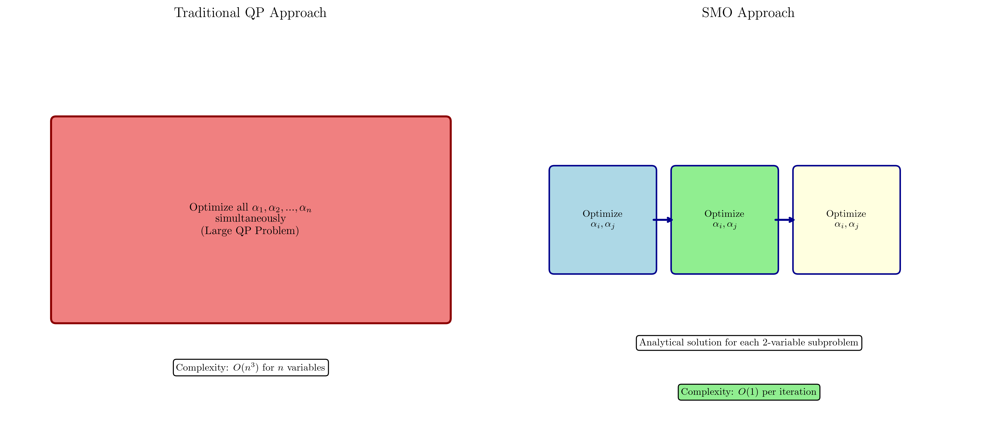

# Question 24: Algorithm Understanding

## Problem Statement
Answer these basic questions about SVM optimization algorithms.

### Task
1. What does SMO stand for?
2. What is the main idea behind SMO algorithm?
3. Why does SMO optimize two variables at a time instead of one?
4. What is a "working set" in SVM optimization?
5. What type of optimization problem is the SVM dual formulation?

## Understanding the Problem
This question tests fundamental understanding of SVM optimization algorithms, particularly the Sequential Minimal Optimization (SMO) algorithm. SMO is a crucial algorithm that makes SVM training practical for large datasets by decomposing the complex quadratic programming problem into a series of simple analytical subproblems. Understanding SMO requires knowledge of optimization theory, the structure of the SVM dual problem, and the constraints that govern SVM training.

## Solution

### Step 1: SMO Acronym and Definition
**SMO stands for Sequential Minimal Optimization**

Breaking down the name:
- **Sequential**: The algorithm optimizes variables in sequence, one pair at a time
- **Minimal**: Uses the smallest possible working set (exactly 2 variables)
- **Optimization**: Solves the SVM dual optimization problem

SMO was developed by John Platt in 1998 as an efficient algorithm for training Support Vector Machines.

### Step 2: Main Idea Behind SMO Algorithm
The main idea behind SMO is to **break down the large quadratic programming problem into a series of smallest possible sub-problems that can be solved analytically**.

Key principles:
- Instead of optimizing all $\alpha$ variables simultaneously (traditional QP approach)
- SMO optimizes exactly 2 variables at each iteration
- Each 2-variable sub-problem has a closed-form analytical solution
- This avoids the need for complex numerical QP solvers
- Memory requirements are dramatically reduced

The algorithm iteratively selects pairs of variables that violate the Karush-Kuhn-Tucker (KKT) conditions and optimizes them while keeping all other variables fixed.

### Step 3: Why Two Variables Instead of One
SMO optimizes two variables at a time due to the **equality constraint in the SVM dual problem**:

$$\sum_{i=1}^n \alpha_i y_i = 0$$

**Mathematical proof by contradiction:**

Suppose we want to optimize only one variable $\alpha_j$ while keeping all others fixed. Let $S = \{1, 2, \ldots, n\} \setminus \{j\}$ be the set of all indices except $j$.

From the equality constraint:
$$\alpha_j y_j + \sum_{i \in S} \alpha_i y_i = 0$$

Solving for $\alpha_j$:
$$\alpha_j y_j = -\sum_{i \in S} \alpha_i y_i$$

Since $y_j \in \{-1, +1\}$, we have $y_j^2 = 1$, so:
$$\alpha_j = -y_j \sum_{i \in S} \alpha_i y_i = -y_j \sum_{i \neq j} \alpha_i y_i$$

**Key insight:** $\alpha_j$ is completely determined by the fixed variables and the constraint. There is no optimization freedom with only one variable.

**Minimum requirement:** We need at least $2$ free variables to have meaningful optimization while satisfying the equality constraint. This is exactly what SMO does.

### Step 4: Working Set Definition
A **working set** is a subset of variables that are actively optimized while keeping the remaining variables fixed.

Characteristics:
- **In SMO**: Working set size = 2 (minimal possible)
- **In chunking methods**: Working set size > 2 (e.g., 100-1000 variables)
- Variables not in the working set remain at their current values during optimization
- Working set selection strategy affects convergence speed
- The algorithm iteratively updates the working set until convergence

Working set selection in SMO typically chooses:
1. Variables that most violate the KKT conditions
2. Variables that can make the most progress toward the solution

### Step 5: Type of Optimization Problem
The SVM dual formulation is a **Quadratic Programming (QP) problem**.

**Complete mathematical formulation:**

**Objective function** (quadratic in $\boldsymbol{\alpha}$):
$$\mathcal{L}_D(\boldsymbol{\alpha}) = \sum_{i=1}^n \alpha_i - \frac{1}{2}\sum_{i=1}^n\sum_{j=1}^n \alpha_i\alpha_j y_i y_j K(\mathbf{x}_i, \mathbf{x}_j)$$

**Constraints:**
1. **Equality constraint**: $\sum_{i=1}^n \alpha_i y_i = 0$
2. **Box constraints**: $0 \leq \alpha_i \leq C$ for all $i = 1, 2, \ldots, n$

**Standard QP form:** $\max_{\boldsymbol{\alpha}} \boldsymbol{\alpha}^T \mathbf{1} - \frac{1}{2}\boldsymbol{\alpha}^T \mathbf{Q} \boldsymbol{\alpha}$

Where:
- $\mathbf{1} = [1, 1, \ldots, 1]^T \in \mathbb{R}^n$ (vector of ones)
- $\mathbf{Q} \in \mathbb{R}^{n \times n}$ with $Q_{ij} = y_i y_j K(\mathbf{x}_i, \mathbf{x}_j)$ (kernel matrix)
- $\boldsymbol{\alpha} = [\alpha_1, \alpha_2, \ldots, \alpha_n]^T \in \mathbb{R}^n$ (dual variables)

**QP characteristics:**
- **Quadratic objective function** (convex since $\mathbf{Q}$ is positive semidefinite)
- **Linear constraints** (both equality and inequality)
- **Convex optimization problem** (guaranteed global optimum)
- **Well-posed** for any valid kernel function $K(\cdot, \cdot)$

## Visual Explanations

### SMO vs Traditional QP Approach

This visualization compares the traditional quadratic programming approach with SMO. The left side shows the traditional approach that optimizes all variables simultaneously, resulting in $O(n^3)$ complexity. The right side shows SMO's approach of breaking the problem into a sequence of 2-variable subproblems, each with analytical solutions and $O(1)$ complexity per iteration.

### Working Set Concept

This diagram illustrates the working set concept in SVM optimization. The green variables represent the current working set being optimized, while gray variables remain fixed. In SMO, exactly 2 variables form the working set at each iteration, and the equality constraint $\sum_{i=1}^n \alpha_i y_i = 0$ is automatically satisfied.

### QP Problem Structure

This visualization shows the structure of the SVM dual problem as a quadratic programming problem, highlighting the quadratic objective function, equality constraint, and box constraints that define the optimization problem.

## Key Insights

### Algorithmic Efficiency
- SMO avoids storing the full kernel matrix in memory
- Each iteration has analytical solution (no numerical optimization needed)
- Memory complexity is $O(n)$ instead of $O(n^2)$
- Particularly effective for large datasets where traditional QP becomes impractical

### Mathematical Foundation
- The equality constraint necessitates optimizing at least 2 variables
- Two variables is the minimal working set that allows optimization freedom
- The constraint automatically ensures feasibility of the solution
- KKT conditions guide the selection of variables to optimize

### Practical Applications
- SMO is the algorithm behind most modern SVM implementations
- Enables SVM training on datasets with millions of samples
- Forms the basis for more advanced SVM optimization techniques
- Critical for making SVMs practical in real-world applications

## Conclusion
- **SMO** stands for Sequential Minimal Optimization
- **Main idea**: Decompose large QP into analytical 2-variable subproblems
- **Two variables** are needed due to the equality constraint requirement
- **Working set** is the subset of variables being actively optimized
- **SVM dual** is a convex Quadratic Programming problem with guaranteed global optimum

SMO revolutionized SVM training by making it practical for large datasets through its efficient decomposition approach and analytical solutions.
