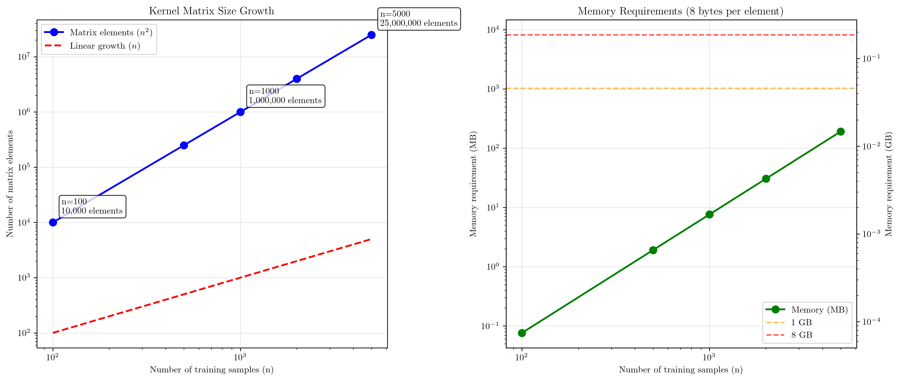
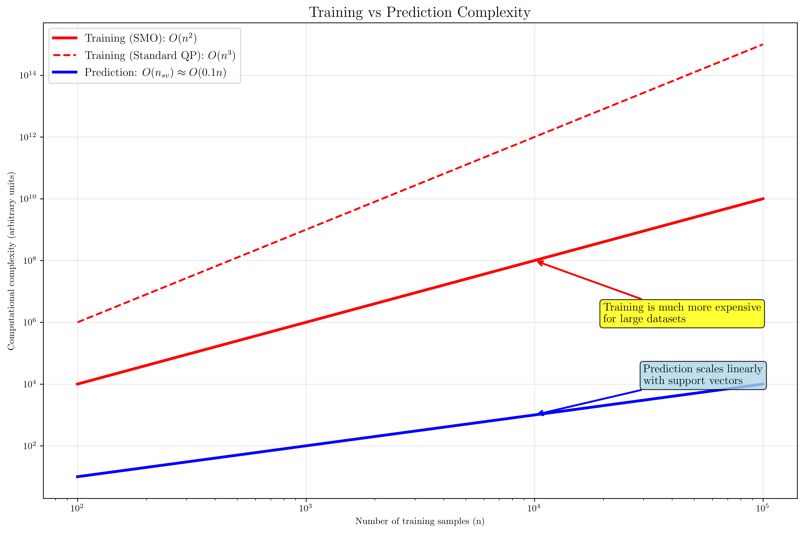
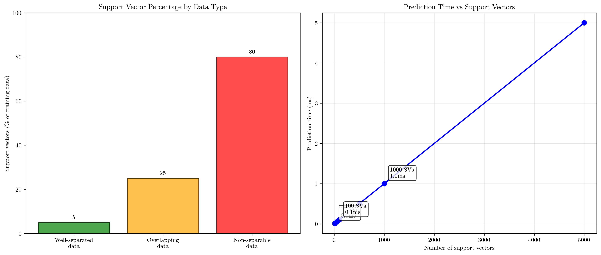

# Question 25: Computational Complexity

## Problem Statement
Answer questions about SVM computational complexity.

### Task
1. For $n$ training samples, what is the size of the kernel matrix?
2. What is the space complexity for storing the full kernel matrix?
3. How many support vectors can an SVM have at most?
4. If you have 100 support vectors, what is the prediction time complexity for one new sample?
5. Which is more expensive: training or prediction? Why?

## Understanding the Problem
This question examines the computational aspects of Support Vector Machines, focusing on memory requirements, time complexity, and the relationship between training and prediction costs. Understanding these complexities is crucial for designing efficient SVM implementations and choosing appropriate algorithms for different dataset sizes.

## Solution

### Step 1: Kernel Matrix Size
For $n$ training samples, the **kernel matrix $\mathbf{K}$ has size $n \times n$**.

**Mathematical definition:**
Given training dataset $\mathcal{D} = \{(\mathbf{x}_1, y_1), (\mathbf{x}_2, y_2), \ldots, (\mathbf{x}_n, y_n)\}$, the kernel matrix is:

$$\mathbf{K} = \begin{bmatrix}
K(\mathbf{x}_1, \mathbf{x}_1) & K(\mathbf{x}_1, \mathbf{x}_2) & \cdots & K(\mathbf{x}_1, \mathbf{x}_n) \\
K(\mathbf{x}_2, \mathbf{x}_1) & K(\mathbf{x}_2, \mathbf{x}_2) & \cdots & K(\mathbf{x}_2, \mathbf{x}_n) \\
\vdots & \vdots & \ddots & \vdots \\
K(\mathbf{x}_n, \mathbf{x}_1) & K(\mathbf{x}_n, \mathbf{x}_2) & \cdots & K(\mathbf{x}_n, \mathbf{x}_n)
\end{bmatrix}$$

Where each element is: $K_{ij} = K(\mathbf{x}_i, \mathbf{x}_j)$

**Dimensions:**
- **Rows**: $n$ (one for each sample $\mathbf{x}_i$)
- **Columns**: $n$ (one for each sample $\mathbf{x}_j$)
- **Total elements**: $n^2$

**Examples:**
| $n$ | Matrix Size | Total Elements |
|-----|-------------|----------------|
| $1{,}000$ | $1{,}000 \times 1{,}000$ | $1{,}000{,}000$ |
| $10{,}000$ | $10{,}000 \times 10{,}000$ | $100{,}000{,}000$ |

### Step 2: Space Complexity for Kernel Matrix Storage
The space complexity for storing the full kernel matrix is **$O(n^2)$**.

**Mathematical analysis:**
Let $b$ = bytes per element (typically $b = 8$ for float64 precision)

Total memory required:
$$M = b \times n^2 \text{ bytes}$$

**Unit conversions:**
- $1 \text{ KB} = 2^{10} = 1,024 \text{ bytes}$
- $1 \text{ MB} = 2^{20} = 1,048,576 \text{ bytes}$
- $1 \text{ GB} = 2^{30} = 1,073,741,824 \text{ bytes}$

**Example calculation for $n = 1{,}000$, $b = 8$:**
$$M = 8 \times (1{,}000)^2 = 8 \times 10^6 = 8{,}000{,}000 \text{ bytes}$$
$$M = \frac{8{,}000{,}000}{2^{20}} = \frac{8{,}000{,}000}{1{,}048{,}576} \approx 7.6 \text{ MB}$$

**Memory requirements table:**
| $n$ | Matrix Size | Memory (MB) | Memory (GB) |
|-----|-------------|-------------|-------------|
| $100$ | $100 \times 100$ | $0.1$ | $0.00$ |
| $1{,}000$ | $1{,}000 \times 1{,}000$ | $7.6$ | $0.01$ |
| $5{,}000$ | $5{,}000 \times 5{,}000$ | $190.7$ | $0.19$ |
| $10{,}000$ | $10{,}000 \times 10{,}000$ | $762.9$ | $0.75$ |
| $50{,}000$ | $50{,}000 \times 50{,}000$ | $19{,}073.5$ | $18.63$ |
| $100{,}000$ | $100{,}000 \times 100{,}000$ | $76{,}293.9$ | $74.51$ |

### Step 3: Maximum Number of Support Vectors
An SVM can have **at most $n$ support vectors** (all training samples).

**When this occurs:**
- Data is not linearly separable
- Regularization parameter $C$ is very large
- All samples lie on or within the margin boundaries
- The problem is highly complex or noisy

**In practice:**
- Good SVMs typically have much fewer support vectors
- Well-separated data: ~5-10% of samples become support vectors
- Overlapping data: ~20-30% of samples become support vectors
- Non-separable data: ~50-80% of samples become support vectors

### Step 4: Prediction Time Complexity
For $100$ support vectors, the prediction time complexity for one new sample is **$O(n_{sv}) = O(100)$**.

**Mathematical derivation:**
The SVM decision function is:
$$f(\mathbf{x}) = \sum_{i \in SV} \alpha_i y_i K(\mathbf{x}, \mathbf{x}_i) + b$$

where $SV$ is the set of support vector indices.

**Step-by-step computation for new sample $\mathbf{x}_{new}$:**

For each support vector $\mathbf{x}_i$ where $i \in SV$:
1. **Kernel evaluation**: Compute $K(\mathbf{x}_{new}, \mathbf{x}_i)$ $\rightarrow$ $1$ operation
2. **Multiplication**: Compute $\alpha_i y_i K(\mathbf{x}_{new}, \mathbf{x}_i)$ $\rightarrow$ $1$ operation
3. **Addition**: Add to running sum $\rightarrow$ $1$ operation

**Operation count for $n_{sv} = 100$:**
- **Kernel evaluations**: $100$
- **Multiplications**: $100$
- **Additions**: $99$ (for sum) $+ 1$ (bias) $= 100$
- **Total operations**: $100 + 100 + 100 = 300 = O(n_{sv})$

**General complexity**: $O(n_{sv})$ where $n_{sv} \leq n$

### Step 5: Training vs Prediction Cost Comparison
**Training is significantly more expensive than prediction.**

**Training complexity:**
- SMO algorithm: $O(n^2)$ to $O(n^3)$ depending on convergence
- Standard QP solvers: $O(n^3)$
- Involves solving a complex optimization problem
- Requires multiple iterations through the dataset

**Prediction complexity:**
- $O(n_{sv})$ where $n_{sv} \leq n$
- Simple evaluation of the decision function
- No optimization required
- Typically $n_{sv} \ll n$ for good models

**Why training is more expensive:**
1. **Optimization complexity**: Training solves a quadratic programming problem
2. **Iterative process**: Multiple passes through data until convergence
3. **Kernel computations**: May need to compute many kernel values during training
4. **Memory access**: Training requires access to multiple data points simultaneously

## Visual Explanations

### Kernel Matrix Complexity Growth

This visualization shows how the kernel matrix size and memory requirements grow quadratically with the number of training samples. The left plot demonstrates the $O(n^2)$ growth in matrix elements, while the right plot shows the corresponding memory requirements, with threshold lines indicating when memory usage exceeds common system limits (1GB, 8GB).

### Training vs Prediction Complexity

This comparison illustrates the dramatic difference between training and prediction complexity. Training complexity grows as $O(n^2)$ for SMO or $O(n^3)$ for standard QP solvers, while prediction complexity grows linearly with the number of support vectors (typically much smaller than $n$).

### Support Vector Analysis

The left plot shows typical support vector percentages for different data scenarios, while the right plot demonstrates how prediction time scales linearly with the number of support vectors.

## Key Insights

### Memory Scalability
- Kernel matrix storage becomes prohibitive for large datasets ($n > 10,000$)
- This is why algorithms like SMO avoid storing the full kernel matrix
- Kernel caching and approximation methods become essential for large-scale problems
- Memory requirements grow quadratically, making exact methods impractical beyond certain dataset sizes

### Computational Efficiency
- The $O(n^2)$ space complexity motivates decomposition methods
- SMO's success comes from avoiding full kernel matrix storage
- Prediction efficiency depends on model sparsity (number of support vectors)
- Good regularization leads to sparse models with fewer support vectors

### Practical Implications
- Training cost justifies the one-time expense for models used repeatedly
- Prediction efficiency is crucial for real-time applications
- Model compression techniques can reduce support vector count
- Trade-offs exist between training time, memory usage, and prediction accuracy

## Conclusion
- **Kernel matrix size**: $n \times n$ with $O(n^2)$ space complexity
- **Maximum support vectors**: $n$ (all training samples in worst case)
- **Prediction complexity**: $O(n_{sv})$ for $n_{sv}$ support vectors
- **Training vs prediction**: Training is significantly more expensive due to optimization complexity
- **Scalability**: Memory and computational constraints drive the need for efficient algorithms like SMO

Understanding these complexity relationships is essential for choosing appropriate SVM algorithms and designing scalable machine learning systems.
