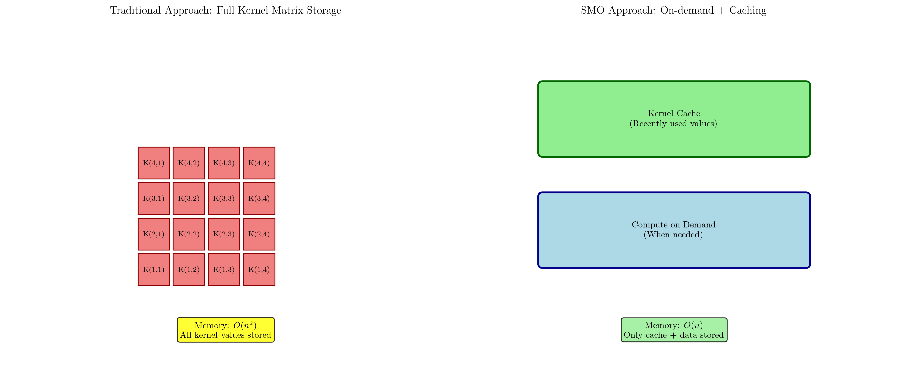
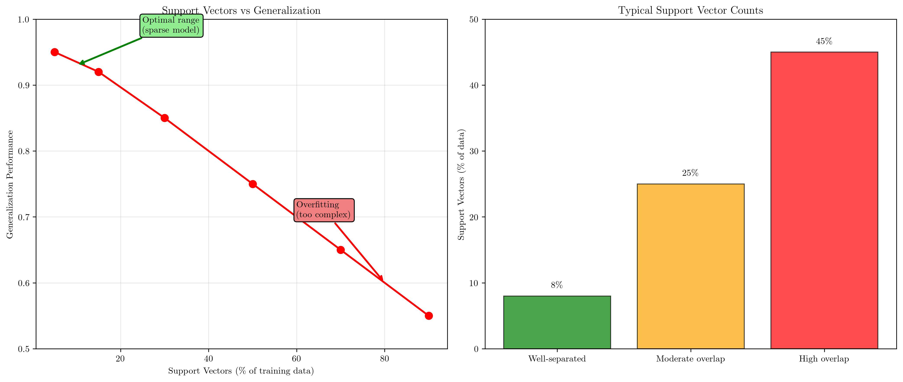
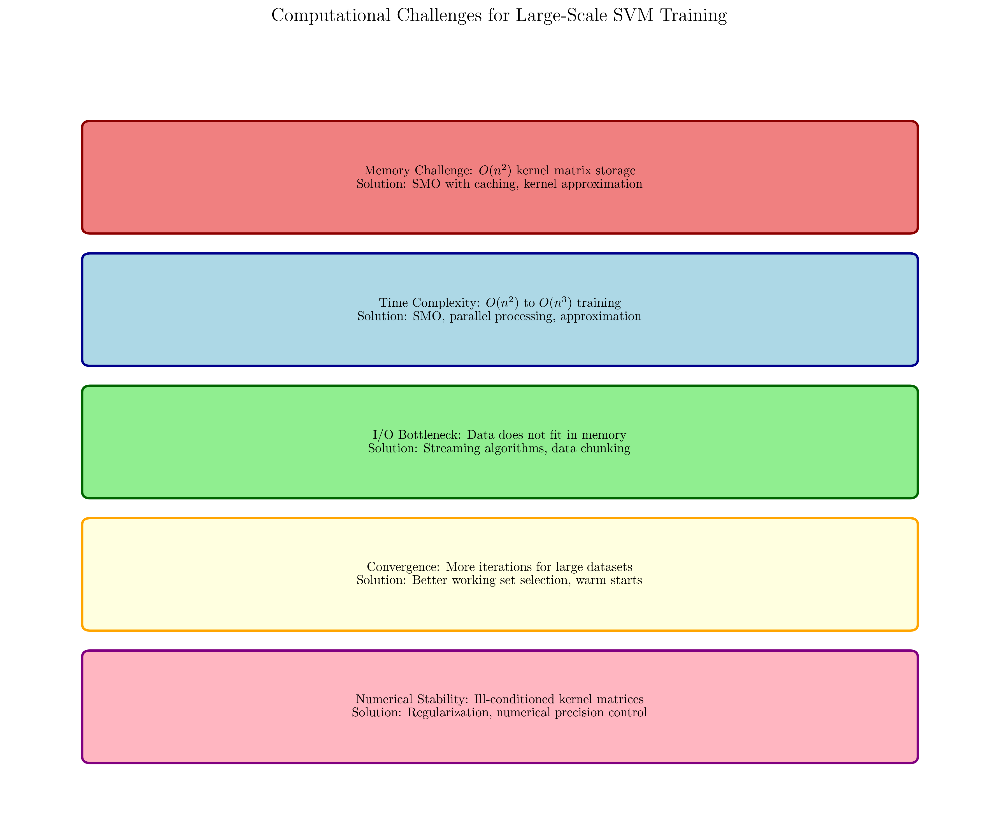

# Question 26: Computational Concept Check

## Problem Statement
Test your understanding of SVM computational concepts.

### Task
1. True or False: The kernel matrix must always be stored in memory. Explain.
2. True or False: More support vectors always mean better accuracy. Explain.
3. What is the advantage of SMO over standard quadratic programming?
4. Why might you prefer the primal formulation for linear SVMs with many features?
5. What computational challenges arise when training SVMs on very large datasets?

## Understanding the Problem
This question tests critical understanding of SVM computational concepts, including memory management strategies, model complexity trade-offs, algorithmic advantages, and scalability challenges. These concepts are fundamental for implementing efficient SVM systems and making informed decisions about algorithm selection and system design.

## Solution

### Step 1: Kernel Matrix Storage (False)
**Statement**: "The kernel matrix must always be stored in memory."
**Answer**: **FALSE**

**Mathematical proof by counterexample:**

Consider the SMO algorithm approach:

**Traditional approach** (what the statement assumes):
- Store full kernel matrix $\mathbf{K} \in \mathbb{R}^{n \times n}$
- Memory requirement: $M = 8n^2$ bytes (for float64)
- Space complexity: $O(n^2)$

**SMO approach** (actual implementation):
- **On-demand computation**: Compute $K(\mathbf{x}_i, \mathbf{x}_j)$ when needed
- **Kernel cache**: Store recently used values in cache of size $C \ll n^2$
- **Recomputation**: If $K(\mathbf{x}_i, \mathbf{x}_j)$ not in cache, recompute
- **Memory requirement**: $M = 8C + 8nd$ bytes (cache + data)
- **Space complexity**: $O(n)$ (since $C$ is constant)

**Numerical example:**
For $n = 10,000$ samples:
- **Full matrix**: $8 \times 10,000^2 = 800,000,000$ bytes $\approx 763$ MB
- **SMO with cache**: $8 \times 1,000 + 8 \times 10,000 \times d \approx 8$ KB $+ 8nd$ bytes

**Conclusion**: SMO proves that full kernel matrix storage is NOT required, making the statement **FALSE**.

### Step 2: Support Vectors and Accuracy (False)
**Statement**: "More support vectors always mean better accuracy."
**Answer**: **FALSE**

**Mathematical analysis:**

Let $n_{sv}$ = number of support vectors, $n$ = total training samples.

**Support vector ratio**: $r = \frac{n_{sv}}{n}$

**Relationship with generalization:**
- **Low $r$ (sparse model)**: Typically indicates good generalization
- **High $r$ (dense model)**: Often indicates overfitting

**Theoretical justification:**
From VC theory, the generalization bound depends on the effective model complexity. For SVMs:

$$\text{Generalization Error} \leq \text{Training Error} + O\left(\sqrt{\frac{n_{sv}}{n}}\right)$$

**Key insight**: As $n_{sv}$ increases, the generalization bound becomes looser.

**Empirical evidence:**

| Data Scenario | Typical $r$ | Generalization Quality |
|---------------|-------------|----------------------|
| Well-separated | $0.05 - 0.10$ | Excellent |
| Moderate overlap | $0.20 - 0.30$ | Good |
| High overlap/noise | $0.50 - 0.80$ | Poor |

**Mathematical example:**
Consider regularization parameter $C$:
- **Small $C$**: Fewer support vectors, better generalization
- **Large $C$**: More support vectors, potential overfitting

**Conclusion**: More support vectors typically indicate overfitting, making the statement **FALSE**.

### Step 3: SMO Advantages over Standard QP
SMO provides several key advantages over standard quadratic programming:

**Memory Efficiency:**
- SMO: $O(n)$ space complexity
- Standard QP: $O(n^2)$ space complexity
- Avoids storing full kernel matrix

**No Specialized QP Solver:**
- SMO uses analytical solutions for 2-variable subproblems
- Standard QP requires complex numerical optimization software
- Simpler implementation and fewer dependencies

**Scalability:**
- SMO scales to datasets with millions of samples
- Standard QP becomes impractical for large datasets
- Better numerical stability for large problems

**Computational Advantages:**
- Each SMO iteration has $O(1)$ complexity
- Avoids matrix decomposition operations
- More cache-friendly memory access patterns

### Step 4: Primal Formulation for Linear SVMs
**Mathematical comparison of variable counts:**

| Formulation | Variables | Optimization Problem |
|-------------|-----------|---------------------|
| **Primal** | $d$ (features) | $\min_{\mathbf{w}, b} \frac{1}{2}\|\mathbf{w}\|^2 + C\sum_{i=1}^n \xi_i$ |
| **Dual** | $n$ (samples) | $\max_{\boldsymbol{\alpha}} \sum_{i=1}^n \alpha_i - \frac{1}{2}\sum_{i,j} \alpha_i\alpha_j y_i y_j \mathbf{x}_i^T \mathbf{x}_j$ |

**Case analysis:**

**Case 1:** $d \ll n$ (few features, many samples)
- Primal: $d$ variables
- Dual: $n$ variables
- **Conclusion**: Primal is more efficient since $d < n$

**Case 2:** $d \gg n$ (many features, few samples)
- Primal: $d$ variables
- Dual: $n$ variables
- **Conclusion**: Dual is typically more efficient since $n < d$

**However, for linear kernels specifically:**

**Primal advantages when $d \gg n$:**
1. **Direct optimization**: Works directly in feature space $\mathbb{R}^d$
2. **No kernel matrix**: Avoids computing $n \times n$ kernel matrix
3. **Gradient-based methods**: Can use efficient algorithms like SGD
4. **Memory efficiency**: Only stores $\mathbf{w} \in \mathbb{R}^d$ and data

**Mathematical insight:**
For linear kernel $K(\mathbf{x}_i, \mathbf{x}_j) = \mathbf{x}_i^T \mathbf{x}_j$, the dual requires computing all pairwise dot products, while primal works directly with $\mathbf{w}$.

**When primal is preferred:**
- High-dimensional sparse features (e.g., text data with $d > 10^6$)
- Online learning scenarios
- When $n$ is large but features are sparse

### Step 5: Large Dataset Computational Challenges
Training SVMs on very large datasets presents multiple computational challenges:

**Memory Challenges:**
- **Kernel matrix**: $O(n^2)$ storage requirement
- **Data loading**: Datasets may not fit in RAM
- **Solution**: SMO with caching, data streaming, kernel approximation

**Time Complexity:**
- **Training**: $O(n^2)$ to $O(n^3)$ depending on algorithm
- **Convergence**: More iterations needed for large datasets
- **Solution**: Parallel processing, better working set selection

**I/O Bottlenecks:**
- **Disk access**: Frequent data loading from storage
- **Network transfer**: Distributed training communication costs
- **Solution**: Data chunking, efficient data formats, local caching

**Convergence Issues:**
- **Slower convergence**: More iterations to reach optimality
- **Working set selection**: Harder to find good variable pairs
- **Solution**: Advanced heuristics, warm starting, adaptive strategies

**Numerical Stability:**
- **Ill-conditioned matrices**: Poor numerical properties
- **Precision issues**: Floating-point errors accumulate
- **Solution**: Regularization, numerical precision control, matrix conditioning

## Visual Explanations

### Memory Storage Strategies

This comparison shows the fundamental difference between traditional full kernel matrix storage and SMO's on-demand approach with caching. The traditional approach requires $O(n^2)$ memory, while SMO reduces this to $O(n)$ through intelligent caching and recomputation strategies.

### Support Vector Quality Analysis

The left plot demonstrates the inverse relationship between support vector percentage and generalization performance, showing that sparse models (fewer support vectors) typically generalize better. The right plot shows typical support vector percentages for different data scenarios.

### Computational Challenges Overview

This visualization summarizes the major computational challenges faced when training SVMs on large datasets, along with common solution strategies for each challenge category.

## Key Insights

### Memory Management
- Full kernel matrix storage is not required for SVM training
- SMO's caching strategy enables training on datasets much larger than available memory
- The trade-off between cache size and recomputation cost can be optimized
- Memory-efficient algorithms are essential for practical large-scale machine learning

### Model Complexity
- Support vector sparsity is generally desirable for good generalization
- The number of support vectors reflects the complexity of the decision boundary
- Regularization parameter $C$ controls the trade-off between training accuracy and sparsity
- Model selection should consider both accuracy and complexity metrics

### Algorithm Selection
- SMO's advantages make it the preferred algorithm for most SVM implementations
- The choice between primal and dual formulations depends on dataset characteristics
- Different algorithms excel in different scenarios (small vs large datasets, linear vs nonlinear)
- Understanding algorithmic trade-offs is crucial for system design

### Scalability Considerations
- Multiple bottlenecks must be addressed simultaneously for large-scale training
- Solutions often involve approximations that trade accuracy for computational efficiency
- Distributed and parallel approaches become necessary beyond certain dataset sizes
- System design must consider the entire computational pipeline, not just the core algorithm

## Conclusion
- **Kernel matrix storage**: FALSE - SMO uses on-demand computation with caching
- **Support vector count**: FALSE - More support vectors often indicate overfitting
- **SMO advantages**: Memory efficiency, analytical solutions, no specialized QP solver needed
- **Primal formulation**: Preferred for linear SVMs when direct feature space optimization is more efficient
- **Large dataset challenges**: Memory, time complexity, I/O, convergence, and numerical stability issues require comprehensive solutions

Understanding these computational concepts is essential for implementing efficient SVM systems and making informed decisions about algorithm selection, system architecture, and performance optimization strategies.
