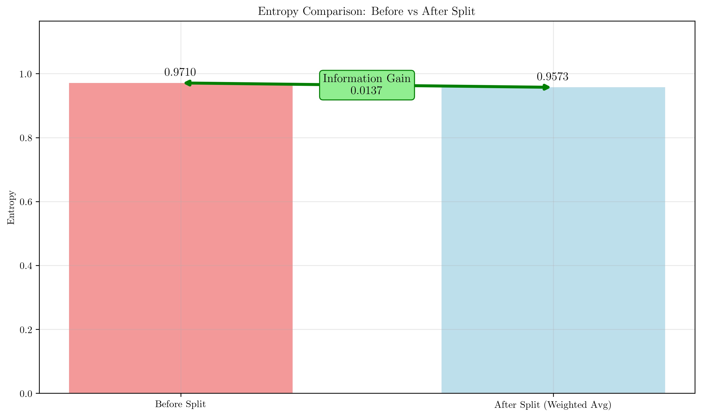

# Question 2: Information Gain Calculation

## Problem Statement
A feature "Color" splits the dataset as follows:

| Color | Class A | Class B | Total |
|-------|---------|---------|-------|
| Red   | 20      | 10      | 30    |
| Blue  | 25      | 15      | 40    |
| Green | 15      | 15      | 30    |

### Task
1. Calculate the entropy for each color value
2. Calculate the weighted average entropy after splitting
3. Calculate the information gain from this split
4. Would this be a good split for the root node? Explain why

## Understanding the Problem
Information gain is a fundamental concept in decision tree construction that measures how much information a feature provides about the class labels. It quantifies the reduction in entropy (uncertainty) achieved by splitting the dataset based on a particular feature.

Entropy measures the impurity or uncertainty in a dataset. For a binary classification problem, entropy is calculated as:
$$H(S) = -\sum_{i} p_i \log_2(p_i)$$

where $p_i$ is the proportion of samples belonging to class $i$.

Information gain is defined as:
$$IG(S, A) = H(S) - \sum_{v \in Values(A)} \frac{|S_v|}{|S|} H(S_v)$$

where $S$ is the original dataset, $A$ is the attribute (feature), $S_v$ is the subset of $S$ for which attribute $A$ has value $v$, and $H(S_v)$ is the entropy of subset $S_v$.

## Solution

We have a dataset with 100 total samples (60 Class A, 40 Class B) that we want to split using the "Color" feature.

### Step 1: Calculate the Entropy for Each Color Value

#### Red Color Subset
For the Red subset: 20 Class A samples, 10 Class B samples, 30 total samples

$$P(\text{Class A}|\text{Red}) = \frac{20}{30} = 0.6667$$
$$P(\text{Class B}|\text{Red}) = \frac{10}{30} = 0.3333$$

$$H(\text{Red}) = -P(A) \log_2(P(A)) - P(B) \log_2(P(B))$$
$$H(\text{Red}) = -0.6667 \times \log_2(0.6667) - 0.3333 \times \log_2(0.3333)$$
$$H(\text{Red}) = -0.6667 \times (-0.5850) - 0.3333 \times (-1.5850)$$
$$H(\text{Red}) = 0.3900 + 0.5283 = 0.9183$$

#### Blue Color Subset
For the Blue subset: 25 Class A samples, 15 Class B samples, 40 total samples

$$P(\text{Class A}|\text{Blue}) = \frac{25}{40} = 0.6250$$
$$P(\text{Class B}|\text{Blue}) = \frac{15}{40} = 0.3750$$

$$H(\text{Blue}) = -0.6250 \times \log_2(0.6250) - 0.3750 \times \log_2(0.3750)$$
$$H(\text{Blue}) = -0.6250 \times (-0.6781) - 0.3750 \times (-1.4150)$$
$$H(\text{Blue}) = 0.4238 + 0.5306 = 0.9544$$

#### Green Color Subset
For the Green subset: 15 Class A samples, 15 Class B samples, 30 total samples

$$P(\text{Class A}|\text{Green}) = \frac{15}{30} = 0.5000$$
$$P(\text{Class B}|\text{Green}) = \frac{15}{30} = 0.5000$$

$$H(\text{Green}) = -0.5000 \times \log_2(0.5000) - 0.5000 \times \log_2(0.5000)$$
$$H(\text{Green}) = -0.5000 \times (-1.0000) - 0.5000 \times (-1.0000)$$
$$H(\text{Green}) = 0.5000 + 0.5000 = 1.0000$$

### Step 2: Calculate the Weighted Average Entropy After Splitting

The weighted average entropy is calculated as:
$$E(S|\text{Color}) = \sum_{v \in \{\text{Red, Blue, Green}\}} \frac{|S_v|}{|S|} \times H(S_v)$$

For each color subset:

**Red contribution:**
$$\text{Weight}_{\text{Red}} = \frac{30}{100} = 0.3000$$
$$\text{Contribution}_{\text{Red}} = 0.3000 \times 0.9183 = 0.2755$$

**Blue contribution:**
$$\text{Weight}_{\text{Blue}} = \frac{40}{100} = 0.4000$$
$$\text{Contribution}_{\text{Blue}} = 0.4000 \times 0.9544 = 0.3818$$

**Green contribution:**
$$\text{Weight}_{\text{Green}} = \frac{30}{100} = 0.3000$$
$$\text{Contribution}_{\text{Green}} = 0.3000 \times 1.0000 = 0.3000$$

**Weighted Average Entropy:**
$$E(S|\text{Color}) = 0.2755 + 0.3818 + 0.3000 = 0.9573$$

### Step 3: Calculate the Information Gain from This Split

First, we need to calculate the original entropy before splitting:

$$P(\text{Class A}) = \frac{60}{100} = 0.6000$$
$$P(\text{Class B}) = \frac{40}{100} = 0.4000$$

$$H(S) = -0.6000 \times \log_2(0.6000) - 0.4000 \times \log_2(0.4000)$$
$$H(S) = -0.6000 \times (-0.7370) - 0.4000 \times (-1.3219)$$
$$H(S) = 0.4422 + 0.5288 = 0.9710$$

Now we can calculate the information gain:
$$IG(S, \text{Color}) = H(S) - E(S|\text{Color})$$
$$IG(S, \text{Color}) = 0.9710 - 0.9573 = 0.0137$$

### Step 4: Evaluation of Split Quality

The information gain of 0.0137 represents only a 1.41% reduction in entropy. This is a very small improvement, indicating that the "Color" feature provides minimal information for distinguishing between Class A and Class B.

**Analysis:**
- **Information Gain:** 0.0137 (very low)
- **Entropy Reduction:** 1.41%
- **Split Quality:** Poor

This would not be a good split for the root node because:
1. The information gain is extremely low (< 0.05)
2. The entropy reduction is minimal
3. All three color subsets still have relatively high entropy (close to 1.0)
4. The Green subset has maximum entropy (1.0), indicating perfect class balance with no discriminative power

## Visual Explanations

### Data Distribution Analysis

The visualization shows four key aspects:
1. **Data Distribution:** The bar chart shows how samples are distributed across colors and classes
2. **Entropy by Color:** Each color subset's entropy, with Green having the highest (1.0)
3. **Information Gain Components:** Comparison of original entropy, weighted average entropy, and the resulting information gain
4. **Weighted Contributions:** How each color subset contributes to the overall weighted average entropy

### Decision Tree Visualization

This shows how the dataset would be split using the Color feature as the root node. The small information gain is evident from the similar entropy values between the root and child nodes.

### Entropy Comparison

The comparison clearly shows the minimal difference between the original entropy and the weighted average entropy after splitting, resulting in very low information gain.

## Key Insights

### Entropy Analysis
- Red subset has the lowest entropy (0.9183), indicating it's the most "pure" subset
- Blue subset has moderate entropy (0.9544)
- Green subset has maximum entropy (1.0000), indicating perfect class balance and no discriminative power
- All subsets still have high entropy, suggesting poor separation

### Information Gain Interpretation
- An information gain of 0.0137 is considered very poor for decision tree splitting
- Good splits typically have information gain > 0.1
- The low gain indicates that Color doesn't effectively separate the classes
- This feature would not be selected by most decision tree algorithms due to insufficient discriminative power

### Decision Tree Construction Implications
- Decision tree algorithms (ID3, C4.5, CART) prefer features with high information gain
- Features with low information gain like this one would be avoided in favor of more discriminative features
- The algorithm would continue searching for better features or might create a shallow tree if no better options exist

## Conclusion
- **Entropy values:** Red (0.9183), Blue (0.9544), Green (1.0000)
- **Weighted average entropy:** 0.9573
- **Information gain:** 0.0137 (very low)
- **Split quality:** Poor - not suitable for the root node

The Color feature provides minimal discriminative power for this classification task. The extremely low information gain of 0.0137 indicates that splitting on Color barely reduces the uncertainty in the dataset. A good decision tree algorithm would reject this split and search for more informative features that provide better class separation.
