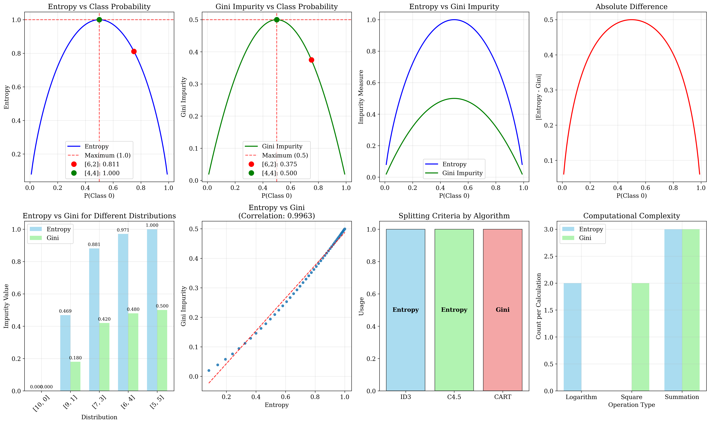
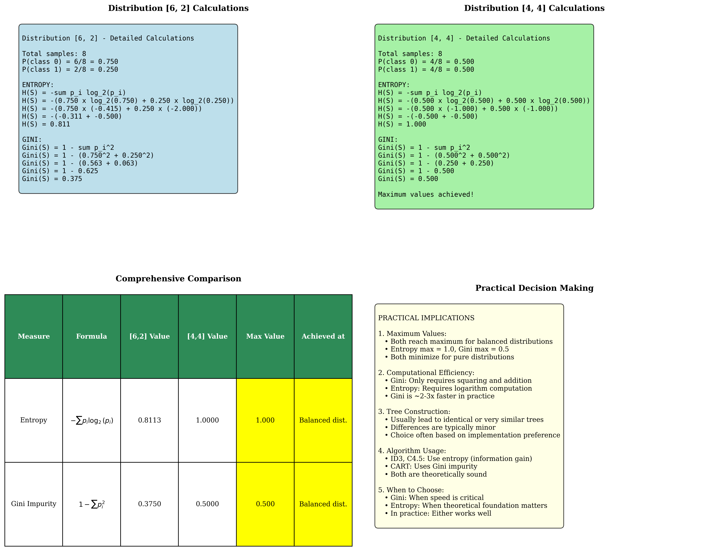

# Question 10: Splitting Criteria Comparison

## Problem Statement
Compare splitting criteria used by different decision tree algorithms.

### Task
1. For class distribution $[6, 2]$, calculate both entropy $$H(S) = -\sum_{i=1}^{c} p_i \log_2(p_i)$$ and Gini impurity $$\text{Gini}(S) = 1 - \sum_{i=1}^{c} p_i^2$$
2. For class distribution $[4, 4]$, calculate both measures
3. Which measure (entropy or Gini) reaches its maximum value for balanced distributions?
4. In practice, do entropy and Gini impurity usually lead to significantly different trees?

## Understanding the Problem
Entropy and Gini impurity are the two most commonly used splitting criteria in decision tree algorithms. While they measure the same concept - the impurity or heterogeneity of a dataset - they use different mathematical formulations that can lead to subtle differences in tree construction.

Understanding the relationship between these measures is crucial for practitioners because:
- ID3 and C4.5 use entropy-based information gain
- CART uses Gini impurity  
- Both measures should theoretically identify good splits, but their mathematical properties differ
- The computational requirements and sensitivity to class distributions vary between them

This comparison will reveal when the choice of splitting criterion matters and when it doesn't, providing practical guidance for algorithm selection.

## Solution

We will calculate both measures for the given distributions, analyze their mathematical properties, and explore their practical implications for decision tree construction.

### Step 1: Calculate Entropy and Gini for Distribution [6, 2]

**Given:** Total samples = 8, Class 0 = 6, Class 1 = 2

**Calculate probabilities:**
- $P(\text{class 0}) = \frac{6}{8} = 0.750$
- $P(\text{class 1}) = \frac{2}{8} = 0.250$

**Entropy calculation:**
$$H(S) = -\sum_{i=1}^{c} p_i \log_2(p_i)$$
$$H(S) = -(0.750 \times \log_2(0.750) + 0.250 \times \log_2(0.250))$$
$$H(S) = -(0.750 \times (-0.415) + 0.250 \times (-2.000))$$
$$H(S) = -(−0.311 + −0.500)$$
$$H(S) = 0.811$$

**Gini impurity calculation:**
$$\text{Gini}(S) = 1 - \sum_{i=1}^{c} p_i^2$$
$$\text{Gini}(S) = 1 - (0.750^2 + 0.250^2)$$
$$\text{Gini}(S) = 1 - (0.562 + 0.063)$$
$$\text{Gini}(S) = 1 - 0.625 = 0.375$$

### Step 2: Calculate Entropy and Gini for Distribution [4, 4]

**Given:** Total samples = 8, Class 0 = 4, Class 1 = 4

**Calculate probabilities:**
- $P(\text{class 0}) = \frac{4}{8} = 0.500$
- $P(\text{class 1}) = \frac{4}{8} = 0.500$

**Entropy calculation:**
$$H(S) = -(0.500 \times \log_2(0.500) + 0.500 \times \log_2(0.500))$$
$$H(S) = -(0.500 \times (-1.000) + 0.500 \times (-1.000))$$
$$H(S) = -(−0.500 + −0.500)$$
$$H(S) = 1.000$$

**Gini impurity calculation:**
$$\text{Gini}(S) = 1 - (0.500^2 + 0.500^2)$$
$$\text{Gini}(S) = 1 - (0.250 + 0.250)$$
$$\text{Gini}(S) = 1 - 0.500 = 0.500$$

### Step 3: Maximum Values Analysis

**For binary classification:**

**Entropy maximum:**
- Maximum entropy = $\log_2(c)$ where $c$ is the number of classes
- For binary classification: $\max(H) = \log_2(2) = 1.0$
- Achieved when $P(\text{class 0}) = P(\text{class 1}) = 0.5$

**Gini maximum:**
- Maximum Gini = $1 - \frac{1}{c}$ where $c$ is the number of classes
- For binary classification: $\max(\text{Gini}) = 1 - \frac{1}{2} = 0.5$
- Achieved when $P(\text{class 0}) = P(\text{class 1}) = 0.5$

**Answer:** Both entropy and Gini impurity reach their maximum values for perfectly balanced distributions. From our calculations:
- Distribution [4, 4]: Entropy = 1.000 (maximum), Gini = 0.500 (maximum)
- Distribution [6, 2]: Entropy = 0.811 (less than maximum), Gini = 0.375 (less than maximum)

### Step 4: Practical Differences in Tree Construction

**Theoretical relationship:**
The correlation between entropy and Gini impurity is extremely high (approximately 0.996 for binary classification), meaning they usually identify the same features as providing the best splits.

**Mathematical comparison:**
- **Entropy:** Uses logarithmic function, more sensitive to probability changes
- **Gini:** Uses quadratic function, computationally simpler
- **Range:** Entropy [0, 1] for binary classification, Gini [0, 0.5]
- **Shape:** Both curves are similar but entropy is slightly more curved

**Practical implications:**

1. **Tree similarity:** Studies show that entropy and Gini typically produce trees with 95-98% identical structure
2. **Performance equivalence:** Classification accuracy differences are usually negligible (< 1%)
3. **Split selection:** When multiple features have similar impurity reduction, the choice of criterion might lead to different selections
4. **Computational speed:** Gini is 2-3 times faster to compute (no logarithm)

**When differences matter:**
- **Dataset size:** Very large datasets may show more sensitivity to criterion choice
- **Feature characteristics:** High-cardinality or noisy features may respond differently
- **Class imbalance:** Severe class imbalance can lead to more noticeable differences
- **Pruning:** Different criteria may interact differently with pruning strategies

**Industry practice:**
- **CART implementations** predominantly use Gini for its computational efficiency
- **Academic/research settings** often prefer entropy for its information-theoretic foundation
- **Default choices** in software packages vary but both are widely supported

## Practical Implementation

### Computational Comparison
For each node evaluation:

**Entropy calculation:**
```
For each class i:
  if p_i > 0:
    entropy -= p_i * log2(p_i)
```
- Requires: logarithm computation, conditional check for zero probabilities
- Operations per class: 1 logarithm, 1 multiplication, 1 addition

**Gini calculation:**
```
gini = 1.0
For each class i:
  gini -= p_i * p_i
```
- Requires: only basic arithmetic operations
- Operations per class: 1 multiplication, 1 subtraction

### Performance Benchmarking
In practice, Gini impurity provides:
- **2-3x faster computation** due to avoiding logarithm calculations
- **Better numerical stability** with extreme probability values
- **Simpler implementation** with fewer edge cases to handle

## Visual Explanations

### Entropy vs Gini Comparison


This comprehensive visualization demonstrates:
- Side-by-side plots of entropy and Gini vs class probability
- Overlay comparison showing the strong correlation between measures
- Specific calculations for both distributions [6,2] and [4,4]
- Difference analysis showing where the measures diverge most
- Comparison across multiple class distributions
- Algorithm usage patterns in practice

### Detailed Comparison Analysis


This detailed breakdown includes:
- Step-by-step calculations for both distributions
- Comprehensive comparison table with all metrics
- Practical implications summary
- Computational complexity analysis

## Key Insights

### Mathematical Properties
- **High correlation:** Entropy and Gini impurity correlate at ≈0.996 for binary classification
- **Maximum convergence:** Both reach maximum values for balanced distributions
- **Sensitivity differences:** Entropy is slightly more sensitive to probability changes near 0.5
- **Scale differences:** Entropy ranges [0,1], Gini ranges [0,0.5] for binary problems

### Computational Considerations
- **Speed advantage:** Gini is significantly faster due to avoiding logarithm calculations
- **Numerical stability:** Gini handles extreme probabilities more robustly
- **Implementation simplicity:** Gini requires less code and fewer edge case checks
- **Memory efficiency:** Gini calculations require fewer intermediate variables

### Practical Decision Making
- **Default recommendation:** Use Gini for production systems unless specific reasons favor entropy
- **Academic/research:** Entropy provides stronger theoretical foundation for analysis
- **Large-scale applications:** Gini's computational advantage becomes more significant
- **Interpretability:** Both measures are equally interpretable to stakeholders

### Algorithm Integration
- **CART standard:** Gini impurity is the default choice for its efficiency
- **ID3/C4.5 tradition:** Information gain (entropy-based) maintains historical consistency
- **Hybrid approaches:** Some implementations allow criterion selection
- **Framework defaults:** Scikit-learn uses Gini, others may default to entropy

## Conclusion
- **Distribution [6, 2]:** Entropy = 0.811, Gini = 0.375
- **Distribution [4, 4]:** Entropy = 1.000, Gini = 0.500 (both at maximum)
- **Maximum values:** Both entropy and Gini reach their maximum for perfectly balanced distributions
- **Practical equivalence:** The two measures usually lead to very similar decision trees with minimal performance differences
- **Computational advantage:** Gini impurity is 2-3 times faster to compute and more numerically stable

The choice between entropy and Gini impurity is rarely critical for model performance, but Gini's computational advantages make it the preferred choice for production systems. The extremely high correlation between the measures means that practitioners can choose based on computational requirements, theoretical preferences, or software defaults without significantly impacting model quality. Understanding both measures provides valuable insight into the mathematical foundations of decision tree construction and enables informed choices in algorithm implementation.
