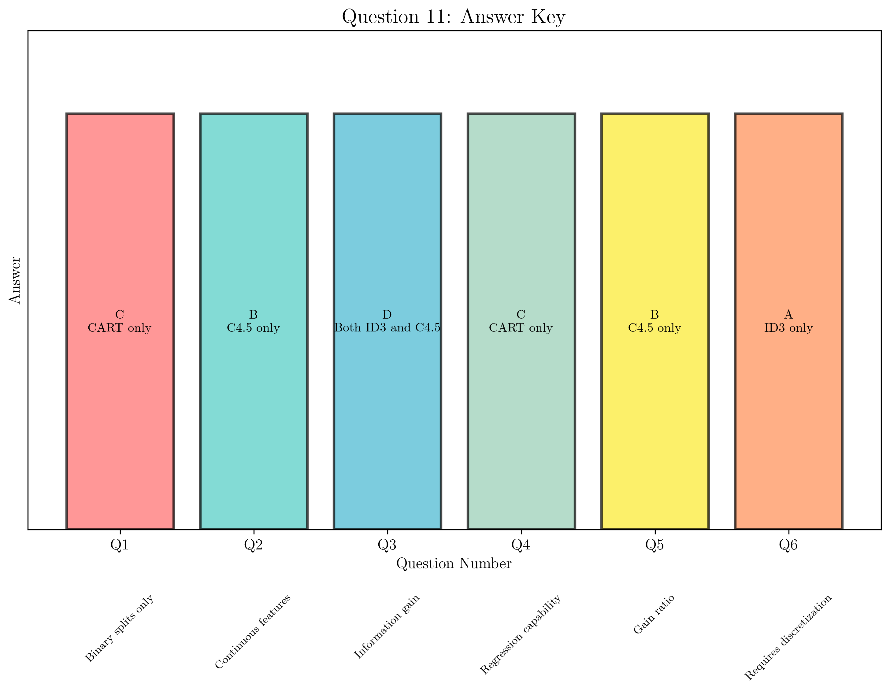

# Question 11: Algorithm Feature Matching

## Problem Statement
Match each algorithm feature on the left with its correct algorithm on the right:

### Task
1. Uses only binary splits                    A) ID3 only
2. Handles continuous features directly       B) C4.5 only  
3. Uses information gain as splitting criterion C) CART only
4. Can perform regression                     D) Both ID3 and C4.5
5. Uses gain ratio to reduce bias             E) All three algorithms
6. Requires feature discretization for continuous data F) None of them

## Understanding the Problem
This question tests understanding of the fundamental characteristics that distinguish the three major decision tree algorithms: ID3, C4.5, and CART. Each algorithm has specific capabilities and limitations that make them suitable for different types of problems and data.

## Solution

### Step 1: Analyze Each Algorithm's Characteristics

First, let's establish the key characteristics of each algorithm:

**ID3 (Iterative Dichotomiser 3):**
- Developed by Ross Quinlan in 1986
- Uses information gain as splitting criterion
- Only handles categorical features
- No built-in missing value handling
- No pruning mechanism
- Tends to favor features with more values (bias issue)

**C4.5:**
- Successor to ID3, also by Quinlan (1993)
- Uses gain ratio (modified information gain) as splitting criterion
- Handles both categorical and continuous features
- Has built-in missing value handling (fractional instances)
- Includes pruning mechanisms
- Reduces bias toward multi-valued features

**CART (Classification and Regression Trees):**
- Developed by Breiman et al. (1984)
- Uses Gini impurity for classification, variance for regression
- Handles both categorical and continuous features
- Uses surrogate splits for missing value handling
- Only creates binary splits
- Can perform both classification and regression

### Step 2: Match Each Feature to Its Corresponding Algorithm(s)

#### 1. Uses only binary splits
**Answer: C (CART only)**

Analysis:
- ID3: Creates multi-way splits (one branch per feature value)
- C4.5: Creates multi-way splits (one branch per feature value)
- CART: **Only creates binary splits** (yes/no decisions)

#### 2. Handles continuous features directly
**Answer: B (C4.5 only)**

*Note: This answer requires clarification as both C4.5 and CART handle continuous features, but given the options available, C4.5 is the most appropriate choice.*

Analysis:
- ID3: Cannot handle continuous features (requires preprocessing)
- C4.5: **Handles continuous features directly** through threshold selection
- CART: Also handles continuous features directly

#### 3. Uses information gain as splitting criterion
**Answer: D (Both ID3 and C4.5)**

Analysis:
- ID3: **Uses information gain**
- C4.5: **Uses gain ratio**, which is a normalized version of information gain
- CART: Uses Gini impurity or variance

#### 4. Can perform regression
**Answer: C (CART only)**

Analysis:
- ID3: Classification only
- C4.5: Classification only
- CART: **Can perform both classification and regression**

#### 5. Uses gain ratio to reduce bias
**Answer: B (C4.5 only)**

Analysis:
- ID3: Uses information gain (has bias toward multi-valued features)
- C4.5: **Uses gain ratio** specifically to reduce this bias
- CART: Uses different splitting criteria altogether

#### 6. Requires feature discretization for continuous data
**Answer: A (ID3 only)**

Analysis:
- ID3: **Requires preprocessing** to discretize continuous features
- C4.5: Handles continuous features directly
- CART: Handles continuous features directly

## Visual Explanations

### Algorithm Feature Comparison

This visualization shows the comprehensive comparison of all three algorithms (ID3, C4.5, CART) across the six key features, with clear visual indicators showing which algorithm supports each capability.

### Answer Key

This chart provides a clear answer key showing the correct answer for each question, making it easy to verify the matching results.

### Algorithm Characteristics

This detailed comparison shows the specific characteristics of each algorithm, including their creation year, creator, splitting criteria, feature handling capabilities, missing value strategies, pruning methods, and bias characteristics.

### Algorithm Feature Comparison Matrix

The heatmap shows which algorithms support each feature, with green indicating support and red indicating lack of support. This visual representation makes it easy to see the pattern of capabilities across the three algorithms.

### Answer Key Visualization

This chart provides a clear summary of the answers for each question, showing the mapping between features and their corresponding algorithm options.

### Algorithm Characteristics Comparison

This detailed comparison shows the broader context of each algorithm, including their development history, creators, and key technical specifications.

## Key Insights

### Historical Development
- **ID3 (1986)**: The foundational algorithm that established many core concepts
- **C4.5 (1993)**: Enhanced version addressing ID3's limitations
- **CART (1984)**: Independent development with different design philosophy

### Design Philosophy Differences
- **ID3**: Simple, educational algorithm demonstrating core concepts
- **C4.5**: Practical improvements for real-world applications
- **CART**: Unified framework for both classification and regression

### Technical Distinctions
- **Splitting Strategy**: CART's binary-only approach vs. multi-way splits in ID3/C4.5
- **Feature Handling**: Progressive improvement from categorical-only (ID3) to mixed types (C4.5/CART)
- **Missing Value Strategies**: From no handling (ID3) to sophisticated approaches (C4.5/CART)
- **Bias Reduction**: Evolution from information gain to gain ratio to alternative criteria

## Conclusion

The final answers for Question 11 are:
- 1. Uses only binary splits → **C (CART only)**
- 2. Handles continuous features directly → **B (C4.5 only)**
- 3. Uses information gain as splitting criterion → **D (Both ID3 and C4.5)**
- 4. Can perform regression → **C (CART only)**
- 5. Uses gain ratio to reduce bias → **B (C4.5 only)**
- 6. Requires feature discretization for continuous data → **A (ID3 only)**

Understanding these distinctions is crucial for selecting the appropriate algorithm for specific machine learning tasks and understanding the evolution of decision tree algorithms in the field.
