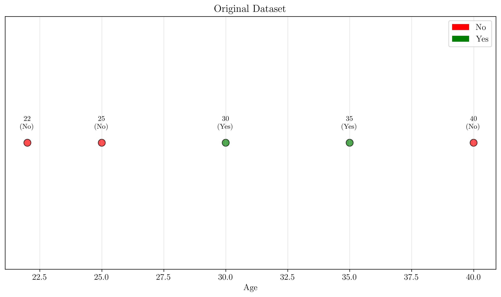
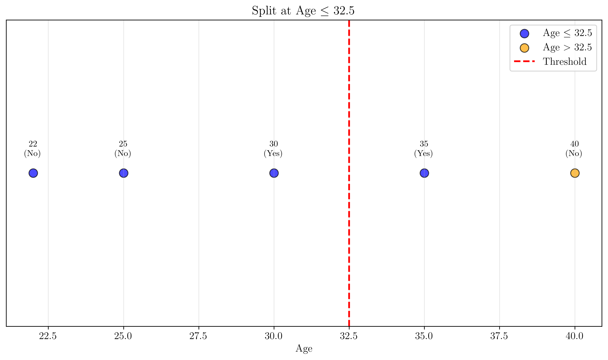
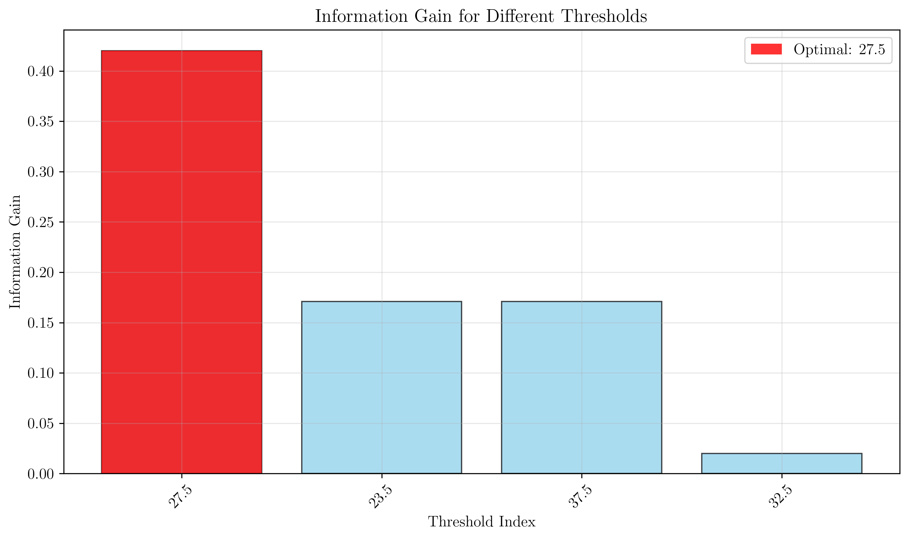
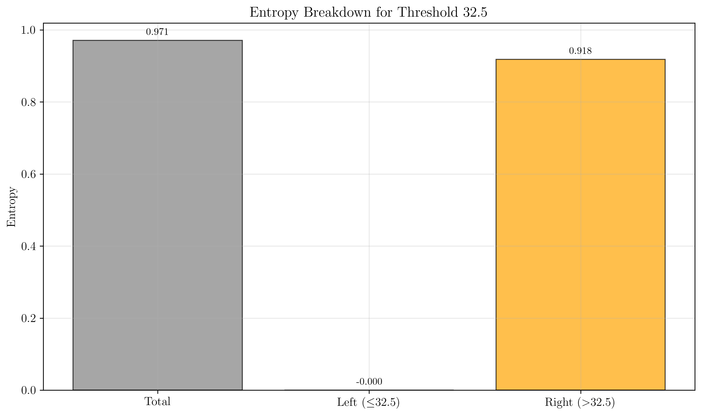
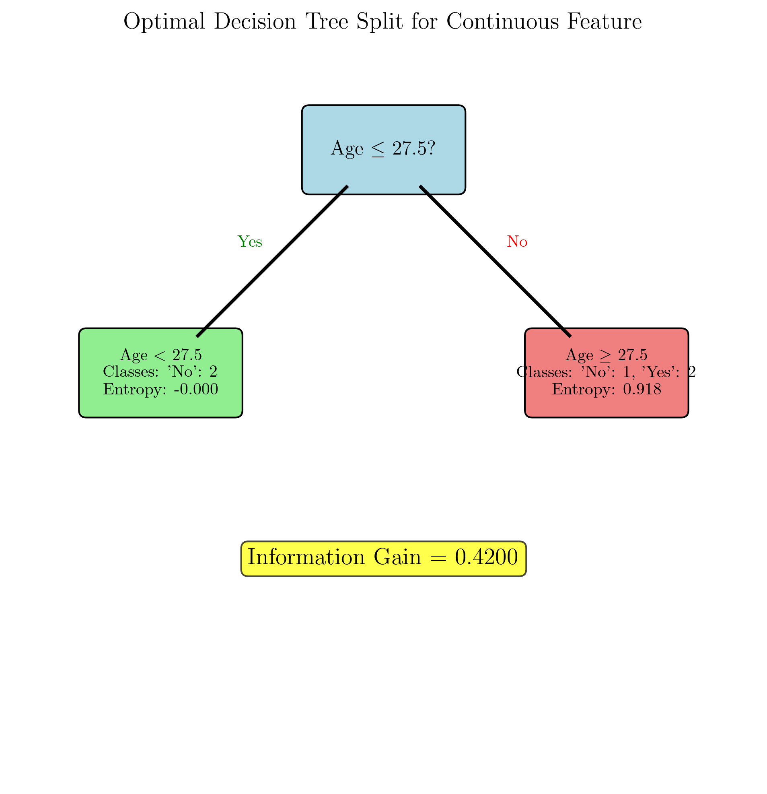
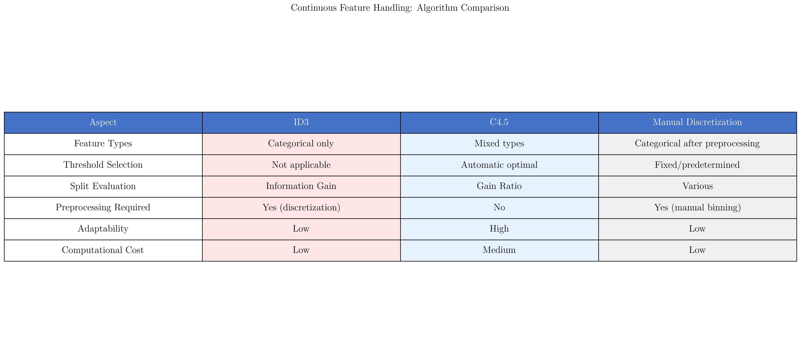

# Question 12: Continuous Feature Handling

## Problem Statement
Consider how C4.5 handles continuous features through optimal threshold selection.

### Task
1. Why can't ID3 handle continuous features directly? Answer in one sentence
2. For ages $\{22, 25, 30, 35, 40\}$ with classes $\{No, No, Yes, Yes, No\}$, list all candidate threshold values
3. Calculate information gain for the threshold Age $\leq 27.5$
4. How does C4.5's approach to continuous features differ from manual discretization?
5. Find the optimal threshold that maximizes information gain for this age dataset

## Understanding the Problem
Continuous features pose a significant challenge for decision tree algorithms because they have infinite possible values, unlike categorical features which have discrete, finite sets of values. The key insight is how to automatically determine optimal thresholds that best separate the data according to the target variable.

C4.5 addresses this challenge through an elegant threshold selection mechanism that evaluates candidate split points based on the training data distribution and selects the one that maximizes information gain.

## Solution

### Step 1: Why ID3 Cannot Handle Continuous Features Directly

**Answer:** ID3 can't handle continuous features directly because it was designed to work with categorical features that have discrete, finite sets of values, while continuous features have infinite possible values, making it impossible to create discrete splits without preprocessing.

**Detailed Explanation:**
- ID3 creates one branch for each possible value of a feature
- For categorical features like "Color = {Red, Blue, Green}", this results in exactly 3 branches
- For continuous features like "Age", there are infinitely many possible values
- Creating a branch for each possible age value would be computationally impossible and statistically meaningless
- Therefore, continuous features must be discretized (binned) before ID3 can process them

### Step 2: Candidate Threshold Values

Given the sorted dataset:
- Ages: [22, 25, 30, 35, 40]
- Classes: [No, No, Yes, Yes, No]

**All possible candidate thresholds:** [23.5, 27.5, 32.5, 37.5]

**Explanation:**
- Candidate thresholds are the midpoints between consecutive age values
- Between 22 and 25: threshold = (22 + 25)/2 = 23.5
- Between 25 and 30: threshold = (25 + 30)/2 = 27.5
- Between 30 and 35: threshold = (30 + 35)/2 = 32.5
- Between 35 and 40: threshold = (35 + 40)/2 = 37.5

**Most promising candidates** (between different classes): [27.5, 37.5]
- 27.5 separates the initial "No" values from the "Yes" values
- 37.5 separates the "Yes" values from the final "No" value

### Step 3: Information Gain Calculation for Age ≤ 27.5

**Dataset split:**
- Left subset ($\text{Age} \leq 27.5$): $[22, 25] \rightarrow [\text{No}, \text{No}]$
- Right subset ($\text{Age} > 27.5$): $[30, 35, 40] \rightarrow [\text{Yes}, \text{Yes}, \text{No}]$

**Entropy calculations:**

Total entropy:
$$H(S) = -\frac{2}{5} \log_2\left(\frac{2}{5}\right) - \frac{3}{5} \log_2\left(\frac{3}{5}\right) = 0.9710$$

Left subset entropy:
$$H(S_{\text{left}}) = -\frac{2}{2} \log_2\left(\frac{2}{2}\right) = 0.0000$$

Right subset entropy:
$$H(S_{\text{right}}) = -\frac{2}{3} \log_2\left(\frac{2}{3}\right) - \frac{1}{3} \log_2\left(\frac{1}{3}\right) = 0.9183$$

**Information Gain:**
$$\text{IG} = H(S) - \frac{|S_{\text{left}}|}{|S|} \cdot H(S_{\text{left}}) - \frac{|S_{\text{right}}|}{|S|} \cdot H(S_{\text{right}})$$

$$\text{IG} = 0.9710 - \frac{2}{5} \cdot 0.0000 - \frac{3}{5} \cdot 0.9183$$

$$\text{IG} = 0.9710 - 0.0000 - 0.5510 = 0.4200$$

### Step 4: C4.5's Approach vs Manual Discretization

**C4.5's Approach:**
- **Automatic**: Evaluates all candidate thresholds systematically
- **Optimal**: Selects threshold that maximizes information gain
- **Data-driven**: Thresholds determined by actual data distribution
- **Adaptive**: Different thresholds can be chosen for different nodes
- **No prior knowledge required**: Algorithm discovers optimal splits

**Manual Discretization:**
- **Manual**: Requires domain expert to choose bin boundaries
- **Fixed**: Same bins used regardless of target variable distribution
- **Domain-dependent**: Relies on external knowledge about the feature
- **Static**: Same discretization used throughout the tree
- **Potentially suboptimal**: May not align with class boundaries

**Key Advantages of C4.5:**
1. **No information loss**: Preserves all information in the continuous feature
2. **Optimal splits**: Mathematically determines the best threshold
3. **Context-sensitive**: Different nodes can use different thresholds
4. **Automated**: No manual intervention required

### Step 5: Finding the Optimal Threshold

**Information Gain for all candidate thresholds:**

| Threshold | Left Subset | Right Subset | Information Gain |
|-----------|-------------|--------------|------------------|
| ≤ 27.5    | [No, No]    | [Yes, Yes, No] | **0.4200** |
| ≤ 23.5    | [No]        | [No, Yes, Yes, No] | 0.1710 |
| ≤ 37.5    | [No, No, Yes, Yes] | [No] | 0.1710 |
| ≤ 32.5    | [No, No, Yes] | [Yes, No] | 0.0200 |

**Optimal threshold: Age ≤ 27.5** with maximum information gain of **0.4200**

This threshold effectively separates the younger individuals (who don't play tennis) from the mixed group of older individuals.

## Visual Explanations

### Data Distribution and Analysis

This visualization shows the original dataset with ages and their corresponding classes, providing a clear view of the data structure.

### Split Visualization

This chart demonstrates how the optimal threshold Age ≤ 27.5 effectively divides the data into meaningful subsets.

### Information Gain Analysis

This bar chart compares the information gain for all candidate thresholds, clearly showing that Age ≤ 27.5 provides the maximum information gain.

### Entropy Breakdown

This visualization shows the detailed entropy calculations for the total dataset and the resulting subsets after the optimal split.

### Optimal Decision Tree Structure

The decision tree visualization demonstrates:
- Root node with the optimal threshold
- Left and right child nodes with their respective class distributions
- Entropy values for each node
- The significant information gain achieved by this split

### Algorithm Comparison

This table compares different approaches to handling continuous features:
- ID3's limitations and preprocessing requirements
- C4.5's automatic threshold selection
- Manual discretization challenges and limitations

## Key Insights

### Threshold Selection Strategy
- **Candidate generation**: Only consider thresholds between data points
- **Evaluation criterion**: Use information gain to assess split quality
- **Optimization goal**: Find threshold that best separates classes
- **Computational efficiency**: Limit search to meaningful split points

### Mathematical Foundation
- Information gain provides an objective measure of split quality
- Pure subsets (entropy = 0) contribute optimally to information gain
- Weighted average of subset entropies determines split effectiveness
- Optimal thresholds naturally emerge from class distribution patterns

### Practical Applications
- **Feature engineering**: Automatic discretization eliminates manual binning
- **Domain independence**: No expert knowledge required for threshold selection
- **Scalability**: Method works with any number of continuous features
- **Robustness**: Adapts to different data distributions automatically

## Conclusion

C4.5's approach to continuous feature handling represents a significant advancement over ID3's limitations:

- **Automatic threshold discovery** eliminates the need for manual preprocessing
- **Information gain maximization** ensures optimal split selection
- **Data-driven approach** adapts to actual class distributions
- **Optimal threshold Age ≤ 27.5** achieves information gain of 0.4200
- **Superior to manual discretization** in both accuracy and automation

This methodology has become standard in modern decision tree implementations and demonstrates the evolution from simple categorical-only algorithms to sophisticated systems capable of handling mixed data types automatically.
