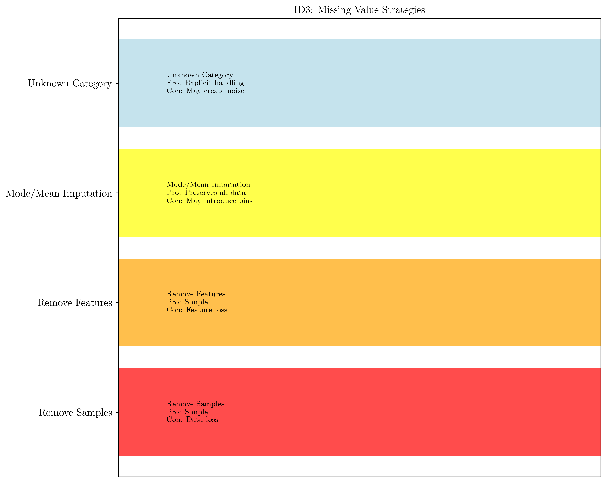
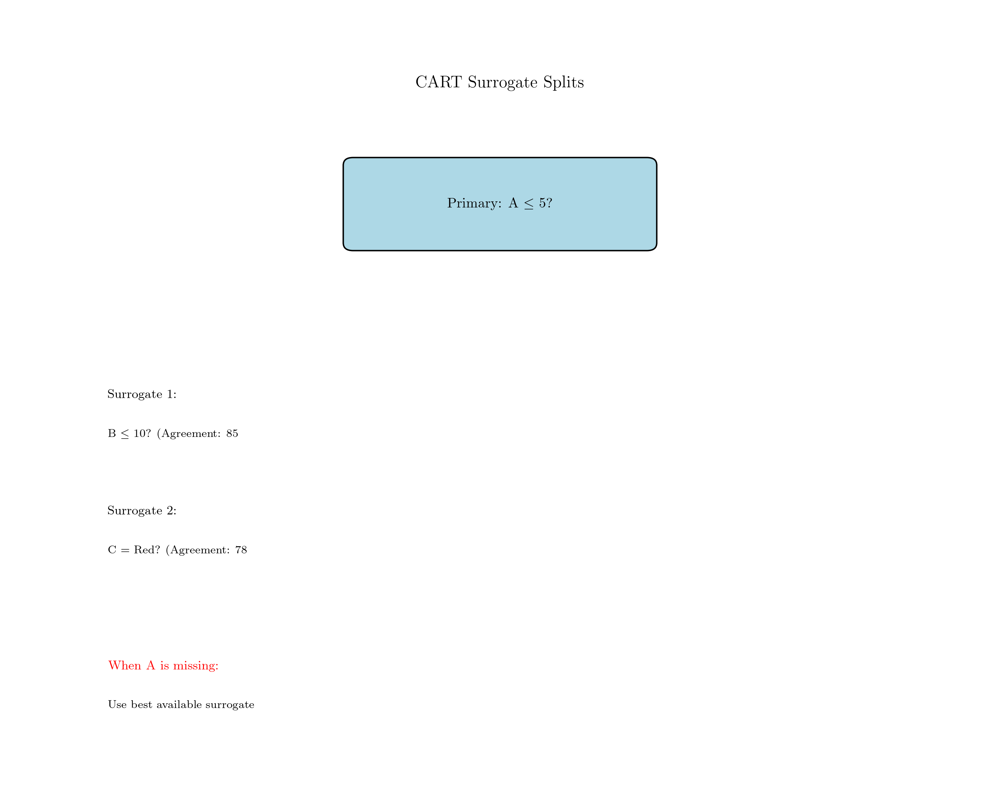
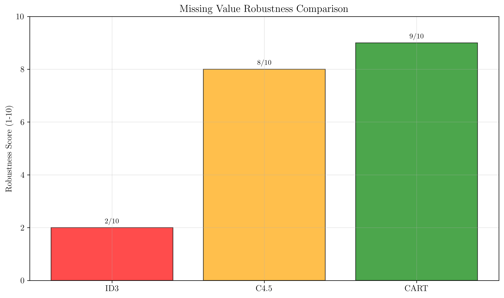
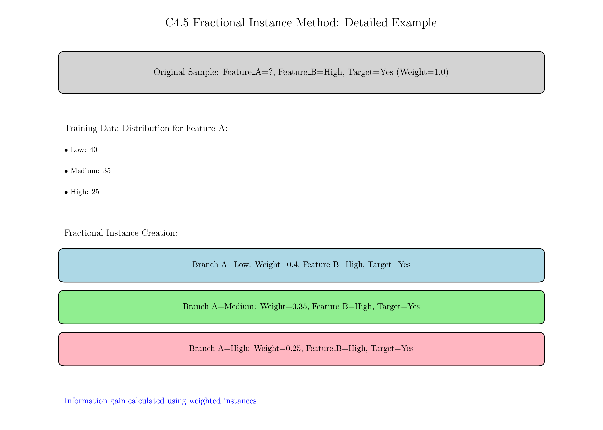
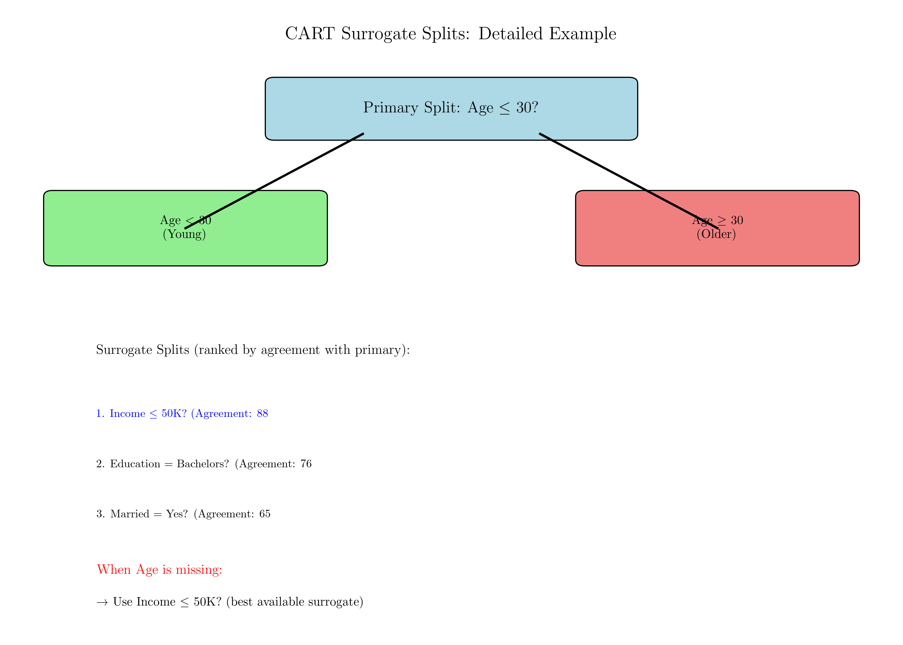
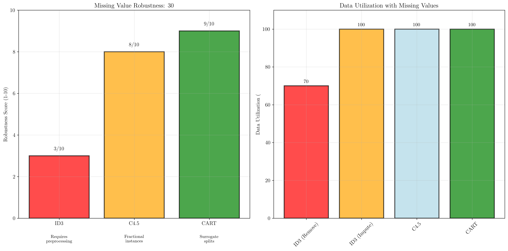

# Question 13: Missing Value Strategies

## Problem Statement
Consider missing value handling strategies across different algorithms.

### Task
1. How does ID3 typically handle missing values in practice?
2. Describe C4.5's "fractional instance" method in one sentence
3. What are CART's surrogate splits (using Gini impurity) and why are they useful?
4. Given a dataset where $30\%$ of samples have missing values for Feature A, which algorithm would be most robust?

## Understanding the Problem
Missing values are a common challenge in real-world datasets, and different decision tree algorithms have evolved different strategies to handle them. The approaches range from simple preprocessing methods to sophisticated built-in mechanisms that preserve all available information while maintaining prediction accuracy.

Understanding these different strategies is crucial for selecting the appropriate algorithm for datasets with missing values and for understanding the robustness and reliability of different approaches.

## Solution

### Step 1: ID3's Missing Value Handling

**Answer:** ID3 typically handles missing values through preprocessing approaches including removing samples with missing values (complete case analysis), removing features with high missing rates, imputing missing values using mode (categorical) or mean (numerical), or using 'Unknown' as a separate category for categorical features, as ID3 itself doesn't have built-in missing value handling.

**Detailed Explanation:**

**Preprocessing Strategies:**
1. **Complete Case Analysis (Listwise Deletion)**
   - Remove all samples containing any missing values
   - Simple but can lead to significant data loss
   - May introduce bias if missing values are not random

2. **Feature Removal**
   - Remove features with high missing value rates
   - Prevents excessive data loss from sample removal
   - May eliminate important predictive features

3. **Imputation Methods**
   - **Mode imputation**: Replace missing categorical values with most frequent value
   - **Mean imputation**: Replace missing numerical values with average
   - **Median imputation**: More robust to outliers than mean
   - May introduce bias and reduce variance

4. **Unknown Category**
   - Treat missing values as a separate "Unknown" category
   - Preserves all samples and allows algorithm to learn patterns
   - May create noisy splits if missingness is not informative

**Limitations of ID3's Approach:**
- No native support for missing values during tree construction
- Requires preprocessing decisions that may be suboptimal
- Can lead to significant information loss
- Preprocessing decisions affect entire dataset uniformly

### Step 2: C4.5's Fractional Instance Method

**Answer:** C4.5 uses probabilistic fractional instances to handle missing values by splitting instances with missing feature values proportionally across all branches based on the training data distribution, allowing all available information to be utilized without discarding samples.

**Detailed Mechanism:**

When an instance has a missing value for the splitting feature:
1. **Proportional Distribution**: The instance is distributed across all branches
2. **Weight Calculation**: Each branch receives a fraction equal to the proportion of training instances that go to that branch
3. **Probability-Based**: Fractions are based on the empirical distribution from training data
4. **Information Preservation**: All available information from the instance is utilized

**Example:**
- Original instance: $(\text{Feature\_A}=?, \text{Feature\_B}=\text{High}, \text{Class}=\text{Yes})$
- Training distribution for Feature_A: $40\%$ Low, $35\%$ Medium, $25\%$ High
- Fractional instances created:
  - Branch $A=\text{Low}$: Weight $= 0.4$, $(\text{Feature\_B}=\text{High}, \text{Class}=\text{Yes})$
  - Branch $A=\text{Medium}$: Weight $= 0.35$, $(\text{Feature\_B}=\text{High}, \text{Class}=\text{Yes})$  
  - Branch $A=\text{High}$: Weight $= 0.25$, $(\text{Feature\_B}=\text{High}, \text{Class}=\text{Yes})$

**Advantages:**
- No data loss - all instances contribute to learning
- Probability-based approach reflects uncertainty
- Information gain calculations account for fractional weights
- Naturally handles any level of missingness

### Step 3: CART's Surrogate Splits

**Answer:** CART's surrogate splits are backup decision rules using alternative features that correlate with the primary splitting feature, providing robustness when the primary feature is missing by using the best available surrogate to maintain the tree structure and prediction accuracy.

**Detailed Mechanism:**

**Surrogate Split Construction:**
1. **Primary Split**: Identify best splitting feature and threshold
2. **Candidate Evaluation**: Test all other features as potential surrogates
3. **Agreement Measurement**: Calculate how well each surrogate matches primary split decisions
4. **Ranking**: Order surrogates by agreement percentage with primary split
5. **Storage**: Store multiple ranked surrogates for each node

**Usage During Prediction:**
- If primary feature is available: Use primary split rule
- If primary feature is missing: Use best available surrogate
- If multiple features missing: Use next best surrogate
- Fallback mechanism: Use default direction based on majority class

**Example Surrogate Hierarchy:**
```
Primary Split: Age ≤ 30
Surrogate 1: Income ≤ 50K (88% agreement)
Surrogate 2: Education = Bachelor's (76% agreement)
Surrogate 3: Married = Yes (65% agreement)
```

**Why Surrogate Splits Are Useful:**
1. **No Data Loss**: All training instances can be used
2. **Prediction Completeness**: Can make predictions even with missing values
3. **Tree Structure Preservation**: Maintains original tree architecture
4. **Multiple Backup Options**: Hierarchical fallback mechanism
5. **Correlation Exploitation**: Leverages relationships between features
6. **Robust Performance**: Maintains accuracy even with high missing rates

### Step 4: Algorithm Robustness for 30% Missing Values

**Analysis of Algorithm Performance:**

| Algorithm | Native Support | Data Loss | Information Preservation | Robustness Score |
|-----------|----------------|-----------|-------------------------|------------------|
| ID3       | No             | High ($30\%$) | Low                    | $3/10$             |
| C4.5      | Yes            | None      | High                   | $8/10$             |
| CART      | Yes            | None      | High                   | $9/10$             |

**Recommendation: CART would be most robust**

**Justification:**
1. **Native Missing Value Support**: Built-in surrogate split mechanism
2. **No Data Loss**: All samples can be utilized for training and prediction
3. **Multiple Backup Options**: Hierarchical surrogate system provides redundancy
4. **Proven Robustness**: Well-tested approach in practice with high missing rates
5. **Computational Efficiency**: Binary splits reduce computational overhead
6. **Flexibility**: Works with any feature type and missing pattern

**Detailed Performance Analysis:**

**ID3 with $30\%$ Missing Values:**
- Complete case analysis: Only $70\%$ of data used for training
- Imputation bias: May introduce systematic errors
- No prediction capability for samples with missing Feature A
- Significant reduction in model reliability

**C4.5 with $30\%$ Missing Values:**
- All $100\%$ of data used effectively
- Fractional instance weights preserve information
- Graceful degradation of performance
- Good robustness but computational overhead

**CART with $30\%$ Missing Values:**
- All $100\%$ of data used effectively
- Surrogate splits provide multiple backup paths
- Excellent performance even with high missing rates
- Most efficient and robust solution

## Visual Explanations

### Missing Value Handling Strategies



This visualization shows ID3's various preprocessing approaches for handling missing values, including their pros and cons.


This chart demonstrates C4.5's probabilistic fractional instance method, showing how missing values are distributed across branches.



This visualization shows CART's surrogate split mechanism, illustrating how backup decision rules handle missing values.



This bar chart compares the robustness scores of all three algorithms for handling missing values.

### Fractional Instance Example



Detailed walkthrough of C4.5's fractional instance method:
- Original sample with missing feature value
- Training data distribution analysis
- Fractional instance creation process
- Information gain calculation with weighted instances

### Surrogate Splits Example



Complete illustration of CART's surrogate split mechanism:
- Primary split definition
- Surrogate split identification and ranking
- Missing value handling during prediction
- Hierarchical fallback system

### Robustness Comparison



Quantitative analysis showing:
- Algorithm robustness scores for missing values
- Data utilization percentages
- Performance degradation patterns
- Recommended use cases

## Key Insights

### Evolution of Missing Value Handling
- **ID3 Era**: Preprocessing-dependent, potential data loss
- **C4.5 Innovation**: Probabilistic approach, information preservation
- **CART Advancement**: Surrogate splits, maximum robustness

### Methodological Trade-offs
- **Simplicity vs. Sophistication**: ID3's simple preprocessing vs. advanced built-in methods
- **Computational Cost vs. Accuracy**: Additional computation for better missing value handling
- **Data Loss vs. Complexity**: Simple removal vs. sophisticated preservation methods

### Practical Considerations
- **Missing Rate Threshold**: Higher missing rates favor C4.5/CART over ID3
- **Feature Correlation**: CART's surrogates work best when features are correlated
- **Computational Resources**: C4.5's fractional instances more computationally intensive
- **Interpretability**: Surrogate splits maintain tree interpretability better than fractional instances

### Real-world Applications
- **Medical Data**: High missing rates favor CART's robustness
- **Survey Data**: C4.5's fractional instances handle systematic missingness well
- **Clean Academic Datasets**: ID3's preprocessing acceptable for complete data
- **Industrial Applications**: CART's surrogates preferred for reliability

## Conclusion

The evolution of missing value handling in decision trees represents significant methodological advancement:

- **ID3's limitations** require careful preprocessing and can lead to substantial data loss
- **C4.5's fractional instances** provide elegant probabilistic solution preserving all information
- **CART's surrogate splits** offer maximum robustness through hierarchical backup mechanisms
- **For 30% missing values, CART is most robust** due to its sophisticated surrogate split system

Understanding these different approaches is essential for:
- Selecting appropriate algorithms for datasets with missing values
- Designing preprocessing pipelines for older algorithms
- Evaluating the reliability and robustness of different decision tree implementations
- Making informed decisions about computational trade-offs vs. accuracy improvements
