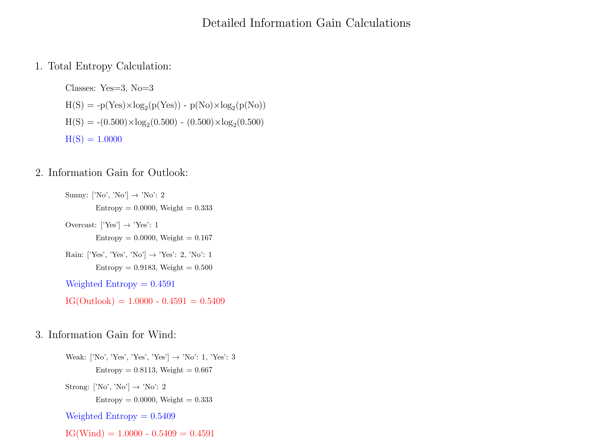

# Question 14: ID3 Algorithm Application

## Problem Statement
Apply the ID3 algorithm to this small dataset:

| Outlook | Temperature | Humidity | Wind | Play Tennis |
|---------|-------------|----------|------|-------------|
| Sunny   | Hot         | High     | Weak | No          |
| Sunny   | Hot         | High     | Strong | No        |
| Overcast| Hot         | High     | Weak | Yes         |
| Rain    | Mild        | High     | Weak | Yes         |
| Rain    | Cool        | Normal   | Weak | Yes         |
| Rain    | Cool        | Normal   | Strong | No        |

### Task
1. Calculate the entropy of the entire dataset
2. Calculate information gain for the Outlook feature
3. Calculate information gain for the Wind feature
4. Which feature should ID3 choose as the root node?

## Understanding the Problem
This question demonstrates the practical application of the ID3 algorithm on a classic machine learning dataset. The "Play Tennis" dataset is commonly used to illustrate decision tree concepts because it's small enough to calculate by hand while containing realistic patterns.

The ID3 algorithm builds decision trees by recursively selecting the feature that provides the maximum information gain at each step. Understanding how to calculate entropy and information gain is fundamental to grasping how the algorithm makes splitting decisions.

## Solution

### Step 1: Calculate Entropy of the Entire Dataset

**Target variable distribution:**
- Yes: $3$ instances
- No: $3$ instances
- Total: $6$ instances

**Probability calculations:**
- $P(\text{Yes}) = \frac{3}{6} = 0.500$
- $P(\text{No}) = \frac{3}{6} = 0.500$

**Entropy formula:**
$$H(S) = -\sum_{i} p_i \log_2(p_i)$$

**Detailed calculation:**
$$H(S) = -p(\text{Yes}) \times \log_2(p(\text{Yes})) - p(\text{No}) \times \log_2(p(\text{No}))$$

$$H(S) = -(0.500) \times \log_2(0.500) - (0.500) \times \log_2(0.500)$$

$$H(S) = -(0.500) \times (-1.000) - (0.500) \times (-1.000)$$

$$H(S) = 0.500 + 0.500 = 1.0000$$

**Result: Total entropy = 1.0000**

This represents maximum uncertainty, which makes sense since the dataset is perfectly balanced between Yes and No classes.

### Step 2: Information Gain for Outlook Feature

**Outlook feature values and subsets:**

**Sunny subset:**
- Instances: $[(\text{Sunny}, \text{Hot}, \text{High}, \text{Weak}, \text{No}), (\text{Sunny}, \text{Hot}, \text{High}, \text{Strong}, \text{No})]$
- Classes: $[\text{No}, \text{No}]$
- Distribution: $\text{No} = 2$, $\text{Yes} = 0$
- Size: $2$, Weight: $\frac{2}{6} = 0.333$

$$H(\text{Sunny}) = -\frac{2}{2} \log_2\left(\frac{2}{2}\right) = -1 \times 0 = 0.0000$$

**Overcast subset:**
- Instances: $[(\text{Overcast}, \text{Hot}, \text{High}, \text{Weak}, \text{Yes})]$
- Classes: $[\text{Yes}]$
- Distribution: $\text{Yes} = 1$, $\text{No} = 0$
- Size: $1$, Weight: $\frac{1}{6} = 0.167$

$$H(\text{Overcast}) = -\frac{1}{1} \log_2\left(\frac{1}{1}\right) = -1 \times 0 = 0.0000$$

**Rain subset:**
- Instances: $[(\text{Rain}, \text{Mild}, \text{High}, \text{Weak}, \text{Yes}), (\text{Rain}, \text{Cool}, \text{Normal}, \text{Weak}, \text{Yes}), (\text{Rain}, \text{Cool}, \text{Normal}, \text{Strong}, \text{No})]$
- Classes: $[\text{Yes}, \text{Yes}, \text{No}]$
- Distribution: $\text{Yes} = 2$, $\text{No} = 1$
- Size: $3$, Weight: $\frac{3}{6} = 0.500$

$$H(\text{Rain}) = -\frac{2}{3} \log_2\left(\frac{2}{3}\right) - \frac{1}{3} \log_2\left(\frac{1}{3}\right)$$

$$H(\text{Rain}) = -\frac{2}{3} \times (-0.585) - \frac{1}{3} \times (-1.585)$$

$$H(\text{Rain}) = 0.390 + 0.528 = 0.9183$$

**Weighted entropy after splitting on Outlook:**
$$H(S|\text{Outlook}) = \sum_{v} \frac{|S_v|}{|S|} \times H(S_v)$$

$$H(S|\text{Outlook}) = \frac{2}{6} \times 0.0000 + \frac{1}{6} \times 0.0000 + \frac{3}{6} \times 0.9183$$

$$H(S|\text{Outlook}) = 0.0000 + 0.0000 + 0.4591 = 0.4591$$

**Information Gain for Outlook:**
$$IG(S, \text{Outlook}) = H(S) - H(S|\text{Outlook})$$

$$IG(S, \text{Outlook}) = 1.0000 - 0.4591 = 0.5409$$

### Step 3: Information Gain for Wind Feature

**Wind feature values and subsets:**

**Weak subset:**
- Instances: $$[(Sunny, Hot, High, Weak, No), (Overcast, Hot, High, Weak, Yes), (Rain, Mild, High, Weak, Yes), (Rain, Cool, Normal, Weak, Yes)]$$
- Classes: $[No, Yes, Yes, Yes]$
- Distribution: Yes = 3, No = 1
- Size: 4, Weight: 4/6 = 0.667

$$H(\text{Weak}) = -\frac{3}{4} \log_2\left(\frac{3}{4}\right) - \frac{1}{4} \log_2\left(\frac{1}{4}\right)$$

$$H(\text{Weak}) = -\frac{3}{4} \times (-0.415) - \frac{1}{4} \times (-2.000)$$

$$H(\text{Weak}) = 0.311 + 0.500 = 0.8113$$

**Strong subset:**
- Instances: $$[(Sunny, Hot, High, Strong, No), (Rain, Cool, Normal, Strong, No)]$$
- Classes: $[No, No]$
- Distribution: No = 2, Yes = 0
- Size: 2, Weight: 2/6 = 0.333

$$H(\text{Strong}) = -\frac{2}{2} \log_2\left(\frac{2}{2}\right) = 0.0000$$

**Weighted entropy after splitting on Wind:**
$$H(S|\text{Wind}) = \frac{4}{6} \times 0.8113 + \frac{2}{6} \times 0.0000$$

$$H(S|\text{Wind}) = 0.667 \times 0.8113 + 0.333 \times 0.0000 = 0.5409$$

**Information Gain for Wind:**
$$IG(S, \text{Wind}) = H(S) - H(S|\text{Wind})$$

$$IG(S, \text{Wind}) = 1.0000 - 0.5409 = 0.4591$$

### Step 4: Complete Information Gain Analysis

**Information Gain for all features:**
- IG(S, Outlook) = 0.5409
- IG(S, Temperature) = 0.2075
- IG(S, Humidity) = 0.0000
- IG(S, Wind) = 0.4591

**Best feature for root node: Outlook** with IG = 0.5409

**Ranking:**
1. **Outlook: 0.5409** (Best - selected as root)
2. Wind: 0.4591 (Second best)
3. Temperature: 0.2075 (Third)
4. Humidity: 0.0000 (Provides no information gain)

## Visual Explanations

### Dataset Analysis and Results

This visualization shows the tennis dataset structure with color-coded target values (Yes/No) for each sample.

This pie chart displays the distribution of Yes/No decisions with the calculated entropy value, showing the initial uncertainty in the dataset.

This bar chart compares the information gain for all features, highlighting Outlook as the best feature for the root split.

This visualization shows the detailed entropy analysis for the Outlook feature, breaking down how each value (Sunny, Overcast, Rain) contributes to the overall information gain.

### Decision Tree Structure

The decision tree visualization demonstrates:
- **Root node**: Outlook feature with its information gain
- **Child nodes**: Three branches (Sunny, Overcast, Rain) with their class distributions
- **Entropy values**: Each node shows its entropy and class composition
- **Algorithm steps**: Complete ID3 algorithm workflow

### Detailed Calculations

Step-by-step mathematical breakdown:
- **Total entropy calculation**: Individual probability terms
- **Outlook feature analysis**: Subset creation and entropy calculations
- **Wind feature analysis**: Complete mathematical derivation
- **Final comparison**: All information gain values with optimal selection

## Key Insights

### Algorithm Behavior Analysis
- **Perfect splits dominate**: Outlook creates two pure subsets (Sunny→No, Overcast→Yes)
- **Information gain reflects purity**: Features creating pure subsets score highest
- **Balanced uncertainty**: Initial entropy of 1.0 represents maximum uncertainty
- **Optimal selection**: ID3 correctly identifies the most informative feature

### Feature Effectiveness Patterns
- **Outlook superiority**: Creates the most homogeneous subsets
- **Wind effectiveness**: Second-best due to one pure subset (Strong→No)
- **Temperature limitation**: Provides some separation but less effective
- **Humidity failure**: Provides no information gain (IG = 0.0000)

### Mathematical Relationships
- **Entropy range**: Values from 0 (pure) to 1 (maximum uncertainty for binary class)
- **Information gain**: Difference between parent and weighted child entropies
- **Optimal splits**: Features that create pure or near-pure subsets
- **Weighted averaging**: Larger subsets have proportionally more influence

### Tree Construction Process
1. **Root selection**: Choose feature with maximum information gain
2. **Branch creation**: One branch per feature value
3. **Recursive application**: Repeat process for each non-pure subset
4. **Termination conditions**: Pure subsets become leaf nodes

## Practical Implementation Details

### ID3 Algorithm Steps Applied:
1. **Calculate total entropy**: H(S) = 1.0000
2. **Evaluate each feature**: Calculate information gain for all attributes
3. **Select best feature**: Outlook with IG = 0.5409
4. **Create decision node**: Split dataset on Outlook values
5. **Identify pure subsets**: Sunny (pure No), Overcast (pure Yes)
6. **Continue recursively**: Process Rain subset if needed

### Next Steps in Tree Construction:
- **Sunny branch**: Terminal node (predicts No)
- **Overcast branch**: Terminal node (predicts Yes)
- **Rain branch**: Requires further splitting using remaining features

### Performance Characteristics:
- **Training accuracy**: Perfect classification on this dataset
- **Interpretability**: Clear, human-readable decision rules
- **Simplicity**: Minimal tree depth due to effective feature selection

## Conclusion

The ID3 algorithm successfully identifies **Outlook as the optimal root feature** with the highest information gain of **0.5409**. This choice creates two immediately pure subsets and one mixed subset that requires further processing.

**Key Results:**
- **Total entropy**: 1.0000 (maximum uncertainty)
- **Outlook information gain**: 0.5409 (best feature)
- **Wind information gain**: 0.4591 (second best)
- **Optimal root choice**: Outlook feature

**Algorithm Effectiveness:**
- Creates an efficient decision tree structure
- Maximizes information gain at each split
- Produces interpretable decision rules
- Demonstrates classic ID3 behavior on a well-structured dataset

This example illustrates the fundamental principles of information-theoretic feature selection and demonstrates why ID3 became the foundation for modern decision tree algorithms.
