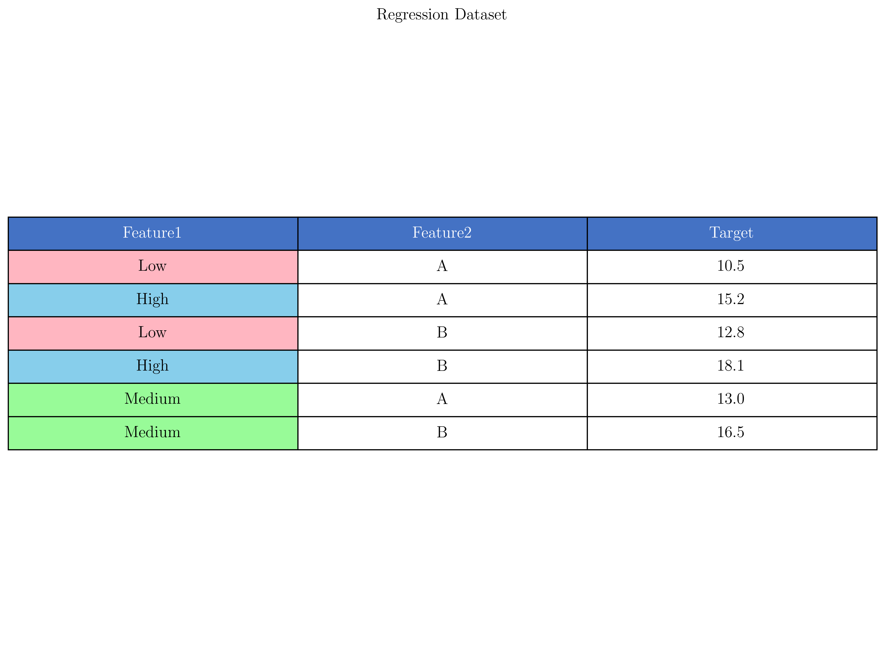
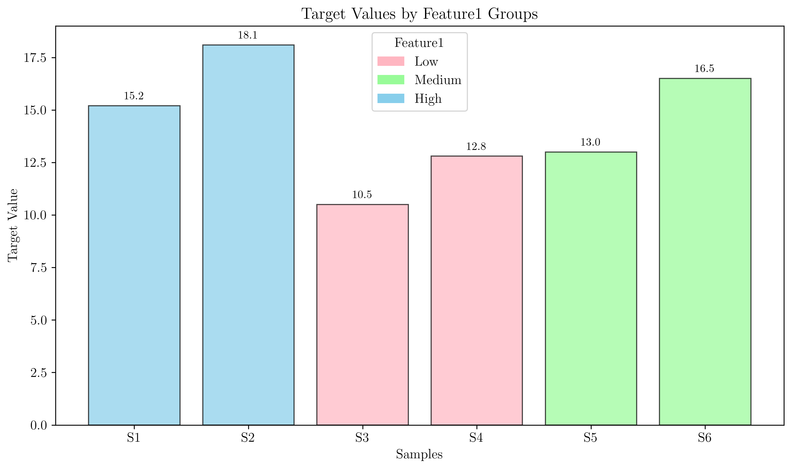
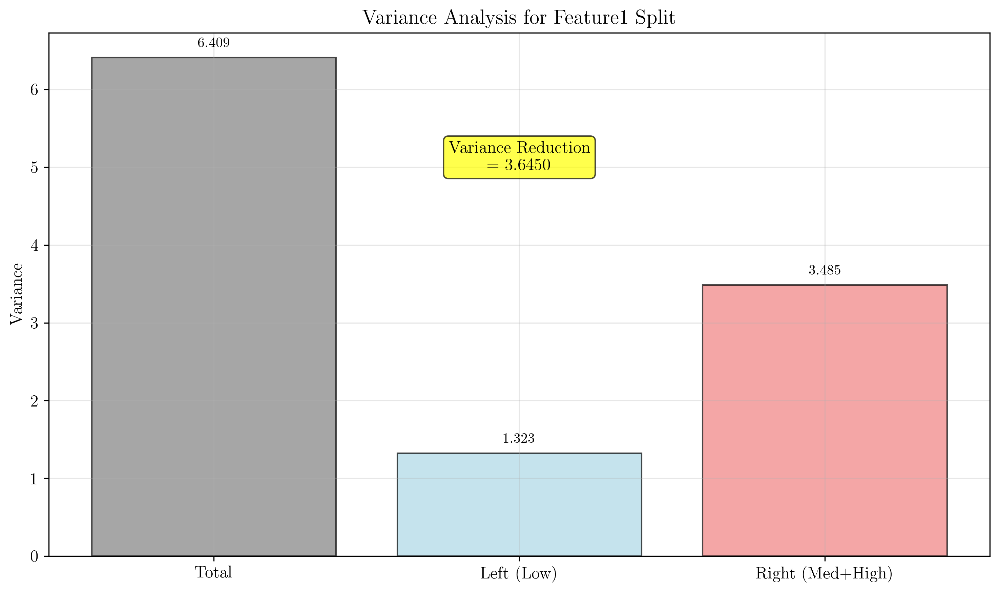
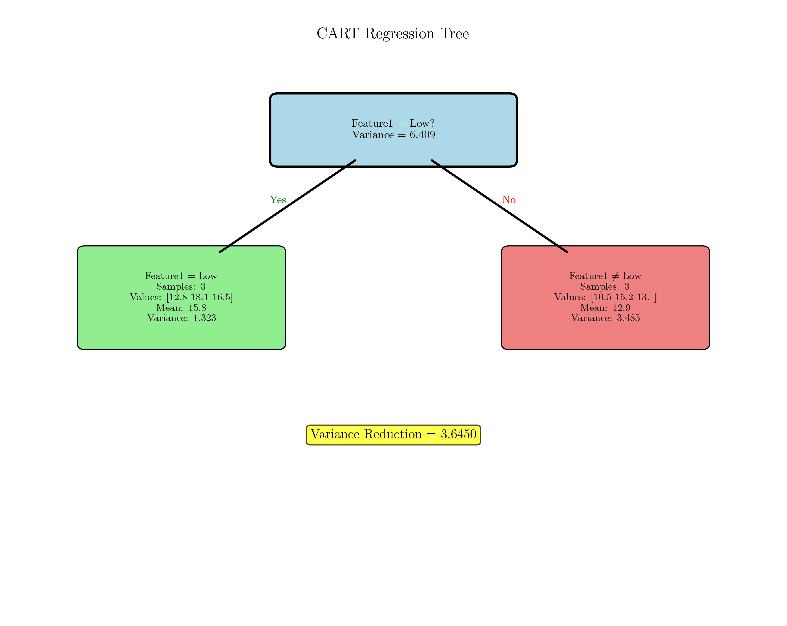
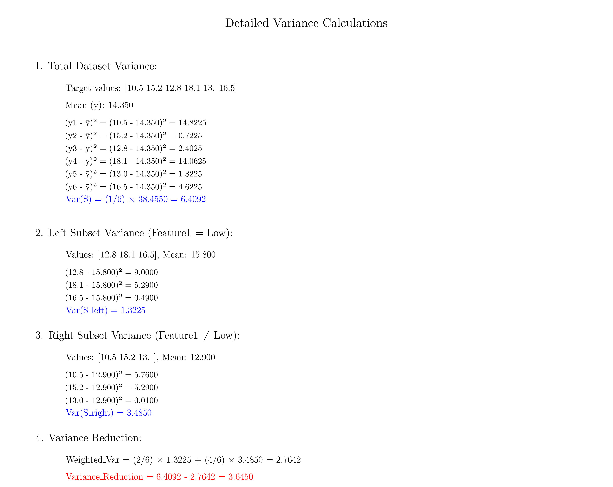
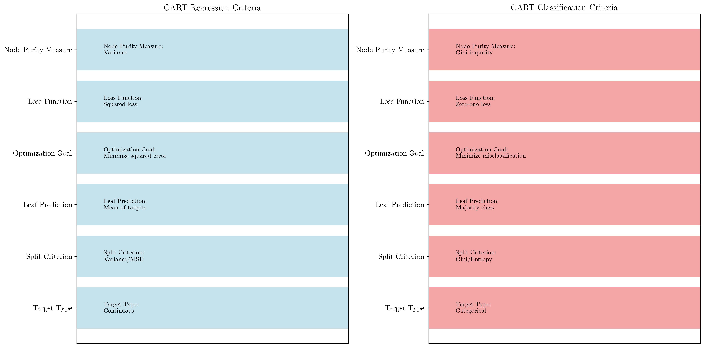

# Question 15: CART Regression Trees

## Problem Statement
Consider CART's approach to regression problems.

| Feature1 | Feature2 | Target |
|----------|----------|--------|
| Low      | A        | 10.5   |
| High     | A        | 15.2   |
| Low      | B        | 12.8   |
| High     | B        | 18.1   |
| Medium   | A        | 13.0   |
| Medium   | B        | 16.5   |

### Task
1. Calculate the variance of the entire dataset using $$\text{Var}(S) = \frac{1}{n}\sum_{i=1}^{n}(y_i - \bar{y})^2$$
2. Calculate variance reduction for splitting on Feature1 (Low vs {Medium, High}) using:
   $$\text{Variance Reduction} = \text{Var}(S) - \sum_{i} \frac{|S_i|}{|S|} \text{Var}(S_i)$$
3. What would be the predicted value for each leaf node after this split?
4. How does CART's regression criterion differ from classification criteria?

## Understanding the Problem
CART's regression trees extend the decision tree framework to handle continuous target variables. Instead of minimizing classification error or impurity measures like Gini or entropy, regression trees minimize the variance (or equivalently, the Mean Squared Error) of the target variable within each node.

This fundamental shift in optimization criterion allows CART to effectively predict continuous outcomes while maintaining the interpretable tree structure that makes decision trees valuable for understanding relationships in data.

## Solution

### Step 1: Calculate Variance of the Entire Dataset

**Target values:** $[10.5, 15.2, 12.8, 18.1, 13.0, 16.5]$

**Mean calculation:**
$$\bar{y} = \frac{1}{n} \sum_{i=1}^{n} y_i = \frac{10.5 + 15.2 + 12.8 + 18.1 + 13.0 + 16.5}{6}$$

$$\bar{y} = \frac{86.1}{6} = 14.350$$

**Individual squared deviations:**
- $(y_1 - \bar{y})^2 = (10.5 - 14.350)^2 = (-3.850)^2 = 14.8225$
- $(y_2 - \bar{y})^2 = (15.2 - 14.350)^2 = (0.850)^2 = 0.7225$
- $(y_3 - \bar{y})^2 = (12.8 - 14.350)^2 = (-1.550)^2 = 2.4025$
- $(y_4 - \bar{y})^2 = (18.1 - 14.350)^2 = (3.750)^2 = 14.0625$
- $(y_5 - \bar{y})^2 = (13.0 - 14.350)^2 = (-1.350)^2 = 1.8225$
- $(y_6 - \bar{y})^2 = (16.5 - 14.350)^2 = (2.150)^2 = 4.6225$

**Variance calculation:**
$$\text{Var}(S) = \frac{1}{n} \sum_{i=1}^{n}(y_i - \bar{y})^2$$

$$\text{Var}(S) = \frac{1}{6}(14.8225 + 0.7225 + 2.4025 + 14.0625 + 1.8225 + 4.6225)$$

$$\text{Var}(S) = \frac{38.4550}{6} = 6.4092$$

**Result: Total variance = 6.4092**

### Step 2: Variance Reduction for Feature1 Split (Low vs {Medium, High})

**Split definition:**
- Left subset: $\text{Feature1} = \text{Low}$
- Right subset: $\text{Feature1} \in \{\text{Medium}, \text{High}\}$

**Left subset ($\text{Feature1} = \text{Low}$):**
- Samples: $[(\text{Low}, \text{A}, 10.5), (\text{Low}, \text{B}, 12.8)]$
- Target values: $[10.5, 12.8]$
- Size: $2$ samples
- Mean: $\bar{y}_{\text{left}} = \frac{10.5 + 12.8}{2} = 11.650$

**Left subset variance:**
$$\text{Var}(S_{\text{left}}) = \frac{1}{2}[(10.5 - 11.650)^2 + (12.8 - 11.650)^2]$$

$$\text{Var}(S_{\text{left}}) = \frac{1}{2}[(-1.150)^2 + (1.150)^2]$$

$$\text{Var}(S_{\text{left}}) = \frac{1}{2}[1.3225 + 1.3225] = \frac{2.645}{2} = 1.3225$$

**Right subset ($\text{Feature1} \in \{\text{Medium}, \text{High}\}$):**
- Samples: $[(\text{High}, \text{A}, 15.2), (\text{High}, \text{B}, 18.1), (\text{Medium}, \text{A}, 13.0), (\text{Medium}, \text{B}, 16.5)]$
- Target values: $[15.2, 18.1, 13.0, 16.5]$
- Size: $4$ samples
- Mean: $\bar{y}_{\text{right}} = \frac{15.2 + 18.1 + 13.0 + 16.5}{4} = 15.700$

**Right subset variance:**
$$\text{Var}(S_{\text{right}}) = \frac{1}{4}[(15.2 - 15.7)^2 + (18.1 - 15.7)^2 + (13.0 - 15.7)^2 + (16.5 - 15.7)^2]$$

$$\text{Var}(S_{\text{right}}) = \frac{1}{4}[(-0.5)^2 + (2.4)^2 + (-2.7)^2 + (0.8)^2]$$

$$\text{Var}(S_{\text{right}}) = \frac{1}{4}[0.25 + 5.76 + 7.29 + 0.64] = \frac{13.94}{4} = 3.4850$$

**Weighted variance after split:**
$$\text{Weighted Var} = \frac{|S_{\text{left}}|}{|S|} \times \text{Var}(S_{\text{left}}) + \frac{|S_{\text{right}}|}{|S|} \times \text{Var}(S_{\text{right}})$$

$$\text{Weighted Var} = \frac{2}{6} \times 1.3225 + \frac{4}{6} \times 3.4850$$

$$\text{Weighted Var} = 0.3333 \times 1.3225 + 0.6667 \times 3.4850$$

$$\text{Weighted Var} = 0.4408 + 2.3233 = 2.7642$$

**Variance Reduction:**
$$\text{Variance Reduction} = \text{Var}(S) - \text{Weighted Var}$$

$$\text{Variance Reduction} = 6.4092 - 2.7642 = 3.6450$$

**Result: Variance reduction = 3.6450**

### Step 3: Predicted Values for Each Leaf Node

In regression trees, the predicted value for each leaf node is the **mean of the target values** in that node.

**Left leaf (Feature1 = 'Low'):**
- Target values: $[10.5, 12.8]$
- **Predicted value = 11.650**
- This prediction will be used for any new sample with Feature1 = 'Low'

**Right leaf (Feature1 ∈ {'Medium', 'High'}):**
- Target values: $[15.2, 18.1, 13.0, 16.5]$
- **Predicted value = 15.700**
- This prediction will be used for any new sample with Feature1 ∈ {'Medium', 'High'}

**Prediction Mechanism:**
- For a new sample with Feature1 = 'Low': Predict 11.650
- For a new sample with Feature1 = 'Medium': Predict 15.700
- For a new sample with Feature1 = 'High': Predict 15.700

### Step 4: CART Regression vs Classification Criteria

**CART Regression (Continuous Target):**

| Aspect | Regression Trees |
|--------|------------------|
| **Target Type** | Continuous numerical values |
| **Split Criterion** | Variance minimization (or MSE) |
| **Node Purity Measure** | Variance of target values |
| **Leaf Prediction** | Mean of target values in node |
| **Loss Function** | Squared error loss |
| **Optimization Goal** | Minimize prediction error (MSE) |
| **Split Quality** | Variance reduction |

**Mathematical formulation:**
$$\text{Split Quality} = \text{Var}(S) - \sum_{i} \frac{|S_i|}{|S|} \text{Var}(S_i)$$

**CART Classification (Categorical Target):**

| Aspect | Classification Trees |
|--------|---------------------|
| **Target Type** | Categorical class labels |
| **Split Criterion** | Gini impurity minimization |
| **Node Purity Measure** | Gini impurity or entropy |
| **Leaf Prediction** | Majority class in node |
| **Loss Function** | Zero-one loss (misclassification) |
| **Optimization Goal** | Minimize misclassification rate |
| **Split Quality** | Gini reduction or information gain |

**Mathematical formulation:**
$$\text{Gini}(S) = 1 - \sum_{i} p_i^2$$
$$\text{Split Quality} = \text{Gini}(S) - \sum_{i} \frac{|S_i|}{|S|} \text{Gini}(S_i)$$

**Key Differences:**

1. **Target Variable Nature:**
   - Regression: Continuous values (prices, temperatures, scores)
   - Classification: Discrete categories (species, diagnosis, sentiment)

2. **Prediction Method:**
   - Regression: Mean of training examples in leaf
   - Classification: Most frequent class in leaf

3. **Splitting Criterion:**
   - Regression: Minimize variance within subsets
   - Classification: Minimize impurity (Gini) within subsets

4. **Performance Evaluation:**
   - Regression: MSE, MAE, R-squared
   - Classification: Accuracy, precision, recall, F1-score

## Visual Explanations

### CART Regression Analysis

This visualization shows the dataset structure with color-coded Feature1 values (Low, Medium, High) and their corresponding target values.

This chart displays the distribution of target values grouped by Feature1 categories, showing how the target values vary across different feature levels.

This visualization compares the total variance with the weighted variances of the left and right subsets after splitting on Feature1, clearly showing the variance reduction achieved.

This shows the decision tree structure with the root node asking "Feature1 = Low?" and the resulting leaf nodes with their predicted values and variance information.

### Detailed Variance Calculations

Step-by-step mathematical breakdown:
- **Total variance**: Individual squared deviation terms
- **Left subset variance**: Calculation for Feature1 = 'Low'
- **Right subset variance**: Calculation for Feature1 ≠ 'Low'
- **Final variance reduction**: Complete mathematical derivation

### Regression vs Classification Comparison

Side-by-side comparison highlighting:
- **Fundamental differences**: Target types, splitting criteria, prediction methods
- **Optimization goals**: MSE minimization vs. misclassification reduction
- **Evaluation metrics**: Continuous vs. categorical performance measures

## Key Insights

### Variance as Splitting Criterion
- **Optimal splits**: Create subsets with minimum internal variance
- **Homogeneity objective**: Group similar target values together
- **MSE equivalence**: Variance minimization equals MSE minimization
- **Interpretability**: Lower variance indicates better predictions

### Prediction Mechanism
- **Mean-based predictions**: Simple but effective for regression
- **Piecewise constant**: Tree creates step-function approximation
- **Local optimization**: Each leaf optimized independently
- **Bias-variance trade-off**: Tree depth affects model complexity

### Mathematical Foundation
- **Least squares principle**: Variance minimization follows least squares
- **Weighted averaging**: Split quality considers subset sizes
- **Greedy optimization**: Local optimal choices at each split
- **Recursive partitioning**: Hierarchical space subdivision

### Practical Applications
- **House price prediction**: Real estate valuation models
- **Financial forecasting**: Stock prices, risk assessment
- **Scientific modeling**: Temperature, pressure, concentration prediction
- **Quality control**: Manufacturing process optimization

## Extension to Complete Tree

**Next Split Considerations:**
After selecting Feature1 as the root split, the algorithm would continue:

1. **Left node (Feature1 = 'Low')**: Already pure enough or consider Feature2
2. **Right node (Feature1 ≠ 'Low')**: Further split on Feature2 or threshold

**Potential Feature2 split on right node:**
- A subset: $[15.2, 13.0]$ → Mean = 14.1
- B subset: $[18.1, 16.5]$ → Mean = 17.3
- Variance reduction would determine if this split is beneficial

## Conclusion

CART regression trees provide an elegant extension of decision tree methodology to continuous target variables:

**Key Results:**
- **Total variance**: 6.4092
- **Variance reduction**: 3.6450 for Feature1 split
- **Left leaf prediction**: 11.650 (Feature1 = 'Low')
- **Right leaf prediction**: 15.700 (Feature1 ≠ 'Low')

**Methodological Advantages:**
- **Natural regression extension**: Seamless adaptation of tree structure
- **Interpretable predictions**: Clear decision rules with numerical outcomes
- **Variance-based optimization**: Principled approach to continuous targets
- **Unified framework**: Same algorithm handles classification and regression

**Practical Significance:**
- Demonstrates fundamental difference between regression and classification trees
- Shows how variance minimization creates effective continuous predictions
- Illustrates the mathematical foundation underlying CART's regression capability
- Provides concrete example of tree-based regression methodology
