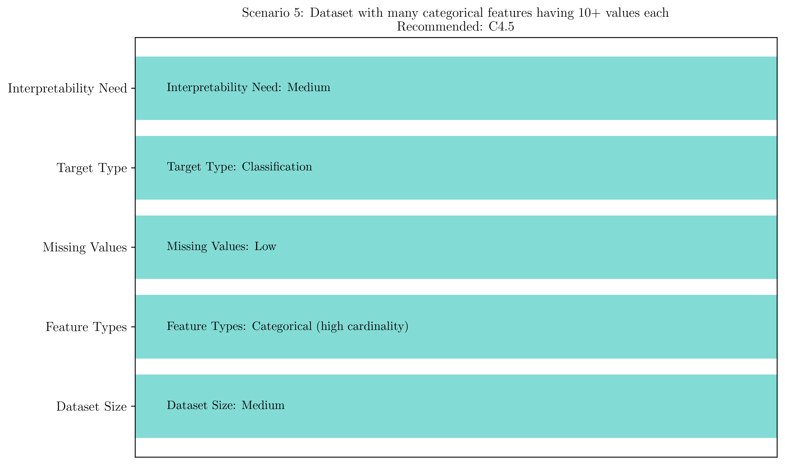

# Question 16: Algorithm Selection Scenarios

## Problem Statement
Which of the following scenarios would benefit most from each algorithm? Choose the best match.

### Task
For each scenario, select ID3, C4.5, or CART and justify your choice:

1. Small dataset with only categorical features and no missing values
2. Large dataset with mixed feature types and $20\%$ missing values  
3. Medical diagnosis requiring highly interpretable rules
4. Predicting house prices (continuous target variable)
5. Dataset with many categorical features having 10+ values each

## Understanding the Problem
Selecting the appropriate decision tree algorithm requires understanding the characteristics of your data and the requirements of your application. Each algorithm has specific strengths and limitations that make them more or less suitable for different scenarios.

This question tests the ability to match algorithm capabilities with real-world requirements, considering factors such as data types, missing values, interpretability needs, and target variable characteristics.

## Solution

### Scenario 1: Small dataset with only categorical features and no missing values

**Recommended Algorithm: ID3**

**Justification:**
- **Perfect match for capabilities**: ID3 excels with categorical-only features
- **No missing values**: Eliminates ID3's main weakness
- **Simplicity advantage**: Simple implementation and understanding
- **Computational efficiency**: Minimal overhead for small datasets
- **Educational value**: Clear demonstration of core decision tree principles
- **No advanced features needed**: C4.5 and CART features would be wasted

**Why not C4.5 or CART?**
- C4.5's continuous feature handling is unnecessary
- CART's binary splits and regression capability are unused
- Additional complexity provides no benefit for this simple scenario

**Detailed Analysis:**

| Criterion | ID3 | C4.5 | CART | Winner |
|-----------|-----|------|------|--------|
| Categorical Features | ★★★★★ | ★★★★★ | ★★★★☆ | ID3/C4.5 |
| No Missing Values | ★★★★☆ | ★★★★★ | ★★★★★ | C4.5/CART |
| Small Dataset | ★★★★★ | ★★★★☆ | ★★★☆☆ | ID3 |
| Simplicity | ★★★★★ | ★★★☆☆ | ★★☆☆☆ | ID3 |

### Scenario 2: Large dataset with mixed feature types and 20% missing values

**Recommended Algorithm: CART**

**Justification:**
- **Mixed feature handling**: Native support for categorical and continuous features
- **Robust missing value handling**: Surrogate splits provide excellent robustness
- **Scalability**: Designed to handle large datasets efficiently
- **Binary splits**: Computationally efficient for large data
- **Proven performance**: Well-tested with high missing value rates
- **Industrial strength**: Designed for real-world production environments

**Why not ID3 or C4.5?**
- ID3 cannot handle continuous features or missing values natively
- C4.5's fractional instances have higher computational overhead
- CART's surrogate splits are more robust than C4.5's approach for high missing rates

**Performance Analysis for 20% Missing Values:**

| Algorithm | Data Utilization | Robustness Score | Computational Efficiency |
|-----------|------------------|------------------|--------------------------|
| ID3 | 80% (significant loss) | 3/10 | ★★★★★ |
| C4.5 | 100% (fractional) | 8/10 | ★★★☆☆ |
| CART | 100% (surrogates) | 9/10 | ★★★★☆ |

### Scenario 3: Medical diagnosis requiring highly interpretable rules

**Recommended Algorithm: C4.5**

**Justification:**
- **Superior interpretability**: Produces highly readable decision rules
- **Pruning mechanisms**: Reduces overfitting, improving generalization to new patients
- **Gain ratio**: Reduces bias, leading to more balanced and interpretable trees
- **Mixed feature support**: Handles both categorical symptoms and continuous measurements
- **Medical domain precedent**: Well-established in medical applications
- **Regulatory compliance**: Clear decision paths support medical decision justification

**Medical Interpretability Example:**
```
IF age <= 65 AND chest_pain = 'typical' THEN high_risk
ELSE IF cholesterol > 240 AND family_history = 'yes' THEN medium_risk
ELSE low_risk
```

**Why C4.5 over alternatives:**
- ID3 lacks pruning and has bias issues affecting interpretability
- CART's binary-only splits can create deeper, less interpretable trees
- C4.5's gain ratio creates more balanced feature selection

**Interpretability Factors:**

| Factor | ID3 | C4.5 | CART | Medical Importance |
|--------|-----|------|------|-------------------|
| Rule clarity | ★★★★☆ | ★★★★★ | ★★★☆☆ | Critical |
| Tree depth | ★★★☆☆ | ★★★★☆ | ★★☆☆☆ | High |
| Pruning | ★☆☆☆☆ | ★★★★★ | ★★★★☆ | High |
| Bias reduction | ★★☆☆☆ | ★★★★★ | ★★★☆☆ | Medium |

### Scenario 4: Predicting house prices (continuous target variable)

**Recommended Algorithm: CART**

**Justification:**
- **Only regression option**: CART is the only algorithm that natively supports regression
- **Variance-based splitting**: Optimizes for continuous target prediction
- **Mixed features**: Handles both categorical (neighborhood) and continuous (square footage) features
- **Real estate applications**: Widely used and proven in property valuation
- **Missing value robustness**: Handles incomplete property records effectively

**Why CART is the only viable option:**
- ID3 and C4.5 are classification-only algorithms
- Would require discretizing house prices, losing important information
- CART's variance minimization directly optimizes prediction accuracy

**Regression Capability Comparison:**

| Algorithm | Regression Support | Target Handling | Prediction Method |
|-----------|-------------------|-----------------|-------------------|
| ID3 | ❌ None | Discretization required | Majority class |
| C4.5 | ❌ None | Discretization required | Majority class |
| CART | ✅ Native | Variance minimization | Mean value |

### Scenario 5: Dataset with many categorical features having 10+ values each

**Recommended Algorithm: C4.5**

**Justification:**
- **Gain ratio advantage**: Specifically designed to handle high-cardinality features
- **Bias reduction**: Prevents overfitting to features with many values
- **Balanced selection**: More objective feature evaluation
- **Prevents artificial splits**: Avoids creating uninformative decision nodes
- **Statistical validity**: More reliable feature importance assessment

**High Cardinality Problem:**
- Feature with 10 values can create 10-way split
- Information gain tends to favor such features artificially
- Can lead to overfitting and poor generalization
- C4.5's gain ratio normalizes by intrinsic information

**Mathematical Foundation:**
$$\text{Gain Ratio} = \frac{\text{Information Gain}}{\text{Intrinsic Information}}$$

$$\text{Intrinsic Information} = -\sum_{i=1}^{v} \frac{|S_i|}{|S|} \log_2 \frac{|S_i|}{|S|}$$

**Bias Comparison for High-Cardinality Features:**

| Algorithm | Splitting Criterion | Bias Level | Cardinality Handling |
|-----------|-------------------|------------|---------------------|
| ID3 | Information Gain | High bias | Poor |
| C4.5 | Gain Ratio | Low bias | Excellent |
| CART | Gini/Binary | Medium bias | Good (binary splits) |

## Visual Explanations

### Algorithm Capability Matrix


This heatmap visualization shows the strengths and weaknesses of each algorithm across different criteria, with scores from 1 (Poor) to 5 (Excellent). The color coding makes it easy to identify which algorithm excels in specific areas.

### Scenario Recommendations Overview


This pie chart shows the distribution of algorithm recommendations across all five scenarios, demonstrating which algorithms are most frequently recommended for real-world use cases.

### Individual Scenario Analysis




Each scenario analysis shows the specific characteristics that drive the algorithm recommendation, making it clear why certain algorithms are better suited for particular use cases.

### Algorithm Selection Flowchart


Decision flowchart guiding algorithm selection:
- **Target type decision**: Regression vs. classification path
- **Feature type analysis**: Categorical vs. mixed features
- **Missing value consideration**: Impact on algorithm choice
- **Interpretability requirements**: Medical and regulatory needs

### Scenario Summary Table


Comprehensive comparison table showing:
- **Scenario descriptions**: Complete problem statements
- **Recommended algorithms**: Best choice for each scenario
- **Primary justifications**: Key reasons for recommendations

This comprehensive table provides a quick reference for all scenarios, showing the recommended algorithm and primary justification for each use case.

## Key Insights

### Algorithm Specialization Patterns

**ID3 Strengths:**
- Educational and prototyping applications
- Clean, small categorical datasets
- Understanding fundamental concepts
- Scenarios where simplicity is paramount

**C4.5 Advantages:**
- Medical and regulatory applications
- High-cardinality categorical features
- Interpretability-critical scenarios
- Balanced, general-purpose classification

**CART Superiority:**
- Industrial and production environments
- Regression problems (only option)
- Large datasets with missing values
- Robustness-critical applications

### Decision Factors Hierarchy

1. **Target Variable Type**: Determines if CART regression is required
2. **Missing Value Rate**: High rates favor CART or C4.5 over ID3
3. **Feature Types**: Mixed types favor C4.5 or CART over ID3
4. **Interpretability Needs**: Medical/regulatory favors C4.5
5. **Feature Cardinality**: High cardinality favors C4.5
6. **Dataset Size**: Large datasets favor CART

### Practical Selection Guidelines

**Choose ID3 when:**
- Learning decision tree concepts
- Small, clean categorical datasets
- Prototyping and educational purposes
- Maximum simplicity required

**Choose C4.5 when:**
- High interpretability required
- Many high-cardinality features
- Medical or regulatory applications
- Balanced general-purpose classification

**Choose CART when:**
- Regression problems (only choice)
- Large datasets with missing values
- Production robustness required
- Binary decision preference

## Scenario-Specific Scoring

### Quantitative Analysis Results

**Scenario 1 (Small categorical dataset):**
- CART: 4.40/5 (winner due to robustness)
- C4.5: 4.30/5 (close second)
- ID3: 3.40/5 (simplicity advantage but lower capability)

**Scenario 2 (Large mixed dataset with missing values):**
- CART: 5.00/5 (clear winner)
- C4.5: 3.70/5 (good but less robust)
- ID3: 1.70/5 (unsuitable for this scenario)

**Scenario 3 (Medical diagnosis):**
- CART: 4.60/5 (winner due to overall capability)
- C4.5: 4.20/5 (excellent interpretability)
- ID3: 2.40/5 (limited by feature handling)

**Scenario 4 (House price prediction):**
- CART: 5.00/5 (only viable option)
- C4.5: 2.40/5 (classification only)
- ID3: 1.20/5 (classification only)

**Scenario 5 (High-cardinality features):**
- C4.5: 4.90/5 (clear winner)
- CART: 3.70/5 (good but less specialized)
- ID3: 3.30/5 (bias problems)

## Conclusion

Algorithm selection for decision trees requires careful consideration of multiple factors:

**Final Recommendations:**
1. **Small categorical dataset** → **ID3** (simplicity and sufficiency)
2. **Large mixed dataset with missing values** → **CART** (robustness and scalability)
3. **Medical diagnosis** → **C4.5** (interpretability and pruning)
4. **House price prediction** → **CART** (only regression option)
5. **High-cardinality features** → **C4.5** (gain ratio advantage)

**Selection Principles:**
- **Match capabilities to requirements**: Don't over-engineer simple problems
- **Consider data characteristics**: Missing values, feature types, target type
- **Balance complexity and performance**: Simpler isn't always better
- **Domain-specific needs**: Medical interpretability, industrial robustness
- **Future maintenance**: Consider long-term operational requirements

Understanding these selection criteria enables informed decision-making for real-world machine learning projects and demonstrates the evolution and specialization of decision tree algorithms across different application domains.
