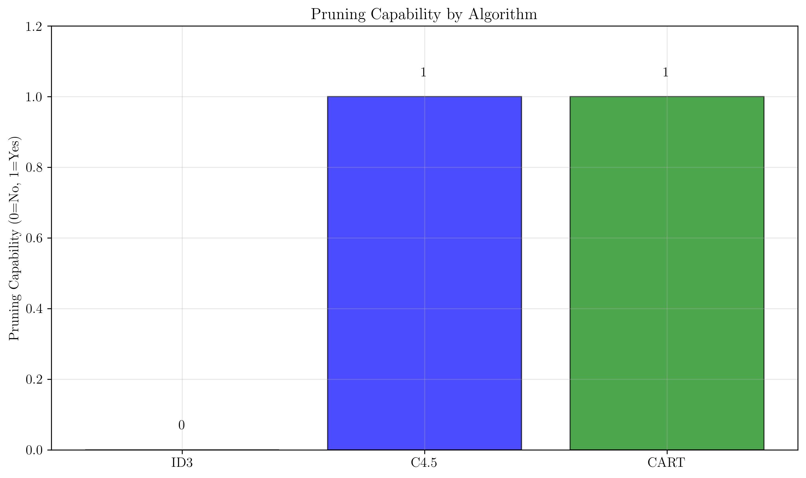
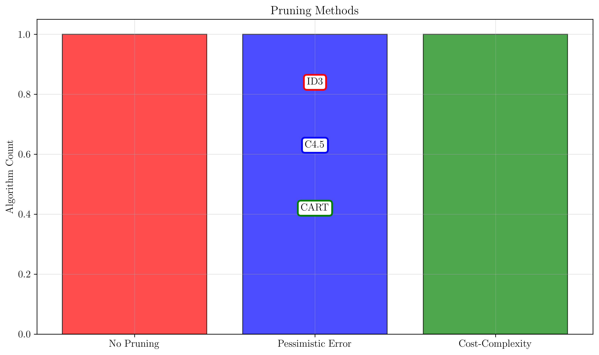
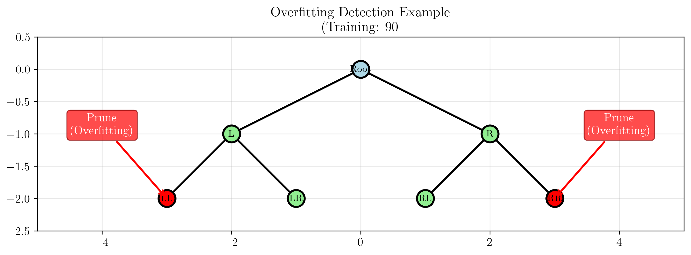
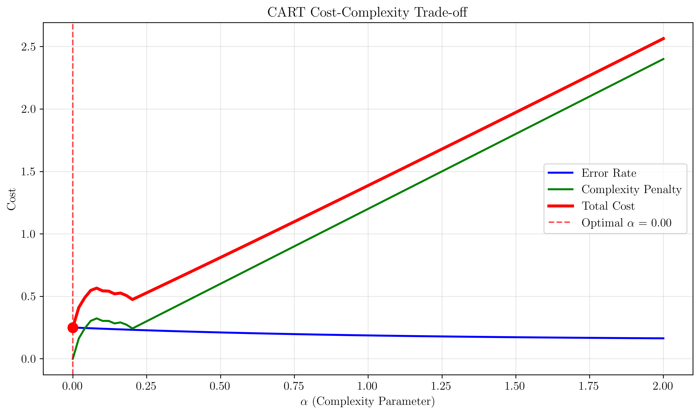

# Question 17: Pruning Approaches Across Algorithms

## Problem Statement
Consider pruning approaches across the three algorithms.

### Task
1. Does ID3 include built-in pruning capabilities? Why or why not?
2. Describe C4.5's pessimistic error pruning in one sentence
3. What is the purpose of CART's cost-complexity pruning parameter $\alpha$?
4. If a subtree has training accuracy $90\%$ but validation accuracy $75\%$, which algorithms would likely prune it?

## Understanding the Problem
Pruning is a crucial technique in decision tree algorithms to prevent overfitting by removing unnecessary branches from the tree. Different algorithms implement pruning in various ways, each with its own advantages and trade-offs. Understanding these differences helps in choosing the right algorithm for specific applications and in interpreting the resulting models.

## Solution

### Step 1: ID3 Pruning Capabilities
**Answer: NO, ID3 does not include built-in pruning capabilities**

**Reason:** ID3 was designed as a basic algorithm without overfitting considerations.

**Characteristics:**
- Grows trees to full depth
- No stopping criteria
- Prone to overfitting
- Requires manual post-pruning

ID3 is a foundational algorithm that focuses on simplicity and educational value rather than practical performance. It grows trees to their maximum possible depth, which often leads to overfitting on real-world datasets.

### Step 2: C4.5 Pessimistic Error Pruning
**Answer:** C4.5 uses **Pessimistic Error Pruning (PEP)**

**Description:** Uses statistical confidence intervals to estimate true error rates.

**How it works:**
- Calculates error rate with confidence intervals
- Prunes if upper bound of error rate doesn't increase significantly
- Conservative approach that prevents over-pruning

PEP is a statistical approach that provides a principled way to decide when to prune branches. It's more conservative than other methods, reducing the risk of removing useful branches.

### Step 3: CART Cost-Complexity Pruning Parameter α
**Answer:** Balances tree complexity with prediction accuracy

**Mathematical formulation:**
$$R_{\alpha}(T) = R(T) + \alpha \times |T|$$
where $|T|$ is the number of terminal nodes

**Effects of $\alpha$:**
- $\alpha = 0$: No pruning (full tree)
- $\alpha \to \infty$: Heavy pruning (stump)
- Optimal $\alpha$: Found through cross-validation

The $\alpha$ parameter acts as a regularization term that penalizes tree complexity. Higher values of $\alpha$ result in simpler trees with fewer nodes.

### Step 4: Overfitting Detection and Pruning
**Answer:** C4.5 and CART would likely prune the overfitting subtree

**Reasoning:**
- Training accuracy (90%) >> Validation accuracy (75%) = Overfitting
- ID3: No pruning capability
- C4.5: PEP would detect overfitting and prune
- CART: Cost-complexity pruning would favor simpler tree

This scenario clearly demonstrates overfitting, where the model performs well on training data but poorly on unseen data. Both C4.5 and CART have mechanisms to detect and correct this.

## Visual Explanations

### Pruning Capability Comparison

The visualization shows:
- **ID3**: No pruning capability (red)
- **C4.5**: Pessimistic error pruning (blue)
- **CART**: Cost-complexity pruning (green)

### Pruning Methods

### Overfitting Detection Example

The tree structure visualization demonstrates how algorithms identify overfitting:
- Red nodes indicate branches that would be pruned due to overfitting
- Green nodes represent healthy branches
- The decision boundary shows how pruning affects the model's generalization

### Cost-Complexity Trade-off

The cost-complexity curve illustrates:
- **Error Rate**: Decreases with tree complexity
- **Complexity Penalty**: Increases linearly with $\alpha$
- **Total Cost**: Optimal balance found at minimum point
- **Optimal $\alpha$**: Automatically selected through cross-validation

## Key Insights

### Theoretical Foundations
- **Pruning Necessity**: All decision trees benefit from pruning to prevent overfitting
- **Statistical vs. Optimization**: C4.5 uses statistical methods, CART uses optimization
- **Parameter Selection**: CART's α parameter provides fine-grained control over pruning

### Practical Applications
- **ID3**: Best for educational purposes and simple datasets
- **C4.5**: Ideal for interpretable models and medical applications
- **CART**: Optimal for production systems and mixed data types

### Common Pitfalls
- **Over-pruning**: Removing too many branches can increase bias
- **Under-pruning**: Insufficient pruning leads to overfitting
- **Parameter Tuning**: Manual α selection in CART can be challenging

## Mathematical Details

### C4.5 Pessimistic Error Pruning
The pessimistic error rate is calculated as:
$$e' = \frac{e + 0.5}{n}$$
where $e$ = number of errors, $n$ = number of samples

The standard error is:
$$SE = \sqrt{\frac{e' \times (1 - e')}{n}}$$

The upper bound of the error rate is:
$$UB = e' + z \times SE$$
where $z$ is the confidence level (typically 1.96 for 95% confidence)

### CART Cost-Complexity Pruning
The cost-complexity measure is:
$$R_{\alpha}(T) = R(T) + \alpha \times |T|$$
where:
- $R(T)$ = misclassification rate of tree $T$
- $|T|$ = number of terminal nodes in $T$
- $\alpha$ = complexity parameter

For a subtree $T_t$:
$$R_{\alpha}(T_t) = R(T_t) + \alpha \times |T_t|$$

The tree is pruned if:
$$R_{\alpha}(T_t) \geq R_{\alpha}(t)$$
where $t$ is the root of subtree $T_t$

## Conclusion
- **ID3** lacks built-in pruning, making it prone to overfitting
- **C4.5** uses statistical pruning (PEP) for conservative overfitting prevention
- **CART** employs cost-complexity pruning with automatic α selection
- **Overfitting detection** is automatic in C4.5 and CART, manual in ID3
- **Production use** favors CART for its robust pruning and regularization

The choice of algorithm should consider not just the pruning method, but also the computational cost, interpretability requirements, and the specific characteristics of the dataset.
