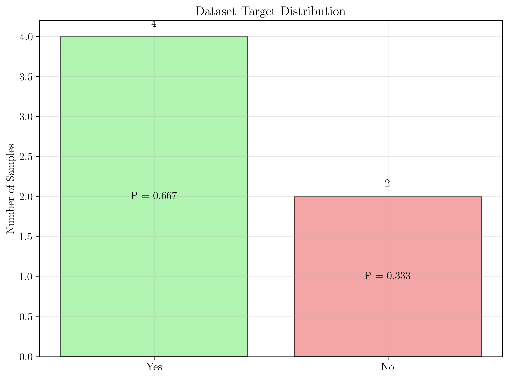
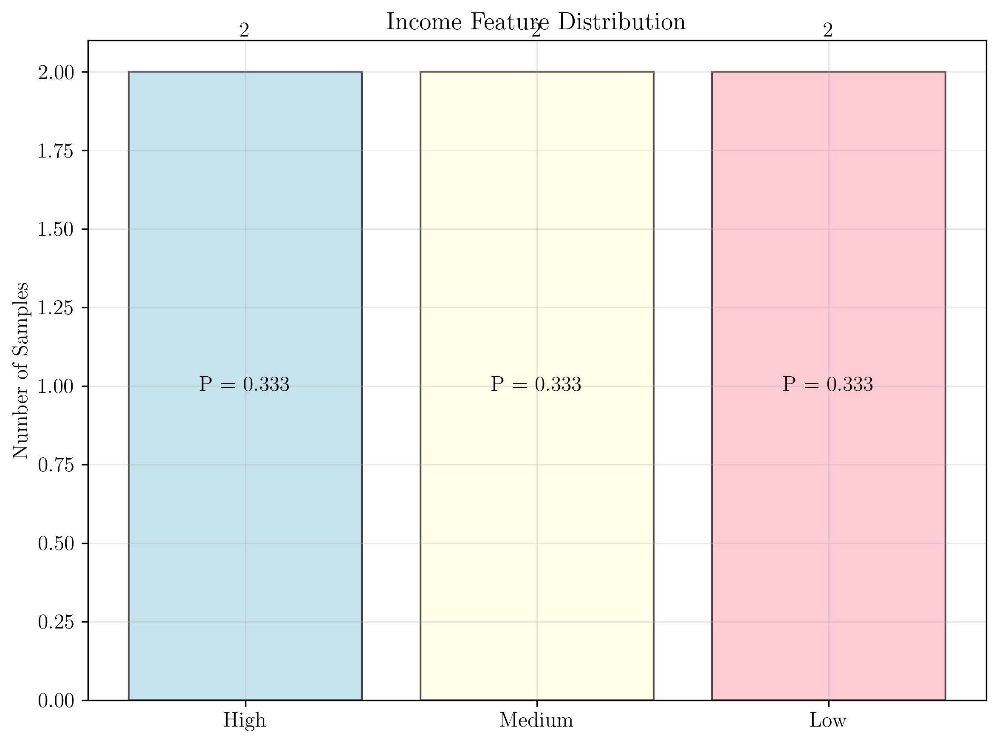
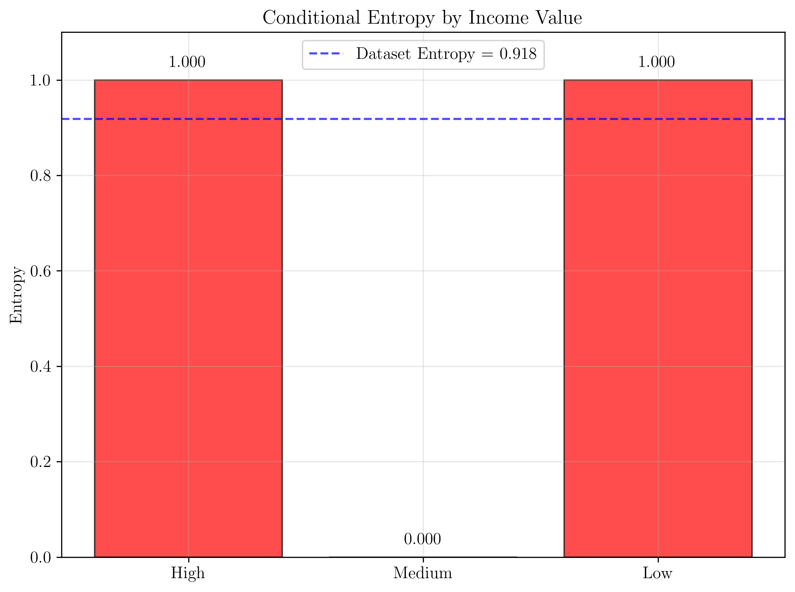
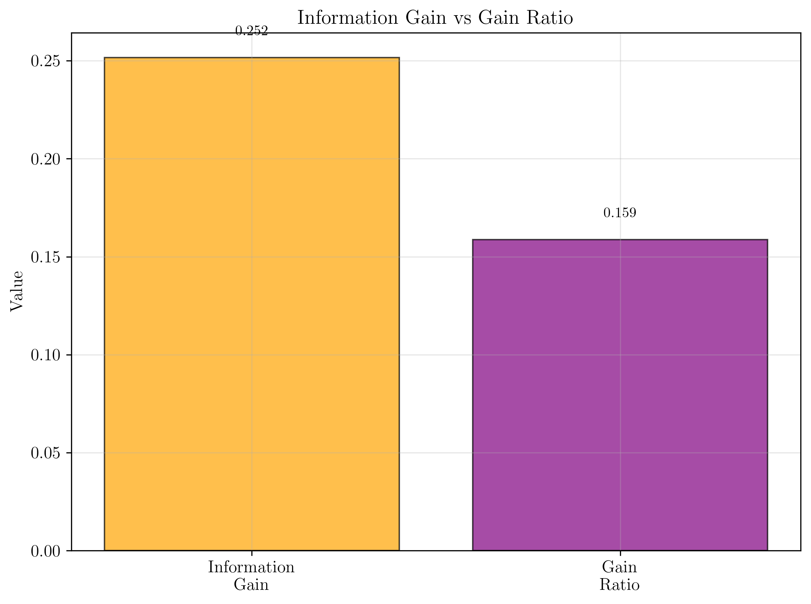

# Question 18: Gain Ratio Calculation

## Problem Statement
Calculate gain ratio for this loan approval dataset:

| Income | Age_Group | Credit | Approved |
|--------|-----------|--------|----------|
| High   | Young     | Good   | Yes      |
| High   | Young     | Poor   | No       |
| Medium | Middle    | Good   | Yes      |
| Low    | Old       | Good   | Yes      |
| Low    | Young     | Poor   | No       |
| Medium | Old       | Good   | Yes      |

### Task
1. Calculate entropy of the dataset
2. Calculate information gain for Income feature  
3. Calculate split information for Income feature
4. Calculate gain ratio and compare with information gain

## Understanding the Problem
Gain ratio is an improvement over information gain that addresses the bias toward multi-valued features. While information gain favors features with many unique values, gain ratio normalizes this by dividing by split information. This makes it a more balanced metric for feature selection in decision trees.

## Solution

### Step 1: Calculate Entropy of the Dataset
**Target class distribution:**
- Yes: 4 samples
- No: 2 samples
- Total: 6 samples

**Probabilities:**
- P(Yes) = 4/6 = 0.667
- P(No) = 2/6 = 0.333

**Entropy calculation:**
$$H(S) = -P(\text{Yes}) \times \log_2(P(\text{Yes})) - P(\text{No}) \times \log_2(P(\text{No}))$$
$$H(S) = -0.667 \times \log_2(0.667) - 0.333 \times \log_2(0.333)$$
$$H(S) = -0.667 \times (-0.585) - 0.333 \times (-1.585)$$
$$H(S) = 0.390 + 0.528$$
$$H(S) = 0.918$$

**Result:** Dataset entropy = 0.918

### Step 2: Calculate Information Gain for Income Feature
**Income feature has 3 unique values:** High, Medium, Low

**Calculating entropy for each income value:**

**High Income:**
- Count: 2 samples
- Yes: 1, No: 1
- P(Yes) = 0.500, P(No) = 0.500
- Entropy = 1.000

**Medium Income:**
- Count: 2 samples
- Yes: 2, No: 0
- P(Yes) = 1.000, P(No) = 0.000
- Entropy = 0.000

**Low Income:**
- Count: 2 samples
- Yes: 1, No: 1
- P(Yes) = 0.500, P(No) = 0.500
- Entropy = 1.000

**Weighted entropy calculation:**
$$H(S|\text{Income}) = \sum\left(\frac{|S_v|}{|S|} \times H(S_v)\right)$$
$$H(S|\text{Income}) = \frac{2}{6} \times 1.000 + \frac{2}{6} \times 0.000 + \frac{2}{6} \times 1.000$$
$$H(S|\text{Income}) = 0.333 \times 1.000 + 0.333 \times 0.000 + 0.333 \times 1.000$$
$$H(S|\text{Income}) = 0.667$$

**Information Gain calculation:**
$$IG(S, \text{Income}) = H(S) - H(S|\text{Income})$$
$$IG(S, \text{Income}) = 0.918 - 0.667$$
$$IG(S, \text{Income}) = 0.252$$

**Result:** Information Gain = 0.252

### Step 3: Calculate Split Information for Income Feature
**Split Information calculation:**
$$\text{SplitInfo}(S, \text{Income}) = -\sum\left(\frac{|S_v|}{|S|} \times \log_2\left(\frac{|S_v|}{|S|}\right)\right)$$
$$\text{SplitInfo}(S, \text{Income}) = -(0.333 \times \log_2(0.333)) - (0.333 \times \log_2(0.333)) - (0.333 \times \log_2(0.333))$$
$$\text{SplitInfo}(S, \text{Income}) = 1.585$$

**Result:** Split Information = 1.585

### Step 4: Calculate Gain Ratio and Compare
**Gain Ratio calculation:**
$$\text{GainRatio}(S, \text{Income}) = IG(S, \text{Income}) / \text{SplitInfo}(S, \text{Income})$$
$$\text{GainRatio}(S, \text{Income}) = 0.252 / 1.585$$
$$\text{GainRatio}(S, \text{Income}) = 0.159$$

**Comparison:**
- Information Gain: 0.252
- Gain Ratio: 0.159
- Difference: 0.093

**Result:** Gain Ratio = 0.159

## Visual Explanations

### Dataset Target Distribution

### Income Feature Distribution

### Conditional Entropy by Income

### Information Gain vs Gain Ratio

The visualization shows:
- **Dataset Target Distribution**: 4 Yes vs 2 No samples
- **Income Feature Distribution**: Balanced split (2 samples each)
- **Conditional Entropy by Income**: High and Low have high entropy, Medium has zero
- **Information Gain vs Gain Ratio**: Clear comparison showing the penalty effect

### Key Patterns in the Data
- **High Income**: Mixed outcomes (Yes: 1, No: 1) → High entropy
- **Medium Income**: All approved (Yes: 2, No: 0) → Zero entropy (perfect split)
- **Low Income**: Mixed outcomes (Yes: 1, No: 1) → High entropy

## Key Insights

### Theoretical Foundations
- **Entropy**: Measures dataset impurity (0.918 indicates moderate impurity)
- **Information Gain**: Measures feature's ability to reduce uncertainty
- **Split Information**: Penalizes features with many values
- **Gain Ratio**: Normalized metric that balances information gain and split complexity

### Mathematical Interpretation
1. **Dataset Entropy H(S):**
   - Measures the impurity of the entire dataset
   - Current value: 0.918 (closer to 1 = more impure)
   - Interpretation: Moderate impurity, some class imbalance

2. **Information Gain IG(S, Income):**
   - Measures how much the Income feature reduces uncertainty
   - Current value: 0.252
   - Interpretation: Moderate feature for splitting

3. **Split Information SplitInfo(S, Income):**
   - Measures how balanced the split is across feature values
   - Current value: 1.585
   - Interpretation: Balanced split

4. **Gain Ratio GainRatio(S, Income):**
   - Normalized information gain that penalizes multi-valued features
   - Current value: 0.159
   - Interpretation: Worse than information gain due to split information penalty

### Practical Applications
- **Feature Selection**: Gain ratio provides more balanced feature ranking
- **Multi-valued Features**: Penalizes features with many unique values
- **Decision Tree Construction**: Helps build more robust trees

## Mathematical Details

### Entropy Formula
$$H(S) = -\sum p_i \times \log_2(p_i)$$
where $p_i$ is the probability of class $i$

### Information Gain Formula
$$IG(S, A) = H(S) - H(S|A)$$
where:
- $H(S)$ = entropy of dataset $S$
- $H(S|A)$ = conditional entropy of $S$ given feature $A$

### Split Information Formula
$$\text{SplitInfo}(S, A) = -\sum\left(\frac{|S_v|}{|S|} \times \log_2\left(\frac{|S_v|}{|S|}\right)\right)$$
where:
- $|S_v|$ = number of samples with value $v$ for feature $A$
- $|S|$ = total number of samples

### Gain Ratio Formula
$$\text{GainRatio}(S, A) = \frac{IG(S, A)}{\text{SplitInfo}(S, A)}$$

## Why Gain Ratio is Important

### Problems with Information Gain
- **Bias toward multi-valued features**: Features with many unique values tend to have higher information gain
- **Overfitting risk**: Can lead to trees that split on features with many values
- **Poor generalization**: May not generalize well to unseen data

### Advantages of Gain Ratio
- **Balanced evaluation**: Considers both information gain and split complexity
- **Better feature selection**: Favors features that provide good splits without excessive complexity
- **Robust trees**: Results in more generalizable decision trees

## Conclusion
- **Dataset entropy**: 0.918 (moderate impurity)
- **Information gain**: 0.252 (moderate feature utility)
- **Split information**: 1.585 (balanced split)
- **Gain ratio**: 0.159 (penalized by split complexity)

The gain ratio (0.159) is significantly lower than the information gain (0.252) because the Income feature has three values, leading to a higher split information penalty. This demonstrates how gain ratio prevents the algorithm from favoring features with many unique values, leading to more balanced and robust decision trees.

The Income feature still provides useful information for splitting, but the gain ratio correctly identifies that its utility is somewhat limited by the balanced distribution of its values across the dataset.
