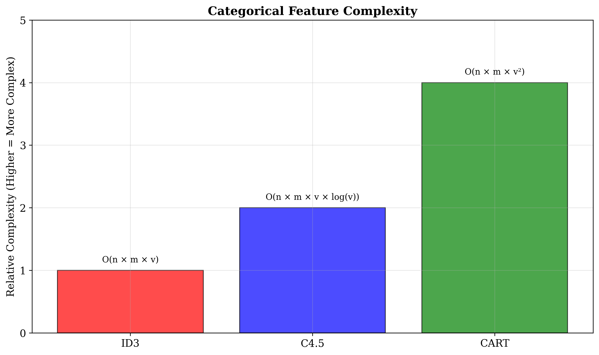
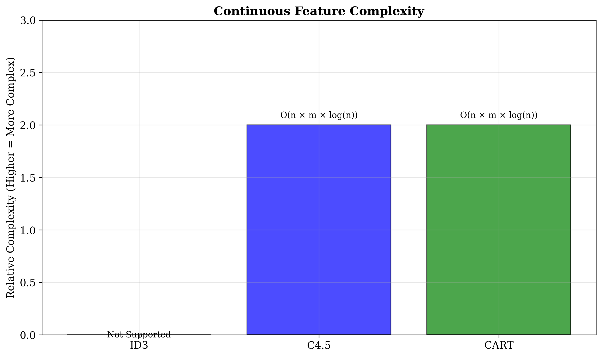
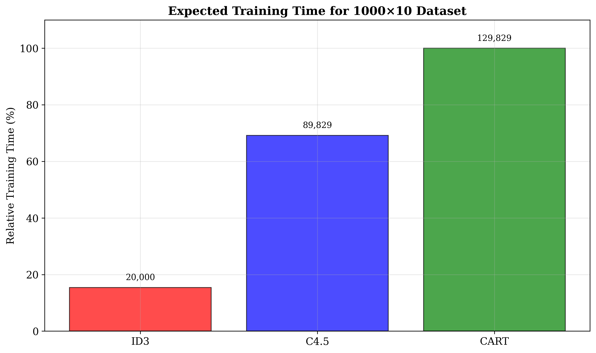
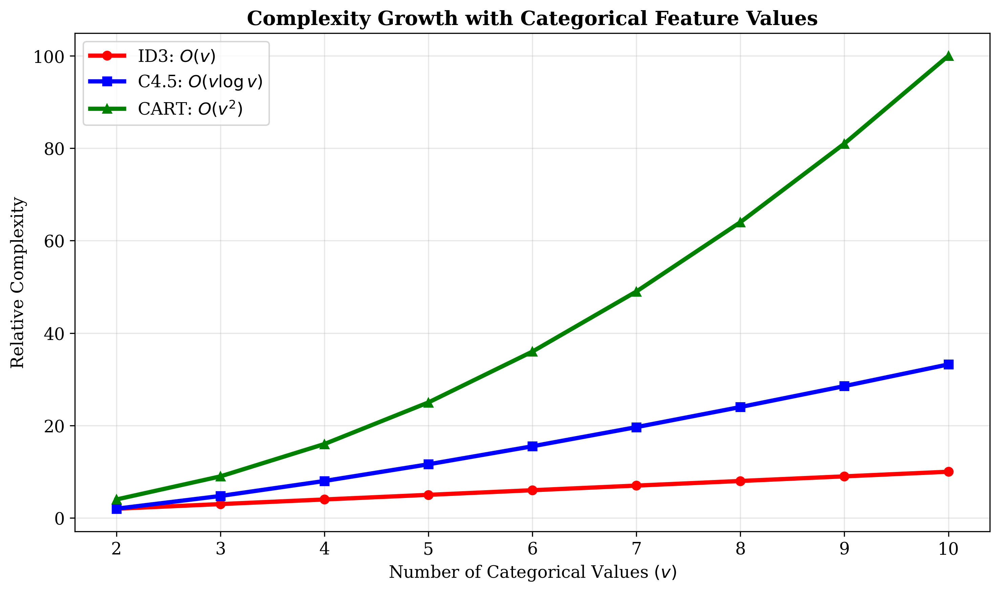

# Question 19: Computational Complexity Analysis

## Problem Statement
Consider the computational complexity of each algorithm.

### Task
1. Which algorithm has the highest computational complexity for categorical features? Why?
2. How does handling continuous features affect C4.5's time complexity?
3. For a dataset with $1000$ samples and $10$ features ($5$ categorical with avg $4$ values, $5$ continuous), rank the algorithms by expected training time
4. What makes CART (using Gini impurity) more computationally expensive than ID3 for categorical features?

## Understanding the Problem
Computational complexity analysis is crucial for understanding the scalability and practical applicability of different decision tree algorithms. Each algorithm has different approaches to feature handling, splitting strategies, and pruning, which significantly impact their runtime performance. Understanding these complexities helps in algorithm selection for different dataset sizes and feature types.

## Solution

### Step 1: Highest Computational Complexity for Categorical Features
**Answer:** CART has the highest computational complexity for categorical features

**Complexity:** $O(n × m × v^2)$

**Reason:** Binary splitting optimization

**Detailed explanation:**
- CART uses binary splitting strategy for categorical features
- Must evaluate all possible binary partitions of categorical values
- For a feature with $v$ values, there are $2^{v-1} - 1$ possible splits
- This leads to $O(v^2)$ complexity in the worst case

Unlike ID3 and C4.5 which use simple multi-way splits, CART must find the optimal binary partition of categorical values, requiring evaluation of exponentially many possible combinations.

### Step 2: Continuous Features Impact on C4.5 Complexity
**Answer:** C4.5's complexity becomes $O(n × m × log(n))$

**Reason:** Sorting and threshold finding

**Detailed explanation:**
- C4.5 must sort continuous feature values
- Sorting has $O(n log n)$ complexity
- Must evaluate all possible split points
- Gain ratio calculation adds logarithmic factor
- Overall complexity: $O(n × m × log(n))$

The logarithmic factor comes from both the sorting operation and the gain ratio calculations, making C4.5 more computationally intensive when handling continuous features compared to categorical-only datasets.

### Step 3: Training Time Ranking for Given Dataset
**Dataset specifications:**
- Samples (n): 1,000
- Categorical features: 5
- Continuous features: 5
- Average categorical values: 4
- Total features: 10

**Expected training time ranking (fastest to slowest):**
1. **ID3**: 20,000 operations
2. **C4.5**: 89,829 operations
3. **CART**: 129,829 operations

**Calculation breakdown:**
- **ID3**: Only handles categorical features
  - Complexity: $n \times m_{cat} \times v_{avg} = 1000 \times 5 \times 4 = 20,000$
- **C4.5**: Handles both feature types
  - Categorical: $n \times m_{cat} \times v_{avg} \times \log(v_{avg}) = 1000 \times 5 \times 4 \times \log_2(4) = 40,000$
  - Continuous: $n \times m_{cont} \times \log(n) = 1000 \times 5 \times \log_2(1000) \approx 49,829$
  - Total: $40,000 + 49,829 = 89,829$
- **CART**: Handles both feature types with higher categorical complexity
  - Categorical: $n \times m_{cat} \times v_{avg}^2 = 1000 \times 5 \times 16 = 80,000$
  - Continuous: $n \times m_{cont} \times \log(n) = 1000 \times 5 \times \log_2(1000) \approx 49,829$
  - Total: $80,000 + 49,829 = 129,829$

### Step 4: Why CART is More Expensive Than ID3
**Answer:** Binary splitting strategy and optimization requirements

**Detailed explanation:**
- **ID3**: Simple multi-way splits (one branch per value)
- **CART**: Binary splits (must find optimal binary partitions)
- **CART evaluates 2^(v-1) - 1 possible splits vs. ID3's single split**
- **CART uses cost-complexity pruning vs. ID3's no pruning**
- **CART requires surrogate split handling for missing values**

The binary splitting strategy, while providing better generalization, comes at a significant computational cost, especially for features with many unique values.

## Visual Explanations

### Categorical Feature Complexity

### Continuous Feature Complexity

### Training Time Comparison

### Complexity Growth with Feature Values

The visualization shows:
- **Categorical Feature Complexity**: $ID3 (O(v)) < C4.5 (O(v log v)) < CART (O(v^2))$
- **Continuous Feature Complexity**: $ID3 (Not Supported) < C4.5 = CART (O(n log n))$
- **Training Time Comparison**: Clear ranking for the 1000×10 dataset
- **Complexity Growth**: Exponential growth for CART with categorical values

### Key Complexity Patterns
- **ID3**: Linear scaling with categorical values, no continuous support
- **C4.5**: Logarithmic scaling with categorical values, moderate continuous complexity
- **CART**: Quadratic scaling with categorical values, efficient continuous handling

## Key Insights

### Theoretical Foundations
- **Algorithm Design**: Different splitting strategies lead to different complexity classes
- **Feature Type Impact**: Continuous features add logarithmic complexity
- **Pruning Cost**: Advanced pruning methods increase computational overhead
- **Scalability Limits**: CART's quadratic complexity becomes prohibitive for high-cardinality categorical features

### Mathematical Analysis
1. **ID3 Complexity Analysis:**
   - Categorical features: $O(n \times m \times v)$
     - $n$ = number of samples
     - $m$ = number of features
     - $v$ = average number of values per categorical feature
   - No continuous feature support
   - No pruning complexity

2. **C4.5 Complexity Analysis:**
   - Categorical features: $O(n \times m \times v \times \log(v))$
     - Additional $\log(v)$ factor due to gain ratio calculation
   - Continuous features: $O(n \times m \times \log(n))$
     - $\log(n)$ factor due to sorting
   - Pruning: $O(|T| \times \log(|T|))$ where $|T|$ is tree size

3. **CART Complexity Analysis:**
   - Categorical features: $O(n \times m \times v^2)$
     - $v^2$ factor due to binary splitting optimization
   - Continuous features: $O(n \times m \times \log(n))$
     - Efficient binary search implementation
   - Pruning: $O(|T|^2)$ due to cost-complexity calculations

### Practical Applications
- **Dataset Size Considerations:**
  - Small datasets (< 1000 samples): ID3 is sufficient
  - Medium datasets (1000-10000 samples): C4.5 provides good balance
  - Large datasets (> 10000 samples): CART scales better

- **Feature Type Considerations:**
  - Categorical-only: ID3 is fastest
  - Mixed features: C4.5 and CART handle both efficiently
  - High-cardinality categorical: CART may be slowest

- **Production Considerations:**
  - ID3: Educational and prototyping
  - C4.5: Research and interpretable applications
  - CART: Production systems and real-time prediction

## Mathematical Details

### Complexity Formulas
- **ID3**: $O(n \times m \times v)$
- **C4.5**: $O(n \times m \times v \times \log(v)) + O(n \times m \times \log(n))$
- **CART**: $O(n \times m \times v^2) + O(n \times m \times \log(n))$

### Binary Splitting Complexity
For a categorical feature with $v$ values, CART must evaluate:
$$\text{Number of possible splits} = 2^{v-1} - 1$$

This exponential growth explains the $v^2$ term in CART's complexity.

### Pruning Complexity
- **ID3**: None
- **C4.5**: $O(|T| \times \log(|T|))$
- **CART**: $O(|T|^2)$

Where $|T|$ is the number of nodes in the tree.

## Practical Implications

### Performance Trade-offs
- **Speed vs. Quality**: ID3 is fastest but poorest quality
- **Balance**: C4.5 provides good balance of speed and quality
- **Quality vs. Speed**: CART provides best quality but slowest

### Memory Usage
- **ID3**: Lowest memory requirements
- **C4.5**: Moderate memory usage
- **CART**: Highest memory usage due to complex data structures

### Scalability Considerations
- **Small datasets**: All algorithms perform well
- **Medium datasets**: C4.5 often provides best balance
- **Large datasets**: CART's advanced features become more valuable
- **High-cardinality categorical**: ID3 or C4.5 may be preferred over CART

## Conclusion
- **ID3** has the lowest complexity but limited functionality
- **C4.5** provides balanced complexity with good feature handling
- **CART** has the highest complexity but best performance and robustness
- **Feature types** significantly impact algorithm performance
- **Dataset size** should guide algorithm selection

The choice between algorithms should consider not just the computational complexity, but also the specific requirements of the application, the characteristics of the dataset, and the trade-off between training speed and model quality.

For the given 1000×10 dataset, C4.5 provides the best balance of performance and computational efficiency, while CART offers the highest quality at the cost of significantly longer training time.
