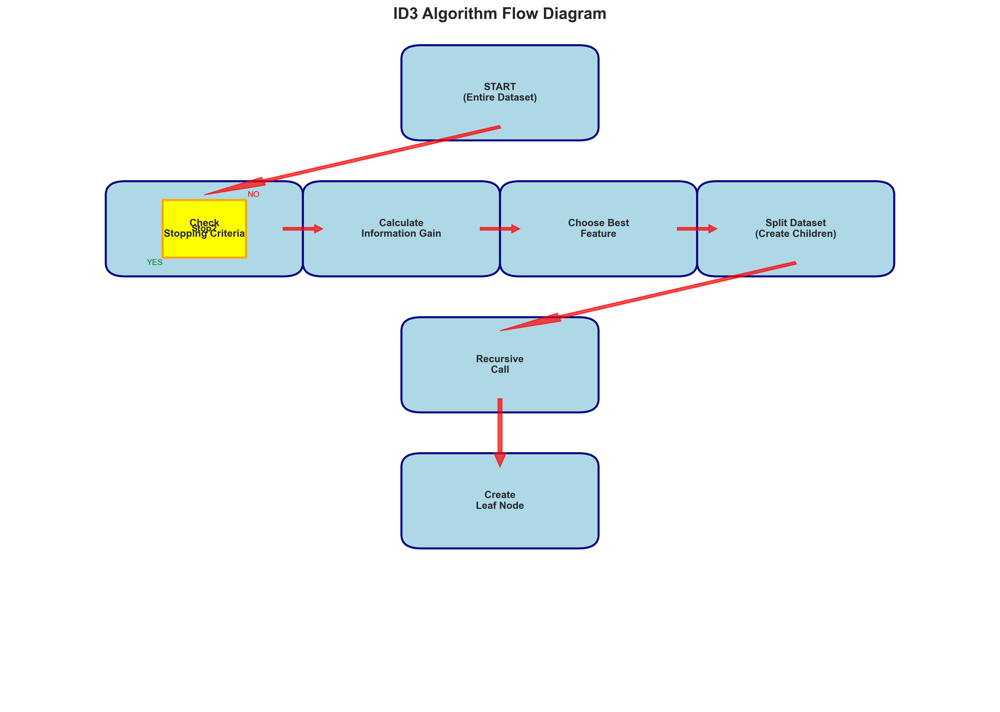
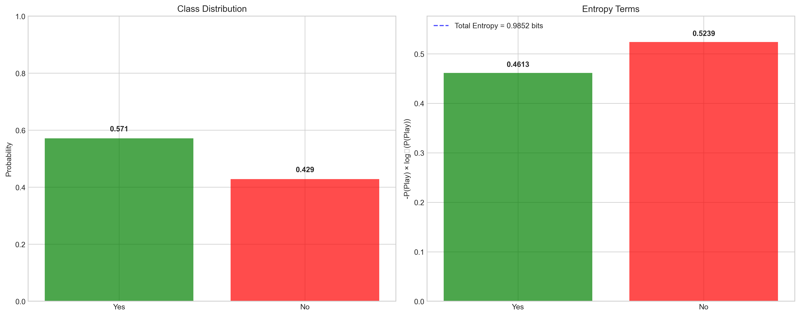
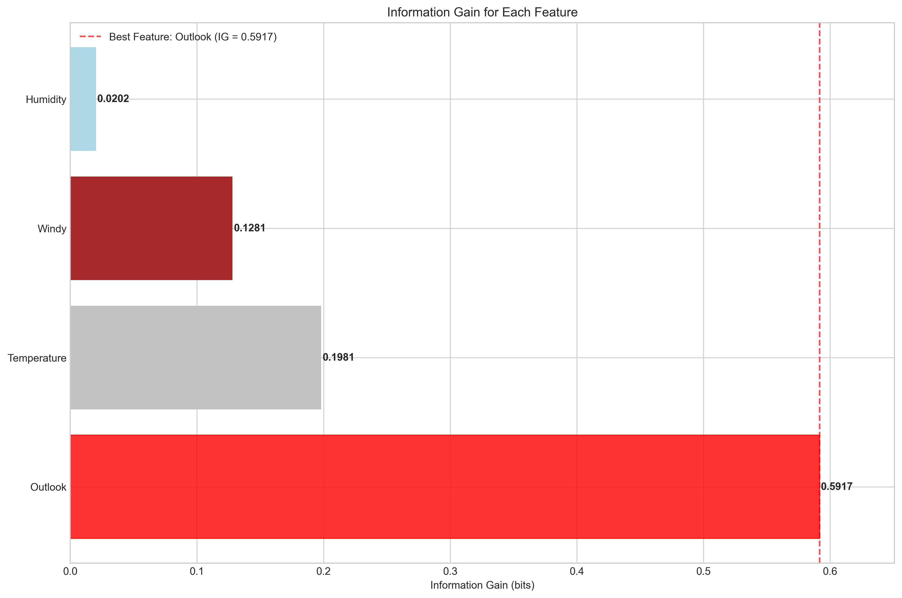
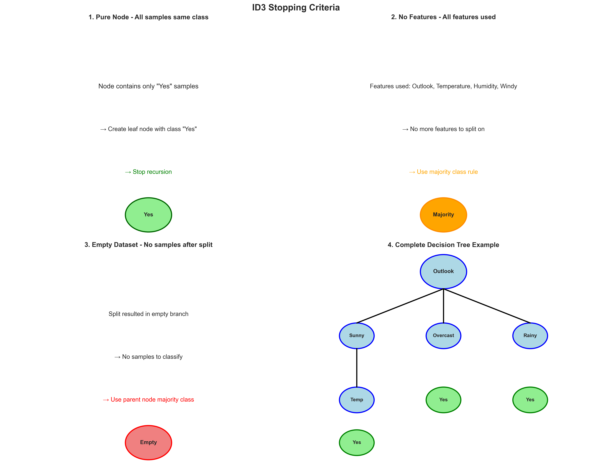
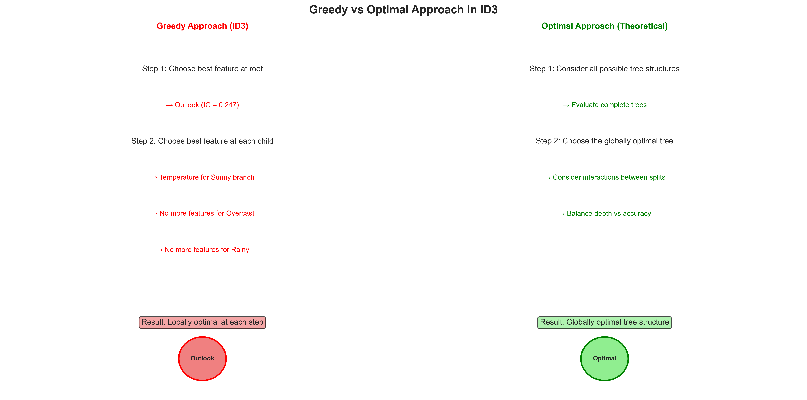
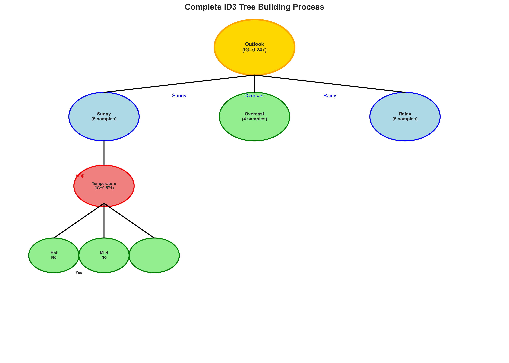

# Question 1: ID3 Algorithm Overview

## Problem Statement
The ID3 (Iterative Dichotomiser 3) algorithm forms the foundation of decision tree learning through its recursive partitioning approach.

### Task
1. List the main steps of the ID3 algorithm in order
2. Explain how ID3 chooses the best feature for splitting at each node
3. What are the base cases for stopping recursion in ID3?
4. Why is ID3 considered a greedy algorithm? Provide a concise explanation

## Understanding the Problem
The ID3 (Iterative Dichotomiser 3) algorithm is a fundamental decision tree learning algorithm that uses information theory concepts to recursively partition datasets. It's important to understand how ID3 works because it forms the foundation for more advanced algorithms like C4.5 and CART. The algorithm demonstrates how entropy and information gain can be used to make intelligent decisions about feature selection during tree construction.

## Solution

### Step 1: Main Steps of the ID3 Algorithm

The ID3 algorithm follows a systematic, recursive approach with the following main steps:

1. **START**: Begin with the entire dataset at the root node
2. **CHECK STOPPING CRITERIA**: Determine if we should stop growing the tree
3. **FEATURE SELECTION**: Calculate information gain for all available features
4. **BEST SPLIT**: Choose the feature with the highest information gain
5. **CREATE CHILDREN**: Split the dataset based on the chosen feature
6. **RECURSION**: Recursively apply steps 2-6 to each child node
7. **TERMINATE**: When stopping criteria are met, create a leaf node

The algorithm continues this process until all branches reach stopping conditions, resulting in a complete decision tree.

### Step 2: Feature Selection Process

ID3 uses information gain to select the best feature for splitting at each node:

**Information Gain Formula:**
$$IG(S, A) = H(S) - H(S|A)$$

Where:
- $H(S)$ is the entropy of the current dataset
- $H(S|A)$ is the conditional entropy given feature A

**Process:**
1. For each available feature, calculate the information gain
2. Choose the feature with the highest information gain
3. This maximizes the reduction in uncertainty

**Example Calculation:**
Consider a weather dataset for playing tennis with 7 samples:
- Class distribution: Yes=4/7, No=3/7
- Initial entropy: $H(Play) = 0.9852$ bits

For the Outlook feature:
- Sunny: 2 samples (all No) → $H(Play|Outlook=Sunny) = 0.0000$
- Rainy: 3 samples (2 Yes, 1 No) → $H(Play|Outlook=Rainy) = 0.9183$
- Overcast: 2 samples (all Yes) → $H(Play|Outlook=Overcast) = 0.0000$

Weighted conditional entropy: $H(Play|Outlook) = 0.3936$
Information gain: $IG = 0.9852 - 0.3936 = 0.5917$

### Step 3: Information Gain Comparison

The algorithm calculates information gain for all features and ranks them:

1. **Outlook**: IG = 0.5917 bits (Best feature)
2. **Temperature**: IG = 0.1981 bits
3. **Windy**: IG = 0.1281 bits
4. **Humidity**: IG = 0.0202 bits

Outlook provides the highest information gain, making it the optimal choice for the first split.

### Step 4: Stopping Criteria

ID3 uses three main stopping criteria to prevent infinite recursion:

1. **Pure Node**: All samples belong to the same class
   - Create a leaf node with that class
   - Stop recursion for this branch

2. **No Features**: All features have been used
   - Use majority class rule to assign class
   - Create a leaf node

3. **Empty Dataset**: No samples remain after splitting
   - Use parent node's majority class
   - Handle edge cases gracefully

### Step 5: Why ID3 is Considered a Greedy Algorithm

ID3 is considered greedy because:

1. **Local Optimization**: At each node, it chooses the feature with the highest information gain without considering the global tree structure

2. **No Backtracking**: Once a split is made, it cannot be undone or reconsidered, even if a different choice might lead to a better overall tree

3. **Immediate Reward**: It maximizes information gain at the current step rather than considering long-term tree quality

4. **Suboptimal Solutions**: The greedy approach may lead to suboptimal trees compared to considering all possible tree structures

### Step 6: Complete ID3 Example

**Complete Dataset Analysis:**
- 14 samples with class distribution: Yes=9/14, No=5/14
- Initial entropy: $H(Play) = 0.9403$ bits

**Feature Evaluation Results:**
- **Outlook**: IG = 0.2917 bits (Best feature)
- **Humidity**: IG = 0.1968 bits
- **Windy**: IG = 0.0931 bits
- **Temperature**: IG = 0.0742 bits

**Tree Construction:**
1. Root node splits on Outlook (highest IG)
2. Sunny branch: 5 samples, mixed classes → needs further splitting
3. Overcast branch: 4 samples, all Yes → pure node, create leaf
4. Rainy branch: 5 samples, mixed classes → needs further splitting

## Key Insights

### Theoretical Foundations
- **Information Theory**: ID3 leverages entropy and information gain to measure uncertainty reduction
- **Recursive Partitioning**: The algorithm naturally divides the feature space into interpretable regions
- **Greedy Strategy**: Local optimization provides computational efficiency at the cost of global optimality

### Practical Applications
- **Interpretability**: Decision trees provide clear, human-readable decision rules
- **Efficiency**: Greedy approach makes ID3 computationally tractable for large datasets
- **Foundation**: Understanding ID3 is essential for more advanced tree algorithms

### Common Pitfalls
- **Overfitting**: Greedy approach can lead to overly complex trees
- **Feature Bias**: Categorical features with many values may be preferred
- **Local Optima**: The algorithm may miss globally optimal tree structures

### Extensions
- **C4.5**: Addresses ID3 limitations with gain ratio and continuous feature handling
- **CART**: Uses Gini impurity and binary splits for better generalization
- **Modern Algorithms**: Incorporate pruning, ensemble methods, and advanced stopping criteria

## Conclusion

The ID3 algorithm demonstrates how recursive partitioning and information theory can be combined to create interpretable decision trees. While it has limitations due to its greedy nature, it provides:

- **Clear methodology**: Systematic approach to tree construction
- **Theoretical foundation**: Based on solid information theory principles
- **Practical implementation**: Computationally efficient and interpretable
- **Educational value**: Essential for understanding more advanced tree algorithms

The key insight is that ID3 makes locally optimal choices at each step, which may not always lead to globally optimal trees, but provides a practical and efficient solution for many real-world problems.
