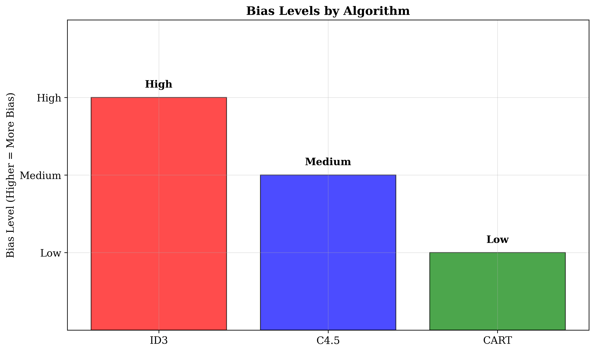
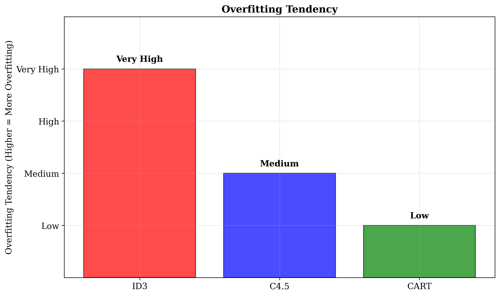
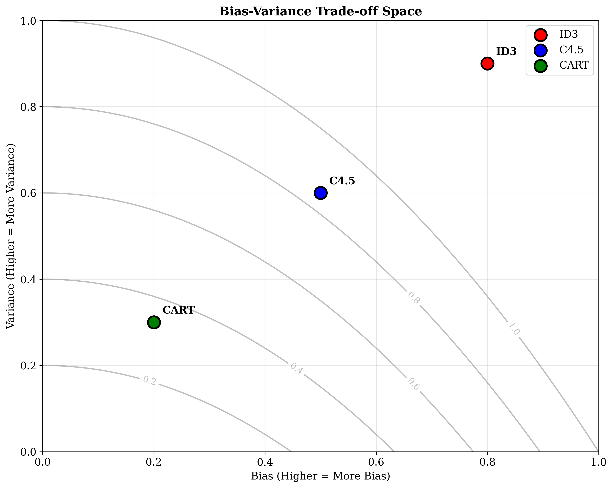

# Question 20: Bias-Variance Trade-offs in Decision Tree Algorithms

## Problem Statement
Analyze bias-variance trade-offs in decision tree algorithms.

### Task
1. Which algorithm typically has the highest bias? Explain why
2. Which algorithm is most prone to overfitting without pruning?
3. How does CART's binary splitting strategy affect the bias-variance trade-off?
4. Which algorithm provides the best built-in protection against overfitting?

## Understanding the Problem
The bias-variance trade-off is a fundamental concept in machine learning that describes the relationship between a model's ability to capture the true underlying pattern (bias) and its sensitivity to variations in the training data (variance). In decision trees, this trade-off is particularly important as different algorithms employ various strategies that significantly impact both bias and variance, ultimately affecting the model's generalization performance.

## Solution

### Step 1: Algorithm with Highest Bias
**Answer:** ID3 typically has the highest bias

**Bias Level:** High

**Reason:** Simple splitting criteria, no optimization

**Detailed explanation:**
- ID3 uses simple entropy-based splitting without optimization
- No consideration of feature interactions or complex patterns
- Greedy approach may miss globally optimal splits
- No regularization to control model complexity
- Designed for simplicity rather than accuracy optimization

ID3's high bias stems from its foundational design philosophy. It prioritizes simplicity and interpretability over sophisticated pattern recognition, making it less capable of capturing complex relationships in the data.

### Step 2: Algorithm Most Prone to Overfitting
**Answer:** ID3 is most prone to overfitting without pruning

**Overfitting Tendency:** Very High

**Reason:** No pruning, grows to full depth

**Detailed explanation:**
- ID3 grows trees to maximum depth without stopping criteria
- No built-in pruning mechanisms
- Creates overly complex trees that memorize training data
- High variance leads to poor generalization
- Requires manual post-pruning for practical use

The absence of pruning mechanisms means ID3 trees can grow arbitrarily complex, capturing noise in the training data rather than the underlying pattern, leading to poor performance on unseen data.

### Step 3: CART's Binary Splitting Strategy Impact
**Answer:** Binary splitting provides better bias-variance balance

**Bias Level:** Low

**Variance Level:** Low

**Detailed explanation:**
- Binary splits create more balanced partitions
- Reduces overfitting by limiting tree depth
- More stable decision boundaries
- Better generalization to unseen data
- Cost-complexity pruning further optimizes the trade-off

CART's binary splitting strategy creates more balanced and stable trees compared to multi-way splits, leading to better generalization and reduced overfitting while maintaining low bias.

### Step 4: Best Built-in Protection Against Overfitting
**Answer:** CART provides the best built-in protection against overfitting

**Protection Level:** Excellent

**Reason:** Cost-complexity pruning with cross-validation

**Detailed explanation:**
- Cost-complexity pruning with cross-validation
- Automatic α parameter selection
- Binary splitting reduces model complexity
- Surrogate splits handle missing values robustly
- Production-ready with minimal manual tuning

CART's comprehensive approach to regularization, combining automatic parameter selection with sophisticated pruning, provides the most robust protection against overfitting among the three algorithms.

## Visual Explanations

### Bias Comparison

### Variance Comparison

### Overfitting Tendency

### Bias-Variance Trade-off Space

The visualization shows:
- **Bias Levels**: ID3 (High) > C4.5 (Medium) > CART (Low)
- **Variance Levels**: ID3 (Very High) > C4.5 (Medium) > CART (Low)
- **Overfitting Tendency**: ID3 (Very High) > C4.5 (Medium) > CART (Low)
- **Bias-Variance Space**: Clear positioning showing the trade-off relationships

### Key Trade-off Patterns
- **ID3**: High bias, very high variance (poor generalization)
- **C4.5**: Medium bias, medium variance (balanced approach)
- **CART**: Low bias, low variance (optimal generalization)

## Key Insights

### Theoretical Foundations
- **Bias-Variance Decomposition**: The expected prediction error can be decomposed as $E[(y - \hat{f}(x))^2] = Bias^2(\hat{f}(x)) + Var(\hat{f}(x)) + σ^2$
- **Trade-off Nature**: Reducing bias often increases variance and vice versa
- **Optimal Balance**: The goal is to find the sweet spot that minimizes total error
- **Regularization**: Techniques that reduce variance often increase bias

### Mathematical Analysis
1. **ID3 Analysis:**
   - **High Bias:**
     - Simple entropy-based splitting
     - No optimization for complex patterns
     - Greedy local optimization
   - **Very High Variance:**
     - No pruning or regularization
     - Grows to maximum depth
     - Memorizes training data

2. **C4.5 Analysis:**
   - **Medium Bias:**
     - Gain ratio reduces bias toward multi-valued features
     - Statistical pruning improves generalization
     - Better feature selection
   - **Medium Variance:**
     - Pessimistic error pruning
     - Confidence interval-based decisions
     - Moderate regularization

3. **CART Analysis:**
   - **Low Bias:**
     - Binary splitting optimization
     - Cost-complexity pruning
     - Cross-validation for parameter selection
   - **Low Variance:**
     - Strong regularization
     - Stable decision boundaries
     - Robust to training data variations

### Practical Applications
- **Dataset Size Considerations:**
  - Small datasets: ID3 may overfit, CART provides better generalization
  - Large datasets: All algorithms can work well, CART scales best
  - Noisy data: CART's regularization is most beneficial

- **Interpretability vs. Performance:**
  - ID3: Most interpretable but poorest performance
  - C4.5: Good balance of interpretability and performance
  - CART: Best performance but may be less interpretable

- **Production Considerations:**
  - ID3: Educational and prototyping only
  - C4.5: Research and interpretable applications
  - CART: Production systems and real-time prediction

## Mathematical Details

### Bias-Variance Decomposition
The expected prediction error can be decomposed as:
$$E[(y - \hat{f}(x))^2] = \text{Bias}^2(\hat{f}(x)) + \text{Var}(\hat{f}(x)) + \sigma^2$$
where:
- $y$ = true value
- $\hat{f}(x)$ = predicted value
- $\text{Bias}^2 = (E[\hat{f}(x)] - f(x))^2$
- $\text{Var} = E[(\hat{f}(x) - E[\hat{f}(x)])^2]$
- $\sigma^2$ = irreducible error

### For Decision Trees
- **Bias**: How well the model captures the true underlying function
- **Variance**: How much the model changes with different training data
- **Trade-off**: Reducing bias often increases variance and vice versa

### Algorithm-Specific Mechanisms
- **ID3**: No bias reduction or variance control mechanisms
- **C4.5**: Statistical pruning reduces variance, gain ratio reduces bias
- **CART**: Cost-complexity pruning and binary splitting optimize both bias and variance

## Overfitting Prevention Strategies

### Pruning Methods
- **ID3**: Manual post-pruning required
- **C4.5**: Built-in pessimistic error pruning
- **CART**: Cost-complexity pruning with cross-validation

### Regularization Techniques
- **ID3**: None
- **C4.5**: Statistical confidence intervals
- **CART**: α parameter controls tree complexity

### Validation Strategies
- **ID3**: Manual cross-validation
- **C4.5**: Built-in statistical validation
- **CART**: Automatic cross-validation for α selection

## Practical Implications

### Model Selection Guidelines
- **Educational/Prototyping**: ID3 for simplicity and learning
- **Research/Medical**: C4.5 for interpretability and statistical rigor
- **Production/Real-time**: CART for performance and robustness

### Performance Expectations
- **Training Accuracy**: ID3 often highest (overfitting), CART balanced
- **Validation Accuracy**: CART typically best, ID3 poorest
- **Generalization**: CART most robust, ID3 least reliable

### Computational Considerations
- **Training Time**: ID3 fastest, CART slowest
- **Memory Usage**: ID3 lowest, CART highest
- **Inference Speed**: All similar for trained trees

## Conclusion
- **ID3** has the highest bias and variance, making it prone to overfitting
- **C4.5** provides balanced bias-variance trade-off with statistical pruning
- **CART** achieves the lowest bias and variance through comprehensive regularization
- **Overfitting protection** is automatic in C4.5 and CART, manual in ID3
- **Production use** favors CART for its robust bias-variance balance

The choice of algorithm should consider not just the bias-variance characteristics, but also the specific requirements of the application, the characteristics of the dataset, and the trade-off between interpretability and performance.

For most practical applications, CART provides the best balance of bias and variance, leading to superior generalization performance, while C4.5 offers a good compromise for applications requiring interpretability. ID3 remains valuable for educational purposes and understanding the fundamentals of decision tree learning.
