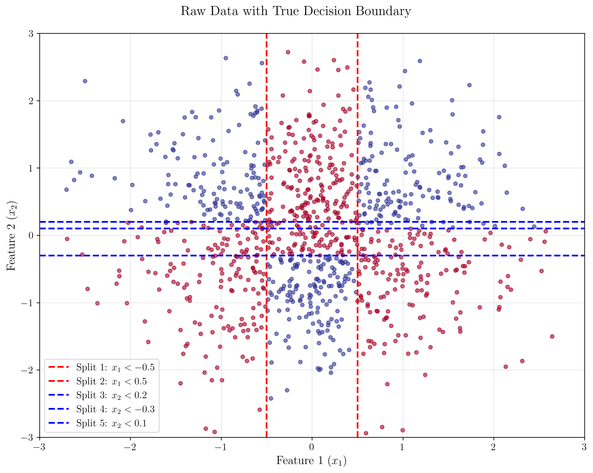
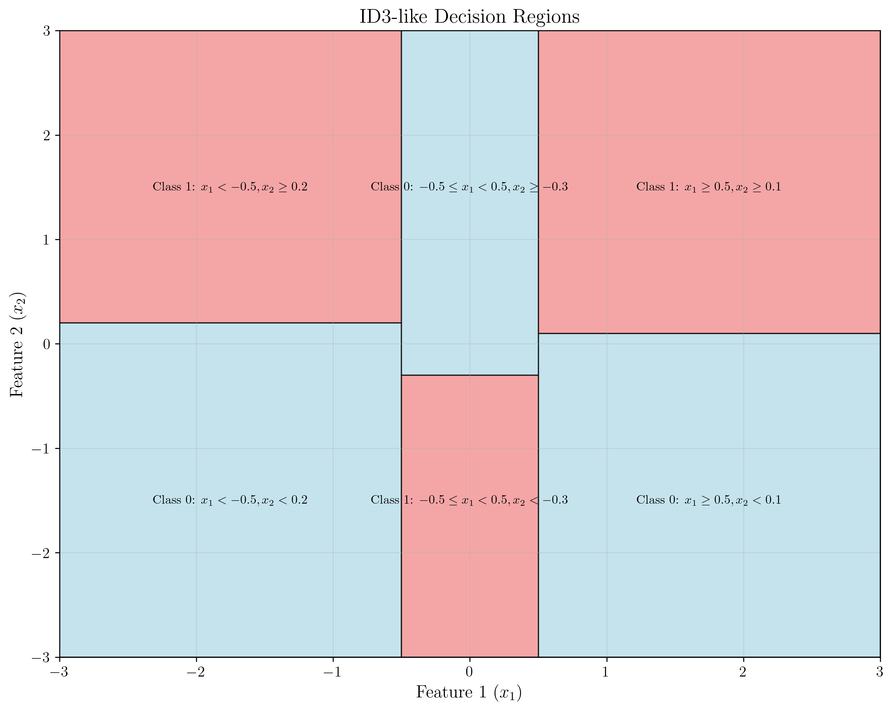
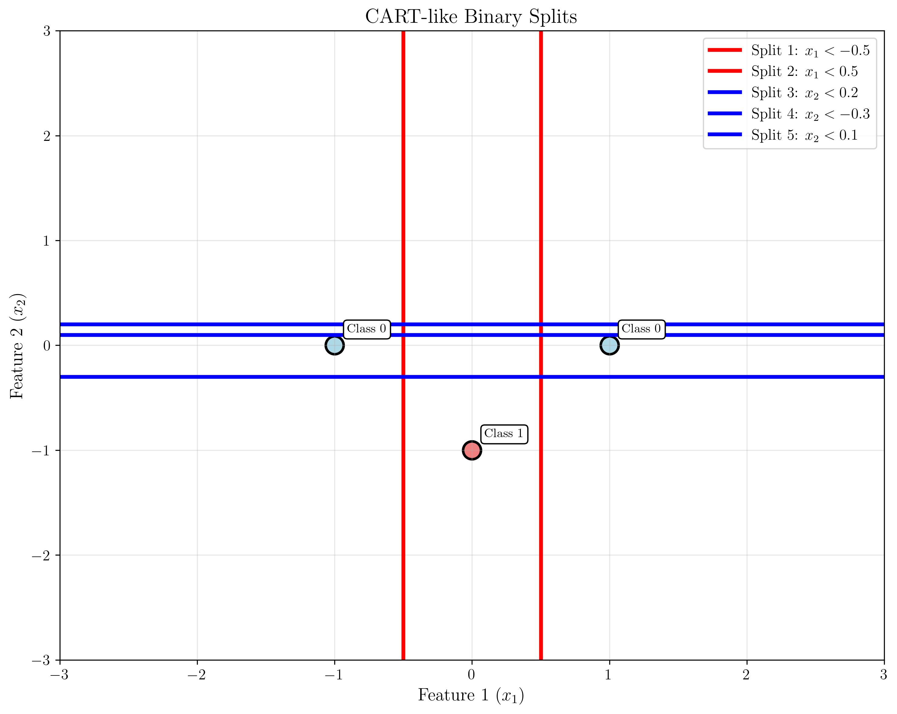

# Question 21: Decision Tree Interpretability

## Problem Statement
Compare tree interpretability across algorithms.

### Task
The geometric interpretation of decision trees helps understand their decision-making process. Which statement correctly describes decision boundaries?

**A)** ID3 creates axis-parallel rectangular regions in feature space
**B)** C4.5 can create diagonal decision boundaries due to continuous feature handling  
**C)** CART's binary splits (using Gini impurity) always create more complex boundaries than multi-way splits
**D)** All decision tree algorithms create identical decision boundaries for the same dataset

## Understanding the Problem
Decision trees are fundamental machine learning models that create interpretable decision boundaries by recursively splitting the feature space. Understanding how different decision tree algorithms create these boundaries is crucial for model interpretation and selection. The key insight is that all standard decision tree algorithms share fundamental geometric properties despite their differences in feature selection criteria and splitting strategies.

## Solution

### Step 1: Understanding Decision Tree Algorithms
The three main decision tree algorithms are:

1. **ID3 (Iterative Dichotomiser 3)**
   - Uses information gain for feature selection
   - Creates axis-parallel splits only
   - Handles categorical features

2. **C4.5 (Successor to ID3)**
   - Extends ID3 with continuous feature handling
   - Still creates axis-parallel splits
   - More sophisticated than ID3 but similar geometric properties

3. **CART (Classification and Regression Trees)**
   - Uses Gini impurity or MSE for splitting
   - Creates binary splits (two children per node)
   - Also creates axis-parallel splits

### Step 2: Geometric Interpretation of Decision Boundaries
Decision boundaries in feature space have fundamental geometric properties:

- Each split creates a hyperplane perpendicular to one feature axis
- Multiple splits create rectangular regions (in 2D) or hyperrectangular regions (in higher dimensions)
- All standard decision tree algorithms create axis-parallel boundaries
- This is a fundamental limitation of decision trees

### Step 3: Visualizing Decision Boundaries
The code generates separate visualizations for better clarity:

#### 1. Raw Data with Decision Boundaries

This plot shows the underlying data distribution with axis-parallel decision boundary lines. Each line represents a split perpendicular to one feature axis.

#### 2. ID3-like Decision Regions

This visualization demonstrates how axis-parallel splits create rectangular decision regions. The mathematical formulation shows:
- Region 1: $x_1 < -0.5, x_2 < 0.2$ → Class 0
- Region 2: $x_1 < -0.5, x_2 \geq 0.2$ → Class 1
- Region 3: $-0.5 \leq x_1 < 0.5, x_2 < -0.3$ → Class 1
- Region 4: $-0.5 \leq x_1 < 0.5, x_2 \geq -0.3$ → Class 0
- Region 5: $x_1 \geq 0.5, x_2 < 0.1$ → Class 0
- Region 6: $x_1 \geq 0.5, x_2 \geq 0.1$ → Class 1

#### 3. CART-like Binary Splits

This plot shows how CART creates binary splits while maintaining axis-parallel boundaries. The splits are:
- Split 1: $x_1 < -0.5$
- Split 2: $x_1 < 0.5$
- Split 3: $x_2 < 0.2$
- Split 4: $x_2 < -0.3$
- Split 5: $x_2 < 0.1$

#### 4. Non-Axis-Parallel Comparison

This visualization illustrates what decision trees cannot do. The green diagonal line $x_2 = 0.5x_1 + 0.3$ represents a non-axis-parallel boundary that standard decision trees cannot create. Instead, they approximate it using multiple axis-parallel splits.

### Step 4: Algorithm Comparison
The key differences between algorithms are not in boundary shape but in:

| Algorithm | Split Type | Boundary Shape | Feature Handling |
|-----------|------------|----------------|------------------|
| ID3 | Multi-way | Axis-parallel | Categorical only |
| C4.5 | Multi-way | Axis-parallel | Categorical + Continuous |
| CART | Binary | Axis-parallel | Categorical + Continuous |

## Key Insights

### Geometric Limitations
- All standard decision tree algorithms create axis-parallel decision boundaries
- This is a fundamental geometric limitation, not a limitation of specific algorithms
- Boundaries are always perpendicular to feature axes
- Results in rectangular decision regions

### Algorithm Differences
The difference between algorithms is in:
- How they select features (information gain vs Gini vs MSE)
- How they handle continuous features
- Split strategy (binary vs multi-way)
- Pruning and stopping criteria

### Practical Implications
- Trees work well when data has axis-parallel separability
- Trees struggle with diagonal or curved decision boundaries
- This limitation can be overcome with ensemble methods (Random Forest)

## Mathematical Foundation

### Decision Boundary Equation
For a feature $f$ with threshold $\theta$, the decision boundary is:
$$f = \theta$$

This creates a hyperplane perpendicular to the $f$-axis.

### Multiple Splits
When multiple features are used, the decision regions become intersections of half-spaces:
$$\bigcap_{i=1}^{n} \{x_i \text{ satisfies condition } C_i\}$$

### Geometric Constraint
The fundamental constraint is that all splits must be of the form:
$$f_i \leq \theta_i \text{ or } f_i > \theta_i$$

This ensures that decision boundaries are always parallel to coordinate axes.

## Conclusion
- **Correct Answer: A) ID3 creates axis-parallel rectangular regions in feature space**

**Explanation:**
- ID3, like all standard decision tree algorithms, creates axis-parallel splits
- Each split is perpendicular to one feature axis
- Multiple splits create rectangular regions in 2D (hyperrectangular in higher dimensions)
- This is a fundamental property, not a limitation of ID3 specifically

**Why other options are incorrect:**
- **B)** C4.5 cannot create diagonal boundaries - it still uses axis-parallel splits
- **C)** CART's binary splits don't necessarily create more complex boundaries
- **D)** Different algorithms may create different trees for the same dataset

The geometric interpretation reveals that decision trees are fundamentally limited to creating axis-parallel boundaries, regardless of the specific algorithm used. This understanding is crucial for model selection and feature engineering decisions.

**Key Mathematical Insight:** The constraint $f_i \leq \theta_i$ for each feature $i$ ensures that decision boundaries are hyperplanes perpendicular to coordinate axes, resulting in rectangular decision regions in the feature space.
