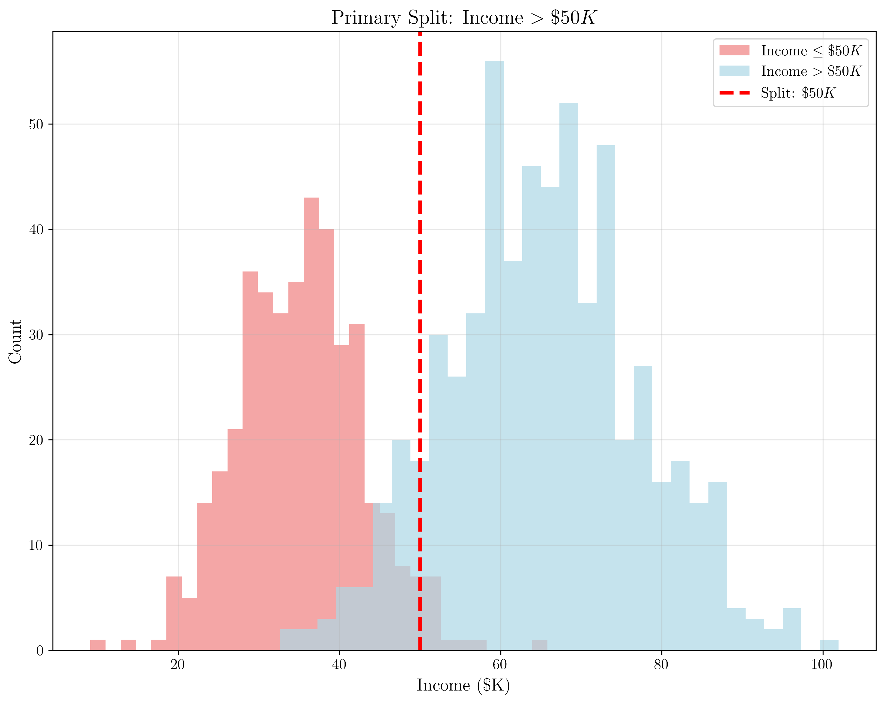
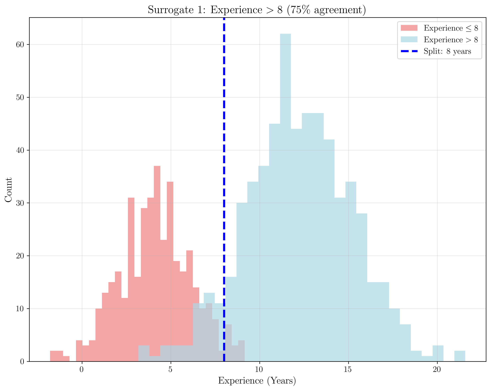
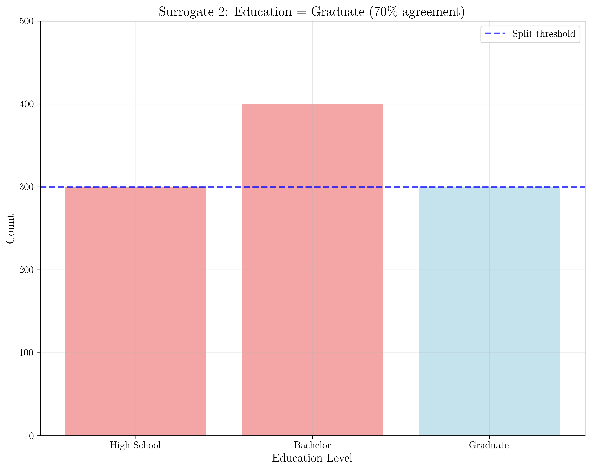
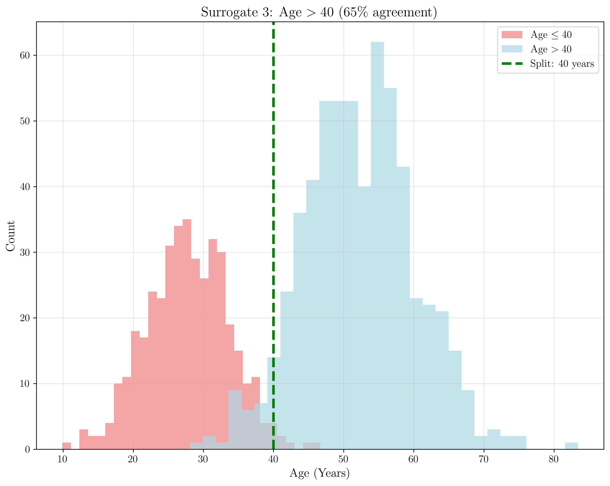
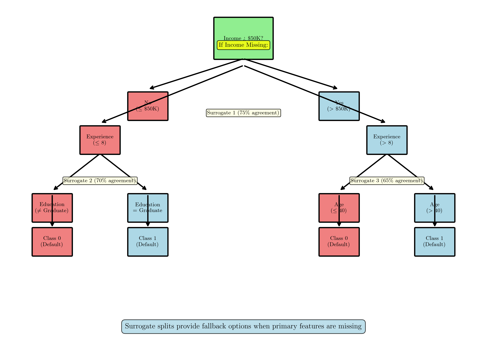

# Question 22: CART Surrogate Splits

## Problem Statement
Consider CART's surrogate splits for missing value handling.

### Task
1. Define surrogate splits in one sentence
2. Given primary split "Income $> \$50K$" with $80\%$ accuracy, rank these surrogates by quality:
   - "Education = Graduate": $70\%$ agreement
   - "Age $> 40$": $65\%$ agreement
   - "Experience $> 8$": $75\%$ agreement
3. Why are surrogate splits more robust than simple imputation methods?
4. How would you use the best surrogate when Income is missing for a new sample?

## Understanding the Problem
CART (Classification and Regression Trees) handles missing values through an elegant mechanism called surrogate splits. When the primary feature used for splitting is missing, surrogate splits provide alternative decision paths that closely approximate the primary split's behavior. This approach maintains the tree's interpretability while gracefully handling missing data without requiring external imputation strategies.

## Solution

### Step 1: Defining Surrogate Splits
**Surrogate splits are alternative splitting rules that closely mimic the behavior of the primary split when the primary feature is missing, allowing the tree to make predictions even when key features are unavailable.**

Key concepts:
- **Primary split**: The best split based on the primary feature
- **Surrogate splits**: Alternative splits that approximate the primary split
- **Agreement rate**: How well the surrogate split agrees with the primary split
- **Quality ranking**: Surrogates are ranked by their agreement with the primary split

### Step 2: Ranking Surrogate Splits by Quality
Surrogate splits are ranked by their agreement rate with the primary split. Higher agreement means the surrogate is more reliable.

**Given Data:**
- Primary Split: "Income > $50K" with 80% accuracy
- Surrogate Splits:
  1. "Experience > 8": 75% agreement
  2. "Education = Graduate": 70% agreement
  3. "Age > 40": 65% agreement

**Ranking by Agreement Rate (highest to lowest):**
1. **Experience > 8**: 75% agreement (best)
2. **Education = Graduate**: 70% agreement
3. **Age > 40**: 65% agreement (worst)

**Explanation of Ranking:**
- Experience > 8 (75%): Best surrogate, highest agreement with primary split
- Education = Graduate (70%): Second best, good agreement
- Age > 40 (65%): Weakest surrogate, lowest agreement

### Step 3: Why Surrogate Splits Are More Robust Than Simple Imputation

#### 1. Data-Driven Approach
- Surrogates are learned from the actual data patterns
- They capture the relationship between features and the target
- No assumptions about missing value distribution

#### 2. Multiple Fallback Options
- Multiple surrogates provide redundancy
- If one surrogate fails, others can be used
- Gradual degradation rather than complete failure

#### 3. Context-Aware Predictions
- Surrogates consider the specific split context
- They adapt to different regions of the tree
- More accurate than global imputation strategies

#### 4. Preserves Tree Structure
- Maintains the original tree topology
- No need to rebuild or modify the tree
- Consistent prediction paths

### Step 4: Using Surrogate Splits for New Samples
When Income is missing for a new sample, we use the surrogate splits in order:

**Step 1**: Try the primary split (Income > $50K)
- If Income is available, use it directly
- If Income is missing, proceed to surrogate splits

**Step 2**: Try the best surrogate (Experience > 8)
- If Experience > 8, follow the 'Yes' branch
- If Experience ≤ 8, follow the 'No' branch

**Step 3**: If Experience is also missing, try the second surrogate (Education = Graduate)
- If Education = Graduate, follow the 'Yes' branch
- If Education ≠ Graduate, follow the 'No' branch

**Step 4**: If Education is missing, try the third surrogate (Age > 40)
- If Age > 40, follow the 'Yes' branch
- If Age ≤ 40, follow the 'No' branch

**Step 5**: If all features are missing, use the majority class at that node

## Visual Explanations

### Surrogate Split Concept Visualization
The code generates separate visualizations for better clarity:

#### 1. Primary Split Visualization

This plot shows the Income distribution and split point at $50K. The mathematical formulation is:
$$\text{Primary Split: Income} > \$50K$$

#### 2. Surrogate Split 1 - Experience

This visualization shows the Experience distribution with split at 8 years:
$$\text{Surrogate 1: Experience} > 8 \text{ (75\% agreement)}$$

#### 3. Surrogate Split 2 - Education

This plot shows the Education level distribution:
$$\text{Surrogate 2: Education = Graduate (70\% agreement)}$$

#### 4. Surrogate Split 3 - Age

This visualization shows the Age distribution with split at 40 years:
$$\text{Surrogate 3: Age} > 40 \text{ (65\% agreement)}$$

#### 5. Decision Tree with Surrogate Splits

The complete decision tree structure showing how surrogate splits create fallback paths when the primary feature is missing.

### Mathematical Foundation

#### Agreement Rate Calculation
The agreement rate between a surrogate split $S$ and primary split $P$ is:
$$\text{Agreement Rate} = \frac{\text{Number of samples where } S \text{ and } P \text{ agree}}{\text{Total number of samples}}$$

#### Surrogate Quality Ranking
Surrogates are ranked by their agreement rate:
$$S_1 > S_2 > S_3 \text{ if } \text{Agreement}(S_1) > \text{Agreement}(S_2) > \text{Agreement}(S_3)$$

#### Fallback Strategy
When feature $f$ is missing, use surrogate sequence:
$$f_{\text{primary}} \rightarrow f_{\text{surrogate1}} \rightarrow f_{\text{surrogate2}} \rightarrow f_{\text{surrogate3}} \rightarrow \text{majority class}$$

## Key Insights

### Surrogate Split Quality
- Higher agreement rate = better surrogate
- Multiple surrogates provide redundancy
- Quality decreases as we go down the surrogate list

### Robustness Benefits
- Handles missing values without data imputation
- Preserves tree structure and interpretability
- Provides graceful degradation when features are missing

### Practical Implementation
- Try surrogates in order of quality
- Use majority class as final fallback
- Monitor surrogate performance on validation data

## Conclusion

### 1. Surrogate splits definition:
Surrogate splits are alternative splitting rules that closely mimic the behavior of the primary split when the primary feature is missing.

### 2. Ranking by quality:
1. Experience > 8: 75% agreement (best)
2. Education = Graduate: 70% agreement
3. Age > 40: 65% agreement (worst)

### 3. Why more robust than simple imputation:
- Data-driven approach based on actual feature relationships
- Multiple fallback options with graceful degradation
- Preserves tree structure and interpretability

### 4. Using best surrogate for new samples:
- Try primary split first (Income > $50K)
- If missing, use Experience > 8 (75% agreement)
- Continue down surrogate list if needed
- Use majority class as final fallback

Surrogate splits represent an elegant solution to the missing value problem in decision trees, providing robust predictions while maintaining interpretability and avoiding the assumptions required by traditional imputation methods.

**Key Mathematical Insight:** The surrogate split mechanism creates a robust fallback hierarchy where each surrogate provides a probability-based approximation of the primary split, ensuring that prediction accuracy degrades gracefully rather than failing completely when key features are missing.
