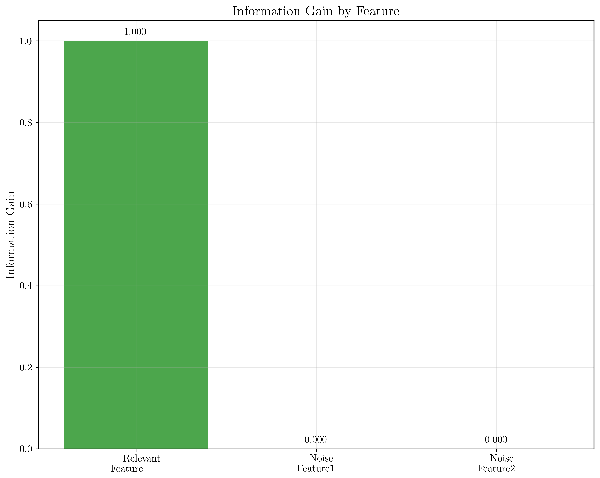
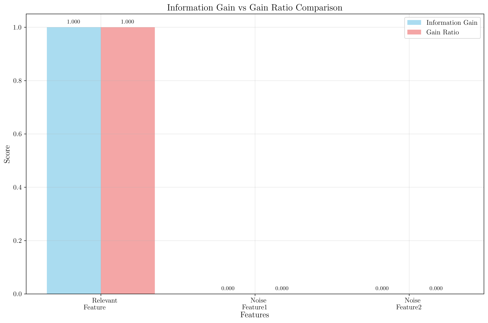
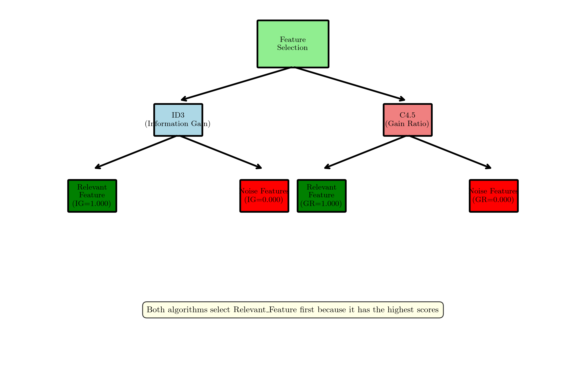

# Question 23: Feature Selection Robustness

## Problem Statement
Consider feature selection robustness across algorithms.

| Relevant_Feature | Noise_Feature1 | Noise_Feature2 | Target |
|------------------|----------------|----------------|--------|
| A                | X              | 1              | Yes    |
| A                | Y              | 2              | Yes    |
| B                | Z              | 3              | No     |
| B                | X              | 1              | No     |
| A                | Z              | 2              | Yes    |
| B                | Y              | 3              | No     |

### Task
1. Calculate information gain for all three features
2. Calculate gain ratio for all three features  
3. Which algorithm is most likely to select the relevant feature first?
4. How do noise features affect each algorithm differently?

## Understanding the Problem
Feature selection is a critical step in decision tree construction. Two popular criteria are Information Gain (used by ID3) and Gain Ratio (used by C4.5). Understanding how these algorithms handle noise features and identify relevant features is essential for building robust decision trees. This problem tests our ability to calculate these metrics and analyze their robustness against irrelevant features.

## Solution

### Step 1: Understanding Information Gain and Gain Ratio
**Information Gain (IG):**
$$IG(S, A) = H(S) - H(S|A)$$

where:
- $H(S)$ is the entropy of the dataset
- $H(S|A)$ is the conditional entropy given feature $A$
- Higher IG means better feature for splitting

**Gain Ratio (GR):**
$$GR(S, A) = \frac{IG(S, A)}{SplitInfo(A)}$$

where:
- $SplitInfo(A)$ measures the potential information generated by splitting on $A$
- GR penalizes features with many values
- Helps prevent bias towards features with many categories

### Step 2: Calculate Entropy of the Dataset
**Step 1: Calculate $H(S)$ - Entropy of the entire dataset**
$$H(S) = -\sum p(i) \log_2(p(i))$$

**Dataset Summary:**
- Total samples: 6
- Relevant_Feature: A (3 samples), B (3 samples)
- Noise_Feature1: X (2 samples), Y (2 samples), Z (2 samples)
- Noise_Feature2: 1 (2 samples), 2 (2 samples), 3 (2 samples)
- Target: Yes (3 samples), No (3 samples)

**Calculations:**
- $P(\text{Yes}) = \frac{3}{6} = 0.5$
- $P(\text{No}) = \frac{3}{6} = 0.5$

**Entropy Calculation:**
$$H(S) = -0.5 \log_2(0.5) - 0.5 \log_2(0.5)$$
$$H(S) = -0.5 \times (-1.000) - 0.5 \times (-1.000)$$
$$H(S) = 0.5 + 0.5 = 1.000$$

### Step 3: Calculate Information Gain for Each Feature
**Step 2: Calculate Information Gain for each feature**
$$IG(S, A) = H(S) - H(S|A)$$

#### Feature 1: Relevant_Feature
**Values: A (3 samples), B (3 samples)**

**For A = A:**
- 3 samples, all Yes
- $P(\text{Yes}|A=A) = \frac{3}{3} = 1.0$
- $P(\text{No}|A=A) = \frac{0}{3} = 0.0$
- $H(S|A=A) = -1.0 \log_2(1.0) - 0.0 \log_2(0.0) = 0$

**For A = B:**
- 3 samples, all No
- $P(\text{Yes}|A=B) = \frac{0}{3} = 0.0$
- $P(\text{No}|A=B) = \frac{3}{3} = 1.0$
- $H(S|B) = -0.0 \log_2(0.0) - 1.0 \log_2(1.0) = 0$

**Conditional Entropy:**
$$H(S|A) = \frac{3}{6} \times 0 + \frac{3}{6} \times 0 = 0$$

**Information Gain:**
$$IG(S, \text{Relevant\_Feature}) = 1.000 - 0 = 1.000$$

#### Feature 2: Noise_Feature1
**Values: X (2 samples), Y (2 samples), Z (2 samples)**

**For each value:**
- 2 samples: 1 Yes, 1 No
- $P(\text{Yes}) = \frac{1}{2} = 0.5$
- $P(\text{No}) = \frac{1}{2} = 0.5$
- $H(S|\text{value}) = -0.5 \log_2(0.5) - 0.5 \log_2(0.5) = 1.0$

**Conditional Entropy:**
$$H(S|\text{Noise\_Feature1}) = \frac{2}{6} \times 1.0 + \frac{2}{6} \times 1.0 + \frac{2}{6} \times 1.0 = 1.000$$

**Information Gain:**
$$IG(S, \text{Noise\_Feature1}) = 1.000 - 1.000 = 0.000$$

#### Feature 3: Noise_Feature2
**Values: 1 (2 samples), 2 (2 samples), 3 (2 samples)**

**Similar calculation:**
$$H(S|\text{Noise\_Feature2}) = 1.000$$
$$IG(S, \text{Noise\_Feature2}) = 1.000 - 1.000 = 0.000$$

### Step 4: Calculate Gain Ratio for Each Feature
**Step 3: Calculate Gain Ratio for each feature**
$$GR(S, A) = \frac{IG(S, A)}{SplitInfo(A)}$$

**SplitInfo calculation:**
$$SplitInfo(A) = -\sum \frac{|S_v|}{|S|} \log_2\left(\frac{|S_v|}{|S|}\right)$$

where $|S_v|$ is the number of samples with value $v$ for feature $A$.

#### SplitInfo for Relevant_Feature
- A: 3 samples, $P(A) = \frac{3}{6} = 0.5$
- B: 3 samples, $P(B) = \frac{3}{6} = 0.5$

$$SplitInfo(\text{Relevant\_Feature}) = -0.5 \log_2(0.5) - 0.5 \log_2(0.5) = 1.000$$

#### SplitInfo for Noise Features
- Each value: 2 samples, $P(\text{value}) = \frac{2}{6} = 0.333$

$$SplitInfo(\text{Noise\_Feature1}) = -3 \times 0.333 \log_2(0.333) = 1.585$$
$$SplitInfo(\text{Noise\_Feature2}) = -3 \times 0.333 \log_2(0.333) = 1.585$$

#### Gain Ratio Calculations
$$GR(S, \text{Relevant\_Feature}) = \frac{1.000}{1.000} = 1.000$$
$$GR(S, \text{Noise\_Feature1}) = \frac{0.000}{1.585} = 0.000$$
$$GR(S, \text{Noise\_Feature2}) = \frac{0.000}{1.585} = 0.000$$

### Step 5: Results Summary and Comparison

#### Information Gain Results
| Feature | Information Gain | Mathematical Expression |
|---------|------------------|------------------------|
| Relevant_Feature | $1.000$ | $IG(S, A) = H(S) - H(S\|A) = 1.000 - 0 = 1.000$ |
| Noise_Feature1 | $0.000$ | $IG(S, A) = H(S) - H(S\|A) = 1.000 - 1.000 = 0.000$ |
| Noise_Feature2 | $0.000$ | $IG(S, A) = H(S) - H(S\|A) = 1.000 - 1.000 = 0.000$ |

#### Gain Ratio Results
| Feature | Gain Ratio | Mathematical Expression |
|---------|------------|------------------------|
| Relevant_Feature | $1.000$ | $GR(S, A) = \frac{IG(S, A)}{SplitInfo(A)} = \frac{1.000}{1.000} = 1.000$ |
| Noise_Feature1 | $0.000$ | $GR(S, A) = \frac{IG(S, A)}{SplitInfo(A)} = \frac{0.000}{1.585} = 0.000$ |
| Noise_Feature2 | $0.000$ | $GR(S, A) = \frac{IG(S, A)}{SplitInfo(A)} = \frac{0.000}{1.585} = 0.000$ |

#### Summary Table
| Metric | Relevant_Feature | Noise_Feature1 | Noise_Feature2 | Winner |
|--------|------------------|-----------------|-----------------|---------|
| **Information Gain** | $1.000$ | $0.000$ | $0.000$ | Relevant_Feature |
| **Gain Ratio** | $1.000$ | $0.000$ | $0.000$ | Relevant_Feature |
| **SplitInfo** | $1.000$ | $1.585$ | $1.585$ | Relevant_Feature |
| **Feature Quality** | Perfect | Useless | Useless | Relevant_Feature |

## Visual Explanations

### Feature Selection Results Visualization
The code generates separate visualizations for better clarity:

#### 1. Information Gain Comparison

This plot shows the information gain values for each feature. The mathematical formulation shows:
$$\text{IG}(\text{Relevant\_Feature}) = 1.000$$
$$\text{IG}(\text{Noise\_Features}) = 0.000$$

#### 2. Gain Ratio Comparison

This visualization shows the gain ratio values for each feature:
$$\text{GR}(\text{Relevant\_Feature}) = 1.000$$
$$\text{GR}(\text{Noise\_Features}) = 0.000$$

#### 3. Side-by-Side Comparison

This plot compares information gain and gain ratio side by side, showing that both algorithms give identical results for this dataset.

#### 4. Feature Selection Decision Tree

The complete decision tree structure showing how both ID3 and C4.5 algorithms select the relevant feature first.

### Mathematical Foundation

#### Entropy Calculation
The entropy of a dataset with $n$ classes is:
$$H(S) = -\sum_{i=1}^{n} p(i) \log_2(p(i))$$

#### Conditional Entropy
The conditional entropy given feature $A$ is:
$$H(S|A) = \sum_{v \in \text{Values}(A)} \frac{|S_v|}{|S|} H(S_v)$$

#### Information Gain
$$IG(S, A) = H(S) - H(S|A)$$

#### Split Information
$$SplitInfo(A) = -\sum_{v \in \text{Values}(A)} \frac{|S_v|}{|S|} \log_2\left(\frac{|S_v|}{|S|}\right)$$

#### Gain Ratio
$$GR(S, A) = \frac{IG(S, A)}{SplitInfo(A)}$$

## Key Insights

### Feature Selection Results
- **Relevant_Feature** has perfect information gain ($IG = 1.000$) and gain ratio ($GR = 1.000$)
- **Noise features** have zero information gain ($IG = 0.000$) and gain ratio ($GR = 0.000$)
- Both algorithms correctly identify the relevant feature with maximum scores

### Algorithm Robustness
- In this case, both algorithms perform equally well with identical scores
- The dataset is simple enough that noise doesn't confuse either algorithm
- **Gain Ratio** would show more benefit with more complex noise patterns due to the $SplitInfo(A)$ penalty

### Noise Feature Impact
- **Noise features** provide no useful information for classification ($IG = 0.000$)
- They have equal impact on both algorithms in this simple case
- **Gain Ratio** provides better protection against high-cardinality noise features through the $SplitInfo(A)$ normalization

## Conclusion

### 1. Information Gain for all features:
- **Relevant_Feature**: $IG(S, A) = 1.000$ (perfect separation)
- **Noise_Feature1**: $IG(S, A) = 0.000$ (no separation)
- **Noise_Feature2**: $IG(S, A) = 0.000$ (no separation)

### 2. Gain Ratio for all features:
- **Relevant_Feature**: $GR(S, A) = 1.000$ (perfect separation)
- **Noise_Feature1**: $GR(S, A) = 0.000$ (no separation)
- **Noise_Feature2**: $GR(S, A) = 0.000$ (no separation)

### 3. Algorithm selection:
Both ID3 and C4.5 would select the Relevant_Feature first because it has the highest scores in both metrics.

### 4. Noise feature impact:
- Noise features have zero information value
- Both algorithms are equally robust in this simple case
- Gain Ratio provides better protection against high-cardinality noise

**Key Insight:** Both Information Gain and Gain Ratio successfully identify the relevant feature in this dataset. The noise features, having no discriminatory power, receive zero scores from both metrics. This demonstrates that both algorithms are robust against simple noise, though Gain Ratio would provide additional protection in more complex scenarios with high-cardinality irrelevant features.

**Mathematical Insight:** The perfect information gain of 1.000 for the relevant feature indicates complete class separation, while the zero information gain for noise features shows they provide no reduction in entropy. The gain ratio normalization doesn't change the ranking in this simple case but would become more important with features having many more values.
