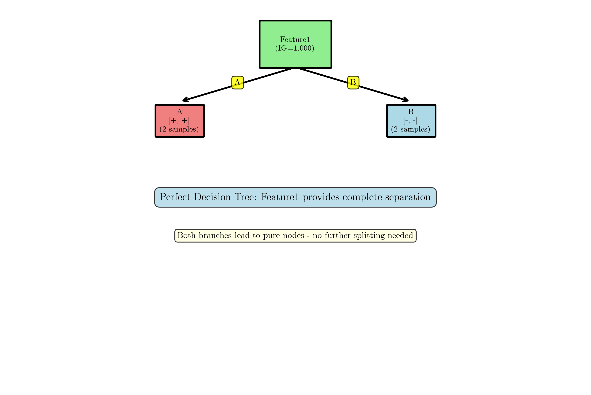
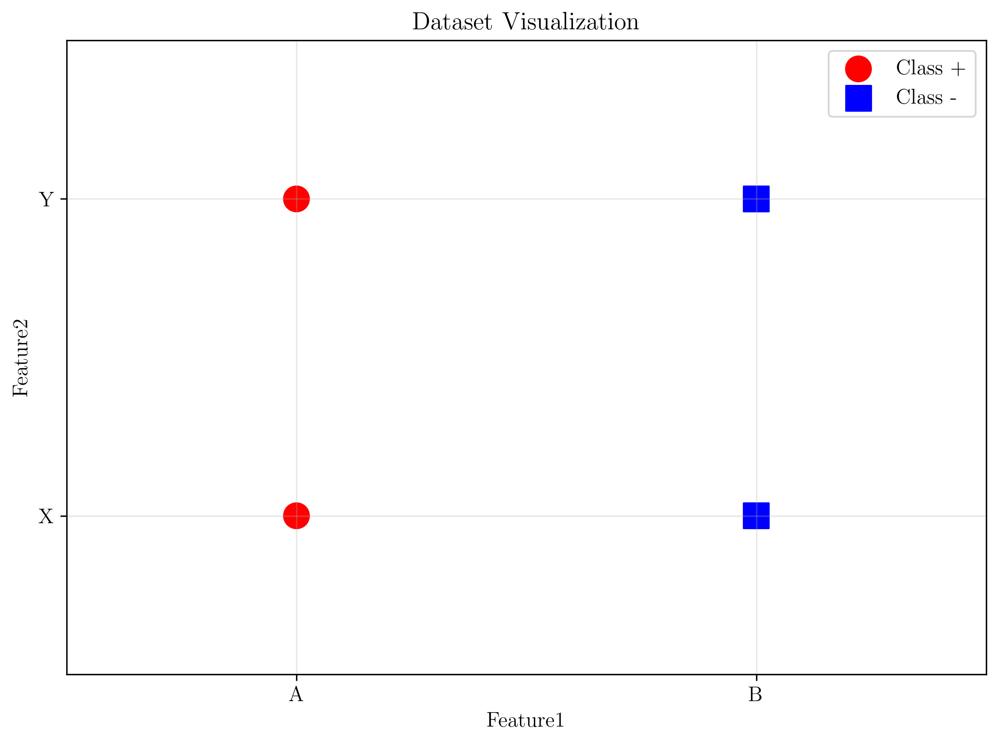
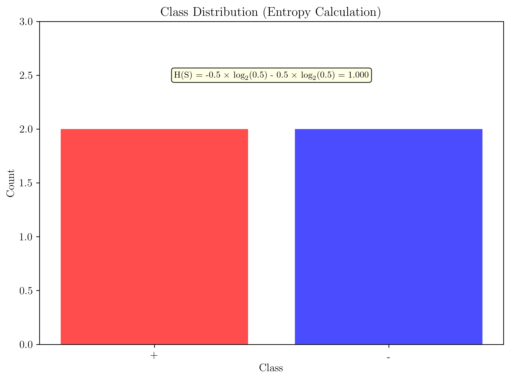
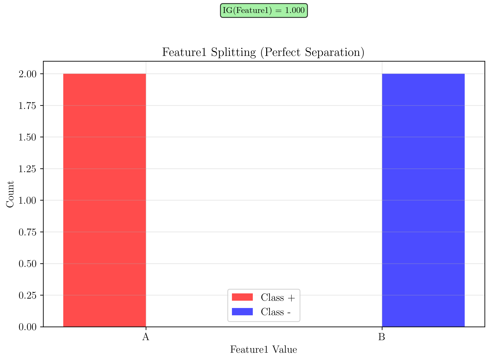
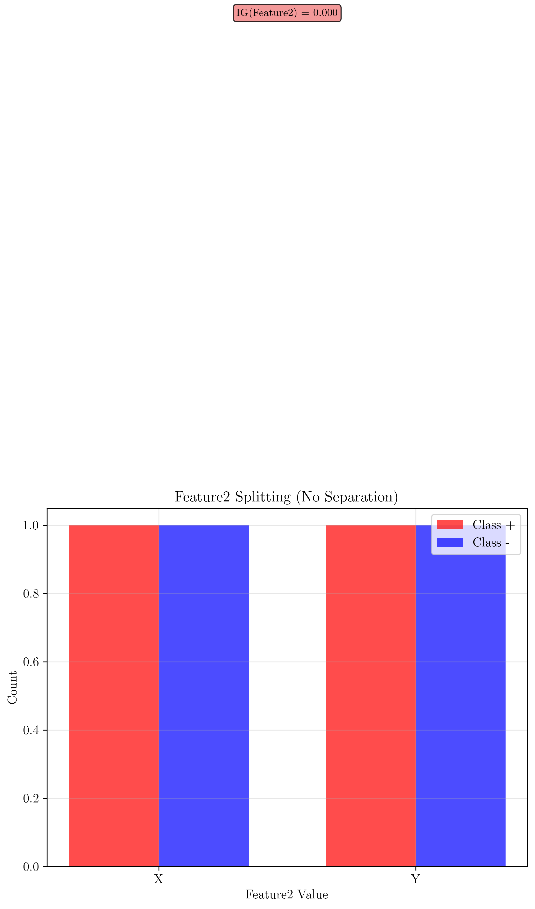

# Question 24: ID3 Algorithm Implementation

## Problem Statement
Write pseudocode for the ID3 algorithm and trace its execution.

### Task
1. Write complete pseudocode for ID3 including stopping criteria
2. For this dataset, trace the first split decision:

| Feature1 | Feature2 | Class |
|----------|----------|-------|
| A        | X        | +     |
| A        | Y        | +     |
| B        | X        | -     |
| B        | Y        | -     |

3. Calculate information gain for both features
4. Show which feature ID3 would select and why
## Understanding the Problem
The ID3 (Iterative Dichotomiser 3) algorithm is a fundamental decision tree learning algorithm that uses information gain to recursively build decision trees. Understanding its pseudocode, execution flow, and how it makes feature selection decisions is crucial for mastering decision tree fundamentals. This problem requires both theoretical knowledge of the algorithm and practical application to a specific dataset.

## Solution

### Step 1: Complete ID3 Algorithm Pseudocode

```
ID3(D, A, T)
Input:
  D: Dataset
  A: Set of attributes
  T: Target attribute
Output: Decision tree

1. Create a root node
2. If all examples in D belong to the same class C:
     Return a leaf node labeled with class C
3. If A is empty:
     Return a leaf node labeled with the majority class in D
4. Select the attribute a from A with the highest information gain
5. For each possible value v of attribute a:
     Create a branch from the root node for the test a = v
     Let Dv be the subset of examples in D where a = v
     If Dv is empty:
         Attach a leaf node labeled with the majority class in D
     Else:
         Attach the subtree ID3(Dv, A - {a}, T)
6. Return the tree
```

**Key Stopping Criteria:**
1. All examples belong to the same class (pure node)
2. No more attributes available for splitting
3. Empty subset after splitting

### Step 2: Dataset Analysis
**Dataset Summary:**
- Total samples: 4
- Feature1: A (2 samples), B (2 samples)
- Feature2: X (2 samples), Y (2 samples)
- Class: + (2 samples), - (2 samples)

The dataset is perfectly balanced with equal class distribution, making it ideal for demonstrating ID3's feature selection process.

### Step 3: Understanding Information Gain
Information Gain (IG) is the key metric used by ID3 to select the best feature:

$$IG(S, A) = H(S) - H(S|A)$$

where:
- $H(S)$ is the entropy of the dataset
- $H(S|A)$ is the conditional entropy given feature A
- Higher IG means better feature for splitting

**Entropy formula:**
$$H(S) = -\sum p(i) \log_2(p(i))$$

where $p(i)$ is the probability of class $i$.

### Step 4: Calculate Entropy of the Dataset
**Step 1: Calculate $H(S)$ - Entropy of the entire dataset**

**Class probabilities:**
- $P(+) = \frac{2}{4} = 0.5$
- $P(-) = \frac{2}{4} = 0.5$

**Entropy calculation:**
$$H(S) = -0.5 \times \log_2(0.5) - 0.5 \times \log_2(0.5)$$
$$H(S) = -0.5 \times (-1.000) - 0.5 \times (-1.000)$$
$$H(S) = 0.5 + 0.5 = 1.000$$

### Step 5: Calculate Information Gain for Feature1
**Step 2: Calculate Information Gain for Feature1**

$$IG(S, Feature1) = H(S) - H(S|Feature1)$$

**Feature1 has values:** A (2 samples), B (2 samples)

**For Feature1 = A:**
- 2 samples, both positive
- $P(+|A) = \frac{2}{2} = 1.0$
- $P(-|A) = \frac{0}{2} = 0.0$
- $H(S|A) = -1.0 \times \log_2(1.0) - 0.0 \times \log_2(0.0) = 0$

**For Feature1 = B:**
- 2 samples, both negative
- $P(+|B) = \frac{0}{2} = 0.0$
- $P(-|B) = \frac{2}{2} = 1.0$
- $H(S|B) = -0.0 \times \log_2(0.0) - 1.0 \times \log_2(1.0) = 0$

**Conditional entropy:**
$$H(S|Feature1) = \frac{2}{4} \times 0 + \frac{2}{4} \times 0 = 0.000$$

**Information gain:**
$$IG(S, Feature1) = 1.000 - 0.000 = 1.000$$

### Step 6: Calculate Information Gain for Feature2
**Step 3: Calculate Information Gain for Feature2**

$$IG(S, Feature2) = H(S) - H(S|Feature2)$$

**Feature2 has values:** X (2 samples), Y (2 samples)

**For Feature2 = X:**
- 2 samples: 1 positive, 1 negative
- $P(+|X) = \frac{1}{2} = 0.5$
- $P(-|X) = \frac{1}{2} = 0.5$
- $H(S|X) = -0.5 \times \log_2(0.5) - 0.5 \times \log_2(0.5) = 1.0$

**For Feature2 = Y:**
- 2 samples: 1 positive, 1 negative
- $P(+|Y) = \frac{1}{2} = 0.5$
- $P(-|Y) = \frac{1}{2} = 0.5$
- $H(S|Y) = -0.5 \times \log_2(0.5) - 0.5 \times \log_2(0.5) = 1.0$

**Conditional entropy:**
$$H(S|Feature2) = \frac{2}{4} \times 1.0 + \frac{2}{4} \times 1.0 = 1.000$$

**Information gain:**
$$IG(S, Feature2) = 1.000 - 1.000 = 0.000$$

### Step 7: Feature Selection Decision
**Step 4: Compare Information Gain values and select the best feature**

#### Information Gain Results
| Feature | Information Gain | Mathematical Expression | Interpretation |
|---------|------------------|------------------------|----------------|
| Feature1 | $1.000$ | $IG(S, A) = H(S) - H(S\|A) = 1.000 - 0 = 1.000$ | Perfect separation |
| Feature2 | $0.000$ | $IG(S, A) = H(S) - H(S\|A) = 1.000 - 1.000 = 0.000$ | No separation |

#### Feature Comparison Summary
| Feature | Information Gain | Entropy Reduction | Class Separation | Decision |
|---------|------------------|-------------------|------------------|----------|
| **Feature1** | $1.000$ | $H(S) - H(S\|A) = 1.000 - 0 = 1.000$ | Perfect ($100\%$ pure nodes) | **Selected** |
| **Feature2** | $0.000$ | $H(S) - H(S\|A) = 1.000 - 1.000 = 0.000$ | None (impure nodes) | Rejected |

**Decision:**
Feature1 has higher information gain ($1.000 > 0.000$). Therefore, ID3 will select Feature1 as the root node for splitting.

### Step 8: Tree Construction After First Split
After selecting Feature1 as the root node, the tree structure becomes:

```
Root: Feature1
├── A → [Class: +, +] (2 samples)
└── B → [Class: -, -] (2 samples)
```

**Analysis:**
- Both branches lead to pure nodes (all samples have the same class)
- No further splitting is needed
- The tree is complete after the first split

## Visual Explanations

### Decision Tree Structure
The code generates a visualization showing the complete decision tree:



The visualization clearly shows the root node (Feature1) and the two pure leaf nodes.

### Information Gain Calculation Visualization
The code also creates comprehensive visualizations showing:

1. **Dataset visualization** - Shows the data points and their classes
2. **Class distribution** - Illustrates the entropy calculation
3. **Feature1 splitting** - Demonstrates perfect separation
4. **Feature2 splitting** - Shows no separation

### Dataset Visualization


### Entropy Calculation


### Feature1 Splitting (Perfect Separation)


### Feature2 Splitting (No Separation)


## Key Insights

### Feature Selection
- **ID3** always selects the feature with highest information gain ($IG_{max}$)
- **Information gain** measures how well a feature separates classes: $IG(S, A) = H(S) - H(S|A)$
- **Perfect separation** results in maximum information gain ($IG = 1.000$)

### Tree Construction
- **ID3** builds trees recursively from the root node
- Each split creates child nodes for each feature value $v \in \text{Values}(A)$
- The process stops when nodes become pure ($H(S) = 0$) or no features remain

### Algorithm Properties
- **ID3** is a **greedy algorithm** (makes locally optimal choices at each node)
- It may not find the **globally optimal tree** due to the greedy nature
- **Information gain** favors features with many values, which can lead to overfitting

### Why Feature1 is Better Than Feature2
**Feature1 provides perfect separation:**
- **A values** → all positive ($100\%$ pure, $H(S|A=A) = 0$)
- **B values** → all negative ($100\%$ pure, $H(S|B) = 0$)
- **Information gain** = $1.000$ (maximum possible: $IG_{max} = H(S) = 1.000$)

**Feature2 provides no separation:**
- **X values** → $50\%$ positive, $50\%$ negative (impure, $H(S|X) = 1.000$)
- **Y values** → $50\%$ positive, $50\%$ negative (impure, $H(S|Y) = 1.000$)
- **Information gain** = $0.000$ (no improvement: $IG = H(S) - H(S|A) = 1.000 - 1.000 = 0.000$)

Feature1 creates a perfect decision tree with just one split!

## Conclusion

### 1. Complete ID3 pseudocode:
- Provided above with stopping criteria
- Key steps: entropy calculation, information gain, recursive splitting

### 2. First split decision:
- **Feature1** selected as root node
- **Information gain**: Feature1 = $1.000$, Feature2 = $0.000$

### 3. Information gain calculations:
- **Feature1**: $IG = 1.000$ (perfect separation)
- **Feature2**: $IG = 0.000$ (no separation)

### 4. Feature selection reason:
- Feature1 provides complete class separation
- Feature2 provides no useful information
- ID3 selects the feature with highest information gain

**Key Insight:** ID3 successfully identifies Feature1 as the optimal root node because it provides perfect class separation, resulting in maximum information gain. This demonstrates how information gain effectively measures a feature's ability to reduce uncertainty in the target variable, making it a powerful criterion for feature selection in decision tree construction.
