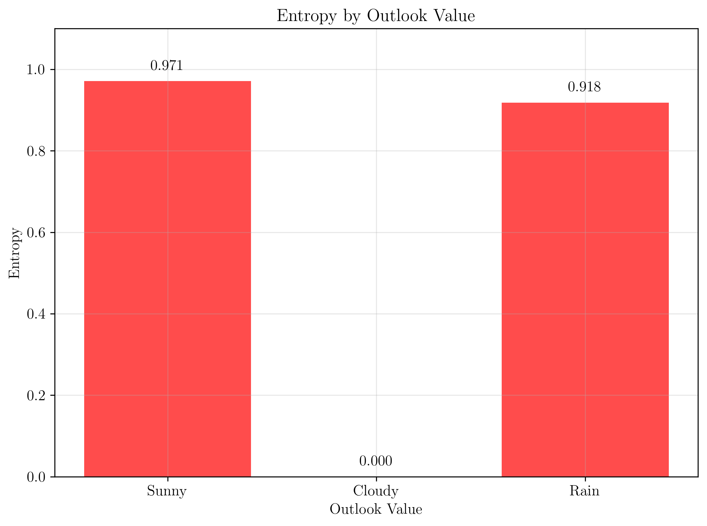

# Question 25: ID3 Feature Exhaustion

## Problem Statement
Consider ID3's behavior when all features have been used but nodes remain impure.

### Task
1. Describe the scenario where ID3 exhausts all features but has impure nodes
2. Given this partially constructed tree where all features are used:

```
Root: Outlook
├── Sunny → [Yes: 2, No: 3]
├── Cloudy → [Yes: 4, No: 0]  
└── Rain → [Yes: 1, No: 2]
```

3. How should ID3 handle the impure "Sunny" and "Rain" nodes?
4. What is the decision rule for leaf node class assignment in this case?
5. Calculate the entropy of each impure leaf and determine which majority class rule to apply

## Understanding the Problem
This problem examines a critical scenario in decision tree construction: what happens when ID3 has used all available features but some leaf nodes still contain samples from multiple classes? This is a common situation in real-world datasets where features have limited discriminatory power, data is noisy, or the problem is inherently non-linearly separable. Understanding how to handle this scenario is essential for practical decision tree implementation.

## Solution

### Step 1: Understanding the Scenario
The scenario occurs when:

1. **ID3 has used all available features for splitting**
2. **Some leaf nodes still contain samples from multiple classes**
3. **No more features are available to further split these impure nodes**
4. **The algorithm must make a decision about class assignment**

This is a common situation in real-world datasets where:
- Features have limited discriminatory power
- Data is noisy or contains conflicting examples
- The problem is inherently non-linearly separable
- Feature space is insufficient for perfect separation

### Step 2: Given Tree Analysis
**Partially constructed tree where all features are used:**

```
Root: Outlook
├── Sunny → [Yes: 2, No: 3]
├── Cloudy → [Yes: 4, No: 0]  
└── Rain → [Yes: 1, No: 2]
```

**Analysis:**
- Total samples: 12
- **Sunny branch**: 5 samples (2 Yes, 3 No) - **IMPURE**
- **Cloudy branch**: 4 samples (4 Yes, 0 No) - **PURE**
- **Rain branch**: 3 samples (1 Yes, 2 No) - **IMPURE**

**Features used**: Outlook (all possible values exhausted)
**No more features available** for further splitting

### Step 3: How ID3 Should Handle Impure Nodes
When ID3 exhausts all features but has impure nodes:

1. **Stop further splitting** (no more features available)
2. **Convert impure nodes to leaf nodes**
3. **Assign class labels using majority voting**
4. **Use the most frequent class as the prediction**

This is a stopping criterion in ID3:
```
If A is empty (no more attributes):
  Return a leaf node labeled with the majority class in D
```

The algorithm cannot continue building the tree and must make the best possible prediction with available information.

### Step 4: Decision Rule for Leaf Node Class Assignment
**Decision Rule: Majority Class Assignment**

For each impure leaf node:
1. Count the number of samples from each class
2. Identify the class with the highest count
3. Assign that class as the leaf node's prediction
4. In case of ties, use a tie-breaking strategy

**Mathematical formulation:**
$$Class(leaf) = \arg\max_c Count(c) \text{ for } c \in Classes$$

where $Count(c)$ is the number of samples of class $c$ in the leaf.

### Step 5: Entropy Calculation for Each Leaf
**Step 1: Calculate entropy for each impure leaf node**

$$H(S) = -\sum p(i) \log_2(p(i))$$

#### Sunny branch: $[Yes: 2, No: 3]$
**Class probabilities:**
- $P(Yes|Sunny) = \frac{2}{5} = 0.400$
- $P(No|Sunny) = \frac{3}{5} = 0.600$

**Entropy calculation:**
$$H(Sunny) = -0.400 \times \log_2(0.400) - 0.600 \times \log_2(0.600)$$
$$H(Sunny) = -0.400 \times (-1.322) - 0.600 \times (-0.737)$$
$$H(Sunny) = 0.971$$

#### Cloudy branch: $[Yes: 4, No: 0]$ - Pure node
**Class probabilities:**
- $P(Yes|Cloudy) = \frac{4}{4} = 1.0$
- $P(No|Cloudy) = \frac{0}{4} = 0.0$

**Entropy calculation:**
$$H(Cloudy) = -1.0 \times \log_2(1.0) - 0.0 \times \log_2(0.0) = 0$$

This is a pure node with zero entropy.

#### Rain branch: $[Yes: 1, No: 2]$
**Class probabilities:**
- $P(Yes|Rain) = \frac{1}{3} = 0.333$
- $P(No|Rain) = \frac{2}{3} = 0.667$

**Entropy calculation:**
$$H(Rain) = -0.333 \times \log_2(0.333) - 0.667 \times \log_2(0.667)$$
$$H(Rain) = -0.333 \times (-1.585) - 0.667 \times (-0.585)$$
$$H(Rain) = 0.918$$

### Step 6: Majority Class Assignment
**Step 2: Determine majority class for each impure leaf**

#### Sunny branch: $[Yes: 2, No: 3]$
- Yes count: 2
- No count: 3
- **Majority class: No (3 > 2)**
- **Decision rule**: If Outlook = Sunny, predict No

#### Rain branch: $[Yes: 1, No: 2]$
- Yes count: 1
- No count: 2
- **Majority class: No (2 > 1)**
- **Decision rule**: If Outlook = Rain, predict No

#### Cloudy branch: $[Yes: 4, No: 0]$
- Yes count: 4
- No count: 0
- **Pure node**: All samples are Yes
- **Decision rule**: If Outlook = Cloudy, predict Yes

### Step 7: Final Tree Structure
**Final decision tree after handling impure nodes:**

```
Root: Outlook
├── Sunny → Predict: No (majority: 3/5)
├── Cloudy → Predict: Yes (pure: 4/4)
└── Rain → Predict: No (majority: 2/3)
```

**Complete decision rules:**
1. If Outlook = Sunny, predict No
2. If Outlook = Cloudy, predict Yes
3. If Outlook = Rain, predict No

**Note**: The tree cannot be further refined due to feature exhaustion.

## Visual Explanations

### Decision Tree with Feature Exhaustion
The code generates a visualization showing the complete decision tree structure:


The visualization clearly shows the root node (Outlook) and the three leaf nodes with their entropy values and predictions.

### Entropy and Information Visualization
The code creates separate, focused visualizations for each aspect:

#### 1. Class Distribution by Outlook Value
Shows the Yes/No counts for each branch:


#### 2. Entropy Comparison
Displays entropy values for each branch:



#### 3. Majority Class Assignment
Visual representation of the predictions:


#### 4. Feature Space Exhaustion
Conceptual diagram explaining the scenario:


## Key Insights

### Feature Exhaustion
- Occurs when all available features have been used
- Impure nodes cannot be further split
- Tree construction must stop

### Handling Impure Nodes
- Convert to leaf nodes with majority class assignment
- Use voting mechanism for class prediction
- Accept some impurity as inevitable

### Practical Implications
- Trees may not achieve perfect classification
- Model performance depends on feature quality
- Feature engineering becomes crucial

### Entropy Interpretation
- **Sunny**: H = 0.971 (high impurity, close to maximum entropy of 1.0)
- **Cloudy**: H = 0.000 (pure node, perfect separation)
- **Rain**: H = 0.918 (high impurity, similar to Sunny)

## Conclusion

### 1. Scenario description:
ID3 exhausts all features when no more attributes are available for splitting, leaving some nodes impure with mixed class samples.

### 2. Given tree analysis:
- **Sunny**: $[Yes:2, No:3]$ - impure, entropy = 0.971
- **Cloudy**: $[Yes:4, No:0]$ - pure, entropy = 0.000
- **Rain**: $[Yes:1, No:2]$ - impure, entropy = 0.918

### 3. Handling impure nodes:
- Stop further splitting (no features available)
- Convert impure nodes to leaf nodes
- Use majority class voting for predictions

### 4. Decision rule:
- **Sunny** → Predict No (majority: 3/5)
- **Cloudy** → Predict Yes (pure: 4/4)
- **Rain** → Predict No (majority: 2/3)

### 5. Entropy and majority class:
- **Sunny**: H = 0.971, majority = No
- **Cloudy**: H = 0.000, majority = Yes
- **Rain**: H = 0.918, majority = No

**Key Insight:** Feature exhaustion is a fundamental limitation of decision trees that requires practical solutions. Majority class assignment provides a principled way to handle impure nodes when no more features are available, ensuring that the tree can still make predictions even in imperfect scenarios. This understanding is crucial for real-world decision tree applications where perfect separation is rarely achievable.
