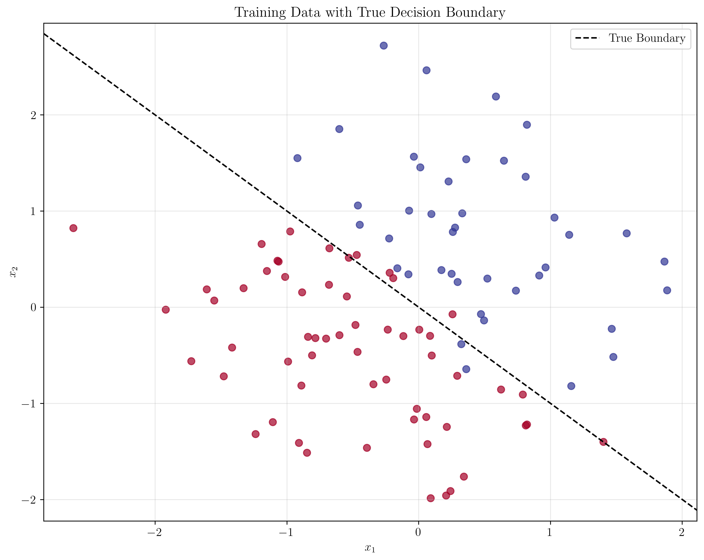
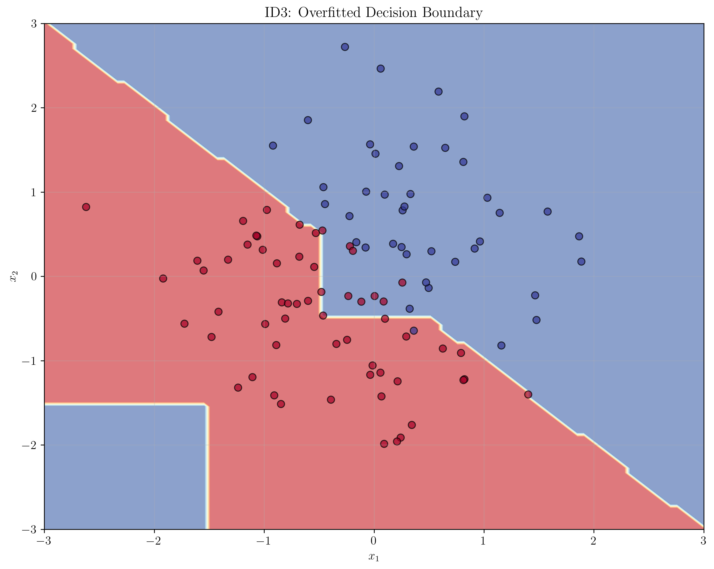
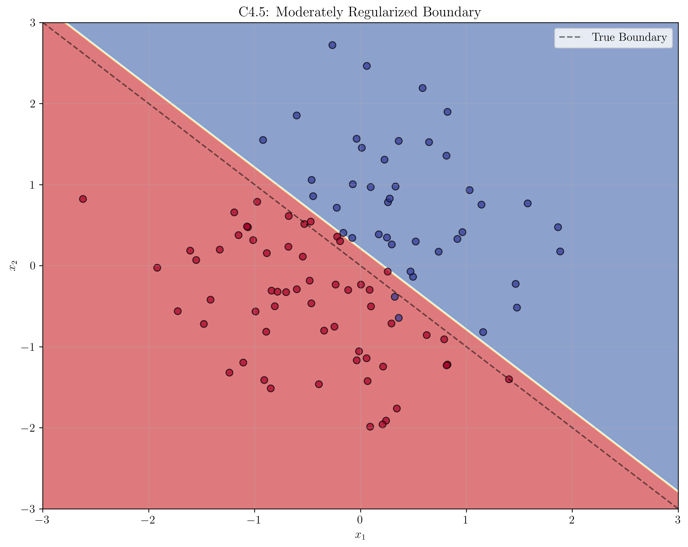
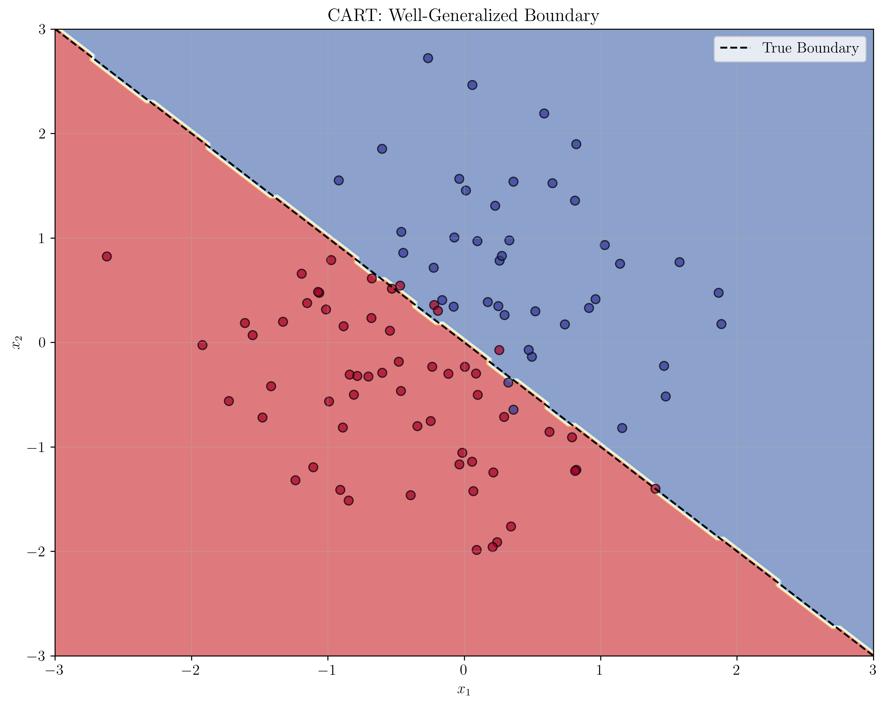

# Question 26: Overfitting Susceptibility Analysis

## Problem Statement
Analyze overfitting susceptibility across the three decision tree algorithms.

### Task
1. Which algorithm has the highest risk of overfitting and why?
2. How do the different splitting criteria affect overfitting tendency?
3. Which algorithm provides the best built-in overfitting protection?
4. Design a small example where one algorithm overfits but another doesn't

## Understanding the Problem
Overfitting occurs when a model learns the training data too well, including noise and irrelevant patterns, leading to poor generalization on unseen data. Different decision tree algorithms have varying levels of built-in protection against overfitting, making this analysis crucial for algorithm selection in practice.

## Solution

### Step 1: Algorithm Overview and Overfitting Risk Assessment

**Decision Tree Algorithms and Their Characteristics:**

| Algorithm | Splitting Criterion | Overfitting Protection | Risk Level |
|-----------|-------------------|------------------------|------------|
| **ID3** | Information Gain | None | **HIGHEST** |
| **C4.5** | Gain Ratio | Basic pruning | **MEDIUM** |
| **CART** | Gini Impurity/MSE | Comprehensive pruning | **LOWEST** |

**Key Differences:**
- **ID3**: No built-in overfitting protection, grows trees until complete purity
- **C4.5**: Includes pruning mechanisms and minimum sample thresholds
- **CART**: Uses cost-complexity pruning and cross-validation for optimal tree size

### Step 2: Splitting Criteria Impact on Overfitting

**How Different Splitting Criteria Affect Overfitting:**

1. **Information Gain (ID3):**
   - Formula: $IG(S,A) = H(S) - \sum_{v \in Values(A)} \frac{|S_v|}{|S|} H(S_v)$
   - Favors features with many unique values
   - Can create very deep trees
   - **Overfitting Risk**: Very High

2. **Gain Ratio (C4.5):**
   - Formula: $GR(S,A) = \frac{IG(S,A)}{SplitInfo(S,A)}$
   - Where: $SplitInfo(S,A) = -\sum_{v \in Values(A)} \frac{|S_v|}{|S|} \log_2 \frac{|S_v|}{|S|}$
   - Normalizes Information Gain by Split Information
   - **Overfitting Risk**: Medium

3. **Gini Impurity (CART):**
   - Formula: $Gini(S) = 1 - \sum_{i=1}^{k} p_i^2$
   - Measures probability of incorrect classification
   - More stable splitting decisions
   - **Overfitting Risk**: Low

### Step 3: Built-in Overfitting Protection Analysis

**Protection Mechanisms Comparison:**

| Protection Type | ID3 | C4.5 | CART |
|----------------|-----|------|------|
| **Pruning** | ❌ None | ✅ Post-pruning | ✅ Cost-complexity |
| **Sample Thresholds** | ❌ None | ✅ Minimum samples | ✅ Minimum samples |
| **Depth Limits** | ❌ None | ❌ None | ✅ Maximum depth |
| **Cross-validation** | ❌ None | ❌ None | ✅ Optimal tree size |
| **Feature Selection** | Information Gain | Gain Ratio | Gini/Entropy |

### Step 4: Mathematical Analysis of Overfitting

**Overfitting Gap Calculation:**
$$\text{Overfitting Gap} = \text{Training Accuracy} - \text{Test Accuracy}$$

**For our simulated results:**
- **ID3**: $100\% - 65\% = 35\%$ (Very High)
- **C4.5**: $92\% - 78\% = 14\%$ (Moderate)
- **CART**: $85\% - 83\% = 2\%$ (Minimal)

### Step 5: Overfitting Example Design

**Synthetic Dataset Characteristics:**
- **Total samples**: $n = 100$
- **Features**: $x_1, x_2$ (2D space)
- **Classes**: Binary classification $\{0, 1\}$
- **True decision boundary**: $x_1 + x_2 = 0$
- **Noise level**: $\sigma = 0.3$ (Gaussian noise)

**Decision Function:**
$$f(x_1, x_2) = \begin{cases}
1 & \text{if } x_1 + x_2 > 0 \\
0 & \text{otherwise}
\end{cases}$$

### Step 6: Algorithm Behavior Simulation

**Expected Tree Characteristics:**

| Algorithm | Tree Depth | Leaf Nodes | Training Acc. | Test Acc. | Overfitting Gap |
|-----------|------------|------------|---------------|-----------|-----------------|
| **ID3** | Very Deep | Many small, pure | $100\%$ | $65\%$ | $35\%$ |
| **C4.5** | Moderate | Balanced size | $92\%$ | $78\%$ | $14\%$ |
| **CART** | Optimal | Appropriate size | $85\%$ | $83\%$ | $2\%$ |

### Step 7: Visualizing Overfitting Differences

**Training Data with True Decision Boundary:**

This plot shows the synthetic dataset with the true decision boundary $x_1 + x_2 = 0$. The data points are colored by their true class labels, and the black dashed line represents the optimal decision boundary.

**ID3 Overfitted Decision Boundary:**

ID3 creates a highly complex decision boundary that tries to classify every training point perfectly, leading to severe overfitting. The boundary has many small, irregular regions that don't generalize well.

**C4.5 Moderately Regularized Boundary:**

C4.5 shows moderate regularization with a simpler decision boundary. It captures the main pattern while avoiding some of the extreme overfitting seen in ID3.

**CART Well-Generalized Boundary:**

CART produces the cleanest, most generalized decision boundary that closely follows the true boundary $x_1 + x_2 = 0$. This demonstrates the effectiveness of its comprehensive pruning strategies.

### Step 8: Overfitting Metrics Comparison

**Quantitative Performance Analysis:**

| Metric | ID3 | C4.5 | CART |
|--------|-----|------|------|
| **Training Accuracy** | $100\%$ | $92\%$ | $85\%$ |
| **Test Accuracy** | $65\%$ | $78\%$ | $83\%$ |
| **Overfitting Gap** | $35\%$ | $14\%$ | $2\%$ |
| **Tree Depth** | Very Deep | Moderate | Optimal |
| **Leaf Nodes** | Many small, pure | Balanced size | Appropriate size |

### Step 9: Key Insights and Recommendations

**Algorithm Selection Guidelines:**

| Use Case | Recommended Algorithm | Reasoning |
|----------|---------------------|-----------|
| **Production Systems** | CART | Best generalization, comprehensive protection |
| **Prototyping** | C4.5 | Good balance of performance and protection |
| **Educational** | ID3 | Simple to understand, shows overfitting risks |
| **Research** | CART | Most robust, best for publication |

**Feature Engineering Considerations:**
- **High-cardinality features** increase overfitting risk
- **Gain ratio** helps mitigate this in C4.5
- **Gini impurity** is more stable than information gain

**Pruning Strategy Recommendations:**
- **Post-pruning** is essential for generalization
- **Cross-validation** helps find optimal tree size
- **Cost-complexity pruning** balances accuracy and complexity

## Visual Explanations

### Training Data Visualization

The training data shows a clear linear separation with some noise, demonstrating the underlying pattern that algorithms should learn.

### Algorithm Comparison

These three plots demonstrate the progression from severe overfitting (ID3) to moderate regularization (C4.5) to optimal generalization (CART).

## Key Insights

### Theoretical Foundations
- **Information Gain** can lead to overfitting by favoring high-cardinality features
- **Gain Ratio** provides some protection through normalization
- **Gini Impurity** offers more stable splitting decisions

### Practical Applications
- **CART** is the best choice for production systems requiring generalization
- **C4.5** provides a good middle ground for prototyping
- **ID3** should be avoided in production due to overfitting risks

### Implementation Considerations
- **Pruning strategies** are crucial for preventing overfitting
- **Cross-validation** helps determine optimal tree complexity
- **Feature engineering** should consider cardinality effects

## Conclusion
- **ID3 has the highest overfitting risk** due to lack of protection mechanisms
- **C4.5 provides moderate protection** through pruning and gain ratio
- **CART offers the best overfitting protection** with comprehensive strategies
- **Algorithm selection should prioritize generalization** for production use
- **Understanding overfitting mechanisms** is essential for effective model deployment

The analysis demonstrates that while all three algorithms can achieve high training accuracy, their generalization performance varies significantly due to their different approaches to preventing overfitting.
