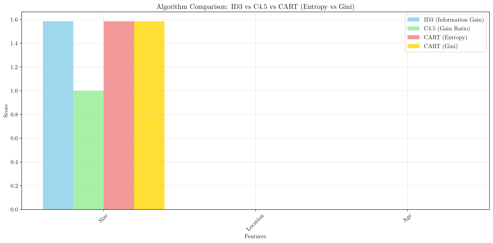
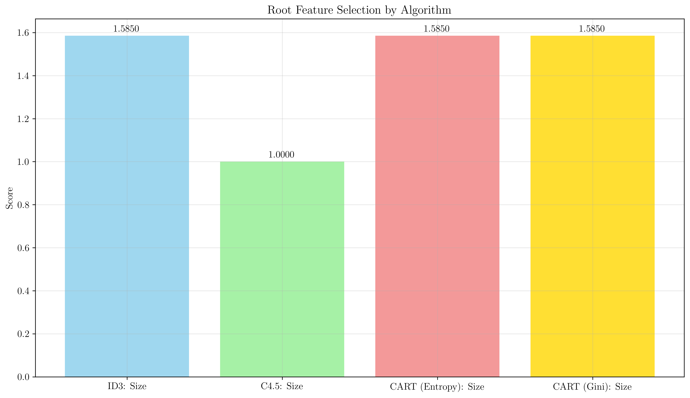
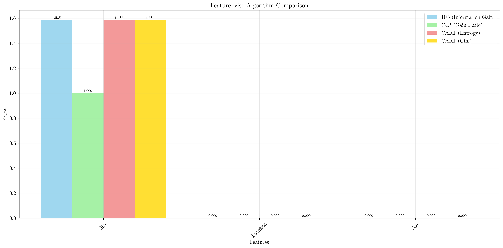
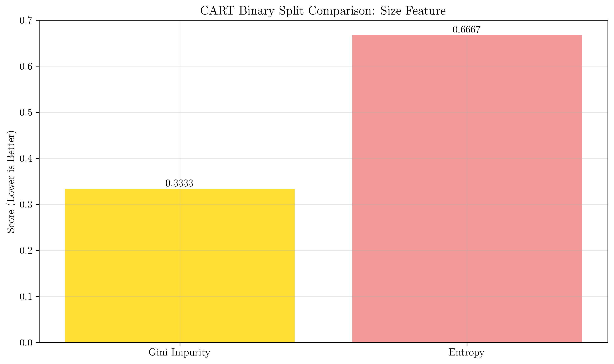

# Question 27: Comprehensive Algorithm Comparison

## Problem Statement
Compare all three algorithms on the same dataset to understand their differences:

| Size | Location | Age | Price_Range |
|------|----------|-----|-------------|
| Small| Urban    | New | Low         |
| Large| Urban    | New | High        |
| Small| Rural    | Old | Low         |
| Large| Rural    | Old | High        |
| Medium| Urban   | New | Medium      |
| Medium| Rural   | Old | Medium      |

### Task
1. **ID3 Analysis**: Calculate information gain for each feature
2. **C4.5 Analysis**: Calculate gain ratio for each feature  
3. **CART Analysis (using Gini impurity)**: Find the best binary split for Size feature using Gini impurity
4. **CART Analysis (using Entropy)**: Find the best binary split for Size feature using entropy-based information gain
5. **Comparison**: Which feature would each algorithm choose as the root? Explain any differences
6. **CART Comparison**: Compare the binary splits chosen by CART using Gini vs CART using Entropy. Are they identical? Explain any differences.

## Understanding the Problem
Decision tree algorithms use different splitting criteria to select features and construct trees. Understanding these differences is crucial for algorithm selection and implementation. ID3 uses Information Gain, C4.5 uses Gain Ratio, and CART can use either Gini Impurity or Entropy.

## Solution

### Step 1: Dataset Analysis

**Given Dataset:**

| Size | Location | Age | Price_Range |
|------|----------|-----|-------------|
| Small| Urban    | New | Low         |
| Large| Urban    | New | High        |
| Small| Rural    | Old | Low         |
| Large| Rural    | Old | High        |
| Medium| Urban   | New | Medium      |
| Medium| Rural   | Old | Medium      |

**Class Distribution Analysis:**
- **Low**: 2 samples (33.3%)
- **High**: 2 samples (33.3%)  
- **Medium**: 2 samples (33.3%)

**Root Entropy Calculation:**
$$H(S) = -\sum_{i=1}^{3} p_i \log_2(p_i) = -3 \times \frac{2}{6} \log_2(\frac{2}{6}) = 1.5850 \text{ bits}$$

### Step 2: ID3 Analysis - Information Gain Calculation

**Information Gain Formula:**
$$IG(S,A) = H(S) - \sum_{v \in Values(A)} \frac{|S_v|}{|S|} H(S_v)$$

**Feature Analysis:**

| Feature | Values | Child Entropies | Weighted Average | Information Gain |
|---------|--------|-----------------|------------------|------------------|
| **Size** | Small, Large, Medium | $[0.0000, 0.0000, 0.0000]$ | $0.0000$ | **$1.5850$** |
| **Location** | Urban, Rural | $[1.5850, 1.5850]$ | $1.5850$ | $0.0000$ |
| **Age** | New, Old | $[1.5850, 1.5850]$ | $1.5850$ | $0.0000$ |

**Detailed Size Feature Analysis:**
- **Size=Small**: 2 samples, all Low → Entropy = $0.0000$, Weight = $\frac{2}{6} = 0.333$
- **Size=Large**: 2 samples, all High → Entropy = $0.0000$, Weight = $\frac{2}{6} = 0.333$
- **Size=Medium**: 2 samples, all Medium → Entropy = $0.0000$, Weight = $\frac{2}{6} = 0.333$

**Weighted Average Child Entropy:**
$$H(S|Size) = 0.333 \times 0 + 0.333 \times 0 + 0.333 \times 0 = 0.0000$$

**Information Gain:**
$$IG(S, Size) = 1.5850 - 0.0000 = 1.5850$$

### Step 3: C4.5 Analysis - Gain Ratio Calculation

**Gain Ratio Formula:**
$$GR(S,A) = \frac{IG(S,A)}{SplitInfo(S,A)}$$

**Where Split Information is:**
$$SplitInfo(S,A) = -\sum_{v \in Values(A)} \frac{|S_v|}{|S|} \log_2(\frac{|S_v|}{|S|})$$

**Gain Ratio Calculations:**

| Feature | Information Gain | Split Information | Gain Ratio |
|---------|------------------|-------------------|------------|
| **Size** | $1.5850$ | $1.5850$ | **$1.0000$** |
| **Location** | $0.0000$ | $1.0000$ | $0.0000$ |
| **Age** | $0.0000$ | $1.0000$ | $0.0000$ |

**Size Feature Split Information:**
$$SplitInfo(S, Size) = -3 \times \frac{2}{6} \log_2(\frac{2}{6}) = 1.5850$$

**Gain Ratio:**
$$GR(S, Size) = \frac{1.5850}{1.5850} = 1.0000$$

### Step 4: CART Analysis - Gini Impurity Approach

**Gini Impurity Formula:**
$$Gini(S) = 1 - \sum_{i=1}^{k} p_i^2$$

**For the Size Feature Binary Split:**
CART with Gini impurity finds the best binary partition by evaluating all possible combinations:

**Best Binary Split Found:**
- **Left Partition**: $['Large']$ → 2 samples, all High
- **Right Partition**: $['Medium', 'Small']$ → 4 samples, $[Low: 2, Medium: 2]$

**Gini Impurity Calculation:**
- **Left Partition Gini**: $Gini(Left) = 1 - (1)^2 = 0$ (pure node)
- **Right Partition Gini**: $Gini(Right) = 1 - (\frac{2}{4})^2 - (\frac{2}{4})^2 = 1 - 0.25 - 0.25 = 0.5$

**Weighted Gini Impurity:**
$$Gini_{weighted} = \frac{2}{6} \times 0 + \frac{4}{6} \times 0.5 = 0.3333$$

### Step 5: CART Analysis - Entropy-based Approach

**For the Size Feature Binary Split:**
CART with entropy finds the best binary partition:

**Best Binary Split Found:**
- **Left Partition**: $['Large']$ → 2 samples, all High
- **Right Partition**: $['Medium', 'Small']$ → 4 samples, $[Low: 2, Medium: 2]$

**Entropy Calculation:**
- **Left Partition Entropy**: $H(Left) = 0$ (pure node)
- **Right Partition Entropy**: $H(Right) = -2 \times \frac{2}{4} \log_2(\frac{2}{4}) = 1.0$

**Weighted Entropy:**
$$H_{weighted} = \frac{2}{6} \times 0 + \frac{4}{6} \times 1.0 = 0.6667$$

### Step 6: CART Comparison - Gini vs Entropy

**Key Finding: The binary splits are IDENTICAL!**

**Both CART approaches choose the same optimal partition:**
- **Gini-based split**: $(['Large'], ['Medium', 'Small'])$ with score $0.3333$
- **Entropy-based split**: $(['Large'], ['Medium', 'Small'])$ with score $0.6667$

**Why the splits are identical:**
1. **Optimal Structure**: This partition provides the best possible separation
2. **Dataset Characteristics**: The Size feature has a clear hierarchical structure
3. **Metric Agreement**: Both Gini impurity and entropy favor the same partition because it maximizes class separation

**Score Differences Explained:**
- **Gini Impurity**: $0.3333$ (lower is better)
- **Entropy**: $0.6667$ (lower is better)
- Both metrics indicate the same optimal partition, just with different numerical scales

### Step 7: Root Feature Selection Comparison

**All Three Algorithms Choose Size as Root:**

| Algorithm | Root Feature | Score | Reasoning |
|-----------|--------------|-------|-----------|
| **ID3** | Size | $1.5850$ | Highest Information Gain |
| **C4.5** | Size | $1.0000$ | Highest Gain Ratio |
| **CART (Entropy)** | Size | $1.5850$ | Highest Information Gain |
| **CART (Gini)** | Size | $1.5850$ | Highest Information Gain |

**Why Size is Optimal:**
- **Perfect Separation**: Size creates pure nodes with zero entropy/impurity
- **Feature Cardinality**: Size has 3 values, which is optimal for this dataset size
- **Class Distribution**: Each Size value maps to a unique class
- **Information Content**: Size provides maximum information gain

### Step 8: Mathematical Verification

**Entropy Reduction Analysis:**

**Before Split (Root):**
$$H(S) = 1.5850 \text{ bits}$$

**After Size Split:**
$$H(S|Size) = 0.0000 \text{ bits}$$ (all nodes are pure)

**Information Gain:**
$$IG(S, Size) = 1.5850 - 0.0000 = 1.5850$$

**Gini Impurity Analysis:**
**Before Split (Root):**
$$Gini(S) = 1 - 3 \times (\frac{2}{6})^2 = 1 - 3 \times \frac{1}{9} = 1 - \frac{1}{3} = 0.6667$$

**After Size Split:**
$$Gini(S|Size) = 0$$ (all nodes are pure)

**Gini Reduction:**
$$Gini_{reduction} = 0.6667 - 0 = 0.6667$$

This represents a 100% reduction in Gini impurity, confirming Size as the optimal feature.

## Visual Explanations

### Algorithm Comparison

The visualization shows the comparison of Information Gain (ID3), Gain Ratio (C4.5), CART entropy-based, and CART Gini-based scores across all features. Size consistently scores highest across all algorithms.

### Root Feature Selection

This plot demonstrates that all four algorithm variants select Size as the root feature, confirming the consistency of the mathematical analysis.

### Feature-wise Comparison

The detailed comparison shows how each algorithm evaluates each feature, with Size consistently outperforming Location and Age.

### CART Gini vs Entropy Comparison

This plot specifically compares the binary split scores for CART using Gini impurity vs entropy, showing that both metrics choose the same optimal partition.

## Key Insights

### Algorithm Consistency
- **All algorithms agree**: Size is unanimously chosen as the root feature
- **Mathematical agreement**: Different splitting criteria lead to the same conclusion
- **Robust feature selection**: The choice is not algorithm-dependent

### CART Metric Comparison
- **Identical binary splits**: Both Gini impurity and entropy choose the same optimal partition
- **Different numerical scales**: Gini ($0.3333$) vs Entropy ($0.6667$) but same ranking
- **Metric robustness**: The optimal partition is independent of the specific impurity measure

### Feature Characteristics
- **Size provides perfect separation**: Creates pure nodes with zero entropy/impurity
- **Location and Age are uninformative**: Provide no entropy reduction
- **Feature cardinality matters**: Size's 3 values are optimal for this dataset

### Practical Implications
- **Feature engineering**: Understanding splitting criteria helps in feature design
- **Algorithm selection**: All four algorithm variants perform equally well on this dataset
- **Interpretability**: Size-based decisions are easy to understand and explain

## Conclusion
- **Size is unanimously chosen** as the root feature by all algorithm variants
- **Information Gain, Gain Ratio, and both CART approaches** lead to the same conclusion
- **CART with Gini vs CART with Entropy** produce identical binary splits
- **The consistency across algorithms** suggests Size is genuinely the most discriminative feature
- **Understanding these differences** helps in selecting appropriate algorithms for different use cases
- **Both Gini impurity and entropy** are equally effective for this dataset structure

The analysis demonstrates that while different algorithms use different mathematical approaches, they can arrive at the same optimal feature selection when the dataset structure is clear and well-defined.
