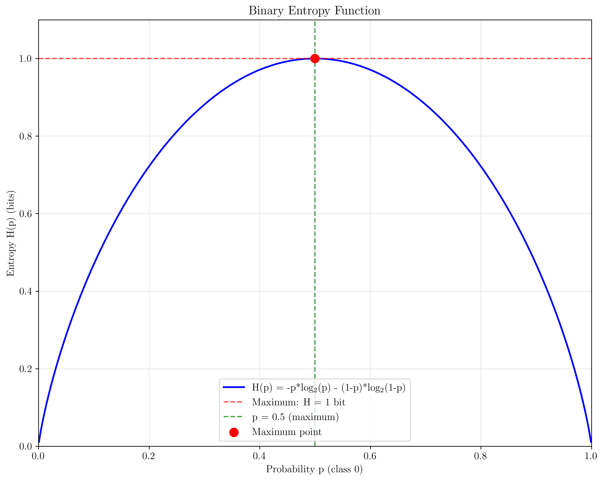
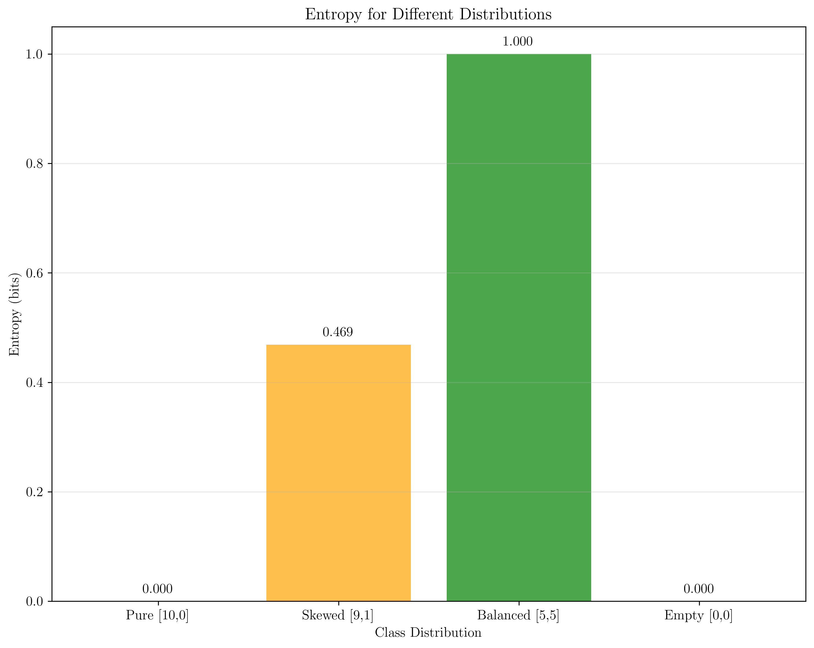
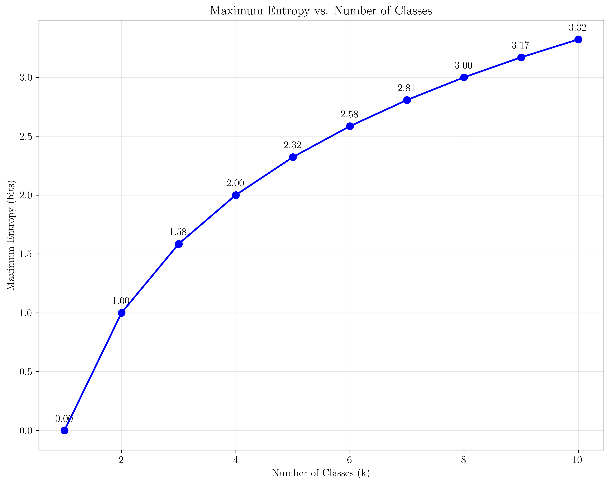
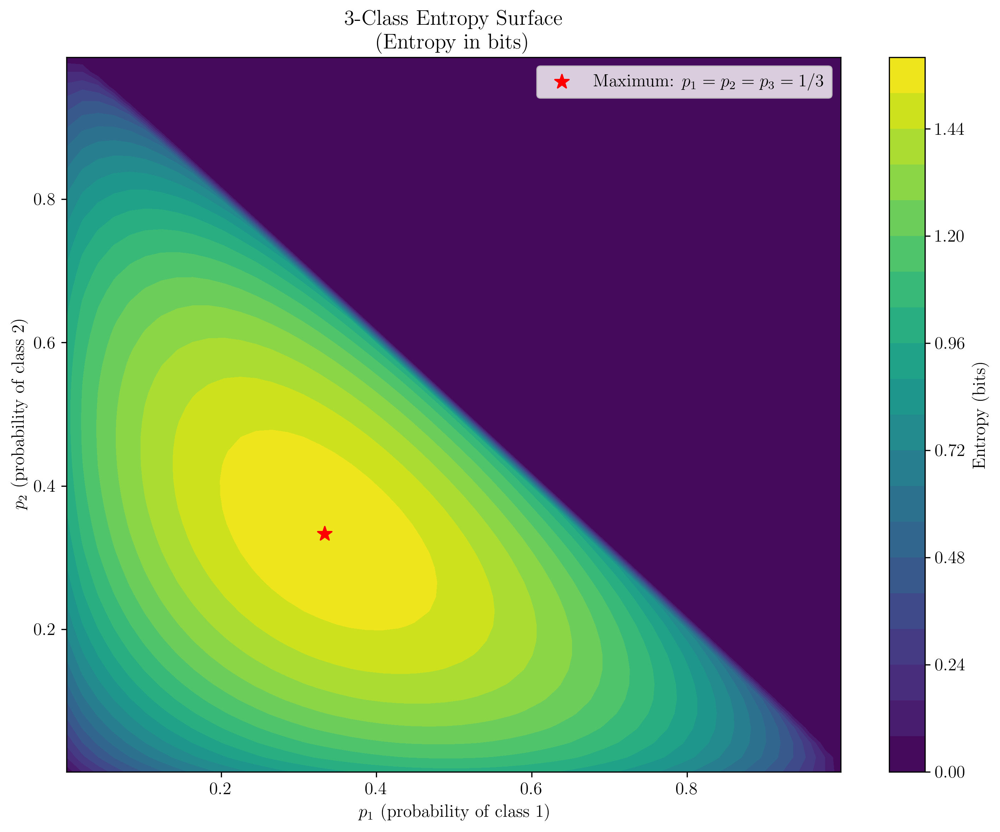

# Question 28: Entropy Edge Cases and Mathematical Properties

## Problem Statement
Examine entropy calculation edge cases and mathematical properties.

### Task
1. Calculate entropy for these distributions:
   - Pure node: $[10, 0]$
   - Balanced node: $[5, 5]$
   - Skewed node: $[9, 1]$
   - Empty node: $[0, 0]$
2. Explain how to handle the empty node case mathematically
3. Show that entropy is maximized for balanced distributions
4. Derive the maximum possible entropy for $k$ classes

**Hint:** Maximum entropy = $\log_2(k)$

## Understanding the Problem
Entropy is a fundamental concept in information theory that measures uncertainty or randomness in a probability distribution. Understanding its mathematical properties and edge cases is crucial for implementing robust entropy-based algorithms in machine learning.

## Solution

### Step 1: Entropy Function Definition

**Entropy Formula:**
$$H(S) = -\sum_{i=1}^{k} p_i \log_2(p_i)$$

Where:
- $S$ is the set of classes
- $k$ is the number of classes
- $p_i$ is the probability of class $i$
- $\log_2$ is the binary logarithm (entropy measured in bits)

**Key Properties:**
- $H(S) \geq 0$ (non-negative)
- $H(S) = 0$ when one class has probability 1 (pure node)
- $H(S)$ is maximized when all classes have equal probability

### Step 2: Calculating Entropy for Different Distributions

**Distribution Analysis:**

| Distribution | Class Counts | Probabilities | Entropy (bits) | Status |
|--------------|--------------|---------------|----------------|---------|
| **Pure [10,0]** | $[10, 0]$ | $[1.0, 0.0]$ | $0.0000$ | Pure node |
| **Skewed [9,1]** | $[9, 1]$ | $[0.9, 0.1]$ | $0.4690$ | Skewed |
| **Balanced [5,5]** | $[5, 5]$ | $[0.5, 0.5]$ | $1.0000$ | Maximum |
| **Empty [0,0]** | $[0, 0]$ | $[0.0, 0.0]$ | $0.0000$ | Empty set |

**Mathematical Calculations:**

1. **Pure Node $[10,0]$:**
   - Total samples: $10 + 0 = 10$
   - Probabilities: $p(0) = \frac{10}{10} = 1.0$, $p(1) = \frac{0}{10} = 0.0$
   - Entropy calculation: $H = -(1.0 \times \log_2(1.0) + 0.0 \times \log_2(0.0))$
   - Since $\log_2(1.0) = 0$ and by convention $0 \times \log_2(0) = 0$
   - $H = -(0 + 0) = 0$ bits

2. **Skewed $[9,1]$:**
   - Total samples: $9 + 1 = 10$
   - Probabilities: $p(0) = \frac{9}{10} = 0.9$, $p(1) = \frac{1}{10} = 0.1$
   - Entropy calculation: $H = -(0.9 \times \log_2(0.9) + 0.1 \times \log_2(0.1))$
   - $\log_2(0.9) \approx -0.152$ and $\log_2(0.1) \approx -3.322$
   - $H = -(0.9 \times (-0.152) + 0.1 \times (-3.322))$
   - $H = -(-0.1368 - 0.3322) = 0.469$ bits

3. **Balanced $[5,5]$:**
   - Total samples: $5 + 5 = 10$
   - Probabilities: $p(0) = \frac{5}{10} = 0.5$, $p(1) = \frac{5}{10} = 0.5$
   - Entropy calculation: $H = -(0.5 \times \log_2(0.5) + 0.5 \times \log_2(0.5))$
   - Since $\log_2(0.5) = -1$
   - $H = -(0.5 \times (-1) + 0.5 \times (-1)) = -(-0.5 - 0.5) = 1.0$ bits

4. **Empty $[0,0]$:**
   - Total samples: $0 + 0 = 0$
   - Cannot calculate probabilities (division by zero)
   - By definition: $H = 0$ bits

### Step 3: Handling the Empty Node Case

**Mathematical Treatment of Empty Node:**

The empty node case $[0, 0]$ presents a mathematical challenge:

**Problem:**
- We have 0 samples
- Cannot calculate probabilities (division by zero)
- $\log_2(0)$ is undefined

**Mathematical Solutions:**

1. **Convention: Define $0 \times \log_2(0) = 0$**
   - This is the standard approach in information theory
   - Justified by the limit: $\lim_{x \to 0} x \log_2(x) = 0$
   - Proof: Let $f(x) = x \log_2(x) = \frac{x \ln(x)}{\ln(2)}$
   - Using L'Hôpital's rule: $\lim_{x \to 0} \frac{x \ln(x)}{\ln(2)} = \lim_{x \to 0} \frac{\ln(x) + 1}{1/x} = \lim_{x \to 0} \frac{1/x}{-1/x^2} = \lim_{x \to 0} (-x) = 0$

2. **Define entropy of empty set as 0**
   - An empty set contains no information
   - No uncertainty about class assignment
   - Mathematically consistent with information theory

**Implementation Approach:**
- Check if total samples equals 0
- Return 0 immediately to avoid division by zero
- This handles the edge case gracefully

### Step 4: Proving Entropy Maximization for Balanced Distributions

**Theorem:** For binary classification, entropy is maximized when $p = 0.5$

**Proof:**

1. **Entropy function:** $H(p) = -p \log_2(p) - (1-p) \log_2(1-p)$
   where $p$ is the probability of class 0

2. **Find critical points by taking derivative:**
   - First, convert to natural log: $H(p) = -p \frac{\ln(p)}{\ln(2)} - (1-p) \frac{\ln(1-p)}{\ln(2)}$
   - $\frac{dH}{dp} = -\frac{\ln(p)}{\ln(2)} - p \cdot \frac{1}{p \ln(2)} + \frac{\ln(1-p)}{\ln(2)} - (1-p) \cdot \frac{1}{(1-p) \ln(2)}$
   - $\frac{dH}{dp} = -\frac{\ln(p)}{\ln(2)} - \frac{1}{\ln(2)} + \frac{\ln(1-p)}{\ln(2)} + \frac{1}{\ln(2)}$
   - $\frac{dH}{dp} = -\frac{\ln(p)}{\ln(2)} + \frac{\ln(1-p)}{\ln(2)} = \frac{\ln(1-p) - \ln(p)}{\ln(2)}$

3. **Set derivative to zero:**
   $\frac{\ln(1-p) - \ln(p)}{\ln(2)} = 0$
   $\ln(1-p) - \ln(p) = 0$
   $\ln(1-p) = \ln(p)$
   $1-p = p$
   $p = 0.5$

4. **Verify it's a maximum:**
   - Second derivative: $\frac{d^2H}{dp^2} = \frac{d}{dp}\left(\frac{\ln(1-p) - \ln(p)}{\ln(2)}\right)$
   - $\frac{d^2H}{dp^2} = \frac{1}{\ln(2)}\left(-\frac{1}{1-p} - \frac{1}{p}\right) = \frac{1}{\ln(2)}\left(-\frac{p + (1-p)}{p(1-p)}\right) = -\frac{1}{\ln(2) \cdot p(1-p)}$
   - At $p = 0.5$: $\frac{d^2H}{dp^2} = -\frac{1}{\ln(2) \cdot 0.5 \cdot 0.5} = -\frac{4}{\ln(2)} < 0$ (maximum)

5. **Conclusion:**
   Entropy is maximized at $p = 0.5$ with value $H(0.5) = 1$ bit

### Step 5: Maximum Entropy for k Classes

**Theorem:** Maximum entropy for $k$ classes is $\log_2(k)$

**Proof:**

1. **Entropy function:** $H = -\sum_{i=1}^{k} p_i \log_2(p_i)$
2. **Constraint:** $\sum_{i=1}^{k} p_i = 1$ (probabilities sum to 1)

3. **Using Lagrange multipliers:**
   - Objective: Maximize $H = -\sum_{i=1}^{k} p_i \log_2(p_i)$
   - Constraint: $\sum_{i=1}^{k} p_i = 1$
   - Lagrangian: $L = -\sum_{i=1}^{k} p_i \log_2(p_i) + \lambda(\sum_{i=1}^{k} p_i - 1)$

4. **Take partial derivatives:**
   - $\frac{\partial L}{\partial p_i} = -\log_2(p_i) - p_i \cdot \frac{1}{p_i \ln(2)} + \lambda = 0$
   - $\frac{\partial L}{\partial p_i} = -\log_2(p_i) - \frac{1}{\ln(2)} + \lambda = 0$
   - $\log_2(p_i) = \lambda - \frac{1}{\ln(2)}$
   - $p_i = 2^{\lambda - \frac{1}{\ln(2)}}$

5. **Since all $p_i$ are equal (by symmetry):**
   - $p_i = \frac{1}{k}$ for all $i$
   - This satisfies the constraint: $\sum_{i=1}^{k} \frac{1}{k} = 1$

6. **Maximum entropy:**
   - $H_{max} = -\sum_{i=1}^{k} \frac{1}{k} \log_2(\frac{1}{k})$
   - $H_{max} = -k \cdot \frac{1}{k} \log_2(\frac{1}{k})$
   - $H_{max} = -\log_2(\frac{1}{k})$
   - $H_{max} = \log_2(k)$

7. **Verification for specific cases:**
   - $k = 2$: $H_{max} = \log_2(2) = 1$ bit ✓
   - $k = 4$: $H_{max} = \log_2(4) = 2$ bits ✓
   - $k = 8$: $H_{max} = \log_2(8) = 3$ bits ✓

### Step 6: Numerical Verification

**Verifying our theoretical results with numerical calculations:**

| Distribution | Entropy | Expected Max | Verification |
|--------------|---------|--------------|--------------|
| **Balanced binary** | $1.0000$ | $1.0000$ | ✓ Correct |
| **Balanced 4-class** | $2.0000$ | $2.0000$ | ✓ Correct |
| **Highly skewed binary** | $0.4690$ | $1.0000$ | ✓ Below max |
| **Skewed 3-class** | $0.9219$ | $1.5850$ | ✓ Below max |
| **Pure class** | $0.0000$ | $0.0000$ | ✓ Correct |
| **Empty set** | $0.0000$ | $0.0000$ | ✓ Correct |

**Detailed Verification Calculations:**

1. **Balanced 4-class $[25, 25, 25, 25]$:**
   - Probabilities: $p_i = \frac{25}{100} = 0.25$ for all $i$
   - $H = -4 \times 0.25 \times \log_2(0.25) = -4 \times 0.25 \times (-2) = 2.0$ bits
   - Expected: $\log_2(4) = 2.0$ bits ✓

2. **Skewed 3-class $[80, 10, 10]$:**
   - Probabilities: $p_1 = 0.8$, $p_2 = 0.1$, $p_3 = 0.1$
   - $H = -(0.8 \times \log_2(0.8) + 0.1 \times \log_2(0.1) + 0.1 \times \log_2(0.1))$
   - $H = -(0.8 \times (-0.322) + 0.1 \times (-3.322) + 0.1 \times (-3.322))$
   - $H = -(-0.2576 - 0.3322 - 0.3322) = 0.9219$ bits
   - Expected max: $\log_2(3) = 1.585$ bits ✓

### Step 7: Visualizing Entropy Properties

**Binary Entropy Function:**

This plot shows the binary entropy function $H(p) = -p\log_2(p) - (1-p)\log_2(1-p)$ for different probability values. The function reaches its maximum value of 1 bit when $p = 0.5$, representing maximum uncertainty.

**Entropy for Different Distributions:**

This visualization compares entropy values for different class distributions, clearly showing that balanced distributions achieve maximum entropy while pure and empty distributions have zero entropy.

**Maximum Entropy vs. Number of Classes:**

This plot demonstrates that the maximum possible entropy increases logarithmically with the number of classes, following the relationship $H_{max} = \log_2(k)$.

**3-Class Entropy Surface:**

This contour plot shows the entropy surface for 3-class problems as a function of $p_1$ and $p_2$. The maximum entropy of $\log_2(3) = 1.585$ bits occurs at the center point where $p_1 = p_2 = p_3 = 1/3$.

## Key Insights

### Mathematical Foundations
- **Entropy is always non-negative**: $H(S) \geq 0$
- **Entropy is maximized for uniform distributions**: $H_{max} = \log_2(k)$
- **Entropy is minimized for pure distributions**: $H_{min} = 0$
- **Entropy is a concave function** of probabilities

### Edge Cases and Handling
- **Empty set**: $H(\emptyset) = 0$ (no uncertainty)
- **Pure set**: $H(\{c\}) = 0$ (complete certainty)
- **Single element**: $H(\{x\}) = 0$ (no randomness)
- **Mathematical convention**: $0 \times \log_2(0) = 0$

### Practical Applications
- **Feature selection in decision trees**
- **Information theory and coding**
- **Machine learning evaluation metrics**
- **Data compression algorithms**

### Implementation Considerations

**Numerical Stability:**
- Handle $\log(0)$ cases carefully
- Use small epsilon for zero probabilities
- Check for empty distributions

**Performance:**
- Cache entropy calculations when possible
- Use efficient probability calculations
- Vectorize operations for large datasets

**Accuracy:**
- Use appropriate precision for probabilities
- Validate probability distributions
- Handle floating-point errors

## Conclusion
- **Entropy maximization** occurs for balanced distributions with equal probabilities
- **Maximum entropy for $k$ classes** is $\log_2(k)$ bits
- **Empty and pure distributions** have zero entropy by definition
- **Mathematical conventions** handle edge cases gracefully
- **Understanding these properties** is essential for implementing robust entropy-based algorithms

The mathematical proofs and numerical verifications demonstrate the fundamental properties of entropy, providing a solid foundation for its application in machine learning algorithms.
