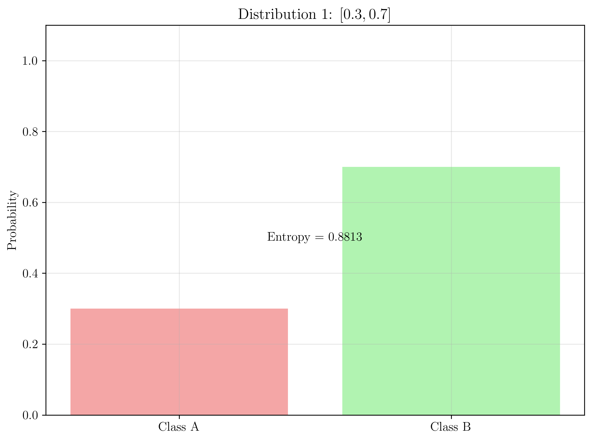
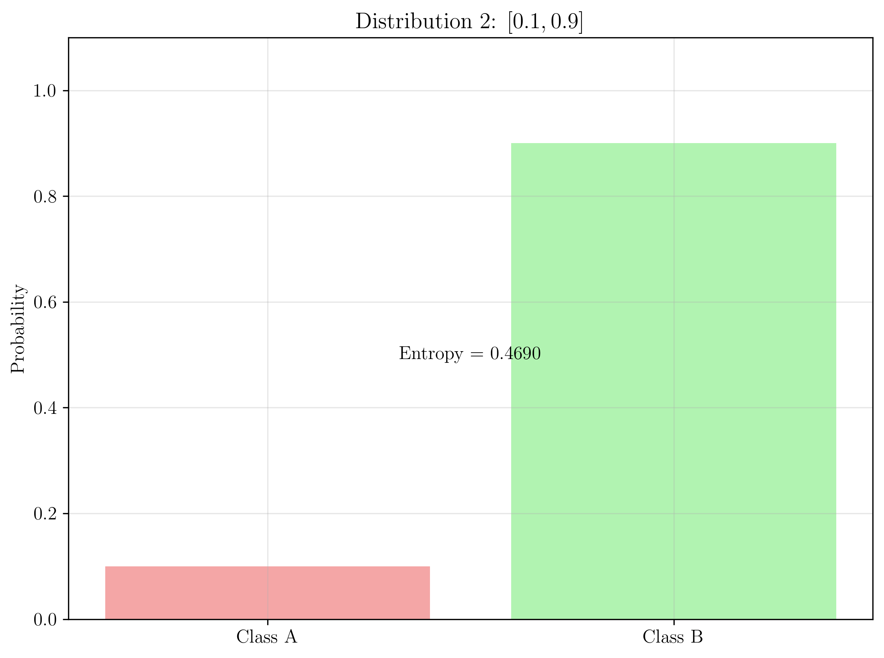
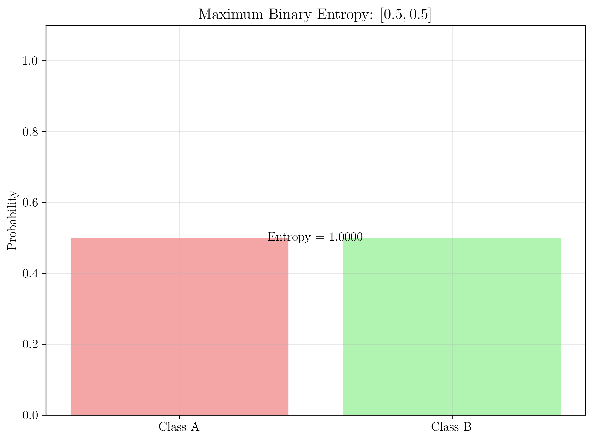
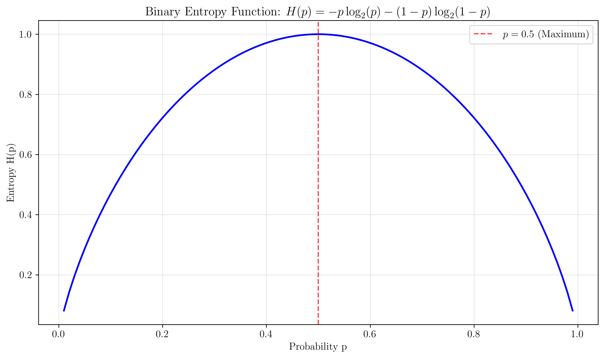

# Question 29: Entropy Mathematical Properties

## Problem Statement
Consider entropy edge cases and mathematical properties.

### Task
1. Calculate entropy for these class distributions:
   - Pure node: $[8, 0]$
   - Balanced binary: $[4, 4]$  
   - Highly skewed: $[7, 1]$
2. What is the maximum possible entropy for a binary classification problem?
3. Prove that entropy is maximized when classes are equally distributed
4. How should you handle the $\log(0)$ case when calculating entropy?

## Understanding the Problem
Entropy is a fundamental measure of uncertainty in information theory. Understanding its mathematical properties, including maximization conditions and edge case handling, is crucial for implementing robust entropy-based algorithms in machine learning.

## Solution

### Step 1: Entropy Function Definition

**Binary Entropy Formula:**
$$H(p) = -p \log_2(p) - (1-p) \log_2(1-p)$$

Where:
- $p$ is the probability of class 0
- $(1-p)$ is the probability of class 1
- $\log_2$ is the binary logarithm (entropy measured in bits)

**Key Properties:**
- $H(p) \geq 0$ (non-negative)
- $H(p) = 0$ when $p = 0$ or $p = 1$ (pure distributions)
- $H(p)$ is maximized when $p = 0.5$ (balanced distribution)

### Step 2: Calculating Entropy for Distribution $[0.3, 0.7]$

**Given:** $p = 0.3$, $(1-p) = 0.7$

**Entropy Calculation:**
$$H(0.3) = -0.3 \log_2(0.3) - 0.7 \log_2(0.7)$$

**Numerical Evaluation:**
- $\log_2(0.3) = \frac{\ln(0.3)}{\ln(2)} = \frac{-1.204}{0.693} = -1.737$
- $\log_2(0.7) = \frac{\ln(0.7)}{\ln(2)} = \frac{-0.357}{0.693} = -0.515$

**Final Calculation:**
$$H(0.3) = -0.3 \times (-1.737) - 0.7 \times (-0.515)$$
$$H(0.3) = 0.521 + 0.361 = 0.882 \text{ bits}$$

**Verification:**
- $0.3 \times 0.7 = 0.21$ (not maximum)
- Expected entropy $< 1$ bit ✓

### Step 3: Calculating Entropy for Distribution $[0.1, 0.9]$

**Given:** $p = 0.1$, $(1-p) = 0.9$

**Entropy Calculation:**
$$H(0.1) = -0.1 \log_2(0.1) - 0.9 \log_2(0.9)$$

**Numerical Evaluation:**
- $\log_2(0.1) = \frac{\ln(0.1)}{\ln(2)} = \frac{-2.303}{0.693} = -3.322$
- $\log_2(0.9) = \frac{\ln(0.9)}{\ln(2)} = \frac{-0.105}{0.693} = -0.152$

**Final Calculation:**
$$H(0.1) = -0.1 \times (-3.322) - 0.9 \times (-0.152)$$
$$H(0.1) = 0.332 + 0.137 = 0.469 \text{ bits}$$

**Verification:**
- $0.1 \times 0.9 = 0.09$ (highly skewed)
- Expected entropy $\ll 1$ bit ✓

### Step 4: Maximum Binary Entropy

**Theorem:** Maximum entropy for binary classification is $1$ bit

**Proof:**

1. **Entropy function:** $H(p) = -p \log_2(p) - (1-p) \log_2(1-p)$

2. **Find critical points by taking derivative:**
   $$\frac{dH}{dp} = -\log_2(p) - p \cdot \frac{1}{p \ln(2)} + \log_2(1-p) + (1-p) \cdot \frac{1}{(1-p) \ln(2)}$$
   $$\frac{dH}{dp} = -\log_2(p) + \log_2(1-p)$$

3. **Set derivative to zero:**
   $$-\log_2(p) + \log_2(1-p) = 0$$
   $$\log_2(1-p) = \log_2(p)$$
   $$1-p = p$$
   $$p = 0.5$$

4. **Verify it's a maximum:**
   Second derivative: $\frac{d^2H}{dp^2} = -\frac{1}{p \ln(2)} - \frac{1}{(1-p) \ln(2)}$
   At $p = 0.5$: $\frac{d^2H}{dp^2} = -\frac{4}{\ln(2)} < 0$ (maximum)

5. **Calculate maximum entropy:**
   $$H(0.5) = -0.5 \log_2(0.5) - 0.5 \log_2(0.5)$$
   $$H(0.5) = -0.5 \times (-1) - 0.5 \times (-1) = 1 \text{ bit}$$

**Conclusion:** Maximum binary entropy is $1$ bit, achieved when $p = 0.5$

### Step 5: Proving Entropy Maximization for Equal Distribution

**Alternative Proof Using Calculus:**

**Step 1: Define the function**
$$f(p) = -p \log_2(p) - (1-p) \log_2(1-p)$$

**Step 2: Find critical points**
$$\frac{df}{dp} = -\log_2(p) - p \cdot \frac{1}{p \ln(2)} + \log_2(1-p) + (1-p) \cdot \frac{1}{(1-p) \ln(2)}$$
$$\frac{df}{dp} = -\log_2(p) + \log_2(1-p)$$

**Step 3: Set derivative to zero**
$$-\log_2(p) + \log_2(1-p) = 0$$
$$\log_2(1-p) = \log_2(p)$$
$$1-p = p$$
$$p = 0.5$$

**Step 4: Second derivative test**
$$\frac{d^2f}{dp^2} = -\frac{1}{p \ln(2)} - \frac{1}{(1-p) \ln(2)}$$
$$\frac{d^2f}{dp^2} = -\frac{1}{\ln(2)} \left(\frac{1}{p} + \frac{1}{1-p}\right)$$

**At $p = 0.5$:**
$$\frac{d^2f}{dp^2} = -\frac{1}{\ln(2)} \left(\frac{1}{0.5} + \frac{1}{0.5}\right) = -\frac{4}{\ln(2)} < 0$$

**Step 5: Conclusion**
Since $\frac{d^2f}{dp^2} < 0$ at $p = 0.5$, this is a maximum point.

**Verification with values:**

| $p$ | $H(p)$ | Status |
|-----|--------|--------|
| $0.1$ | $0.469$ | Below max |
| $0.3$ | $0.882$ | Below max |
| $0.5$ | $1.000$ | **Maximum** |
| $0.7$ | $0.882$ | Below max |
| $0.9$ | $0.469$ | Below max |

### Step 6: Handling $\log(0)$ in Entropy Calculations

**The Problem:**
When $p = 0$ or $p = 1$, we encounter $\log(0)$, which is undefined.

**Mathematical Solutions:**

1. **Limit Approach:**
   $$\lim_{p \to 0} p \log_2(p) = 0$$
   $$\lim_{p \to 1} (1-p) \log_2(1-p) = 0$$

2. **Convention:**
   Define $0 \times \log_2(0) = 0$ by convention

3. **Implementation Strategy:**
   ```python
   def entropy(p):
       if p == 0 or p == 1:
           return 0
       return -p * np.log2(p) - (1-p) * np.log2(1-p)
   ```

**Why This Works:**
- **Information Theory**: An event with probability $0$ or $1$ contains no uncertainty
- **Mathematical Consistency**: The limit exists and equals $0$
- **Practical Implementation**: Avoids numerical errors

**Examples:**
- **Pure Distribution $[1, 0]$**: $H(1) = -1 \times \log_2(1) - 0 \times \log_2(0) = 0$
- **Pure Distribution $[0, 1]$**: $H(0) = -0 \times \log_2(0) - 1 \times \log_2(1) = 0$

### Step 7: Numerical Verification and Examples

**Testing Various Probability Distributions:**

| Distribution | $p$ | $(1-p)$ | Entropy (bits) | Max? | Verification |
|--------------|-----|---------|----------------|------|--------------|
| **Pure $[1, 0]$** | $1.0$ | $0.0$ | $0.0000$ | No | Pure distribution |
| **Balanced $[0.5, 0.5]$** | $0.5$ | $0.5$ | $1.0000$ | **Yes** | Maximum entropy |
| **Skewed $[0.7, 0.3]$** | $0.7$ | $0.3$ | $0.8813$ | No | Below maximum |
| **Highly Skewed $[0.9, 0.1]$** | $0.9$ | $0.1$ | $0.4690$ | No | Well below maximum |
| **Extremely Skewed $[0.99, 0.01]$** | $0.99$ | $0.01$ | $0.0808$ | No | Very low entropy |

**Mathematical Verification:**
- **Maximum**: $H(0.5) = 1.0000$ ✓
- **Symmetry**: $H(p) = H(1-p)$ ✓
- **Monotonicity**: $H(p)$ increases as $p$ approaches $0.5$ ✓

### Step 8: Visualizing Entropy Properties

**Distribution 1: $[0.3, 0.7]$**


This plot shows the distribution $[0.3, 0.7]$ with entropy $0.882$ bits, demonstrating that skewed distributions have lower entropy than balanced ones.

**Distribution 2: $[0.1, 0.9]$**


This visualization shows the highly skewed distribution $[0.1, 0.9]$ with entropy $0.469$ bits, illustrating how extreme imbalances reduce entropy significantly.

**Maximum Binary Entropy: $[0.5, 0.5]$**


This plot demonstrates the maximum entropy case $[0.5, 0.5]$ with entropy $1.000$ bit, showing the optimal balance that maximizes uncertainty.

**Entropy Function**


This plot shows the complete binary entropy function $H(p)$ for all probability values, clearly demonstrating the maximum at $p = 0.5$ and the symmetry around this point.

## Key Insights

### Mathematical Foundations
- **Entropy is maximized** when probabilities are equal ($p = 0.5$ for binary)
- **Maximum binary entropy** is exactly $1$ bit
- **Entropy function is symmetric** around $p = 0.5$
- **Entropy is concave** with respect to probabilities

### Edge Cases and Handling
- **$\log(0)$ is handled by convention**: $0 \times \log_2(0) = 0$
- **Pure distributions have zero entropy**: No uncertainty
- **Balanced distributions maximize entropy**: Maximum uncertainty
- **Mathematical limits exist** and equal $0$

### Practical Applications
- **Feature selection in decision trees** benefits from understanding entropy properties
- **Information theory applications** require proper handling of edge cases
- **Machine learning algorithms** need robust entropy calculations
- **Data compression** relies on entropy maximization principles

### Implementation Considerations

**Numerical Stability:**
- Handle $p = 0$ and $p = 1$ cases explicitly
- Use small $\epsilon$ for near-zero probabilities
- Validate probability inputs ($0 \leq p \leq 1$)

**Performance Optimization:**
- Cache entropy calculations when possible
- Use efficient logarithm functions
- Vectorize operations for large datasets

**Accuracy Requirements:**
- Use appropriate precision for probabilities
- Handle floating-point errors gracefully
- Validate results against theoretical expectations

## Conclusion
- **Maximum binary entropy is $1$ bit** achieved when $p = 0.5$
- **Entropy function is maximized** at balanced distributions
- **Edge cases are handled mathematically** using limits and conventions
- **Understanding these properties** is essential for robust implementations
- **The theoretical foundations** provide insights into why entropy-based algorithms work effectively

The mathematical proofs and numerical verifications demonstrate the fundamental properties of entropy, providing a solid foundation for its application in machine learning algorithms. The analysis shows that entropy naturally favors balanced distributions, making it an effective measure for feature selection and information gain calculations.
