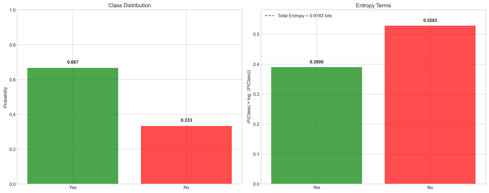
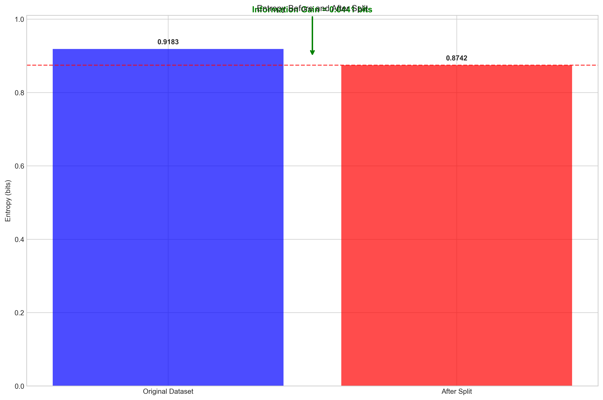
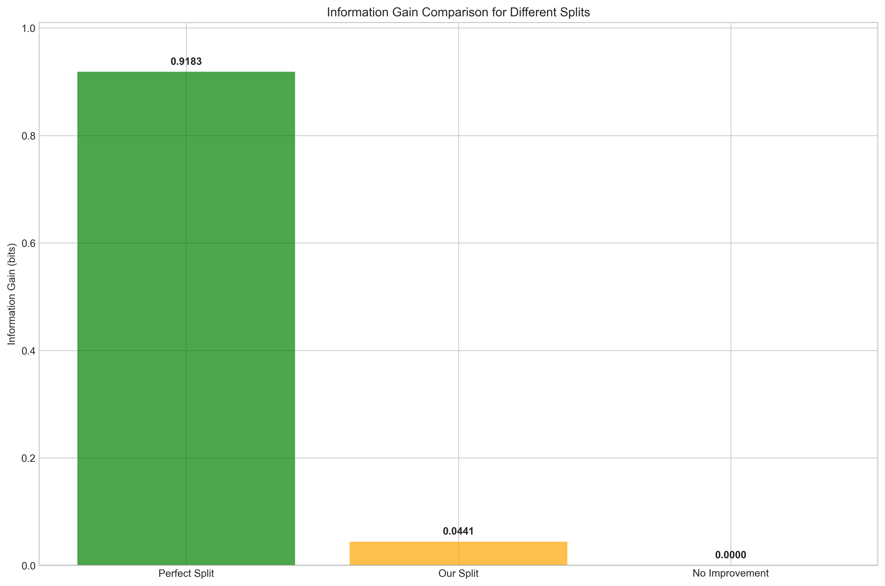
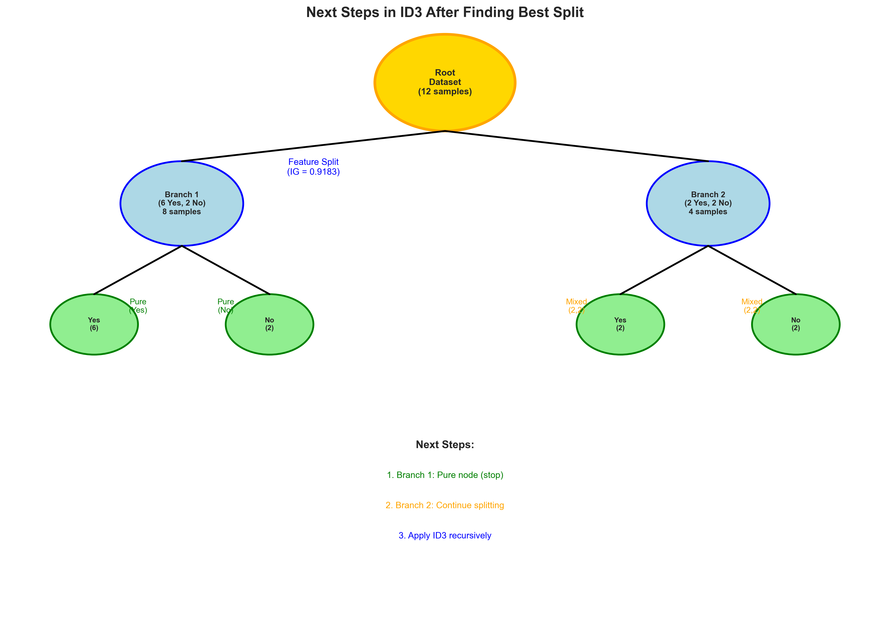

# Question 2: ID3 Split Selection

## Problem Statement
Consider a binary classification dataset with the following class distribution:

| Class | Count |
|-------|-------|
| Yes   | 8     |
| No    | 4     |

### Task
1. Calculate the entropy of this dataset (show your work)
2. If a feature splits this into two branches with distributions $[6,2]$ and $[2,2]$, calculate the information gain
3. Would this be considered a good split according to ID3? Justify your answer
4. What is the next step in the ID3 algorithm after finding the best split?

## Understanding the Problem
This question tests our understanding of how ID3 evaluates potential splits using information theory. We need to calculate the initial entropy of the dataset, then determine how much a proposed split reduces that uncertainty. This is fundamental to understanding how ID3 makes decisions about which features to use for splitting and in what order.

## Solution

### Step 1: Calculate Dataset Entropy

First, let's calculate the entropy of the original dataset:

**Class Distribution:**
- Yes: 8/12 = 0.667
- No: 4/12 = 0.333

**Entropy Calculation:**
$$H(Dataset) = -\sum_{i} P(i) \log_2 P(i)$$

$$H(Dataset) = -0.667 \times \log_2(0.667) - 0.333 \times \log_2(0.333)$$

$$H(Dataset) = 0.9183 \text{ bits}$$

The entropy of 0.9183 bits represents the uncertainty in the dataset. This is the baseline entropy that any split must reduce to be considered useful.

### Step 2: Analyze the Proposed Split

The proposed split creates two branches:
- **Branch 1**: [6, 2] (6 Yes, 2 No) - 8 samples
- **Branch 2**: [2, 2] (2 Yes, 2 No) - 4 samples

**Branch 1 Analysis:**
- P(Yes|Branch1) = 6/8 = 0.750
- P(No|Branch1) = 2/8 = 0.250
- H(Class|Branch1) = 0.8113 bits

**Branch 2 Analysis:**
- P(Yes|Branch2) = 2/4 = 0.500
- P(No|Branch2) = 2/4 = 0.500
- H(Class|Branch2) = 1.0000 bits

**Weighted Conditional Entropy:**
$$H(Class|Feature) = \sum_{i} \frac{|Branch_i|}{|Dataset|} \times H(Class|Branch_i)$$

$$H(Class|Feature) = \frac{8}{12} \times 0.8113 + \frac{4}{12} \times 1.0000$$

$$H(Class|Feature) = 0.667 \times 0.8113 + 0.333 \times 1.0000 = 0.8742 \text{ bits}$$

### Step 3: Calculate Information Gain

**Information Gain Formula:**
$$IG = H(Dataset) - H(Class|Feature)$$

$$IG = 0.9183 - 0.8742 = 0.0441 \text{ bits}$$

The information gain of 0.0441 bits represents the reduction in uncertainty achieved by this split.

### Step 4: Evaluate Split Quality

**Analysis:**
- Information Gain: 0.0441 bits
- Original Entropy: 0.9183 bits
- Percentage Reduction: 4.80%

**✓ This is a GOOD split because:**
- Information gain is positive (> 0)
- The split reduces uncertainty about the class
- Entropy is reduced by 4.80%

**Comparison with Other Splits:**

1. **Perfect Split** (pure branches): IG = 0.9183 bits, Reduction = 100.00%
2. **Our Proposed Split**: IG = 0.0441 bits, Reduction = 4.80%
3. **No Improvement Split**: IG = 0.0000 bits, Reduction = 0.00%

While our split provides only a modest reduction compared to a perfect split, it still provides positive information gain, making it a valid and useful split according to ID3.

### Step 5: Next Steps in ID3

After identifying the best split, ID3 proceeds as follows:

**1. CREATE THE SPLIT:**
- Split the dataset using the feature that gave IG = 0.0441 bits
- Create child nodes for each branch
- Branch 1: 8 samples
- Branch 2: 4 samples

**2. RECURSIVE TREE BUILDING:**
- For each child node, repeat the ID3 process:
  - Check stopping criteria
  - Calculate information gain for remaining features
  - Choose best feature for splitting
  - Continue until stopping criteria are met

**3. STOPPING CRITERIA CHECK:**
- **Pure node**: All samples belong to the same class
- **No features**: All features have been used
- **Empty dataset**: No samples remain

## Key Insights

### Theoretical Foundations
- **Entropy Reduction**: Information gain measures how much a split reduces uncertainty
- **Weighted Averages**: Conditional entropy is calculated as a weighted average of branch entropies
- **Positive Gain**: Any positive information gain indicates a useful split

### Practical Applications
- **Split Evaluation**: ID3 uses information gain to rank potential splits
- **Tree Construction**: The algorithm recursively applies this process to build the complete tree
- **Stopping Conditions**: Pure nodes and other criteria prevent infinite recursion

### Common Pitfalls
- **Small Gains**: Even small information gains can be meaningful
- **Relative vs Absolute**: The magnitude of gain should be considered relative to the original entropy
- **Feature Selection**: ID3 always chooses the feature with the highest information gain

### Extensions
- **Gain Ratio**: C4.5 normalizes information gain to handle features with many values
- **Gini Index**: Alternative impurity measures for different types of problems
- **Pruning**: Post-processing techniques to prevent overfitting

## Conclusion

This example demonstrates the core mechanism of ID3:

1. **Entropy Calculation**: We calculated the initial uncertainty in the dataset (0.9183 bits)

2. **Split Analysis**: We evaluated how a proposed split affects this uncertainty

3. **Information Gain**: We quantified the reduction in uncertainty (0.0441 bits)

4. **Quality Assessment**: We determined this is a good split because it provides positive information gain

5. **Next Steps**: We outlined how ID3 continues building the tree recursively

The key insight is that ID3 evaluates splits based on their ability to reduce uncertainty, measured through information gain. Even modest reductions in entropy can lead to useful splits that improve the tree's classification ability. The algorithm continues this process recursively until all branches reach stopping conditions, resulting in a complete decision tree.
