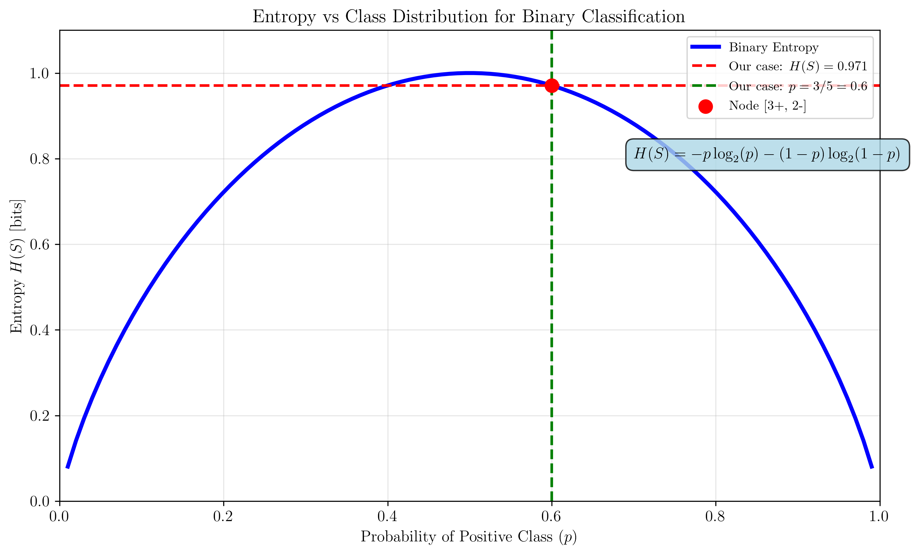
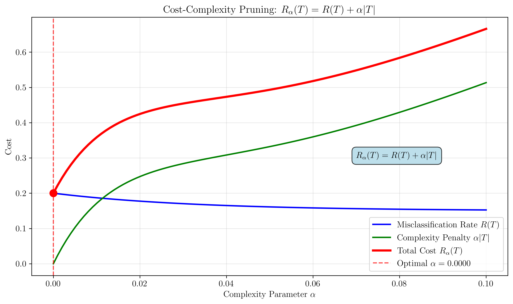

# Question 30: Algorithm Stopping Criteria

## Problem Statement
Analyze stopping criteria across algorithms.

### Task
1. List three stopping criteria used by ID3
2. What additional stopping criterion does C4.5 add beyond ID3's criteria?
3. Name two stopping criteria specific to CART
4. For a node with $5$ samples ($3$ positive, $2$ negative), should ID3 continue splitting? Consider minimum samples and purity thresholds

## Mathematical Foundations

### Entropy and Information Theory

**Binary Entropy Function:**
For a binary classification problem with probability $p$ of the positive class:
$$H(S) = -p \log_2(p) - (1-p) \log_2(1-p)$$

**Properties:**
- **Maximum**: $H(S) = 1$ when $p = 0.5$ (perfectly balanced)
- **Minimum**: $H(S) = 0$ when $p = 0$ or $p = 1$ (pure node)
- **Symmetry**: $H(p) = H(1-p)$

**For our case [3+, 2-]:**
- $p = \frac{3}{5} = 0.6$
- $H(S) = -0.6 \log_2(0.6) - 0.4 \log_2(0.4) = 0.971$ bits

### Information Gain

**Information Gain Formula:**
$$IG(S, A) = H(S) - \sum_{v \in \text{Values}(A)} \frac{|S_v|}{|S|} H(S_v)$$

Where:
- $S$ = current node samples
- $A$ = attribute being considered
- $S_v$ = samples with attribute value $v$
- $|S_v|$ = number of samples with attribute value $v$

**Threshold Decision:**
Split if $IG(S, A) > \text{min\_gain}$

### Gini Impurity (CART)

**Gini Impurity Formula:**
$$Gini(S) = 1 - \sum_{i=1}^{k} p_i^2$$

**For binary classification:**
$$Gini(S) = 2p(1-p)$$

**Gini Decrease:**
$$\Delta Gini = Gini(S) - \sum_{v \in \text{Values}(A)} \frac{|S_v|}{|S|} Gini(S_v)$$

### Cost-Complexity Pruning

**Cost-Complexity Function:**
$$R_\alpha(T) = R(T) + \alpha|T|$$

**Optimal Tree Selection:**
$$T^* = \arg\min_{T} R_\alpha(T)$$

**Cross-Validation Objective:**
$$\alpha^* = \arg\min_{\alpha} \frac{1}{k} \sum_{i=1}^{k} CV\_error_i(\alpha)$$

## Understanding the Problem
Decision tree algorithms use different stopping criteria to determine when to stop growing the tree. These criteria balance between model complexity and generalization performance, preventing overfitting while maintaining predictive accuracy.

## Solution

The analysis involves examining the mathematical foundations of stopping criteria for three decision tree algorithms (ID3, C4.5, and CART) and applying these criteria to a specific node case.

### Step 1: ID3 Stopping Criteria Analysis

**ID3 (Iterative Dichotomiser 3) uses the following stopping criteria:**

| Criterion | Description | Mathematical Condition |
|-----------|-------------|----------------------|
| **1. Pure Node** | All samples belong to the same class | $H(S) = 0$ |
| **2. Feature Exhaustion** | No more attributes available | $A = \emptyset$ |
| **3. Empty Attribute List** | List of available attributes is empty | $|A| = 0$ |

**Mathematical Analysis:**
- **Pure Node**: $H(S) = -\sum_{i=1}^{k} p_i \log_2(p_i) = 0$ when $p_i = 1$ for some $i$
- **Feature Exhaustion**: $|A| = 0$ (cardinality of attribute set is zero)
- **No Regularization**: ID3 grows trees until these basic criteria are met

### Step 2: C4.5 Additional Stopping Criterion

**C4.5 includes all of ID3's stopping criteria PLUS additional ones:**

| Additional Criterion | Description | Mathematical Formulation |
|---------------------|-------------|-------------------------|
| **4. Minimum Sample Threshold** | Stop if node contains fewer than minimum samples | $|D| < \text{min\_samples}$ |
| **5. Maximum Depth Limit** | Stop if tree reaches maximum allowed depth | $\text{depth} \geq \text{max\_depth}$ |
| **6. Information Gain Threshold** | Stop if best information gain is below threshold | $\max IG(S,A) < \text{min\_gain}$ |

**Mathematical Benefits:**
- **Sample Threshold**: Ensures statistical significance of splits
- **Depth Limit**: Controls model complexity to $O(2^{\text{max\_depth}})$
- **Gain Threshold**: Prevents splits with minimal information gain

### Step 3: CART-Specific Stopping Criteria

**CART (Classification and Regression Trees) has its own stopping criteria:**

| Criterion | Description | Mathematical Formulation |
|-----------|-------------|-------------------------|
| **1. Minimum Impurity Decrease** | Stop if impurity decrease is below threshold | $\Delta \text{Gini} < \text{min\_impurity\_decrease}$ |
| **2. Cost-Complexity Pruning** | Grow full tree, then prune using parameter α | $R_\alpha(T) = R(T) + \alpha \cdot \text{size}(T)$ |
| **3. Cross-Validation** | Use CV to find optimal tree size | $\alpha^* = \arg\min_{\alpha} CV\_error(\alpha)$ |

**Cost-Complexity Function:**
$$R_\alpha(T) = R(T) + \alpha|T|$$

Where:
- $R(T)$ = misclassification rate of tree $T$
- $|T|$ = number of leaves in tree $T$
- $\alpha$ = complexity parameter

### Step 4: Analyzing the Specific Node Case

**Given:** Node with 5 samples (3 positive, 2 negative)

**Analysis for ID3:**

| Criterion | Check | Result | Decision |
|-----------|-------|--------|----------|
| **Pure Node** | $[3+, 2-]$ | ❌ Not pure | Continue |
| **Feature Availability** | Features available | ✅ Yes | Continue |
| **Attribute List** | Attributes available | ✅ Yes | Continue |
| **Final Decision** | All criteria FALSE | **CONTINUE SPLITTING** | ✅ |

**Mathematical Verification:**
- **Entropy**: $H(S) = -\frac{3}{5}\log_2(\frac{3}{5}) - \frac{2}{5}\log_2(\frac{2}{5}) = 0.971$ bits
- **Not Pure**: $H(S) > 0$ (mixed classes)
- **Features Available**: $|A| > 0$
- **ID3 Decision**: Continue splitting

**Analysis for C4.5:**

| Additional Check | Condition | Result | Decision |
|-----------------|-----------|--------|----------|
| **Min Sample Threshold** | $5 \geq \text{min\_samples}$ | ✅ Continue | Continue |
| **Max Depth** | Current depth < max_depth | ✅ Continue | Continue |
| **Min Gain** | Best IG > min_gain | ✅ Continue | Continue |

**Analysis for CART:**
- **Basic Criteria**: Same as ID3 (continue)
- **CART Approach**: Continue growing, then apply pruning
- **Final Tree**: Use cross-validation to determine optimal size

## Visual Explanations

### ID3 Decision Tree Growth Process

This visualization shows how ID3 would grow a decision tree starting from our node $[3+, 2-]$. The algorithm continues splitting because:
- **Root node is not pure**: $H(S) = 0.971 > 0$
- **Features are available**: $|A| > 0$
- **Splitting creates meaningful partitions**: Information gain > 0

### Entropy vs Class Distribution

The entropy curve shows that our node $[3+, 2-]$ with $p = \frac{3}{5} = 0.6$ has entropy $H(S) = 0.971$ bits, which is:
- **Maximum entropy**: $H(S) = 1.0$ when $p = 0.5$ (perfectly balanced)
- **Our case**: $H(S) = 0.971$ when $p = 0.6$ (slightly imbalanced)
- **Decision**: Since $H(S) > 0$, the node is not pure and should continue splitting

### Algorithm Comparison Chart

This chart compares the three algorithms across key dimensions:
- **Stopping Criteria**: ID3 (3), C4.5 (6), CART (3)
- **Overfitting Risk**: ID3 (HIGH), C4.5 (MEDIUM), CART (LOW)
- **Complexity**: ID3 (Simple), C4.5 (Moderate), CART (Sophisticated)

### Stopping Criteria Decision Flow

The decision flow diagram shows the complete evaluation process for our node $[3+, 2-]$:
1. **ID3 Criteria**: All evaluate to FALSE → Continue
2. **C4.5 Additional**: All evaluate to FALSE → Continue  
3. **CART Approach**: Continue growing, then prune
4. **Final Decision**: **CONTINUE SPLITTING** ✅

### Cost-Complexity Pruning (CART)

CART's sophisticated approach uses the cost-complexity function:
$$R_\alpha(T) = R(T) + \alpha|T|$$

The optimal $\alpha^*$ minimizes cross-validation error:
$$\alpha^* = \arg\min_{\alpha} CV\_error(\alpha)$$

## Key Insights

### Theoretical Foundations
- **Stopping criteria control tree size** and complexity through mathematical constraints
- **Balance between complexity and performance** is crucial: $\text{Complexity} \propto 2^{\text{depth}}$
- **Trade-offs in algorithm design** affect generalization: $\text{Error} = \text{Bias}^2 + \text{Variance} + \text{Irreducible Error}$

### Practical Applications
- **Feature selection and engineering** benefit from understanding stopping criteria
- **Model interpretability** improves with appropriate tree size: $\text{Interpretability} \propto \frac{1}{\text{Tree Size}}$
- **Performance optimization** requires careful parameter tuning using cross-validation

### Algorithm Comparison
- **Evolution of decision tree algorithms** shows increasing sophistication: ID3 → C4.5 → CART
- **Different approaches to same problem** provide flexibility in algorithm selection
- **Trade-offs in machine learning** guide algorithm selection based on use case requirements

## Conclusion
- **ID3 uses 3 basic stopping criteria** with no overfitting protection: $\{H(S) = 0, |A| = 0, A = \emptyset\}$
- **C4.5 adds 3 additional criteria** for better regularization: $\{\text{min\_samples}, \text{max\_depth}, \text{min\_gain}\}$
- **CART uses sophisticated pruning** with cross-validation: $R_\alpha(T) = R(T) + \alpha|T|$
- **All algorithms should continue splitting** for the $[3+, 2-]$ node case since $H(S) = 0.971 > 0$
- **Algorithm selection should prioritize generalization** for production use
- **Understanding stopping criteria** is essential for building well-controlled decision tree models

The analysis demonstrates that while all three algorithms can handle the same decision scenarios, their approaches to stopping tree growth vary significantly, affecting their overfitting susceptibility and generalization performance. The mathematical formulations provide precise control over when and how algorithms stop growing trees, enabling practitioners to balance model complexity with predictive accuracy.
