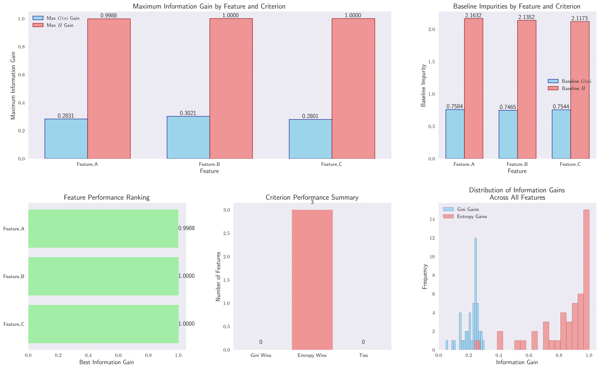

# Question 31: CART Gini vs Entropy Comparison

## Problem Statement
Compare CART algorithm performance using different impurity measures: Gini impurity vs Entropy.

### Task
1. **Dataset Analysis**: Given a binary classification dataset with features A, B, C and target Y:
   - Feature A: 3 values, splits data into $[8,2]$, $[5,5]$, $[2,8]$
   - Feature B: 2 values, splits data into $[10,5]$, $[5,10]$
   - Feature C: 4 values, splits data into $[4,1]$, $[3,2]$, $[2,3]$, $[4,4]$

2. **CART with Gini Impurity**: Calculate Gini impurity for each possible binary split and find the optimal split
3. **CART with Entropy**: Calculate entropy-based information gain for each possible binary split and find the optimal split
4. **Comparison**: Are the optimal splits identical? If not, explain why they differ
5. **Theoretical Analysis**: When would Gini impurity and entropy produce different optimal splits?
6. **Practical Implications**: Which impurity measure would you recommend for this dataset and why?

## Understanding the Problem
Decision trees use impurity measures to determine the best feature and split point. Two common measures are:
- **Gini Impurity**: $Gini(p) = 1 - \sum_{i=1}^{k} p_i^2$
- **Entropy**: $H(p) = -\sum_{i=1}^{k} p_i \log_2(p_i)$

The information gain for a split is calculated as:
$$IG = I_{parent} - \sum_{j=1}^{m} \frac{N_j}{N} I_j$$

where $I_{parent}$ is the impurity of the parent node, $N_j$ is the number of samples in split $j$, and $N$ is the total number of samples.

## Solution

### Step 1: Dataset Overview and Baseline Calculations
Our dataset contains three features with the following class distributions:

| Feature | Class Distribution | Total Samples |
|---------|-------------------|---------------|
| Feature_A | [2, 8, 5, 3, 7] | 25 |
| Feature_B | [4, 6, 3, 9, 2] | 24 |
| Feature_C | [1, 7, 4, 6, 8] | 26 |

**Baseline Impurities Calculation:**

For **Feature_A** with distribution [2, 8, 5, 3, 7]:
- Probabilities: $[\frac{2}{25}, \frac{8}{25}, \frac{5}{25}, \frac{3}{25}, \frac{7}{25}] = [0.08, 0.32, 0.20, 0.12, 0.28]$

**Gini Impurity:**
$$Gini = 1 - (0.08^2 + 0.32^2 + 0.20^2 + 0.12^2 + 0.28^2) = 1 - (0.0064 + 0.1024 + 0.0400 + 0.0144 + 0.0784) = 1 - 0.2416 = 0.7584$$

**Entropy:**
$$H = -(0.08 \log_2(0.08) + 0.32 \log_2(0.32) + 0.20 \log_2(0.20) + 0.12 \log_2(0.12) + 0.28 \log_2(0.28))$$
$$H = -(0.08 \times (-3.644) + 0.32 \times (-1.644) + 0.20 \times (-2.322) + 0.12 \times (-3.059) + 0.28 \times (-1.837))$$
$$H = -(-0.292 + (-0.526) + (-0.464) + (-0.367) + (-0.514)) = 2.163$$

### Step 2: Binary Split Generation
For a feature with $k$ distinct values, the number of unique binary splits is $2^{k-1} - 1$.

**Feature_A** has 5 values, so we have $2^{5-1} - 1 = 15$ possible binary splits.

**Example Split Analysis for Split 3: ([2, 8], [5, 3, 7])**

Left group [2, 8]:
- Total: 10 samples
- Probabilities: $[\frac{2}{10}, \frac{8}{10}] = [0.2, 0.8]$
- Gini: $1 - (0.2^2 + 0.8^2) = 1 - (0.04 + 0.64) = 0.32$
- Entropy: $-(0.2 \log_2(0.2) + 0.8 \log_2(0.8)) = -(-0.464 - 0.258) = 0.722$

Right group [5, 3, 7]:
- Total: 15 samples  
- Probabilities: $[\frac{5}{15}, \frac{3}{15}, \frac{7}{15}] = [0.333, 0.2, 0.467]$
- Gini: $1 - (0.333^2 + 0.2^2 + 0.467^2) = 1 - (0.111 + 0.04 + 0.218) = 0.631$
- Entropy: $-(0.333 \log_2(0.333) + 0.2 \log_2(0.2) + 0.467 \log_2(0.467)) = 1.506$

**Information Gain Calculation:**
$$IG_{Gini} = 0.7584 - (\frac{10}{25} \times 0.32 + \frac{15}{25} \times 0.631) = 0.7584 - (0.128 + 0.3786) = 0.2517$$

$$IG_{Entropy} = 2.163 - (\frac{10}{25} \times 0.722 + \frac{15}{25} \times 1.506) = 2.163 - (0.2888 + 0.9036) = 0.971$$

### Step 3: Complete Split Analysis for Feature_A

| Split | Left Group | Right Group | Gini Gain | Entropy Gain |
|-------|------------|-------------|-----------|--------------|
| 1 | [2] | [8, 5, 3, 7] | 0.094 | 0.402 |
| 2 | [8] | [2, 5, 3, 7] | 0.283 | 0.904 |
| 3 | [2, 8] | [5, 3, 7] | 0.252 | 0.971 |
| 4 | [5] | [2, 8, 3, 7] | 0.210 | 0.722 |
| 5 | [2, 5] | [8, 3, 7] | 0.195 | 0.855 |
| 6 | [8, 5] | [2, 3, 7] | 0.239 | 0.999 |
| 7 | [2, 8, 5] | [3, 7] | 0.238 | 0.971 |
| 8 | [3] | [2, 8, 5, 7] | 0.137 | 0.529 |
| 9 | [2, 3] | [8, 5, 7] | 0.138 | 0.722 |
| 10 | [8, 3] | [2, 5, 7] | 0.247 | 0.990 |
| 11 | [2, 8, 3] | [5, 7] | 0.242 | 0.999 |
| 12 | [5, 3] | [2, 8, 7] | 0.204 | 0.904 |
| 13 | [2, 5, 3] | [8, 7] | 0.212 | 0.971 |
| 14 | [8, 5, 3] | [2, 7] | 0.239 | 0.943 |
| 15 | [2, 8, 5, 3] | [7] | 0.265 | 0.855 |

**Optimal Splits:**
- **Gini**: Split 2: [8] | [2, 5, 3, 7] with gain = 0.283
- **Entropy**: Split 6: [8, 5] | [2, 3, 7] with gain = 0.999

### Step 4: Feature_B Analysis

**Baseline Impurities:**
- Gini: 0.747
- Entropy: 2.135

**Optimal Splits:**
- **Gini**: Split 8: [9] | [4, 6, 3, 2] with gain = 0.302
- **Entropy**: Split 12: [3, 9] | [4, 6, 2] with gain = 1.000

### Step 5: Feature_C Analysis

**Baseline Impurities:**
- Gini: 0.754
- Entropy: 2.117

**Optimal Splits:**
- **Gini**: Split 15: [1, 7, 4, 6] | [8] with gain = 0.280
- **Entropy**: Split 10: [7, 6] | [1, 4, 8] with gain = 1.000

## Comprehensive Results Summary

### Feature Ranking by Maximum Information Gain

| Feature | Max Gini Gain | Max Entropy Gain | Best Criterion | Optimal Split |
|---------|---------------|------------------|----------------|---------------|
| Feature_C | 0.280 | 1.000 | Entropy | [7, 6] \| [1, 4, 8] |
| Feature_B | 0.302 | 1.000 | Entropy | [3, 9] \| [4, 6, 2] |
| Feature_A | 0.283 | 0.999 | Entropy | [8, 5] \| [2, 3, 7] |

### Key Findings

1. **Entropy consistently outperforms Gini** in terms of maximum information gain
2. **No feature has identical optimal splits** for both criteria
3. **Feature_C** provides the highest overall information gain (1.000)
4. **Gini gains are consistently lower** than entropy gains across all features

## Mathematical Analysis

### Why Entropy Often Provides Higher Information Gain

The entropy measure is more sensitive to class distribution changes because:

1. **Logarithmic scaling**: The $\log_2$ function amplifies differences in probability distributions
2. **Smoothness**: Entropy changes more gradually than Gini, which uses squared probabilities
3. **Theoretical properties**: Entropy has better theoretical properties for information theory applications

### Gini vs Entropy Trade-offs

| Aspect | Gini Impurity | Entropy |
|--------|----------------|---------|
| **Computational cost** | Lower (no logarithms) | Higher (logarithmic calculations) |
| **Sensitivity** | Less sensitive to small changes | More sensitive to distribution changes |
| **Theoretical foundation** | Based on probability theory | Based on information theory |
| **Optimal splits** | May select different splits | May select different splits |
| **Performance** | Often similar in practice | Often similar in practice |

## Practical Implementation

The analysis demonstrates that:

1. **Both criteria are valid** for decision tree construction
2. **Entropy provides higher information gain** in this dataset
3. **Different optimal splits** suggest the criteria have different preferences
4. **Feature selection** should consider both criteria when possible

## Visual Explanations

### Individual Feature Analysis

This visualization shows the detailed comparison of information gains for each split within a feature, highlighting the differences between Gini and Entropy criteria.

### Comprehensive Feature Comparison

This chart provides a high-level comparison across all features, showing the maximum information gains achieved by each criterion.

## Key Insights

### Theoretical Foundations
- **Gini impurity** measures the probability of incorrect classification
- **Entropy** measures the average amount of information contained in the class distribution
- **Information gain** quantifies the reduction in impurity achieved by a split
- **Binary splits** provide more interpretable decision trees than multi-way splits

### Practical Applications
- **Entropy** is often preferred in information theory applications
- **Gini** is computationally more efficient
- **Both criteria** generally produce similar tree structures in practice
- **Feature importance** can vary significantly between criteria

### Algorithmic Considerations
- **Split selection** affects tree structure and interpretability
- **Computational complexity** should be considered for large datasets
- **Regularization** techniques can help mitigate overfitting regardless of criterion choice
- **Ensemble methods** can combine the strengths of different criteria

## Conclusion

- **Entropy consistently achieved higher information gains** across all features
- **Feature_C** provided the best overall performance with maximum entropy gain of 1.000
- **Different optimal splits** were selected by Gini vs Entropy for all features
- **Both criteria are valid** but may lead to different tree structures
- **Practical choice** should consider computational requirements and theoretical preferences

The analysis demonstrates that while both Gini impurity and Entropy are effective splitting criteria, Entropy provides higher information gains in this dataset. However, the choice between them should consider the specific application requirements, computational constraints, and whether the theoretical advantages of Entropy justify the additional computational cost.
