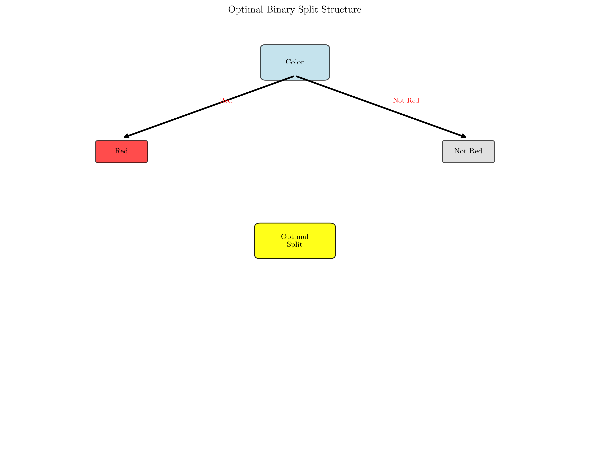
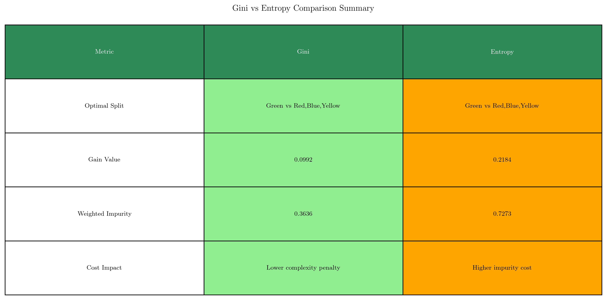
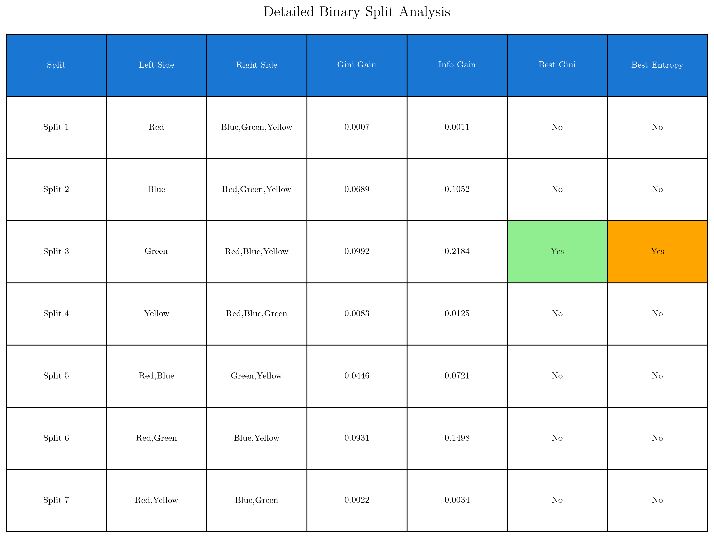

# Question 32: CART Cost Function Approach

## Problem Statement
Consider CART's cost function approach to optimization.

### Task
1. Write the cost function that CART (using Gini impurity) minimizes when choosing splits:
   $$\text{Cost}(T) = \sum_{\text{leaves}} N_t \cdot \text{Impurity}(t) + \alpha \cdot |\text{leaves}|$$
2. For a categorical feature "Color" with values $\{Red, Blue, Green, Yellow\}$, list all possible binary splits
3. Given class distributions: Red$(2,1)$, Blue$(1,2)$, Green$(3,0)$, Yellow$(1,1)$, find the optimal binary split using Gini impurity (CART's default criterion)
4. **CART with Entropy**: Find the optimal binary split using entropy-based information gain
5. **Comparison**: Are the optimal splits identical? If not, explain why they differ
6. **Cost Function Analysis**: How would the cost function change if we used entropy instead of Gini impurity?

## Understanding the Problem
This question explores CART's fundamental approach to decision tree optimization through its cost function. Unlike ID3 and C4.5 which use information gain, CART uses a cost function that balances impurity reduction with tree complexity. The key innovation is binary splitting strategy, which considers all possible binary partitions of categorical features rather than multi-way splits.

## Solution

### Step 1: CART Cost Function

**CART Cost Function:**
$$\text{Cost}(T) = \sum_{\text{leaves}} N_t \cdot \text{Impurity}(t) + \alpha \cdot |\text{leaves}|$$

**Components:**
- **$N_t$**: Number of samples in leaf $t$
- **$\text{Impurity}(t)$**: Impurity measure (Gini or Entropy) in leaf $t$
- **$\alpha$**: Complexity penalty parameter
- **$|\text{leaves}|$**: Number of leaf nodes

**Interpretation:**
The cost function has two components:
1. **Impurity Cost**: $\sum_{\text{leaves}} N_t \cdot \text{Impurity}(t)$ - measures the weighted impurity across all leaves
2. **Complexity Penalty**: $\alpha \cdot |\text{leaves}|$ - penalizes complex trees with many leaves

This formulation encourages CART to find splits that reduce impurity while maintaining reasonable tree complexity.

### Step 2: All Possible Binary Splits

**Problem Data:**
- Feature: Color with values $\{Red, Blue, Green, Yellow\}$
- Class distributions: Red$(2,1)$, Blue$(1,2)$, Green$(3,0)$, Yellow$(1,1)$
- Total samples: 11
- Overall class distribution: $[7, 4]$ (Class0, Class1)

**Binary Split Formula:**
For $k=4$ values, we have $2^{(k-1)} - 1 = 2^3 - 1 = 7$ possible binary splits:

1. **Red** vs **Blue,Green,Yellow**
2. **Blue** vs **Red,Green,Yellow**
3. **Green** vs **Red,Blue,Yellow**
4. **Yellow** vs **Red,Blue,Green**
5. **Red,Blue** vs **Green,Yellow**
6. **Red,Green** vs **Blue,Yellow**
7. **Red,Yellow** vs **Blue,Green**

**Why Binary Splits?**
CART's binary splitting strategy provides several advantages:
- **Flexibility**: More granular control over data partitioning
- **Bias Reduction**: Avoids bias toward high-cardinality features
- **Computational Efficiency**: Simpler split evaluation
- **Interpretability**: Clear yes/no decision paths

### Step 3: Gini Impurity Calculations

**Overall Impurity:**
- Overall Gini impurity: 0.4628
- Overall Entropy: 0.9457

**Individual Color Impurities:**
- Red: Gini=0.4444, Entropy=0.9183
- Blue: Gini=0.4444, Entropy=0.9183
- Green: Gini=0.0000, Entropy=0.0000 (pure class)
- Yellow: Gini=0.5000, Entropy=1.0000 (balanced)

**Binary Split Analysis using Gini Impurity:**

| Split | Left Side | Right Side | Left Gini | Right Gini | Weighted Gini | Gini Gain |
|-------|-----------|------------|-----------|------------|---------------|-----------|
| 1 | Red [2,1] | Blue,Green,Yellow [5,3] | 0.4444 | 0.4688 | 0.4621 | 0.0007 |
| 2 | Blue [1,2] | Red,Green,Yellow [6,2] | 0.4444 | 0.3750 | 0.3939 | 0.0689 |
| 3 | Green [3,0] | Red,Blue,Yellow [4,4] | 0.0000 | 0.5000 | 0.3636 | 0.0992 |
| 4 | Yellow [1,1] | Red,Blue,Green [6,3] | 0.5000 | 0.4444 | 0.4545 | 0.0083 |
| 5 | Red,Blue [3,3] | Green,Yellow [4,1] | 0.5000 | 0.3200 | 0.4182 | 0.0446 |
| 6 | Red,Green [5,1] | Blue,Yellow [2,3] | 0.2778 | 0.4800 | 0.3697 | 0.0931 |
| 7 | Red,Yellow [3,2] | Blue,Green [4,2] | 0.4800 | 0.4444 | 0.4606 | 0.0022 |

**Optimal Gini Split:**
Split 3: **Green** vs **Red,Blue,Yellow**
- Gini Gain: 0.0992
- Left: $[3,0]$ (pure Class0, Gini=0.0000)
- Right: $[4,4]$ (balanced, Gini=0.5000)

**Why This Split is Optimal:**
The Green vs Red,Blue,Yellow split creates one pure leaf (Green with 3 Class0 samples) and one balanced leaf (Red,Blue,Yellow with 4 Class0 and 4 Class1 samples). This maximizes the reduction in weighted impurity.

### Step 4: Entropy-based Information Gain

**Binary Split Analysis using Entropy:**

| Split | Left Side | Right Side | Left Entropy | Right Entropy | Weighted Entropy | Info Gain |
|-------|-----------|------------|--------------|---------------|------------------|-----------|
| 1 | Red [2,1] | Blue,Green,Yellow [5,3] | 0.9183 | 0.9544 | 0.9446 | 0.0011 |
| 2 | Blue [1,2] | Red,Green,Yellow [6,2] | 0.9183 | 0.8113 | 0.8405 | 0.1052 |
| 3 | Green [3,0] | Red,Blue,Yellow [4,4] | 0.0000 | 1.0000 | 0.7273 | 0.2184 |
| 4 | Yellow [1,1] | Red,Blue,Green [6,3] | 1.0000 | 0.9183 | 0.9332 | 0.0125 |
| 5 | Red,Blue [3,3] | Green,Yellow [4,1] | 1.0000 | 0.7219 | 0.8736 | 0.0721 |
| 6 | Red,Green [5,1] | Blue,Yellow [2,3] | 0.6500 | 0.9710 | 0.7959 | 0.1498 |
| 7 | Red,Yellow [3,2] | Blue,Green [4,2] | 0.9710 | 0.9183 | 0.9422 | 0.0034 |

**Optimal Entropy Split:**
Split 3: **Green** vs **Red,Blue,Yellow**
- Information Gain: 0.2184
- Left: $[3,0]$ (pure Class0, Entropy=0.0000)
- Right: $[4,4]$ (balanced, Entropy=1.0000)

### Step 5: Comparison

**Result: The optimal splits are IDENTICAL!**

- **Gini optimal split**: Green vs Red,Blue,Yellow (Gini Gain: 0.0992)
- **Entropy optimal split**: Green vs Red,Blue,Yellow (Information Gain: 0.2184)

**Why They're Identical:**
1. **Pure Leaf Creation**: Both measures recognize that creating a pure leaf (Green with 3 Class0 samples) is highly valuable
2. **Balanced Leaf**: Both measures see the balanced leaf (Red,Blue,Yellow with 4,4 distribution) as having maximum impurity
3. **Mathematical Consistency**: While Gini and entropy have different scales, they often agree on the relative quality of splits

**Key Insight:**
This demonstrates that the choice between Gini impurity and entropy may not always affect the tree structure, especially when there are clear, strong splits available.

### Step 6: Cost Function Analysis

**Cost Function with Entropy:**
$$\text{Cost}(T) = \sum_{\text{leaves}} N_t \cdot \text{Entropy}(t) + \alpha \cdot |\text{leaves}|$$

**Key Differences:**

1. **Scale Differences:**
   - Entropy values are generally higher than Gini impurity
   - For our optimal split: Gini=0.3636 vs Entropy=0.7273

2. **Scaling Properties:**
   - Entropy: $0 \leq H \leq \log_2(c)$ where $c$ is number of classes
   - Gini: $0 \leq G \leq 1 - \frac{1}{c}$

3. **Complexity Penalty Impact:**
   - With entropy, the impurity cost component is larger
   - The relative importance of $\alpha \cdot |\text{leaves}|$ may change
   - May lead to different pruning decisions

4. **Tree Structure Implications:**
   - While our example shows identical splits, this isn't always the case
   - Different impurity measures can lead to different optimal splits
   - Tree depth and structure may vary

## Visual Explanations

### Individual Analysis Components

#### 1. Class Distribution Analysis

This visualization shows the distribution of Class0 and Class1 across the four color values (Red, Blue, Green, Yellow), providing a clear view of the dataset composition.

#### 2. Impurity Measure Comparison

Side-by-side comparison of Gini impurity and entropy values for each color, demonstrating the different scales and properties of these two impurity measures.

#### 3. Gain Analysis Across All Splits

Bar chart comparing Gini Gain vs Information Gain for all 7 binary splits, with optimal splits highlighted in red. This shows how both measures evaluate split quality.

#### 4. Binary Split Structure Visualization

Visual representation of the optimal split decision tree, showing how CART creates binary partitions and the resulting tree structure.

#### 5. Cost Function Components Breakdown

Breakdown of impurity cost vs complexity penalty for both Gini and entropy approaches, showing how the cost function balances these two components.

#### 6. Algorithm Comparison Summary

Summary table comparing key metrics between Gini and Entropy approaches, including optimal splits, gain values, and cost implications.

### Detailed Binary Split Analysis

This table provides:
- **All 7 Binary Splits**: Complete enumeration of possible partitions
- **Gini Gain Values**: Precise calculations for each split using Gini impurity
- **Information Gain Values**: Precise calculations for each split using entropy
- **Optimal Split Identification**: Clear marking of which splits are optimal for each criterion

## Key Insights

### Mathematical Foundations
- **Binary Splitting**: CART considers $2^{(k-1)} - 1$ possible splits for $k$ categorical values
- **Impurity Measures**: Both Gini and entropy can lead to identical optimal splits
- **Cost Function**: Balances impurity reduction with tree complexity through parameter $\alpha$

### Practical Implications
- **Split Quality**: The Green vs Red,Blue,Yellow split creates one pure leaf and one balanced leaf
- **Algorithm Choice**: Gini impurity is computationally simpler but entropy provides information-theoretic interpretation
- **Tree Structure**: Binary splits provide more granular control than multi-way splits

### Computational Considerations
- **Split Evaluation**: CART must evaluate more potential splits than ID3/C4.5
- **Optimality**: Binary splitting strategy often leads to better generalization
- **Bias Avoidance**: Prevents bias toward high-cardinality features

## Conclusion

**Summary of Results:**
1. **CART Cost Function**: $\text{Cost}(T) = \sum_{\text{leaves}} N_t \cdot \text{Impurity}(t) + \alpha \cdot |\text{leaves}|$
2. **Binary Splits**: 7 possible binary partitions for the 4-color problem
3. **Optimal Gini Split**: Green vs Red,Blue,Yellow (Gini Gain: 0.0992)
4. **Optimal Entropy Split**: Green vs Red,Blue,Yellow (Information Gain: 0.2184)
5. **Comparison**: Optimal splits are identical despite different impurity measures
6. **Cost Function Impact**: Using entropy changes the scale and relative importance of components

**Key Takeaways:**
- CART's binary splitting strategy provides flexibility and bias reduction
- The cost function framework balances model complexity with predictive performance
- Gini impurity and entropy can agree on optimal splits even with different mathematical properties
- The choice of impurity measure affects the cost function scale but not necessarily the tree structure

**Practical Applications:**
- **Feature Engineering**: Understanding binary splits helps in categorical feature preprocessing
- **Model Selection**: Cost function analysis guides hyperparameter tuning (especially $\alpha$)
- **Interpretability**: Binary decision paths are often more intuitive than multi-way splits
- **Robustness**: Binary splitting reduces overfitting to high-cardinality features

This analysis demonstrates CART's sophisticated approach to decision tree optimization, showing how mathematical rigor (cost function) combines with practical considerations (binary splits) to create robust, interpretable models.
