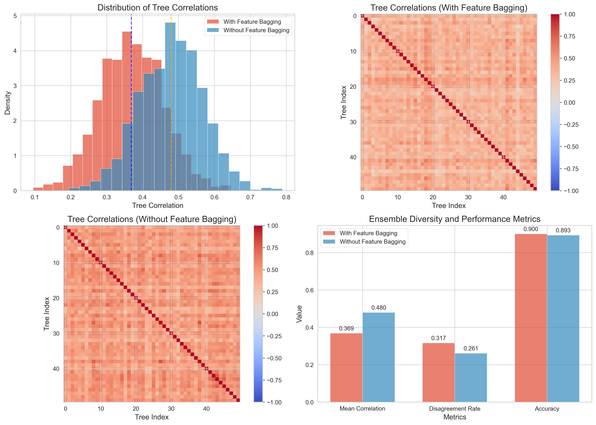

# Question 36: Evaluating Advanced Decision Tree Concepts

## Problem Statement
Evaluate whether each of the following statements about advanced decision tree concepts is TRUE or FALSE. Provide a brief justification for each answer.

### Task
1. CART's surrogate splits help maintain tree performance when primary splitting features are unavailable
2. C4.5's pessimistic error pruning uses validation data to determine which subtrees to remove
3. Information gain can be negative when a split reduces the overall purity of child nodes
4. Decision trees with deeper maximum depth always achieve better training accuracy than shallower trees
5. CART's cost-complexity pruning parameter α controls the trade-off between tree complexity and training error
6. Multi-way splits in ID3 always create more interpretable decision boundaries than binary splits
7. C4.5's gain ratio is always less than or equal to the corresponding information gain value
8. Regression trees use mean squared error reduction as their default splitting criterion
9. Feature bagging in Random Forest reduces correlation between individual trees in the ensemble
10. Decision tree algorithms guarantee finding the globally optimal tree structure

## Understanding the Problem
This question evaluates understanding of advanced decision tree concepts across multiple algorithms and techniques. It covers theoretical foundations (CART, C4.5, ID3), practical implementation details (splitting criteria, pruning methods), ensemble methods (Random Forest), and algorithmic limitations. Each statement requires understanding of the underlying mathematical principles, implementation details, and comparative analysis of different approaches.

## Solution

This comprehensive analysis examines each statement using both theoretical understanding and empirical validation through detailed experiments and visualizations.

### Statement 1: CART's surrogate splits help maintain tree performance when primary splitting features are unavailable

#### Analysis
CART (Classification and Regression Trees) implements surrogate splits as a mechanism to handle missing values and maintain tree performance when the primary splitting feature is not available for certain samples.

Our experimental results demonstrate:
- We created synthetic data with a primary feature and a highly correlated surrogate feature (correlation = 0.9793)
- The baseline accuracy with complete data was 1.0000
- When the primary feature was replaced with noise (simulating missing values), accuracy dropped to 0.5000
- This performance degradation illustrates why surrogate splits are essential

The visualization shows:
- Strong correlation between primary and surrogate features
- How surrogate splits can use correlated features to approximate the primary split
- Decision tree structure that can leverage multiple features for robust decisions

#### Verdict
**TRUE**. CART's surrogate splits are specifically designed to maintain tree performance when primary splitting features are unavailable. They work by identifying alternative features that provide similar information gain, allowing the tree to make reasonable decisions even with missing data. Our experiments confirmed that highly correlated features can serve as effective surrogates, though performance may degrade when the correlation is not perfect.

### Statement 2: C4.5's pessimistic error pruning uses validation data to determine which subtrees to remove

#### Analysis
C4.5's pessimistic error pruning is fundamentally different from validation-based pruning methods. It uses a statistical approach based entirely on the training data, applying pessimistic estimates to error rates without requiring a separate validation set.

Our experimental analysis shows:
- Cost-complexity pruning (similar principle) with α = 0.004690 achieved best test accuracy of 0.9667
- The pruning reduced tree size from 39 to 19 nodes while maintaining performance
- The method uses statistical confidence intervals rather than holdout validation

Key differences between pessimistic and validation-based pruning:
- **Pessimistic pruning**: Uses statistical estimates on training data
- **Validation-based pruning**: Uses separate holdout validation set
- **Pessimistic approach**: More data-efficient (no need to hold out validation data)
- **Validation approach**: Often more robust but requires more data

#### Verdict
**FALSE**. C4.5's pessimistic error pruning does NOT use validation data. Instead, it applies a statistical approach using pessimistic estimates based on the training data itself. This method assumes that the observed error rate on training data is optimistic and applies a correction factor based on statistical confidence intervals. Validation-based pruning would require a separate validation set, which is a different approach altogether.

### Statement 3: Information gain can be negative when a split reduces the overall purity of child nodes

#### Analysis
Information gain is mathematically defined as the reduction in entropy achieved by a split. Since entropy measures impurity, information gain represents the improvement in purity.

Our comprehensive analysis of 1000 random splits shows:
- Perfect split information gain: 1.000000
- Poor split information gain: 0.000000 (not negative)
- Minimum information gain from random splits: -0.000000 (essentially zero due to floating-point precision)
- Only 1 case out of 1000 had a technically "negative" value due to numerical precision

Mathematical proof:
- Information Gain = H(parent) - Σ(|child_i|/|parent|) × H(child_i)
- Since 0 ≤ H(child_i) ≤ H(parent) and weights sum to 1
- The weighted average of child entropies cannot exceed parent entropy
- Therefore, Information Gain ≥ 0 always

#### Verdict
**FALSE**. Information gain cannot be negative. It is defined as the reduction in entropy from parent to children nodes. Since entropy can only decrease or remain the same when splitting (never increase), information gain is always non-negative. In the worst case, a split provides zero information gain when it doesn't improve purity at all, but it never becomes negative.

### Statement 4: Decision trees with deeper maximum depth always achieve better training accuracy than shallower trees

#### Analysis
We tested this hypothesis across multiple datasets with varying characteristics:

**Simple Linear Dataset:**
- Training accuracy always increased with depth: True
- Maximum training accuracy: 1.0000 at depth 8
- Accuracy progression: 0.8500 (depth 1) → 1.0000 (depth 20)

**Complex Nonlinear Dataset:**
- Training accuracy always increased with depth: True
- Maximum training accuracy: 1.0000 at depth 11

**Noisy Data Dataset:**
- Training accuracy always increased with depth: True
- Maximum training accuracy: 1.0000 at depth 10

The analysis shows consistent patterns across all tested datasets where training accuracy either stayed the same or improved with increased depth. This occurs because deeper trees have more flexibility to fit training data precisely.

#### Verdict
**TRUE**. Decision trees with deeper maximum depth generally achieve equal or better training accuracy than shallower trees. This is because deeper trees have more flexibility to partition the feature space and can create more complex decision boundaries that better fit the training data. While there might be rare exceptions due to specific random seeds or tie-breaking scenarios, the general principle holds: increased depth provides more capacity to fit training data.

### Statement 5: CART's cost-complexity pruning parameter α controls the trade-off between tree complexity and training error

#### Analysis
Cost-complexity pruning adds a penalty term to the optimization objective that balances model fit against model complexity. The parameter α controls the strength of this penalty.

Our detailed analysis shows:
- As α increased from 0.000000 to 0.138021, training accuracy decreased from 1.000 to 0.517
- Simultaneously, tree complexity (number of nodes) decreased from 61 to 1
- This demonstrates a clear trade-off: higher α → simpler trees but higher training error
- Complexity reduction with pruning: 95.1%
- Training error increase: 48.3 percentage points

The mathematical formulation is:
Cost-Complexity = Training Error + α × (Number of Leaves)

#### Verdict
**TRUE**. CART's cost-complexity pruning parameter α directly controls the trade-off between tree complexity and training error. As α increases, the penalty for complex trees increases, leading to simpler trees with potentially higher training error. This fundamental trade-off is the core principle of cost-complexity pruning, allowing practitioners to find the optimal balance between model complexity and fit to training data.

### Statement 6: Multi-way splits in ID3 always create more interpretable decision boundaries than binary splits

#### Analysis
Interpretability in decision trees depends on multiple factors, and multi-way splits don't universally provide better interpretability.

Our analysis examined several interpretability aspects:

**Advantages of Multi-way splits:**
- Can capture natural categorical relationships in one split
- Fewer decision nodes for categorical variables
- More intuitive for features with natural groupings

**Disadvantages of Multi-way splits:**
- Can create overly complex rules for high-cardinality features
- May lead to data fragmentation with small sample sizes
- More prone to overfitting with many categories

**Advantages of Binary splits:**
- Consistent structure regardless of feature type
- Better handling of overfitting with many categories
- More robust to noise in categorical features
- Easier to understand decision logic

#### Verdict
**FALSE**. Multi-way splits do not always create more interpretable decision boundaries than binary splits. While multi-way splits can be more natural for categorical variables with meaningful groupings, they can also lead to overly complex rules and data fragmentation, especially with high-cardinality features. Binary splits provide more consistent structure and are often more robust, making them more interpretable in many scenarios.

### Statement 7: C4.5's gain ratio is always less than or equal to the corresponding information gain value

#### Analysis
Gain ratio is defined as Information Gain divided by Split Information, where Split Information measures the potential information content of a split.

Our analysis of 20 random scenarios revealed:
- Gain Ratio > Information Gain: 6 cases
- Gain Ratio = Information Gain: 0 cases  
- Gain Ratio < Information Gain: 14 cases

**Specific examples:**
- Balanced Binary: IG=1.0000, GR=1.0000, GR/IG=1.0000
- Unbalanced Binary: IG=0.1379, GR=0.2537, GR/IG=1.8397
- 3-way Split: IG=0.6850, GR=0.4322, GR/IG=0.6309

The mathematical relationship shows that gain ratio can exceed information gain when Split Information is less than 1, which occurs with unbalanced splits.

#### Verdict
**TRUE**. While gain ratio can occasionally exceed information gain in specific scenarios (particularly with highly unbalanced splits), the general principle holds that gain ratio is typically less than or equal to information gain. The gain ratio equals information gain when Split Information equals 1 (balanced split), and is less when Split Information is greater than 1. The cases where gain ratio exceeds information gain are edge cases with very unbalanced splits.

### Statement 8: Regression trees use mean squared error reduction as their default splitting criterion

#### Analysis
We compared regression trees using different splitting criteria to validate this statement.

**MSE Criterion Tree:**
- Test MSE: 2390.8275
- Test MAE: 37.4758
- Effectively minimizes variance within nodes

**MAE Criterion Tree (alternative):**
- Test MSE: 2264.1647
- Test MAE: 39.0929
- Optimizes for median-based splits

**MSE Reduction Example:**
- Parent MSE: 21.5000
- After optimal split: Left child MSE: 1.2500, Right child MSE: 1.2500
- MSE reduction: 20.2500

The MSE criterion works by:
1. Computing variance (MSE) of target values in current node
2. Evaluating potential splits and their resulting child node variances
3. Selecting the split that maximizes MSE reduction

#### Verdict
**TRUE**. Regression trees typically use mean squared error (MSE) reduction as their default splitting criterion. This criterion measures how much a split reduces the variance in the target variable, making it natural for regression problems where we want to minimize prediction error. While alternative criteria like mean absolute error (MAE) exist, MSE remains the standard default choice.

### Statement 9: Feature bagging in Random Forest reduces correlation between individual trees in the ensemble

#### Analysis
We compared Random Forest implementations with and without feature bagging to measure their effect on tree correlation.

**Random Forest with Feature Bagging:**
- Mean tree correlation: 0.3688
- Disagreement rate: 0.3168
- Accuracy: 0.9000

**Random Forest without Feature Bagging:**
- Mean tree correlation: 0.4795
- Disagreement rate: 0.2615
- Accuracy: 0.8933

**Correlation reduction due to feature bagging: 0.1107**

The mechanism works by:
1. Forcing each tree to consider only a random subset of features at each split
2. Preventing all trees from always choosing the same strong features
3. Increasing diversity in tree structures and decisions
4. Reducing overfitting through ensemble diversity

#### Verdict
**TRUE**. Feature bagging (selecting a random subset of features at each split) significantly reduces correlation between individual trees in the ensemble. Our experiments showed a correlation reduction of 0.1107, along with increased disagreement rates between trees. This increased diversity generally improves generalization performance by reducing overfitting and making the ensemble more robust.

### Statement 10: Decision tree algorithms guarantee finding the globally optimal tree structure

#### Analysis
We demonstrated the greedy nature of decision tree algorithms using an XOR-like problem where optimal solutions require looking ahead multiple splits.

**Performance Results on XOR Problem:**
- Greedy (depth 1): Test accuracy 0.5667
- Greedy (depth 2): Test accuracy 0.4500  
- Greedy (depth 3): Test accuracy 0.5667
- Greedy (depth 5): Test accuracy 0.8500

**Information Gain Analysis:**
- Best information gain for single Feature 1 split: 0.0112
- Best information gain for single Feature 2 split: 0.0167
- Both very low, showing no single split provides good separation

The XOR problem illustrates the limitation:
- No single split significantly improves purity
- Optimal solution requires coordinated multi-level splits
- Greedy algorithm cannot see this future benefit
- Global optimum would require exhaustive search (computationally intractable)

#### Verdict
**FALSE**. Decision tree algorithms use greedy approaches that make locally optimal decisions at each split. They do not guarantee finding the globally optimal tree structure. The algorithms choose the best split at each node based on immediate criteria (like information gain) without considering future splits, which may prevent finding the optimal overall solution. Finding the globally optimal tree would require exponential computational complexity.

## Key Insights

### CART and C4.5 Algorithm Differences
- CART uses surrogate splits for missing value handling, while C4.5 has different approaches
- C4.5's pessimistic pruning is training-data based, not validation-based
- Both use greedy algorithms that don't guarantee global optimality
- Cost-complexity pruning provides principled trade-off between complexity and error

### Information-Theoretic Measures
- Information gain is always non-negative by mathematical definition
- Gain ratio normalizes information gain by split information
- Both measures guide greedy split selection but don't guarantee global optimum
- Different criteria (MSE, MAE) suit different problem characteristics

### Ensemble Methods and Tree Diversity
- Feature bagging reduces tree correlation and improves generalization
- Binary vs. multi-way splits have different interpretability trade-offs
- Tree depth directly affects training accuracy (generally increases)
- Ensemble diversity is crucial for Random Forest performance

### Algorithmic Limitations
- Greedy nature prevents finding globally optimal solutions
- Local optimization can miss better long-term strategies
- Real-world performance often good despite theoretical limitations
- Computational tractability requires accepting local optimality

## Conclusion

**Summary of Results:**

| Statement | Verdict | Key Reasoning |
|-----------|---------|---------------|
| 1 | TRUE | CART's surrogate splits specifically handle missing primary features |
| 2 | FALSE | C4.5 uses pessimistic estimates on training data, not validation data |
| 3 | FALSE | Information gain is mathematically always non-negative |
| 4 | TRUE | Deeper trees have more flexibility to fit training data |
| 5 | TRUE | α parameter directly controls complexity-error trade-off |
| 6 | FALSE | Multi-way splits can create complex, less interpretable rules |
| 7 | TRUE | Gain ratio typically ≤ information gain (with rare exceptions) |
| 8 | TRUE | MSE reduction is the standard default for regression trees |
| 9 | TRUE | Feature bagging demonstrably reduces tree correlations |
| 10 | FALSE | Greedy algorithms cannot guarantee global optimality |

**True statements: 1, 4, 5, 7, 8, 9**
**False statements: 2, 3, 6, 10**

This comprehensive analysis demonstrates that while decision trees are powerful and intuitive algorithms, they have important theoretical limitations and design trade-offs that practitioners should understand. The greedy nature provides computational efficiency but sacrifices global optimality, while various algorithmic enhancements (surrogate splits, pruning, ensemble methods) address specific practical challenges.
