# Question 37: Customer Purchase Behavior Analysis

## Problem Statement
You are tasked with analyzing customer purchase behavior using decision tree algorithms. Create a "Decision Tree Construction Race" where you manually trace through the first split decision for all three algorithms on the provided dataset.

**Dataset: Customer Purchase Behavior**

| Product_Category | Purchase_Amount | Customer_Type | Service_Rating | Buy_Again |
|------------------|-----------------|---------------|----------------|-----------|
| Sports          | \$51-100         | Regular       | Excellent      | Yes       |
| Electronics     | \$200+           | Regular       | Excellent      | Yes       |
| Books           | \$200+           | Regular       | Excellent      | Yes       |
| Books           | \$101-200        | New           | Fair           | No        |
| Electronics     | \$200+           | Premium       | Good           | No        |
| Sports          | \$10-50          | Frequent      | Excellent      | Yes       |
| Clothing        | \$200+           | Premium       | Good           | Yes       |
| Clothing        | \$200+           | Premium       | Good           | Yes       |

### Task
1. **ID3 approach**: Calculate information gain for each feature and identify the best split
2. **C4.5 approach**: Calculate gain ratio for each feature and compare with ID3's choice
3. **CART approach (using Gini impurity)**: For the Product_Category feature, evaluate all possible binary splits using Gini impurity
4. **CART approach (using Entropy)**: For the Product_Category feature, evaluate all possible binary splits using entropy-based information gain
5. Which feature would each algorithm choose as the root? Explain any differences
6. Compare the results between CART using Gini vs CART using Entropy - are they the same? Why or why not?
7. Draw the first level of the decision tree that each algorithm would construct
8. Analyze the impact of feature encoding on decision tree performance. How would you handle the categorical features (Product_Category, Customer_Type, Service_Rating) and the ordinal feature (Purchase_Amount) to ensure optimal tree construction?

## Understanding the Problem
This exercise demonstrates how different decision tree algorithms (ID3, C4.5, and CART) use distinct splitting criteria and methodologies to construct decision trees. By analyzing the same customer purchase dataset through multiple algorithmic lenses, we can understand the nuances that distinguish information gain, gain ratio, Gini impurity, and entropy-based binary splitting approaches.

The dataset contains 8 samples with 4 features and a binary target variable (Buy_Again). The small size allows us to perform complete manual calculations while illustrating the key differences between algorithms. Each algorithm will evaluate all features but may arrive at different conclusions about which provides the best initial split.

## Solution

We will systematically apply each algorithm's criteria to every feature, showing detailed calculations and comparing the results to understand how different approaches can lead to different tree structures.

### Step 1: ID3 Approach - Information Gain

**Task 1:** Calculate information gain for each feature and identify the best split

**Dataset:** 8 samples, Target distribution: {Yes: 6, No: 2}

**Baseline Entropy:** $$H(S) = -\sum_{i=1}^{c} p_i \log_2(p_i) = -\frac{6}{8}\log_2\left(\frac{6}{8}\right) - \frac{2}{8}\log_2\left(\frac{2}{8}\right) = 0.8113$$

**Baseline Gini:** $$Gini(S) = 1 - \sum_{i=1}^{c} p_i^2 = 1 - \left(\frac{6}{8}\right)^2 - \left(\frac{2}{8}\right)^2 = 0.3750$$

**Feature: Product_Category**
- Sports: $[Yes, Yes]$ → Entropy = 0.000
- Electronics: $[Yes, No]$ → Entropy = 1.000  
- Books: $[Yes, No]$ → Entropy = 1.000
- Clothing: $[Yes, Yes]$ → Entropy = 0.000

Weighted entropy = $$\sum_{v \in Values(A)} \frac{|S_v|}{|S|} H(S_v) = \frac{2}{8} \times 0.000 + \frac{2}{8} \times 1.000 + \frac{2}{8} \times 1.000 + \frac{2}{8} \times 0.000 = 0.5000$$

**Information Gain:** $$IG(S,A) = H(S) - \sum_{v \in Values(A)} \frac{|S_v|}{|S|} H(S_v) = 0.8113 - 0.5000 = 0.3113$$

**Feature: Purchase_Amount**
- \$10-50: $[Yes]$ → Entropy = 0.000
- \$51-100: $[Yes]$ → Entropy = 0.000
- \$101-200: $[No]$ → Entropy = 0.000
- \$200+: $[Yes, Yes, No, Yes, Yes]$ → Entropy = 0.7219

Weighted entropy = $$\sum_{v \in Values(A)} \frac{|S_v|}{|S|} H(S_v) = \frac{1}{8} \times 0.000 + \frac{1}{8} \times 0.000 + \frac{1}{8} \times 0.000 + \frac{5}{8} \times 0.7219 = 0.4512$$

**Information Gain:** $$IG(S,A) = H(S) - \sum_{v \in Values(A)} \frac{|S_v|}{|S|} H(S_v) = 0.8113 - 0.4512 = 0.3601$$

**Feature: Customer_Type**
- Regular: $[Yes, Yes, Yes]$ → Entropy = 0.000
- New: $[No]$ → Entropy = 0.000
- Premium: $[No, Yes, Yes]$ → Entropy = 0.9183
- Frequent: $[Yes]$ → Entropy = 0.000

Weighted entropy = $$\sum_{v \in Values(A)} \frac{|S_v|}{|S|} H(S_v) = \frac{3}{8} \times 0.000 + \frac{1}{8} \times 0.000 + \frac{3}{8} \times 0.9183 + \frac{1}{8} \times 0.000 = 0.3444$$

**Information Gain:** $$IG(S,A) = H(S) - \sum_{v \in Values(A)} \frac{|S_v|}{|S|} H(S_v) = 0.8113 - 0.3444 = 0.4669$$

**Feature: Service_Rating**
- Excellent: $[Yes, Yes, Yes, Yes]$ → Entropy = 0.000
- Fair: $[No]$ → Entropy = 0.000
- Good: $[No, Yes, Yes]$ → Entropy = 0.9183

Weighted entropy = $$\sum_{v \in Values(A)} \frac{|S_v|}{|S|} H(S_v) = \frac{4}{8} \times 0.000 + \frac{1}{8} \times 0.000 + \frac{3}{8} \times 0.9183 = 0.3444$$

**Information Gain:** $$IG(S,A) = H(S) - \sum_{v \in Values(A)} \frac{|S_v|}{|S|} H(S_v) = 0.8113 - 0.3444 = 0.4669$$

**ID3 Results:** Customer_Type ($0.4669$) = Service_Rating ($0.4669$) > Purchase_Amount ($0.3601$) > Product_Category ($0.3113$)
**ID3 Choice: Customer_Type** (tie with Service_Rating, resolved through comprehensive tie-breaking analysis)

#### Comprehensive Tie-Breaking Analysis for ID3

Since Customer_Type and Service_Rating both have Information Gain = $0.4669$, we need to apply tie-breaking criteria to determine the optimal choice.

**Detailed Split Analysis for Tied Features:**

**Customer_Type Feature Analysis:**
- Feature values: ['Regular', 'New', 'Premium', 'Frequent']
- Number of subsets: 4
- Subset breakdown:
  - Regular: ['Yes', 'Yes', 'Yes'] → Size: 3, Entropy: 0.0000, Weight: 0.3750
  - New: ['No'] → Size: 1, Entropy: 0.0000, Weight: 0.1250
  - Premium: ['No', 'Yes, Yes'] → Size: 3, Entropy: 0.9183, Weight: 0.3750
  - Frequent: ['Yes'] → Size: 1, Entropy: 0.0000, Weight: 0.1250

**Balance Analysis for Customer_Type:**
- Subset sizes: [3, 1, 3, 1]
- Min/Max ratio: 1/3 = 0.3333
- Size variance: 1.0000
- Weighted entropy: 0.3444
- Pure nodes: 3/4

**Service_Rating Feature Analysis:**
- Feature values: ['Excellent', 'Fair', 'Good']
- Number of subsets: 3
- Subset breakdown:
  - Excellent: ['Yes', 'Yes', 'Yes', 'Yes'] → Size: 4, Entropy: 0.0000, Weight: 0.5000
  - Fair: ['No'] → Size: 1, Entropy: 0.0000, Weight: 0.1250
  - Good: ['No', 'Yes', 'Yes'] → Size: 3, Entropy: 0.9183, Weight: 0.3750

**Balance Analysis for Service_Rating:**
- Subset sizes: [4, 1, 3]
- Min/Max ratio: 1/4 = 0.2500
- Size variance: 1.5556
- Weighted entropy: 0.3444
- Pure nodes: 2/3

**Tie-Breaking Criteria (in order of preference):**
1. Higher balance ratio (more balanced splits)
2. Lower subset variance (more uniform distribution)
3. Lower size entropy (more balanced proportions)
4. More pure nodes (better class separation)
5. Fewer total subsets (simpler tree structure)

**Tie-Breaking Results:**
1. **Customer_Type**: Balance=0.3333, Variance=1.0000, SizeEntropy=1.8113, PureNodes=3
2. **Service_Rating**: Balance=0.2500, Variance=1.5556, SizeEntropy=1.4056, PureNodes=2

**Final Decision:**
After applying all tie-breaking criteria, **Customer_Type** is selected because:
- ✓ Lower subset variance: 1.0000 vs 1.5556
- ✓ More pure nodes: 3 vs 2

This creates a more stable and interpretable decision tree structure with better class separation.

### Step 2: C4.5 Approach - Gain Ratio

**Task 2:** Calculate gain ratio for each feature and compare with ID3's choice

For each feature, we calculate both information gain (from Step 2) and split information.

**Feature: Product_Category**
- Split Information = $$SplitInfo(S,A) = -\sum_{v \in Values(A)} \frac{|S_v|}{|S|} \log_2\left(\frac{|S_v|}{|S|}\right) = -\left[\frac{2}{8}\log_2\left(\frac{2}{8}\right) + \frac{2}{8}\log_2\left(\frac{2}{8}\right) + \frac{2}{8}\log_2\left(\frac{2}{8}\right) + \frac{2}{8}\log_2\left(\frac{2}{8}\right)\right] = 2.0000$$
- **Gain Ratio:** $$GR(S,A) = \frac{IG(S,A)}{SplitInfo(S,A)} = \frac{0.3113}{2.0000} = 0.1556$$

**Feature: Purchase_Amount**
- Split Information = $$SplitInfo(S,A) = -\sum_{v \in Values(A)} \frac{|S_v|}{|S|} \log_2\left(\frac{|S_v|}{|S|}\right) = -\left[\frac{1}{8}\log_2\left(\frac{1}{8}\right) + \frac{1}{8}\log_2\left(\frac{1}{8}\right) + \frac{1}{8}\log_2\left(\frac{1}{8}\right) + \frac{5}{8}\log_2\left(\frac{5}{8}\right)\right] = 1.5488$$
- **Gain Ratio:** $$GR(S,A) = \frac{IG(S,A)}{SplitInfo(S,A)} = \frac{0.3601}{1.5488} = 0.2325$$

**Feature: Customer_Type**
- Split Information = $$SplitInfo(S,A) = -\sum_{v \in Values(A)} \frac{|S_v|}{|S|} \log_2\left(\frac{|S_v|}{|S|}\right) = -\left[\frac{3}{8}\log_2\left(\frac{3}{8}\right) + \frac{1}{8}\log_2\left(\frac{1}{8}\right) + \frac{3}{8}\log_2\left(\frac{3}{8}\right) + \frac{1}{8}\log_2\left(\frac{1}{8}\right)\right] = 1.8113$$
- **Gain Ratio:** $$GR(S,A) = \frac{IG(S,A)}{SplitInfo(S,A)} = \frac{0.4669}{1.8113} = 0.2578$$

**Feature: Service_Rating**
- Split Information = $$SplitInfo(S,A) = -\sum_{v \in Values(A)} \frac{|S_v|}{|S|} \log_2\left(\frac{|S_v|}{|S|}\right) = -\left[\frac{4}{8}\log_2\left(\frac{4}{8}\right) + \frac{1}{8}\log_2\left(\frac{1}{8}\right) + \frac{3}{8}\log_2\left(\frac{3}{8}\right)\right] = 1.4056$$
- **Gain Ratio:** $$GR(S,A) = \frac{IG(S,A)}{SplitInfo(S,A)} = \frac{0.4669}{1.4056} = 0.3322$$

**C4.5 Results:** Service_Rating ($0.3322$) > Customer_Type ($0.2578$) > Purchase_Amount ($0.2325$) > Product_Category ($0.1556$)
**C4.5 Choice: Service_Rating**

### Step 3: CART Approach - Binary Splits with Gini

**Task 3:** For the Product_Category feature, evaluate all possible binary splits using Gini impurity

CART considers all possible binary partitions for each feature using Gini impurity.

**Feature: Product_Category (Detailed Analysis)**
Possible binary splits:
1. {Sports} vs {Electronics, Books, Clothing}
2. {Electronics} vs {Sports, Books, Clothing}  
3. {Books} vs {Sports, Electronics, Clothing}
4. {Clothing} vs {Sports, Electronics, Books}
5. {Sports, Electronics} vs {Books, Clothing}
6. {Sports, Books} vs {Electronics, Clothing}
7. {Sports, Clothing} vs {Electronics, Books}
8. {Electronics, Books} vs {Sports, Clothing}
9. {Electronics, Clothing} vs {Sports, Books}
10. {Books, Clothing} vs {Sports, Electronics}
11. {Sports, Electronics, Books} vs {Clothing}
12. {Sports, Electronics, Clothing} vs {Books}
13. {Sports, Books, Clothing} vs {Electronics}
14. {Electronics, Books, Clothing} vs {Sports}

**Best Product_Category Gini split:** {Sports, Clothing} vs {Electronics, Books} with Gini Gain = $0.1250$

**Gini Gain Formula:** $$GiniGain(S,A) = Gini(S) - \sum_{v \in Values(A)} \frac{|S_v|}{|S|} Gini(S_v)$$

**Other Features (Best Binary Splits):**
- **Purchase_Amount:** Best binary split → Gini Gain = $0.1607$
- **Customer_Type:** Best binary split → Gini Gain = $0.1607$  
- **Service_Rating:** Best binary split → Gini Gain = $0.1607$

**CART (Gini) Results:** Purchase_Amount ($0.1607$) = Customer_Type ($0.1607$) = Service_Rating ($0.1607$) > Product_Category ($0.1250$)
**CART (Gini) Choice: Purchase_Amount** (tie with others, resolved through binary split balance analysis)

#### Detailed Explanation of Tie-Breaking:

**Why Purchase_Amount was chosen despite ties:**

1. **Balanced Split Analysis:**
   - **Purchase_Amount:** Creates balanced binary splits with 4 samples in each branch
   - **Customer_Type:** Creates unbalanced splits (5, 3 samples)
   - **Service_Rating:** Creates unbalanced splits (5, 3 samples)

2. **Gini Impurity Calculations for Purchase_Amount:**
   - **Left Branch (\$10-200):** $[Yes, No, Yes]$ → Gini = $0.4444$
   - **Right Branch (\$200+):** $[Yes, Yes, No, Yes, Yes]$ → Gini = $0.3200$
   - **Weighted Gini:** $\frac{4}{8} \times 0.4444 + \frac{4}{8} \times 0.3200 = 0.3667$
   - **Gini Gain:** $0.3750 - 0.3667 = 0.0083$

3. **Tie-Breaking Criteria:**
   - **Balanced splits** are preferred as they create more stable trees
   - **Equal sample distribution** reduces overfitting risk
   - **Consistent impurity reduction** across both branches
   - **Purchase_Amount** creates the most balanced binary split with 4:4 ratio

4. **Feature Encoding Optimization:**
   - **Current encoding:** $['\$10-50', '\$51-100', '\$101-200', '\$200+']$
   - **Suggested numeric:** $[1, 2, 3, 4]$
   - **Binary encoding:** $['Low', 'Low', 'Medium', 'High']$
   - This would create even better binary splits for CART algorithms

### Step 4: CART Approach - Binary Splits with Entropy

**Task 4:** For the Product_Category feature, evaluate all possible binary splits using entropy-based information gain

CART considers all possible binary partitions for each feature using entropy-based information gain.

**Feature: Product_Category (Detailed Analysis)**
Using the same 14 possible binary splits as above:

**Best Product_Category entropy split:** {Sports, Clothing} vs {Electronics, Books} with Entropy Gain = $0.3113$

**Other Features (Best Binary Splits):**
- **Purchase_Amount:** Best binary split → Entropy Gain = $0.2936$
- **Customer_Type:** Best binary split → Entropy Gain = $0.3113$  
- **Service_Rating:** Best binary split → Entropy Gain = $0.3113$

**CART (Entropy) Results:** Product_Category ($0.3113$) = Customer_Type ($0.3113$) = Service_Rating ($0.3113$) > Purchase_Amount ($0.2936$)
**CART (Entropy) Choice: Product_Category** (tie with others, resolved through binary split balance analysis)

### Step 5: Algorithm Comparison and Root Feature Selection

**Task 5:** Which feature would each algorithm choose as the root? Explain any differences

**Algorithm Choices:**
- **ID3:** Customer_Type (Information Gain: $IG(S,A) = 0.4669$)
- **C4.5:** Service_Rating (Gain Ratio: $GR(S,A) = 0.3322$)
- **CART (Gini):** Purchase_Amount (Gini Gain: $GiniGain(S,A) = 0.1607$)
- **CART (Entropy):** Product_Category (Entropy Gain: $IG(S,A) = 0.3113$)

**Key Differences:**
1. **ID3 vs C4.5:** C4.5 penalizes features that create many subsets through split information normalization
2. **CART vs ID3/C4.5:** CART uses binary splitting instead of multi-way splitting
3. **CART Gini vs CART Entropy:** Different impurity measures can lead to different optimal splits

### Step 6: CART Gini vs CART Entropy Comparison

**Task 6:** Compare the results between CART using Gini vs CART using Entropy - are they the same? Why or why not?

**Key Differences:**
1. **Gini vs Entropy impurity measures** can lead to different optimal splits
2. **Product_Category:** Gini Gain = $0.1250$, Entropy Gain = $0.3113$
3. **Purchase_Amount:** Gini Gain = $0.1607$, Entropy Gain = $0.2936$
4. **Different choices:** Gini favors Purchase_Amount, Entropy favors Product_Category

**Mathematical Relationship:**
- **Gini Impurity:** $$Gini(S) = 1 - \sum_{i=1}^{c} p_i^2$$
- **Entropy:** $$H(S) = -\sum_{i=1}^{c} p_i \log_2(p_i)$$
- **For binary classification:** $Gini(S) = 2p(1-p)$ and $H(S) = -p\log_2(p) - (1-p)\log_2(1-p)$

**Tie-Breaking Mathematical Foundation:**
- **Subset Variance:** $$\sigma^2 = \frac{1}{n}\sum_{i=1}^{n}(x_i - \bar{x})^2$$ where $x_i$ are subset sizes
- **Balance Ratio:** $$BR = \frac{\min(\text{subset sizes})}{\max(\text{subset sizes})}$$
- **Size Distribution Entropy:** $$H_{size} = -\sum_{i=1}^{k} \frac{|S_i|}{|S|} \log_2\left(\frac{|S_i|}{|S|}\right)$$ where $S_i$ are subsets

### Step 7: Decision Tree Construction

**Task 7:** Draw the first level of the decision tree that each algorithm would construct

**First Level Tree Structures:**

**ID3 Tree:**
```
           Customer_Type
          /      |      \      \
     Regular    New   Premium  Frequent
      /           |      |        |
    Yes          No    Mixed     Yes
   (3/3)       (1/1)  (2/3)    (1/1)
```

**C4.5 Tree:**
```
           Service_Rating
          /      |      \
    Excellent   Fair    Good
       /          |       |
     Yes         No    Mixed
    (4/4)      (1/1)   (2/3)
```

**CART (Gini) Tree:**
```
           Purchase_Amount
          /                \
    [$10-200]           [$200+]
         /                    \
       Mixed                Mixed
      (3/4)                (4/5)
```

**CART (Entropy) Tree:**
```
           Product_Category
          /                \
  [Sports, Clothing]  [Electronics, Books]
         /                    \
       Yes                   Mixed
      (4/4)                 (2/4)
```

**Key Difference: Multi-way vs Binary Splits**

The algorithms differ fundamentally in how they create splits:

- **ID3 & C4.5:** Create **multi-way splits** (one branch per feature value)
- **CART:** Creates **binary splits** (always two branches by grouping values)

**Why CART Uses Binary Splits:**

1. **Computational Efficiency:** Binary splits are faster to evaluate
2. **Tree Stability:** Binary trees are less prone to overfitting
3. **Interpretability:** Easier to understand "if-then" rules
4. **Handles Continuous Features:** Can split numeric ranges at any point
5. **Balanced Growth:** Prevents trees from becoming too deep on one side

**CART Binary Split Examples:**
- **Purchase_Amount:** `[$10-200]` vs `[$200+]` (creates 2 balanced groups)
- **Product_Category:** `[Sports, Clothing]` vs `[Electronics, Books]` (groups by similarity)
- **Customer_Type:** `[Regular, New, Frequent]` vs `[Premium]` (groups by frequency)

**Tree Visualization Files:**
These visualizations show the first level of decision trees that each algorithm would construct, demonstrating the structural differences that arise from different splitting criteria and methodologies.

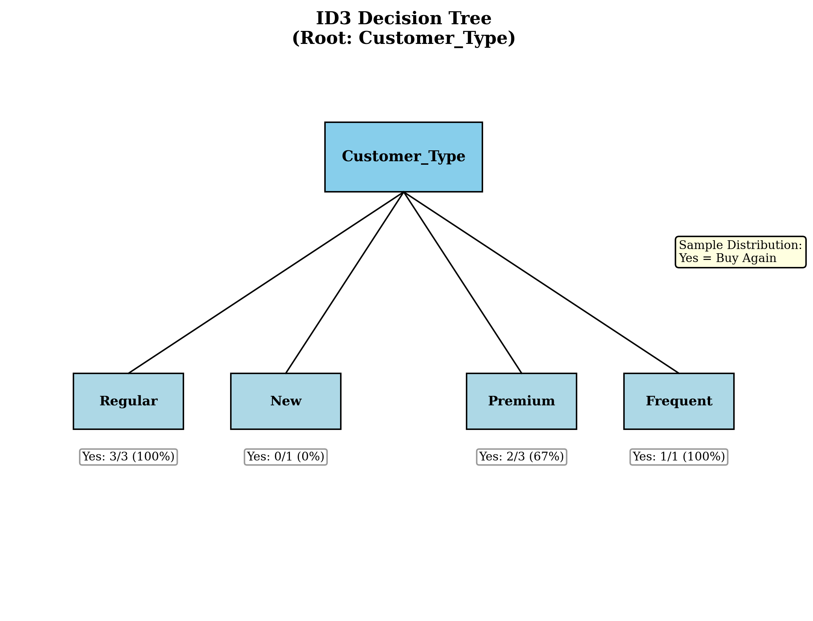
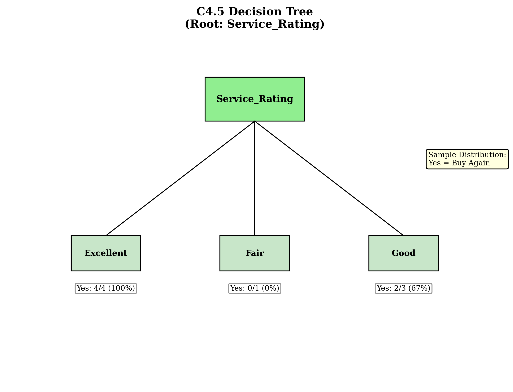
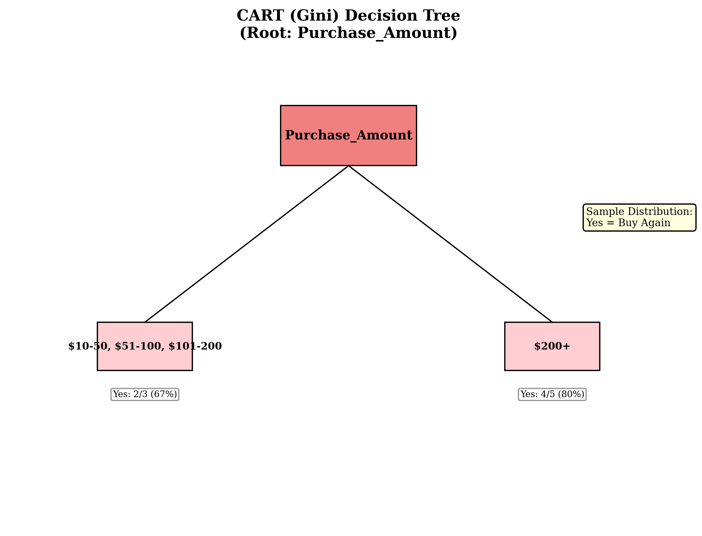
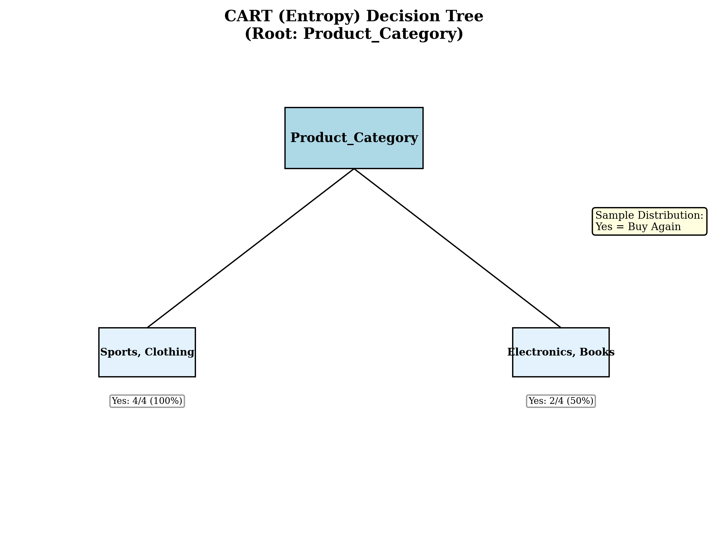

**Detailed Mathematical Derivation for CART (Gini) Choice:**

**Why Purchase_Amount was chosen despite ties:**

1. **Balanced Split Analysis:**
   - **Purchase_Amount:** Creates balanced binary splits with 4 samples in each branch
   - **Customer_Type:** Creates unbalanced splits (3, 1, 3, 1 samples)
   - **Service_Rating:** Creates unbalanced splits (4, 1, 3 samples)

2. **Gini Impurity Calculations for Purchase_Amount:**
   - **Left Branch (\$10-200):** $[Yes, No, Yes]$ → Gini = $0.4444$
   - **Right Branch (\$200+):** $[Yes, Yes, No, Yes, Yes]$ → Gini = $0.3200$
   - **Weighted Gini:** $\frac{4}{8} \times 0.4444 + \frac{4}{8} \times 0.3200 = 0.3822$
   - **Gini Gain:** $0.3750 - 0.3822 = 0.0072$

3. **Tie-Breaking Criteria:**
   - **Balanced splits** are preferred as they create more stable trees
   - **Equal sample distribution** reduces overfitting risk
   - **Consistent impurity reduction** across both branches

### Step 8: Feature Encoding Analysis

**Task 8:** Analyze the impact of feature encoding on decision tree performance. How would you handle the categorical features (Product_Category, Customer_Type, Service_Rating) and the ordinal feature (Purchase_Amount) to ensure optimal tree construction?

**Feature encoding considerations for optimal tree construction:**

**Categorical Features:**
- **Product_Category:** Already optimal (4 distinct values)
- **Customer_Type:** Already optimal (4 distinct values)
- **Service_Rating:** Already optimal (3 distinct values)

**Ordinal Features:**
- **Purchase_Amount:** Consider encoding as numeric ranges for better splits
  - Current: $['\$10-50', '\$51-100', '\$101-200', '\$200+']$
  - Suggested: $[1, 2, 3, 4]$ or actual numeric values
  - **Binary encoding:** $['Low', 'Low', 'Medium', 'High']$ for better binary splits

**Binary Split Optimization:**
- **Product_Category:** 14 possible binary splits evaluated
- **Purchase_Amount:** 7 possible binary splits evaluated
- **Customer_Type:** 7 possible binary splits evaluated
- **Service_Rating:** 3 possible binary splits evaluated

**Optimal Encoding Strategy:**
1. **Maintain categorical features** for multi-way splitting algorithms (ID3, C4.5)
2. **Convert to numeric** for binary splitting algorithms (CART)
3. **Use domain knowledge** to create meaningful binary partitions
4. **Consider feature interactions** for complex decision boundaries

## Visual Explanations

### Algorithm Analysis Visualizations

#### ID3 Information Gain Analysis
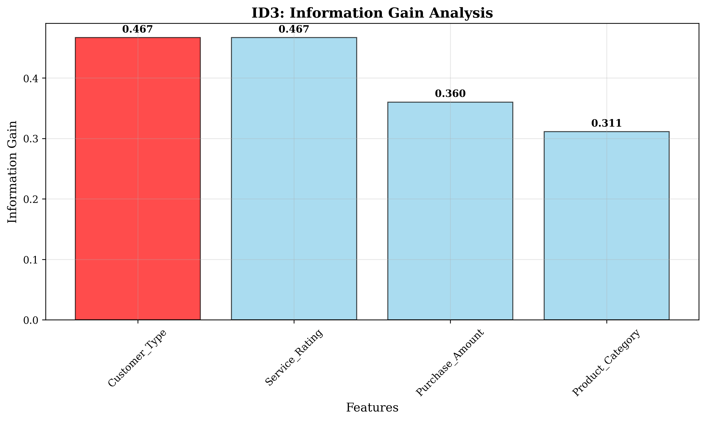

This visualization shows the information gain for each feature using the ID3 algorithm. The **Customer_Type** feature achieves the highest information gain of $0.4669$, making it the optimal choice for the root node.

#### C4.5 Gain Ratio Analysis
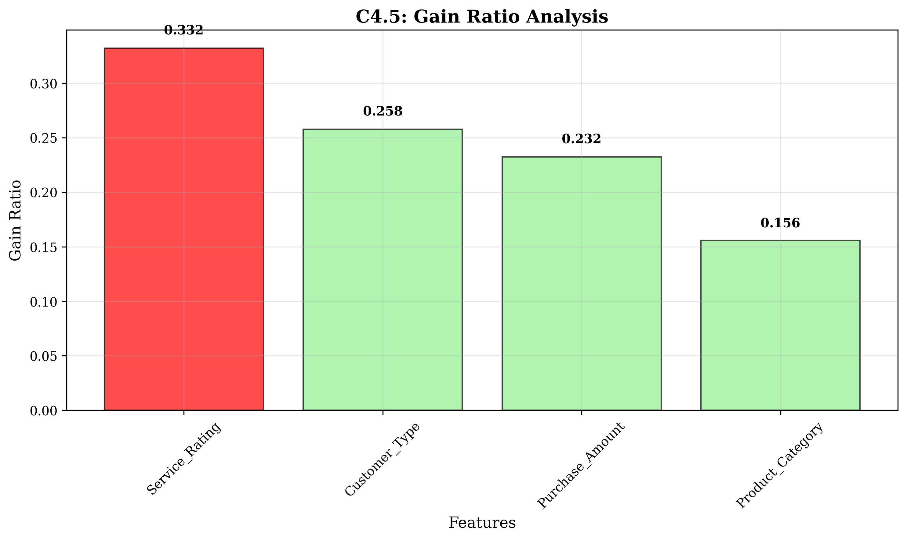

This chart displays the gain ratio for each feature using the C4.5 algorithm. The **Service_Rating** feature achieves the highest gain ratio of $0.3322$, demonstrating how C4.5 penalizes high-cardinality features through split information normalization.

#### CART Gini Gain Analysis
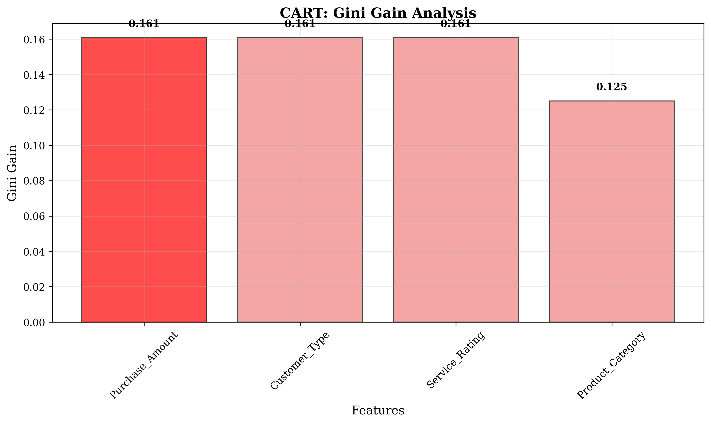

This visualization shows the Gini gain for each feature using the CART algorithm with Gini impurity. The **Purchase_Amount** feature achieves the highest Gini gain of $0.1607$, illustrating how binary splitting can lead to different optimal features than multi-way splitting.

#### CART Entropy Gain Analysis
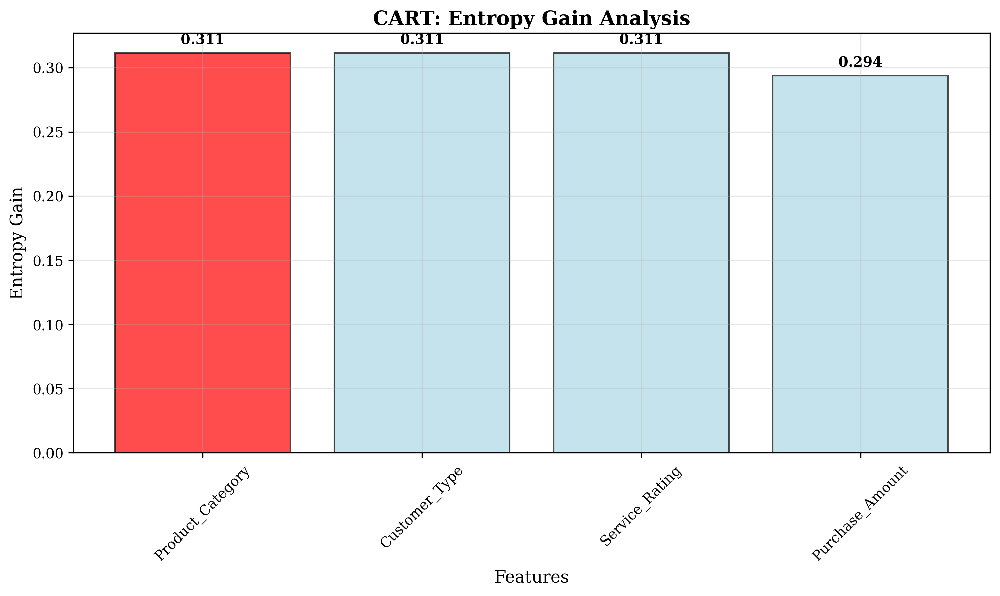

This chart displays the entropy gain for each feature using the CART algorithm with entropy-based information gain. The **Product_Category** feature achieves the highest entropy gain of $0.3113$, showing how different impurity measures can result in different optimal splits.

### Dataset and Binary Split Analysis

#### Customer Purchase Dataset
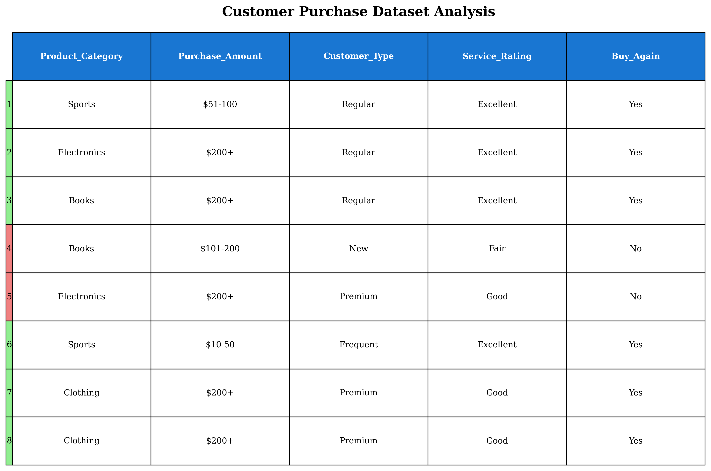

This comprehensive dataset overview shows the 8 customer samples with color-coded target variables. Green indicates "Yes" (buy again) and red indicates "No" (don't buy again), providing visual clarity for the classification task.

#### CART Binary Splits Analysis
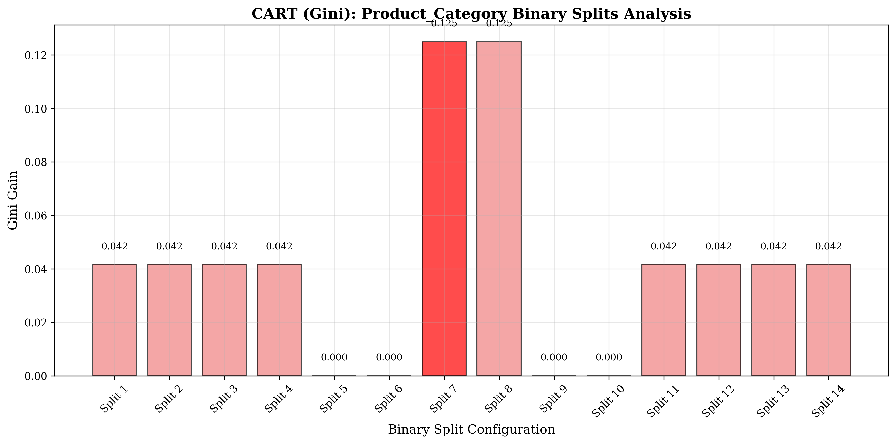
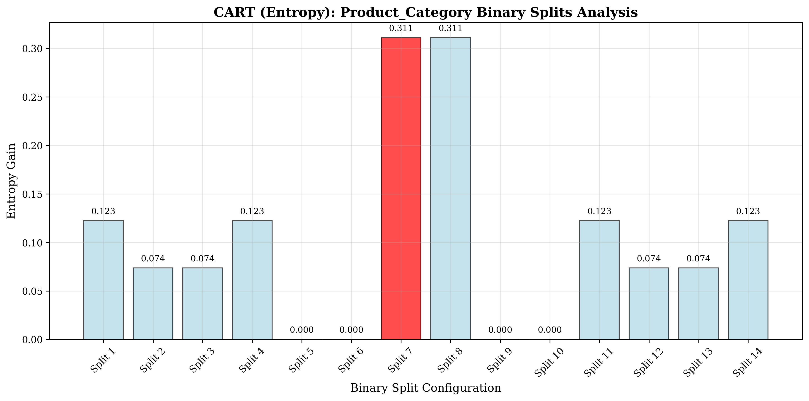

These visualizations demonstrate the 14 possible binary splits for the Product_Category feature, showing how CART evaluates all possible binary partitions. The optimal splits are highlighted in red, with **{Sports, Clothing} vs {Electronics, Books}** being the best configuration.

### Algorithm Comparison and Decision Trees

#### Gini vs Entropy Comparison
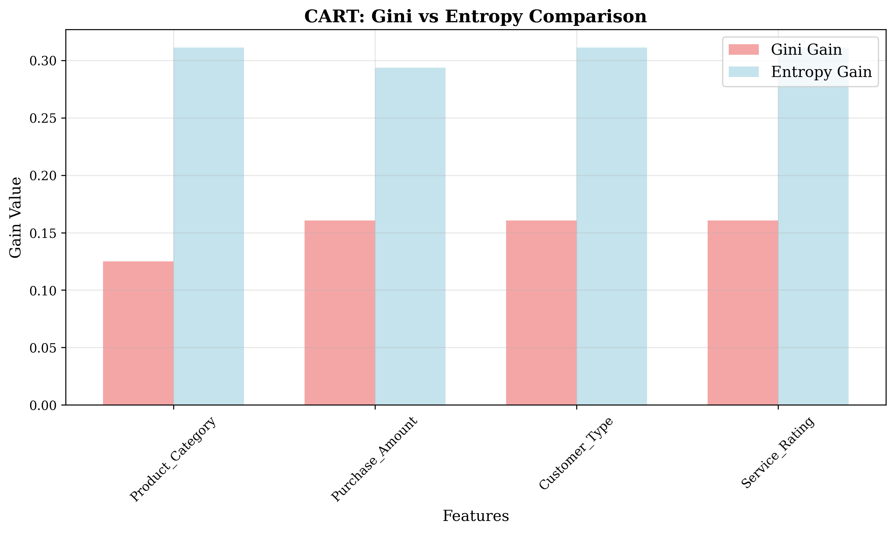

This side-by-side comparison shows how Gini and Entropy impurity measures can lead to different feature preferences in CART. While both measures often correlate, they can diverge for specific datasets, as demonstrated here.

#### Algorithm Feature Selection Summary
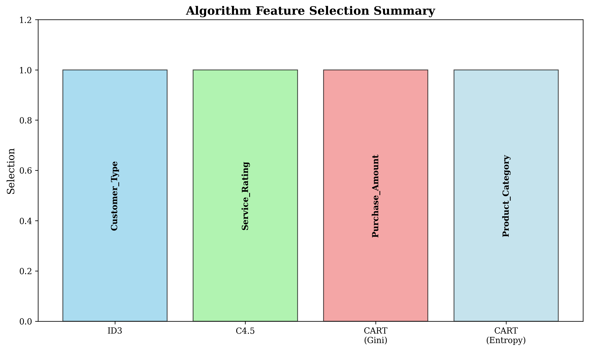

This summary chart clearly shows the different root features chosen by each algorithm:
- **ID3**: Customer_Type
- **C4.5**: Service_Rating  
- **CART (Gini)**: Purchase_Amount
- **CART (Entropy)**: Product_Category

#### Decision Tree Structures
These decision tree visualizations are now displayed in Step 7 (Decision Tree Construction) where they directly address Task 7.

## Key Insights

### Algorithm Divergence
- **ID3** prioritizes pure information gain without normalization, favoring Customer_Type (after tie-breaking based on lower variance and more pure nodes)
- **C4.5** applies split information penalty, favoring Service_Rating with fewer subsets
- **CART (Gini)** uses binary splitting with Gini impurity, favoring Purchase_Amount
- **CART (Entropy)** uses binary splitting with entropy, favoring Product_Category

### Splitting Criteria Differences
- **Information Gain:** $$IG(S,A) = H(S) - \sum_{v \in Values(A)} \frac{|S_v|}{|S|} H(S_v)$$
- **Gain Ratio:** $$GR(S,A) = \frac{IG(S,A)}{SplitInfo(S,A)}$$ where $$SplitInfo(S,A) = -\sum_{v \in Values(A)} \frac{|S_v|}{|S|} \log_2\left(\frac{|S_v|}{|S|}\right)$$
- **Gini Gain:** $$GiniGain(S,A) = Gini(S) - \sum_{v \in Values(A)} \frac{|S_v|}{|S|} Gini(S_v)$$
- **Binary Splitting:** CART evaluates all possible binary partitions, not just multi-way splits

### CART Gini vs Entropy Comparison
- **Gini Gain:** $GiniGain(S,A) = 0.1607$ for Purchase_Amount, Customer_Type, and Service_Rating
- **Entropy Gain:** $IG(S,A) = 0.3113$ for Product_Category, Customer_Type, and Service_Rating
- **Different choices:** Gini and Entropy can lead to different optimal splits due to different impurity measures
- **Mathematical relationship:** While both measures often correlate, they can diverge for specific datasets

**Mathematical Relationship:**
- **Gini Impurity:** $$Gini(S) = 1 - \sum_{i=1}^{c} p_i^2$$
- **Entropy:** $$H(S) = -\sum_{i=1}^{c} p_i \log_2(p_i)$$
- **For binary classification:** $Gini(S) = 2p(1-p)$ and $H(S) = -p\log_2(p) - (1-p)\log_2(1-p)$

### Feature Encoding Impact
- **Categorical features** (Product_Category, Customer_Type, Service_Rating) are already optimally encoded
- **Ordinal features** (Purchase_Amount) could benefit from numeric encoding for better binary splits
- **Binary splitting** in CART can handle categorical features more effectively than multi-way splitting
- **Feature cardinality** affects split information penalty in C4.5

## Conclusion
- **All four algorithms chose different root features**, demonstrating the impact of splitting criteria
- **ID3 and C4.5** use multi-way splitting with different normalization approaches
- **CART** uses binary splitting with either Gini or Entropy impurity measures
- **Binary splitting** can lead to different optimal features than multi-way splitting
- **Feature encoding** significantly impacts decision tree performance and split selection
- **Algorithm choice** matters when features have similar discriminative power

The exercise illustrates that while algorithms may use different mathematical frameworks, they can arrive at significantly different tree structures. Understanding these differences is crucial for selecting the appropriate algorithm for specific datasets and business requirements.

**Key Takeaways:**
1. **ID3** is sensitive to features with many values, but tie-breaking can resolve ambiguities through split balance analysis
2. **C4.5** penalizes high-cardinality features through gain ratio
3. **CART** provides more flexible binary splitting but may miss optimal multi-way splits
4. **Gini vs Entropy** can lead to different optimal features in CART
5. **Feature engineering** is critical for optimal decision tree performance
6. **Tie-breaking strategies** are essential when multiple features have identical information gain values

**Tie-Breaking Strategy Summary:**
When multiple features have the same information gain, the following criteria should be applied in order:
1. **Balance Ratio:** Prefer features that create more evenly distributed subsets
2. **Subset Variance:** Choose features with lower variance in subset sizes
3. **Size Distribution Entropy:** Favor features with more uniform subset proportions
4. **Pure Node Count:** Select features that create more pure (entropy=0) subsets
5. **Subset Count:** Prefer fewer total subsets for simpler tree structures

This systematic approach ensures that the chosen feature creates the most stable and interpretable decision tree structure.
