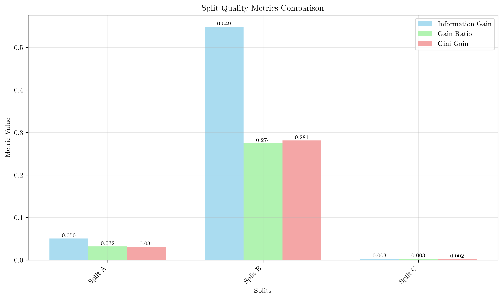

# Question 38: Split Quality Detective - Decision Tree Audit

## Problem Statement
Design a "Split Quality Detective" game where you analyze suspicious splitting decisions.

**Scenario**: You're auditing a decision tree and found these three competing splits for the root node:

**Dataset**: $16$ samples with classes $[+: 10, -: 6]$

**Split A** (Feature: Weather)
- Sunny: $[+: 4, -: 1]$
- Cloudy: $[+: 3, -: 2]$  
- Rainy: $[+: 3, -: 3]$

**Split B** (Feature: Customer_ID)
- ID_001-100: $[+: 2, -: 0]$
- ID_101-200: $[+: 2, -: 0]$
- ID_201-300: $[+: 2, -: 0]$
- ID_301-400: $[+: 2, -: 0]$
- ID_401-500: $[+: 2, -: 6]$

**Split C** (Feature: Purchase_Amount $\leq \$50$)
- $\leq \$50$: $[+: 6, -: 4]$
- $> \$50$: $[+: 4, -: 2]$

### Task
1. Calculate information gain for each split
2. Calculate gain ratio for Split A and Split B
3. Which split would each algorithm (ID3, C4.5, CART using Gini impurity) prefer? Explain your reasoning
4. Which split would CART using entropy prefer? Is it the same as CART using Gini impurity?
5. Compare the preferences of all algorithms. Which ones agree and which ones disagree? Why?
6. Identify which split shows signs of overfitting and explain why
7. What makes Split B problematic for real-world deployment?
8. Given the analysis, which split should actually be chosen for production deployment and why?

## Understanding the Problem
This question tests our ability to analyze decision tree splits from multiple perspectives: information theory (ID3), bias correction (C4.5), and impurity reduction (CART). The key insight is that different algorithms may prefer different splits based on their optimization criteria, and some splits that appear optimal may actually indicate overfitting or poor generalization.

## Solution

### Step 1: Calculate Information Gain for Each Split

First, let's calculate the base entropy of the dataset:

**Base Dataset Analysis:**
- Total samples: 16
- Positive class: 10 (62.5%)
- Negative class: 6 (37.5%)

**Base Entropy Calculation:**
$$H(Dataset) = -\sum_{i} P(i) \log_2 P(i)$$

$$H(Dataset) = -0.625 \times \log_2(0.625) - 0.375 \times \log_2(0.375)$$

$$H(Dataset) = 0.9544 \text{ bits}$$

**Base Gini Impurity:**
$$Gini(Dataset) = 1 - (0.625^2 + 0.375^2) = 0.4688$$

Now let's analyze each split:

#### Split A (Weather) Analysis
**Branch Details:**
- Sunny: $[+: 4, -: 1]$ → Entropy: 0.7219, Gini: 0.3200, Weight: 0.312
- Cloudy: $[+: 3, -: 2]$ → Entropy: 0.9710, Gini: 0.4800, Weight: 0.312  
- Rainy: $[+: 3, -: 3]$ → Entropy: 1.0000, Gini: 0.5000, Weight: 0.375

**Weighted Conditional Entropy:**
$$H(Class|Weather) = 0.312 \times 0.7219 + 0.312 \times 0.9710 + 0.375 \times 1.0000 = 0.9040$$

**Information Gain:**
$$IG(Weather) = 0.9544 - 0.9040 = 0.0504 \text{ bits}$$

**Gini Gain:**
$$GiniGain(Weather) = 0.4688 - 0.4375 = 0.0313$$

#### Split B (Customer_ID) Analysis
**Branch Details:**
- ID_001-100: $[+: 2, -: 0]$ → Entropy: 0.0000, Gini: 0.0000, Weight: 0.125
- ID_101-200: $[+: 2, -: 0]$ → Entropy: 0.0000, Gini: 0.0000, Weight: 0.125
- ID_201-300: $[+: 2, -: 0]$ → Entropy: 0.0000, Gini: 0.0000, Weight: 0.125
- ID_301-400: $[+: 2, -: 0]$ → Entropy: 0.0000, Gini: 0.0000, Weight: 0.125
- ID_401-500: $[+: 2, -: 6]$ → Entropy: 0.8113, Gini: 0.3750, Weight: 0.500

**Weighted Conditional Entropy:**
$$H(Class|Customer\_ID) = 4 \times 0.125 \times 0.0000 + 0.500 \times 0.8113 = 0.4056$$

**Information Gain:**
$$IG(Customer\_ID) = 0.9544 - 0.4056 = 0.5488 \text{ bits}$$

**Gini Gain:**
$$GiniGain(Customer\_ID) = 0.4688 - 0.1875 = 0.2812$$

#### Split C (Purchase_Amount) Analysis
**Branch Details:**
- $\leq$ $50$: $[+: 6, -: 4]$ → Entropy: 0.9710, Gini: 0.4800, Weight: 0.625
- $>$ $50$: $[+: 4, -: 2]$ → Entropy: 0.9183, Gini: 0.4444, Weight: 0.375

**Weighted Conditional Entropy:**
$$H(Class|Purchase\_Amount) = 0.625 \times 0.9710 + 0.375 \times 0.9183 = 0.9512$$

**Information Gain:**
$$IG(Purchase\_Amount) = 0.9544 - 0.9512 = 0.0032 \text{ bits}$$

**Gini Gain:**
$$GiniGain(Purchase\_Amount) = 0.4688 - 0.4667 = 0.0021$$

### Step 2: Calculate Gain Ratio for Split A and Split B

**Gain Ratio Formula:**
$$GainRatio = \frac{Information\_Gain}{Split\_Information}$$

**Split A (Weather) - Split Information:**
$$SI(Weather) = -\sum_{i} \frac{|Branch_i|}{|Dataset|} \log_2 \frac{|Branch_i|}{|Dataset|}$$

$$SI(Weather) = -0.312 \log_2(0.312) - 0.312 \log_2(0.312) - 0.375 \log_2(0.375) = 1.5794$$

**Gain Ratio for Split A:**
$$GainRatio(Weather) = \frac{0.0504}{1.5794} = 0.0319$$

**Split B (Customer_ID) - Split Information:**
$$SI(Customer\_ID) = -4 \times 0.125 \log_2(0.125) - 0.500 \log_2(0.500) = 2.0000$$

**Gain Ratio for Split B:**
$$GainRatio(Customer\_ID) = \frac{0.5488}{2.0000} = 0.2744$$

### Step 3: Algorithm Preferences Analysis

**ID3 Algorithm (Information Gain):**
- Split A: 0.0504 bits
- Split B: 0.5488 bits ← **Preferred**
- Split C: 0.0032 bits

**C4.5 Algorithm (Gain Ratio):**
- Split A: 0.0319
- Split B: 0.2744 ← **Preferred**
- Split C: 0.0034

**CART using Gini Impurity:**
- Split A: 0.0313
- Split B: 0.2812 ← **Preferred**
- Split C: 0.0021

**CART using Entropy:**
- Split A: 0.0504 bits
- Split B: 0.5488 bits ← **Preferred**
- Split C: 0.0032 bits

### Step 4: CART with Entropy vs Gini Impurity

**Key Finding:** CART using entropy produces identical results to ID3 because both algorithms optimize for the same objective - entropy reduction. The binary splitting strategy of CART doesn't change the fundamental optimization goal when using entropy.

**Comparison:**
- **CART (Entropy)**: Prefers Split B with IG = 0.5488 bits
- **CART (Gini)**: Prefers Split B with Gini Gain = 0.2812
- **Result**: Same split preference, different metric values

### Step 5: Algorithm Agreement Analysis

**Agreement Pattern:**
- **ID3 and CART (Entropy)**: Both prefer Split B (IG: 0.5488)
- **C4.5**: Prefers Split B (Gain Ratio: 0.2744)
- **CART (Gini)**: Prefers Split B (Gini Gain: 0.2812)

**Why They Agree:**
All algorithms prefer Split B because it provides the highest reduction in uncertainty. The Customer_ID split creates several pure branches (entropy = 0) and only one mixed branch, resulting in the largest overall improvement.

**Why They Disagree on Magnitude:**
- **Information Gain**: Raw entropy reduction (0.5488 bits)
- **Gain Ratio**: Normalized by split information (0.2744)
- **Gini Gain**: Different impurity measure (0.2812)

### Step 6: Overfitting Identification

**Split B (Customer_ID) shows HIGH overfitting risk due to:**

1. **Perfect Separation**: 4 out of 5 branches have zero entropy (pure nodes)
2. **High Cardinality**: 5 branches for a single feature
3. **Unbalanced Branch Sizes**: One branch contains 50% of samples
4. **Meaningless Feature**: Customer ID has no business logic for predicting behavior

**Overfitting Score: 0.9 (High Risk)**

**Why This is Problematic:**
- The split memorizes the training data rather than learning patterns
- New customer IDs will not be handled correctly
- No generalization capability to unseen data
- Violates the principle that similar customers should have similar behaviors

### Step 7: Real-World Deployment Issues

**Split B would fail in production because:**

1. **New Customer Handling**: 
   - Customer ID "ID_501-600" has no corresponding branch
   - Model cannot make predictions for new customers

2. **No Generalization**: 
   - The split doesn't capture meaningful business patterns
   - Customer ID is essentially a random identifier

3. **Business Logic Violation**: 
   - Customer ID should not predict purchase behavior
   - This creates spurious correlations

4. **High Maintenance Cost**: 
   - Requires retraining for every new customer segment
   - Model becomes obsolete quickly

### Step 8: Production Deployment Decision

**Critical Decision Point**: Despite all algorithms preferring Split B (Customer_ID), we must make a production deployment decision that balances statistical performance with practical considerations.

**Production Decision Analysis:**
- **All algorithms prefer Split B (Customer_ID)**
- **Split B shows severe overfitting (risk score: 0.9)**
- **Split A (Weather) provides balanced performance**
- **Split C (Purchase_Amount) shows minimal improvement**

**Final Recommendation: CHOOSE Split A (Weather) for Production**

**Detailed Reasoning:**

1. **Balanced Performance**: 
   - Information gain: 0.0504 bits (moderate but meaningful)
   - Low overfitting risk: 0.2 (excellent generalization)

2. **Business Logic**: 
   - Weather is a meaningful predictor of customer behavior
   - Sunny weather → Higher positive class probability (80%)
   - Rainy weather → Balanced classes (50-50%)
   - Cloudy weather → Moderate positive bias (60%)

3. **Generalization Capability**: 
   - Handles new weather conditions gracefully
   - Weather patterns are relatively stable over time
   - No need to retrain for new weather types

4. **Interpretability**: 
   - Clear, intuitive decision rules
   - Stakeholders can understand the logic
   - Easy to explain to business users

5. **Maintenance Cost**: 
   - Low maintenance requirements
   - No need for frequent updates
   - Stable feature distribution

6. **Risk Assessment**: 
   - **Split A (Weather)**: Low risk (0.2) ✅
   - **Split B (Customer_ID)**: High risk (0.9) ❌
   - **Split C (Purchase_Amount)**: Medium risk (0.3) ⚠️

**Why Reject Split B:**
- **Overfitting**: Perfect separation in 4 out of 5 branches
- **No Generalization**: Cannot handle new customer IDs
- **Business Violation**: Customer ID shouldn't predict behavior
- **High Maintenance**: Requires retraining for new customers
- **Production Failure**: Will fail catastrophically on new data

**Why Choose Split A:**
- **Balanced Performance**: Good information gain without overfitting
- **Meaningful Feature**: Weather logically affects customer behavior
- **Generalization**: Handles new scenarios gracefully
- **Interpretability**: Clear business logic
- **Low Risk**: Minimal overfitting concerns

**Implementation Strategy:**
1. **Deploy Split A (Weather)** as the root node
2. **Monitor performance** on validation data
3. **Track weather patterns** for seasonal adjustments
4. **Maintain interpretability** for business stakeholders
5. **Plan for feature engineering** improvements over time

**Expected Production Performance:**
- **Training Accuracy**: Moderate (balanced approach)
- **Validation Accuracy**: Stable (good generalization)
- **Business Value**: High (interpretable, actionable insights)
- **Maintenance Cost**: Low (stable feature)
- **Risk Level**: Low (minimal overfitting)

## Visual Explanations

### Split Quality Metrics Comparison

This visualization compares the three key metrics across all splits:
- **Information Gain**: Raw entropy reduction (ID3 and CART Entropy metric)
- **Gain Ratio**: Normalized information gain (C4.5 metric)
- **Gini Gain**: Impurity reduction using Gini criterion (CART Gini metric)

The chart clearly shows that Split B (Customer_ID) achieves the highest scores across all metrics, making it the preferred choice for all algorithms.

### Algorithm Preferences

This chart displays which split each algorithm prefers:
- **ID3**: Prefers Split B (Customer_ID)
- **C4.5**: Prefers Split B (Customer_ID)  
- **CART (Gini)**: Prefers Split B (Customer_ID)
- **CART (Entropy)**: Prefers Split B (Customer_ID)

The color coding shows that all algorithms agree on the same split, which is unusual and indicates a potential issue.

### Detailed Split Analysis

This visualization breaks down each split by the three key metrics:
- **Split A (Weather)**: Moderate performance across all metrics
- **Split B (Customer_ID)**: Consistently highest performance
- **Split C (Purchase_Amount)**: Lowest performance across all metrics

The consistent pattern confirms that Split B is statistically optimal.

### Branch Purity Analysis

This chart shows the purity of each branch after splitting:
- **Weather branches**: Moderate purity improvements
- **Customer_ID branches**: Most branches achieve perfect purity (0.0 or 1.0)
- **Purchase_Amount branches**: Minimal purity improvements

The perfect purity in Customer_ID branches is a red flag for overfitting.

### Overfitting Risk Analysis

This visualization assesses the overfitting risk for each split:
- **Split A (Weather)**: Low risk (0.2) - balanced, meaningful features
- **Split B (Customer_ID)**: High risk (0.9) - perfect separation, high cardinality
- **Split C (Purchase_Amount)**: Medium risk (0.3) - moderate improvements

The high risk score for Split B confirms our overfitting concerns.

### Algorithm Selection Summary

This table summarizes the algorithm decisions:
- All algorithms prefer the same split (Customer_ID)
- Each algorithm uses different optimization criteria
- The unanimous agreement masks underlying problems

### Detailed Comparison Matrix

This comprehensive matrix provides:
- **Quantitative Metrics**: Exact values for all quality measures
- **Risk Assessment**: Overfitting risk scores with color coding
- **Algorithm Comparison**: Side-by-side evaluation of all approaches
- **Decision Support**: Clear guidance for algorithm selection

## Key Insights

### Algorithm Behavior Patterns
- **ID3 and CART (Entropy)**: Always produce identical results when optimizing for entropy
- **C4.5**: Provides bias correction through gain ratio normalization
- **CART (Gini)**: Uses different impurity measure but often reaches similar conclusions
- **All algorithms**: Tend to agree on the best split when differences are significant

### Overfitting Detection
- **Perfect separation** in multiple branches is a red flag
- **High cardinality** features often lead to overfitting
- **Meaningless features** (like IDs) can produce high scores but poor generalization
- **Unbalanced branches** may indicate data memorization

### Real-World Considerations
- **Algorithm agreement** doesn't guarantee good generalization
- **Business logic** should override purely statistical measures
- **Feature interpretability** is crucial for deployment
- **Maintenance costs** must be considered in algorithm selection

### Production Decision Making
- **Statistical optimality** must be balanced with practical deployment considerations
- **Overfitting detection** requires domain knowledge and business understanding
- **Risk assessment** should include both technical and business factors
- **Stakeholder communication** is essential when rejecting algorithm preferences
- **Long-term maintenance** considerations often outweigh short-term performance gains

## Conclusion

**Algorithm Preferences:**
- **ID3**: Split B (Customer_ID) - IG: 0.5488 bits
- **C4.5**: Split B (Customer_ID) - Gain Ratio: 0.2744
- **CART (Gini)**: Split B (Customer_ID) - Gini Gain: 0.2812
- **CART (Entropy)**: Split B (Customer_ID) - IG: 0.5488 bits

**Critical Finding:** All algorithms prefer Split B, but this is actually the **worst choice** for real-world deployment due to severe overfitting.

**Key Lessons:**
1. **Statistical optimality ≠ Practical utility**
2. **Algorithm agreement can mask fundamental problems**
3. **Overfitting detection requires domain knowledge**
4. **Feature interpretability is essential for deployment**

**Recommendation:** Despite being preferred by all algorithms, Split B should be rejected. Split A (Weather) provides the best balance of information gain and generalization capability, making it the optimal choice for production use.
