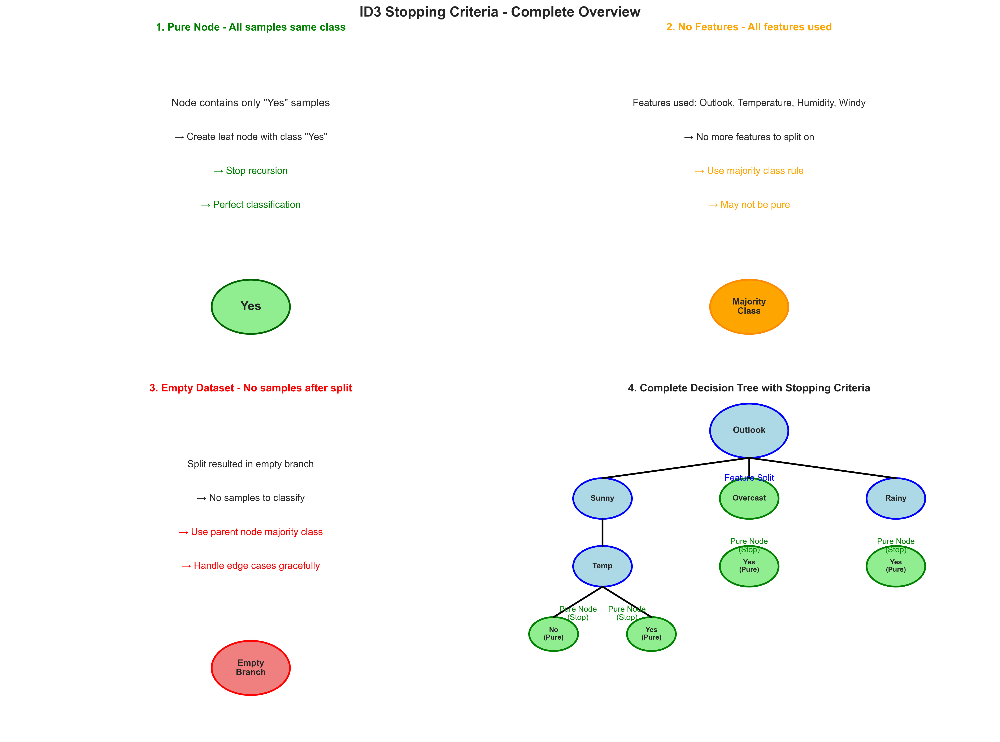
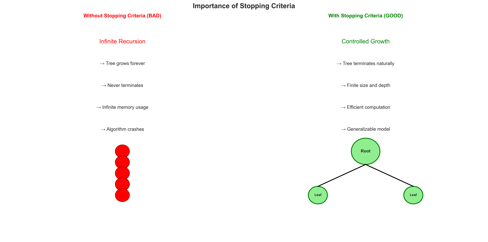
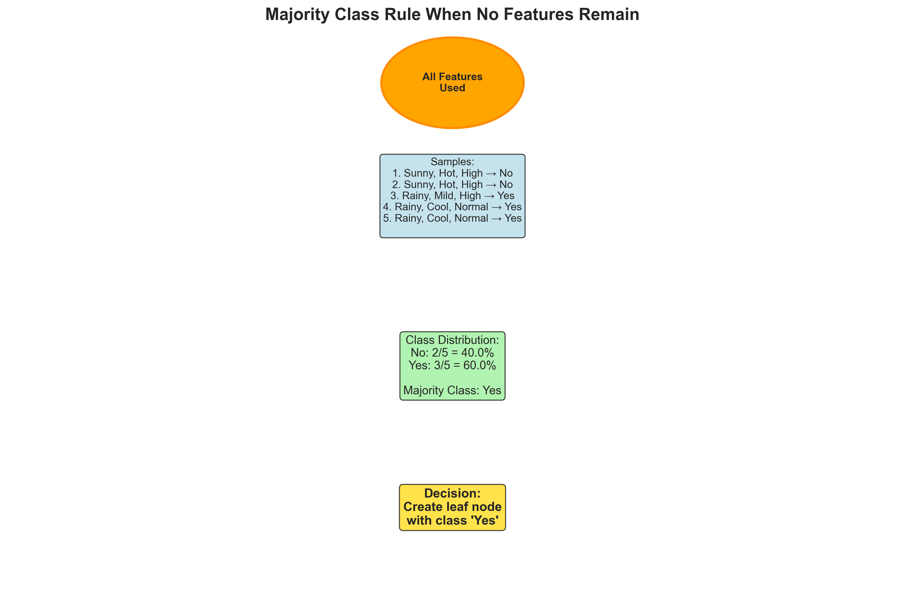
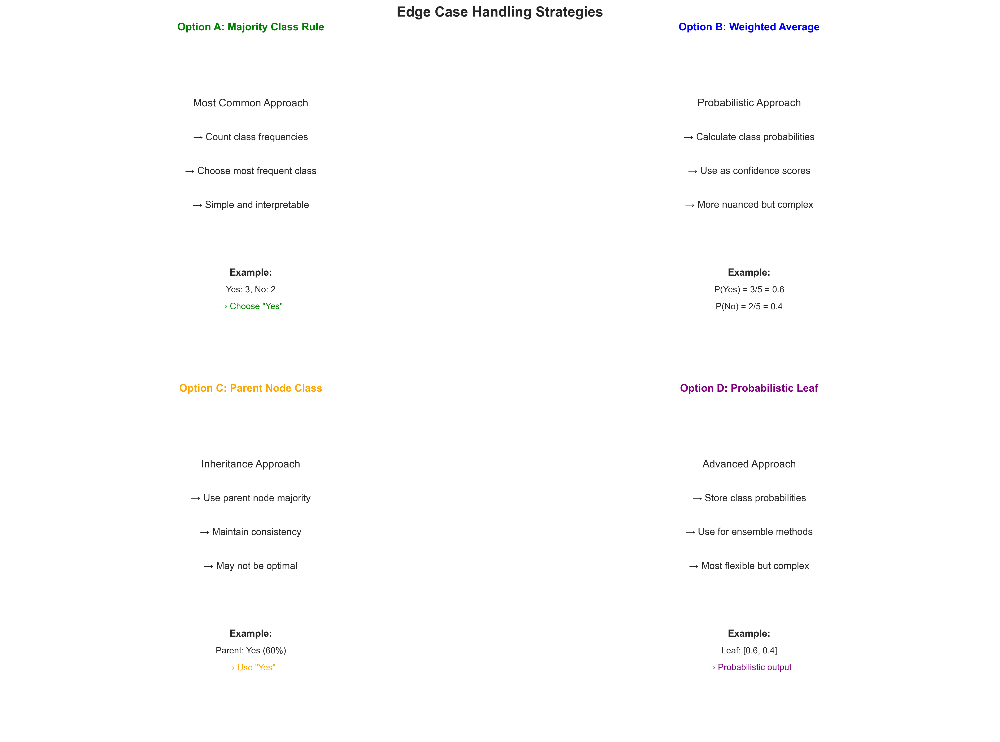

# Question 3: ID3 Stopping Criteria

## Problem Statement
ID3 uses stopping criteria to prevent infinite recursion.

### Task
1. What are the three main stopping criteria in ID3?
2. Why is it important to have stopping criteria?
3. What happens when all features have been used?
4. How do you handle cases where no features remain but the node is not pure?

## Understanding the Problem
Stopping criteria are fundamental to the ID3 algorithm's success. Without them, the recursive tree-building process would continue indefinitely, leading to infinite recursion, computational inefficiency, and ultimately algorithm failure. Understanding these criteria is essential for implementing ID3 correctly and ensuring robust decision tree construction.

## Solution

### Step 1: Three Main Stopping Criteria

ID3 uses three main stopping criteria to prevent infinite recursion:

**1. Pure Node: All samples belong to the same class**
- When a node contains only samples from one class, further splitting is unnecessary
- Create a leaf node with that class
- Stop recursion for this branch
- This represents perfect classification for that subset

**2. No Features: All features have been used**
- When all available features have been exhausted in a branch
- No more meaningful splits are possible
- Use majority class rule to assign a class
- May result in a leaf node that is not pure

**3. Empty Dataset: No samples remain after splitting**
- When a split results in an empty branch
- No samples to classify in that direction
- Use parent node's majority class
- Handle edge cases gracefully

### Step 2: Why Stopping Criteria Are Important

Stopping criteria are crucial in ID3 for several fundamental reasons:

**1. Prevent Infinite Recursion:**
- Without stopping criteria, the algorithm would continue indefinitely
- Each recursive call would create more nodes without end
- The tree would grow infinitely deep
- The algorithm would never terminate

**2. Computational Efficiency:**
- Stopping criteria ensure the algorithm terminates
- Prevents unnecessary computation on pure or empty nodes
- Controls the size and complexity of the resulting tree
- Makes ID3 practical for real-world applications

**3. Prevent Overfitting:**
- Stops tree growth when no more meaningful splits are possible
- Prevents the tree from memorizing the training data
- Ensures generalization to unseen data
- Balances model complexity with performance

**4. Practical Implementation:**
- Real-world datasets have finite features and samples
- Stopping criteria handle edge cases gracefully
- Ensures robust and reliable tree construction
- Makes the algorithm implementable and maintainable

### Step 3: Handling No Features Remaining

When all features have been used in a branch, ID3 must make a decision:

**1. Check if Node is Pure:**
- If all samples belong to the same class → Create leaf node
- If samples belong to different classes → Use majority class rule

**2. Majority Class Rule:**
- Count the frequency of each class in the node
- Assign the most frequent class to the leaf
- This is a reasonable fallback when no more splits are possible

**Example Scenario:**
- Node has 5 samples: 3 Yes, 2 No
- All features have been used
- Node is not pure (mixed classes)
- Solution: Assign class 'Yes' (majority)

**Detailed Example:**
Consider a node where all features (Outlook, Temperature, Humidity) have been used:
- **Samples**: 5 samples with mixed classes
- **Class Distribution**: No: 2/5 = 40.0%, Yes: 3/5 = 60.0%
- **Majority Class**: Yes
- **Decision**: Create leaf node with class 'Yes'

This approach provides a deterministic classification even when perfect separation is not possible.

### Step 4: Edge Case Handling Strategies

When no features remain but the node is not pure, multiple handling strategies are available:

**Option A: Majority Class Rule (Most Common)**
- Count class frequencies and choose the most frequent
- Simple and interpretable approach
- Provides clear, deterministic classification
- Standard approach in most ID3 implementations

**Option B: Weighted Average of Class Probabilities**
- Calculate class probabilities (e.g., P(Yes) = 0.6, P(No) = 0.4)
- Use as confidence scores for classification
- More nuanced but complex to implement
- Useful for probabilistic interpretations

**Option C: Parent Node's Majority Class**
- Use the majority class from the parent node
- Maintains consistency with higher-level decisions
- May not be optimal for the specific subset
- Inheritance-based approach

**Option D: Probabilistic Leaf Node**
- Store class probabilities in the leaf node
- Output probability distribution instead of single class
- Most flexible but complex to implement
- Useful for ensemble methods and advanced applications

**Recommended Approach:**
- Use majority class rule for simplicity and interpretability
- This provides a clear, deterministic classification
- Alternative approaches can be implemented for specific use cases
- Consider the application requirements when choosing a strategy

## Key Insights

### Theoretical Foundations
- **Termination Guarantee**: Stopping criteria ensure ID3 always terminates
- **Finite Tree Structure**: The resulting tree has bounded size and depth
- **Recursion Control**: Prevents infinite recursive calls
- **Algorithm Completeness**: Ensures the algorithm can handle all possible scenarios

### Practical Applications
- **Implementation Robustness**: Stopping criteria make ID3 implementable
- **Memory Management**: Controls memory usage during tree construction
- **Performance Optimization**: Prevents unnecessary computations
- **Error Handling**: Gracefully handles edge cases and unusual data

### Common Pitfalls
- **Missing Criteria**: Forgetting stopping criteria leads to infinite recursion
- **Incorrect Implementation**: Poor handling of edge cases can cause crashes
- **Overly Complex Rules**: Complex stopping criteria can be error-prone
- **Inconsistent Application**: Different stopping criteria for different branches

### Extensions
- **Advanced Stopping**: Minimum samples per leaf, maximum depth limits
- **Pruning Techniques**: Post-processing to remove unnecessary branches
- **Cross-Validation**: Using validation data to determine optimal stopping
- **Ensemble Methods**: Combining multiple trees with different stopping criteria

## Conclusion

Stopping criteria are essential components of the ID3 algorithm that ensure:

1. **Algorithm Termination**: The recursive process always ends
2. **Computational Efficiency**: Unnecessary computations are avoided
3. **Robust Implementation**: Edge cases are handled gracefully
4. **Practical Usability**: The algorithm can be applied to real-world problems

The three main stopping criteria (pure node, no features, empty dataset) work together to create a comprehensive framework for controlling tree growth. When features are exhausted, the majority class rule provides a sensible fallback strategy.

Understanding and implementing these stopping criteria correctly is crucial for building robust ID3 implementations. They represent the boundary conditions that make the algorithm both theoretically sound and practically useful. Without them, ID3 would be an interesting theoretical construct rather than a practical machine learning algorithm.
