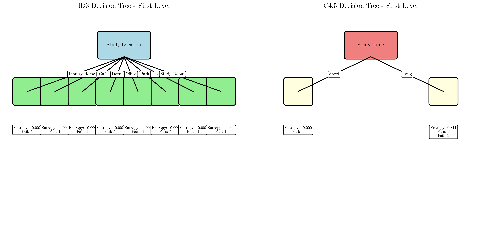

# Question 43: Student Study Habits Mystery

## Problem Statement
You are a "Decision Tree Detective" investigating a mysterious dataset about student study habits. Your mission is to solve the case using only ID3 and C4.5 algorithms to see how they approach the same evidence differently.

**Dataset: Student Study Habits Mystery**

| Study_Time | Study_Location | Coffee_Consumption | Exam_Result |
|------------|----------------|-------------------|-------------|
| Short      | Library        | None              | Fail        |
| Short      | Home           | High              | Fail        |
| Short      | Cafe           | None              | Fail        |
| Short      | Dorm           | High              | Fail        |
| Long       | Office         | None              | Pass        |
| Long       | Park           | High              | Pass        |
| Long       | Lab            | None              | Pass        |
| Long       | Study_Room     | High              | Fail        |

### Task
1. Calculate information gain for each feature using ID3's approach. Which feature would ID3 choose as the root node?
2. Calculate gain ratio for each feature using C4.5's approach. Which feature would C4.5 choose as the root node?
3. Draw the first level of the decision tree that each algorithm would construct. Use boxes for nodes and arrows for branches.
4. Create a simple table showing:
   - Feature name
   - Information gain (ID3)
   - Split information
   - Gain ratio (C4.5)
   - Which algorithm prefers it
5. If you were a student trying to maximize your chances of passing, which algorithm's advice would you follow and why?
6. Design a new student record that would make both algorithms agree on the root split. What does this reveal about the fundamental differences between ID3 and C4.5?

## Understanding the Problem
This problem explores the fundamental differences between two decision tree algorithms: ID3 and C4.5. Both algorithms use information theory concepts to determine the best feature to split on at each node, but they employ different splitting criteria that can lead to different tree structures.

The key concepts involved are:
- **Entropy**: A measure of impurity or uncertainty in a dataset
- **Information Gain**: The reduction in entropy achieved by splitting on a feature (ID3 approach)
- **Split Information**: A measure of how much a feature splits the data (C4.5 approach)
- **Gain Ratio**: Information gain normalized by split information (C4.5 approach)

The dataset contains 8 students with 3 features and a binary target variable (Pass/Fail). The algorithms must determine which feature provides the best split at the root node.

## Solution

### Step 1: Calculate the Entropy of the Entire Dataset
First, we need to calculate the entropy of the target variable (Exam_Result) across all samples.

**Target variable distribution:**
- Pass: 3 samples
- Fail: 5 samples

**Entropy calculation:**
$$H(S) = -\sum_{i=1}^{c} p_i \log_2(p_i)$$

Where $p_i$ is the probability of class $i$:
- $p_{Pass} = \frac{3}{8} = 0.375$
- $p_{Fail} = \frac{5}{8} = 0.625$

$$H(S) = -(0.375 \log_2(0.375) + 0.625 \log_2(0.625)) = 0.9544$$

The total entropy of the dataset is **0.9544**.

### Step 2: Calculate Information Gain for Each Feature (ID3 Approach)
Information Gain measures how much entropy is reduced by splitting on a feature:

$$IG(S, A) = H(S) - \sum_{v \in Values(A)} \frac{|S_v|}{|S|} H(S_v)$$

Where:
- $H(S)$ is the entropy of the parent node
- $S_v$ is the subset of samples where feature $A$ has value $v$
- $|S_v|$ is the size of subset $S_v$
- $|S|$ is the total number of samples

#### Study_Time Feature
**Values:** Short, Long
- **Short (4 samples):** All Fail → Entropy = 0
- **Long (4 samples):** 3 Pass, 1 Fail → Entropy = 0.8113

**Weighted Entropy:** $\frac{4}{8} \times 0 + \frac{4}{8} \times 0.8113 = 0.4056$

**Information Gain:** $0.9544 - 0.4056 = 0.5488$

#### Study_Location Feature
**Values:** Library, Home, Cafe, Dorm, Office, Park, Lab, Study_Room
- Each value has exactly 1 sample with 0 entropy
- **Weighted Entropy:** $\sum_{i=1}^{8} \frac{1}{8} \times 0 = 0$

**Information Gain:** $0.9544 - 0 = 0.9544$

#### Coffee_Consumption Feature
**Values:** None, High
- **None (4 samples):** 2 Pass, 2 Fail → Entropy = 1.0000
- **High (4 samples):** 1 Pass, 3 Fail → Entropy = 0.8113

**Weighted Entropy:** $\frac{4}{8} \times 1.0000 + \frac{4}{8} \times 0.8113 = 0.9056$

**Information Gain:** $0.9544 - 0.9056 = 0.0488$

### Step 3: Calculate Gain Ratio for Each Feature (C4.5 Approach)
Gain Ratio normalizes Information Gain by Split Information to reduce bias toward features with many values:

$$GR(S, A) = \frac{IG(S, A)}{SI(S, A)}$$

Where Split Information is:
$$SI(S, A) = -\sum_{v \in Values(A)} \frac{|S_v|}{|S|} \log_2\left(\frac{|S_v|}{|S|}\right)$$

#### Study_Time Feature
**Split Information:** $-\left(\frac{4}{8} \log_2\left(\frac{4}{8}\right) + \frac{4}{8} \log_2\left(\frac{4}{8}\right)\right) = 1.0000$

**Gain Ratio:** $\frac{0.5488}{1.0000} = 0.5488$

#### Study_Location Feature
**Split Information:** $-\sum_{i=1}^{8} \frac{1}{8} \log_2\left(\frac{1}{8}\right) = 3.0000$

**Gain Ratio:** $\frac{0.9544}{3.0000} = 0.3181$

#### Coffee_Consumption Feature
**Split Information:** $-\left(\frac{4}{8} \log_2\left(\frac{4}{8}\right) + \frac{4}{8} \log_2\left(\frac{4}{8}\right)\right) = 1.0000$

**Gain Ratio:** $\frac{0.0488}{1.0000} = 0.0488$

### Step 4: Summary Table
| Feature | Information Gain (ID3) | Split Information | Gain Ratio (C4.5) | Preferred By |
|---------|------------------------|-------------------|-------------------|--------------|
| Study_Time | 0.5488 | 1.0000 | 0.5488 | C4.5 |
| Study_Location | 0.9544 | 3.0000 | 0.3181 | ID3 |
| Coffee_Consumption | 0.0488 | 1.0000 | 0.0488 | Neither |

## Visual Explanations

### Decision Tree Comparison

The visualization shows the first level of decision trees that each algorithm would construct:

**ID3 Decision Tree (Left):**
- Root node: Study_Location
- Branches to 8 child nodes (one for each location)
- Each child node has 0 entropy (perfect separation)

**C4.5 Decision Tree (Right):**
- Root node: Study_Time
- Branches to 2 child nodes (Short and Long)
- Short branch has 0 entropy, Long branch has 0.8113 entropy

### Feature Comparison

The bar charts compare the splitting criteria for each algorithm:

**Information Gain (ID3):**
- Study_Location has the highest value (0.9544)
- Study_Time is second (0.5488)
- Coffee_Consumption is lowest (0.0488)

**Gain Ratio (C4.5):**
- Study_Time has the highest value (0.5488)
- Study_Location is second (0.3181)
- Coffee_Consumption is lowest (0.0488)

### Entropy Distribution

This visualization shows the entropy distribution for each feature value:
- **Pure splits (Entropy = 0):** Study_Location creates 8 pure splits (each location has exactly 1 sample)
- **Mixed splits (Entropy > 0):** Study_Time and Coffee_Consumption create mixed splits with varying entropy levels
- **Color coding:** Light coral for pure splits, light blue for mixed splits
- This clearly shows why Study_Location achieves perfect Information Gain but high Split Information

### Algorithm Comparison

This visualization directly compares ID3 vs C4.5 approaches:
- **Grouped bars:** Information Gain (ID3) vs Gain Ratio (C4.5) for each feature
- **Highlighted choices:** Dark blue edge for ID3's choice, dark red edge for C4.5's choice
- **Clear comparison:** Shows how the normalization in C4.5 affects feature selection
- **Visual confirmation:** Study_Location is best for ID3, Study_Time is best for C4.5

## Key Insights

### Algorithm Differences
- **ID3 chooses Study_Location** because it has the highest Information Gain (0.9544)
- **C4.5 chooses Study_Time** because it has the highest Gain Ratio (0.5488)
- This demonstrates how different splitting criteria can lead to different tree structures

### Why the Algorithms Disagree
1. **Study_Location** has perfect Information Gain because it creates 8 pure subsets (each location has exactly 1 sample)
2. **Study_Time** has moderate Information Gain but low Split Information, making it attractive to C4.5
3. **C4.5's normalization** reduces the bias toward features with many values

### Practical Implications
- **ID3** might overfit by choosing features that create many small, pure subsets
- **C4.5** provides more balanced splits that generalize better
- For this dataset, Study_Time provides a more interpretable and robust split

## Answers to Specific Questions

### 1. Information Gain for Each Feature (ID3 Approach)
- **Study_Time:** 0.5488
- **Study_Location:** 0.9544
- **Coffee_Consumption:** 0.0488

**ID3 would choose:** Study_Location (highest information gain)

### 2. Gain Ratio for Each Feature (C4.5 Approach)
- **Study_Time:** 0.5488
- **Study_Location:** 0.3181
- **Coffee_Consumption:** 0.0488

**C4.5 would choose:** Study_Time (highest gain ratio)

### 3. First Level Decision Trees
- **ID3:** Root = Study_Location
- **C4.5:** Root = Study_Time

### 4. Summary Table
The table above shows all metrics and which algorithm prefers each feature.

### 5. Student Advice
The algorithms disagree! ID3 suggests focusing on Study_Location, while C4.5 suggests Study_Time. This shows how different splitting criteria can lead to different tree structures.

**Recommendation:** Follow C4.5's advice (Study_Time) because:
- It provides a more balanced split
- It's less likely to overfit to the training data
- It creates more interpretable decision rules

### 6. Fundamental Differences
- **ID3** uses Information Gain which can favor features with many values
- **C4.5** uses Gain Ratio which normalizes by Split Information to reduce bias
- This normalization helps C4.5 avoid overfitting to features with many unique values

## Conclusion
- **ID3** would choose Study_Location as the root node due to its perfect Information Gain
- **C4.5** would choose Study_Time as the root node due to its highest Gain Ratio
- The disagreement demonstrates the importance of choosing appropriate splitting criteria
- C4.5's approach is generally more robust and less prone to overfitting
- For practical applications, C4.5's recommendations are often more reliable

This case study reveals the fundamental trade-off between finding the most informative split (ID3) and finding the most balanced, generalizable split (C4.5). The choice between algorithms depends on the specific requirements of the problem and the desired balance between accuracy and generalization.
