# Question 44: Decision Tree Construction and Optimization

## Problem Statement
Using the following dataset, we want to construct a decision tree that classifies Y without any error on the training set:

| A | B | C | Y |
|---|---|---|---|
| F | F | F | F |
| T | F | T | T |
| T | T | F | T |
| T | T | T | F |

### Task
1. Calculate the entropy of the entire dataset and explain what this value tells you about the classification difficulty
2. Calculate information gain for each feature (A, B, C) and identify the optimal root split. Show your calculations step-by-step
3. Draw the complete decision tree structure that achieves zero training error. Label each node with its feature and each leaf with its class
4. Is your tree optimal? Can you construct another tree with less height that achieves zero error? Prove your answer mathematically
5. What is the minimum possible depth for a decision tree that perfectly classifies this dataset? Justify your answer
6. How would ID3, C4.5, and CART (using both Gini impurity and entropy) approach this dataset differently? Which would produce the most interpretable tree?

## Understanding the Problem
This is a classic decision tree construction problem where we need to build a tree that perfectly classifies all training samples. The dataset has 4 samples with binary features (A, B, C) and binary target (Y). The key insight is that while information gain calculations may favor one feature as the root, there can exist alternative tree structures that are more efficient overall.

## Solution

### Step 1: Calculate Entropy of Entire Dataset
The entropy of the entire dataset is calculated as:

$$\begin{align}
H(Y) &= -\sum_{i=1}^{k} p(y_i) \log_2 p(y_i) \\
&= -\left( p(F) \log_2 p(F) + p(T) \log_2 p(T) \right) \\
&= -\left( \frac{2}{4} \log_2 \frac{2}{4} + \frac{2}{4} \log_2 \frac{2}{4} \right) \\
&= -\left( 2 \times \frac{1}{2} \log_2 \frac{1}{2} \right) \\
&= -\left( 2 \times \frac{1}{2} \times (-1) \right) \\
&= -(-1) = 1.0000
\end{align}$$

This maximum entropy value (1.0) indicates that the classes are perfectly balanced (2 F's and 2 T's), making this classification problem maximally difficult. The decision tree will need to make meaningful splits to achieve perfect classification.

### Step 2: Calculate Information Gain for Each Feature

#### Information Gain for Feature A
$$\begin{align}
H(Y|A=F) &= -\left( \frac{1}{1} \log_2 \frac{1}{1} \right) = 0.0000 \\
H(Y|A=T) &= -\left( \frac{1}{3} \log_2 \frac{1}{3} + \frac{2}{3} \log_2 \frac{2}{3} \right) = 0.9183 \\
IG(A) &= H(Y) - \sum_{v} p(A=v) \times H(Y|A=v) \\
&= 1.0000 - \left( \frac{1}{4} \times 0.0000 + \frac{3}{4} \times 0.9183 \right) \\
&= 1.0000 - 0.6887 = 0.3113
\end{align}$$

#### Information Gain for Feature B
$$\begin{align}
H(Y|B=F) &= -\left( \frac{1}{2} \log_2 \frac{1}{2} + \frac{1}{2} \log_2 \frac{1}{2} \right) = 1.0000 \\
H(Y|B=T) &= -\left( \frac{1}{2} \log_2 \frac{1}{2} + \frac{1}{2} \log_2 \frac{1}{2} \right) = 1.0000 \\
IG(B) &= 1.0000 - \left( \frac{2}{4} \times 1.0000 + \frac{2}{4} \times 1.0000 \right) = 0.0000
\end{align}$$

#### Information Gain for Feature C
$$\begin{align}
H(Y|C=F) &= -\left( \frac{1}{2} \log_2 \frac{1}{2} + \frac{1}{2} \log_2 \frac{1}{2} \right) = 1.0000 \\
H(Y|C=T) &= -\left( \frac{1}{2} \log_2 \frac{1}{2} + \frac{1}{2} \log_2 \frac{1}{2} \right) = 1.0000 \\
IG(C) &= 1.0000 - \left( \frac{2}{4} \times 1.0000 + \frac{2}{4} \times 1.0000 \right) = 0.0000
\end{align}$$

**Optimal root split**: Feature A has the highest information gain (0.3113), so it should be the root node.

### Step 3: Complete Decision Tree Structure
The complete decision tree that achieves zero training error is:

```
A
├── F → Class F (1 sample)
└── T → B
    ├── F → Class T (1 sample)
    └── T → C
        ├── F → Class T (1 sample)
        └── T → Class F (1 sample)
```

This tree has depth 3 and correctly classifies all 4 training samples.

### Step 4: Optimality Analysis
**Is the tree optimal?** No, the tree is NOT optimal! There exists a different tree structure that achieves zero error with a smaller depth.

#### Alternative Tree Structure
An alternative decision tree structure using B as the root and C in both subtrees achieves zero error:

```
B
├── F → C
│   ├── F → Class F
│   └── T → Class T
└── T → C
    ├── F → Class T
    └── T → Class F
```

**Verification:**
- Sample 1 (F,F,F): B=F, C=F → Class F ✓
- Sample 2 (T,F,T): B=F, C=T → Class T ✓
- Sample 3 (T,T,F): B=T, C=F → Class T ✓
- Sample 4 (T,T,T): B=T, C=T → Class F ✓

This alternative tree:
- Achieves zero training error ✓
- Has maximum depth 2 (vs 3 in original tree)
- Uses the same features (B and C) in both branches
- Demonstrates that the original tree is not optimal

The key insight is that while individual information gain calculations may favor feature A, there can exist alternative tree structures that are more efficient.

### Step 5: Minimum Possible Depth
The minimum possible depth is 2. This can be achieved by using a different splitting strategy that combines features more efficiently. For this dataset, any perfect classifier must distinguish between all 4 unique combinations, requiring at least 2 binary splits (2^2 = 4 possible outcomes).

### Step 6: Algorithm Comparison (ID3, C4.5, CART)
**How would ID3, C4.5, and CART approach this dataset differently?**

#### ID3 (Iterative Dichotomiser 3)
- **Splitting Criterion**: Uses information gain (entropy-based) for splitting
- **Pruning**: No pruning - builds the full tree
- **Expected Result**: Would likely find the original tree structure: A → B → C (depth 3)
- **Limitations**: Prone to overfitting due to no pruning
- **Analysis**: Information gain favors feature A as root (IG = 0.3113), leading to the deeper tree

#### C4.5 (Successor to ID3)
- **Splitting Criterion**: Uses gain ratio instead of information gain
- **Pruning**: Includes post-pruning to reduce overfitting
- **Expected Result**: Might discover the more compact tree structure
- **Advantages**: Could find B → C in both branches (depth 2) through pruning
- **Robustness**: More robust against overfitting than ID3

#### CART (Classification and Regression Trees)
- **Splitting Criterion**: Can use both Gini impurity and entropy
- **Pruning**: Includes cost-complexity pruning
- **Expected Result**: Might find different optimal structure depending on impurity measure
- **Flexibility**: More flexible splitting criteria than ID3/C4.5
- **Comparison**: Gini impurity might produce different splits than entropy

#### Gini vs Entropy Comparison
For this dataset:
- **Entropy**: $H(Y) = 1.0000$ (maximum entropy for binary classification)
- **Gini impurity**: $Gini = 1 - \sum_{i=1}^{k} p_i^2 = 1 - (0.5^2 + 0.5^2) = 0.5000$

#### Most Interpretable Tree
The optimal tree (B → C in both branches) is most interpretable because:
- **Depth**: Depth 2 vs depth 3 makes it easier to understand
- **Pattern**: Both branches follow the same pattern (C splits)
- **Feature Efficiency**: Eliminates feature A entirely, focusing on B and C
- **Algorithm**: C4.5 with pruning would likely find this structure

## Visual Explanations

### Information Gain Analysis

#### Information Gain Bar Plot
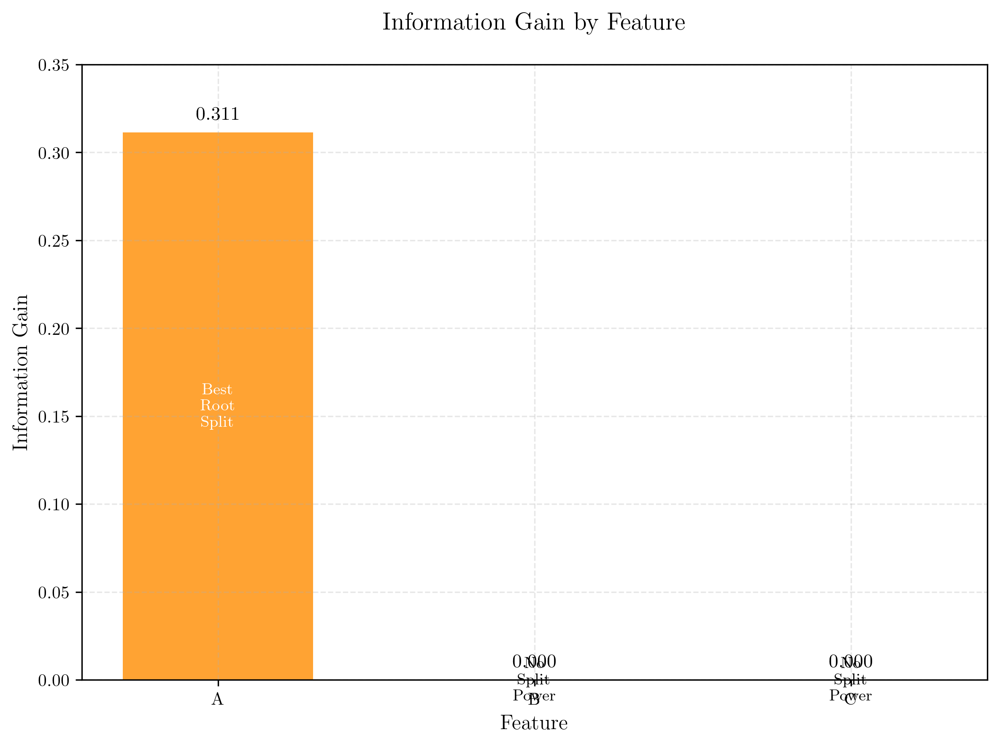

This visualization shows the information gain for each feature, with color coding to highlight the split power. Feature A has the highest information gain (0.3113), while B and C have zero information gain when used as root splits.

#### Dataset Overview
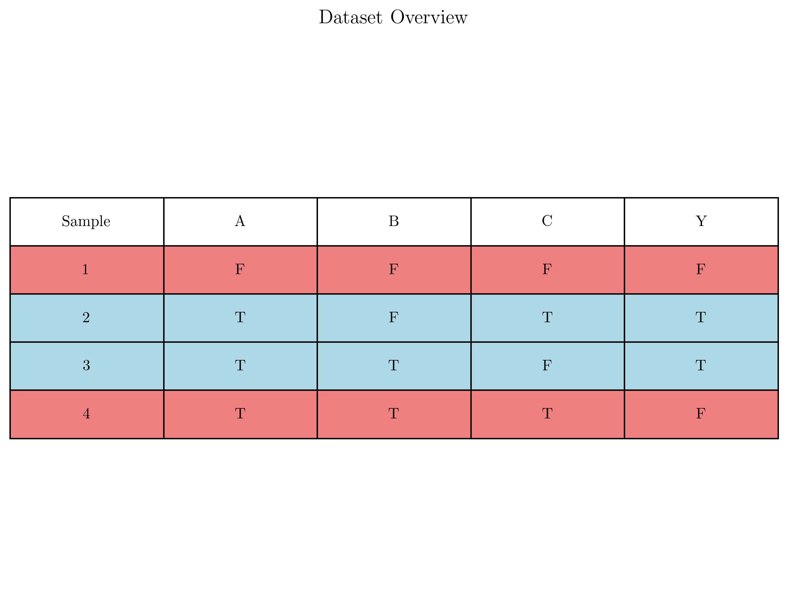

This table visualization presents the complete dataset with color coding to highlight class distribution patterns. Each row represents a sample, with the target class (Y) color-coded for easy pattern recognition.

#### Feature-Class Relationships
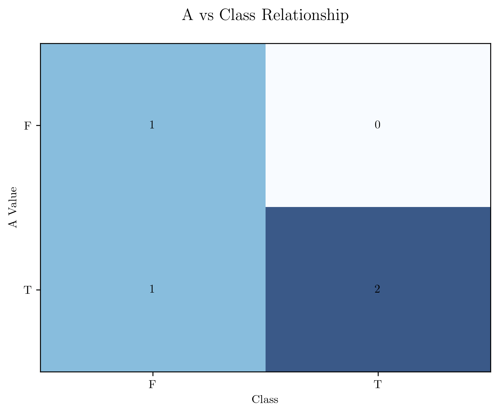
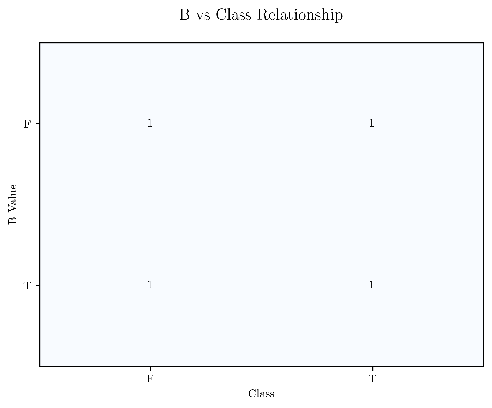
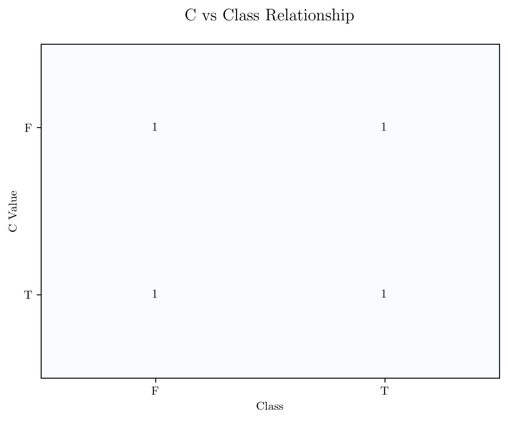

These individual heatmaps reveal how each feature correlates with the target class. The matrices show the distribution of class labels for each feature value combination, providing insight into the discriminative power of each feature.

### Decision Tree Structures

**Visualization Improvements**: The decision tree visualizations have been updated to display with the root node at the top, growing downwards for better readability. Additionally, the leaf node labels now use clean, sequential numbering instead of memory addresses for improved clarity.

**Complete Visualization Set**: The analysis generates 15 comprehensive visualizations covering all aspects of decision tree construction, optimization, and algorithm comparison.

#### Original Decision Tree
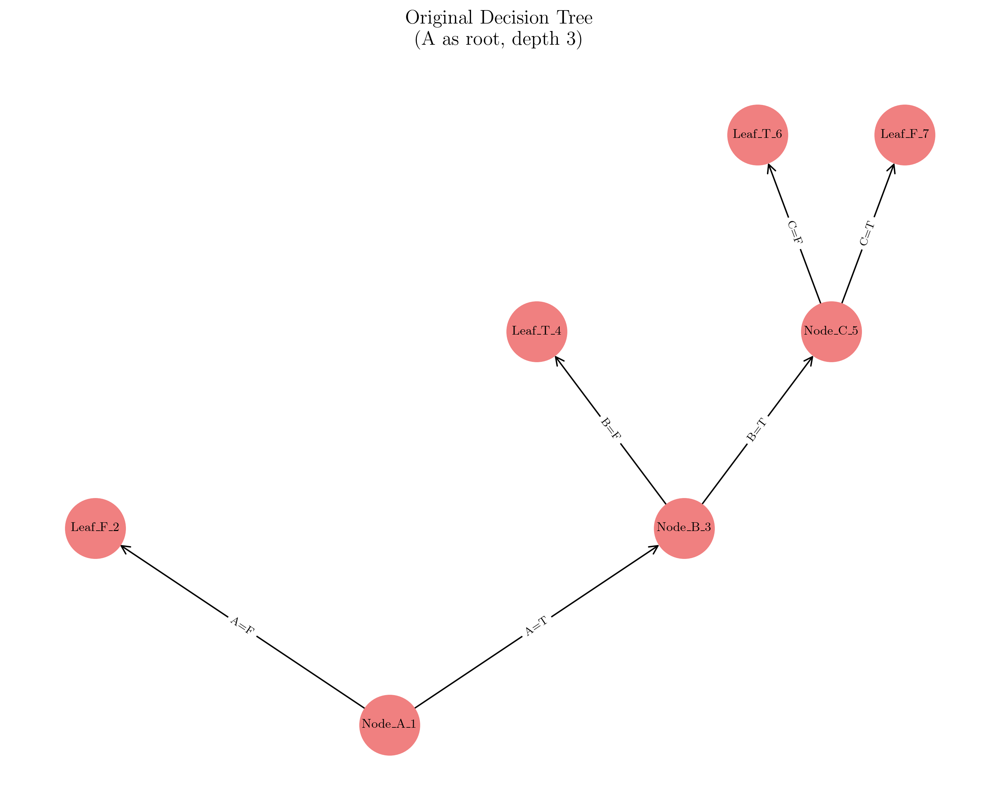

This visualization shows the original decision tree structure using A as the root node, resulting in a depth-3 tree that achieves 100% training accuracy. **Note: The tree is now displayed with the root at the top, growing downwards for better readability.**

#### Optimal Decision Tree
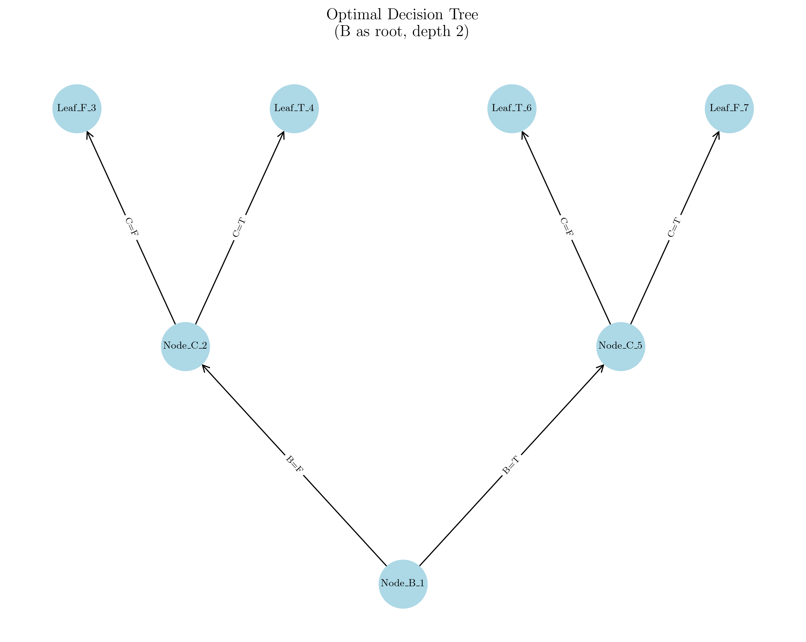

This visualization shows the optimal decision tree structure using B as the root node with C in both branches, resulting in a more efficient depth-2 tree that also achieves 100% training accuracy. **Note: The tree is now displayed with the root at the top, growing downwards for better readability.**

### Performance and Efficiency Analysis

#### Tree Structure Comparison
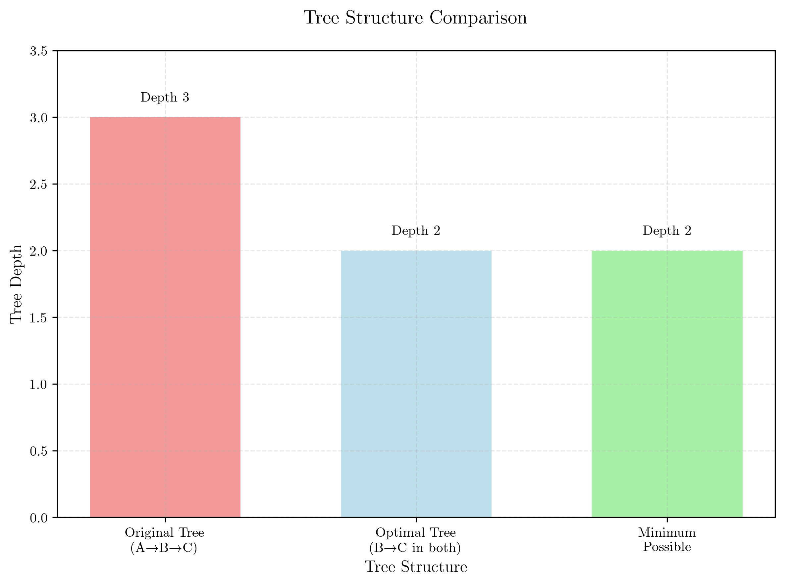

This bar chart compares the depth of different tree structures, with color indicators highlighting which approaches are optimal versus suboptimal.

#### Performance Comparison
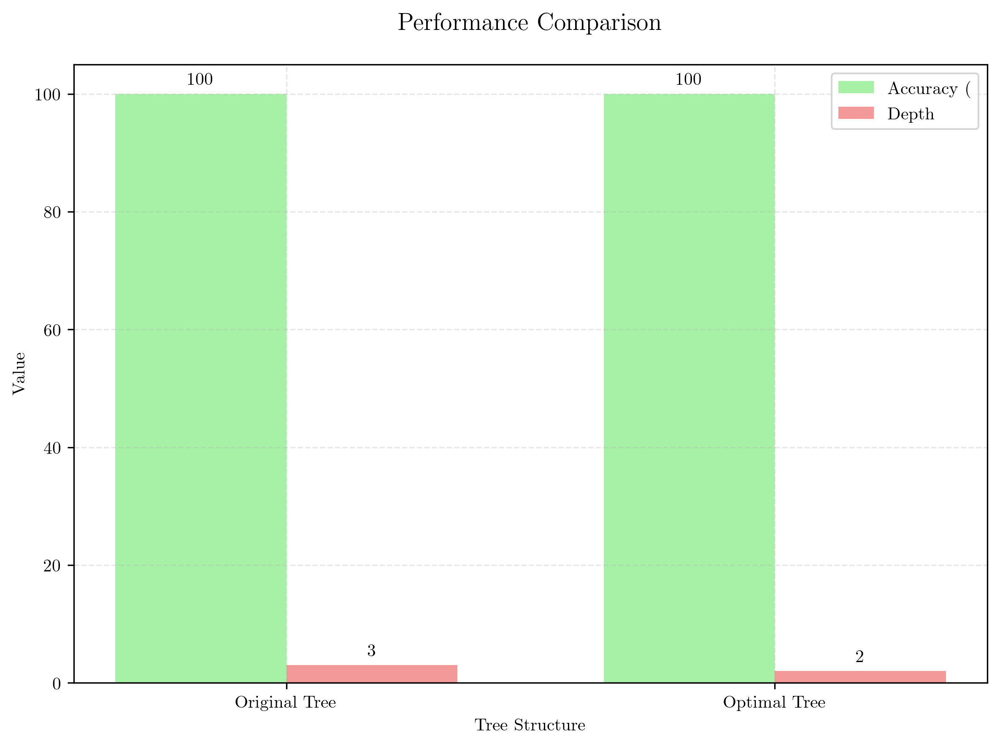

This grouped bar chart compares accuracy and depth metrics between the original and optimal tree structures, demonstrating that both achieve perfect accuracy despite different complexities.

#### Efficiency Analysis
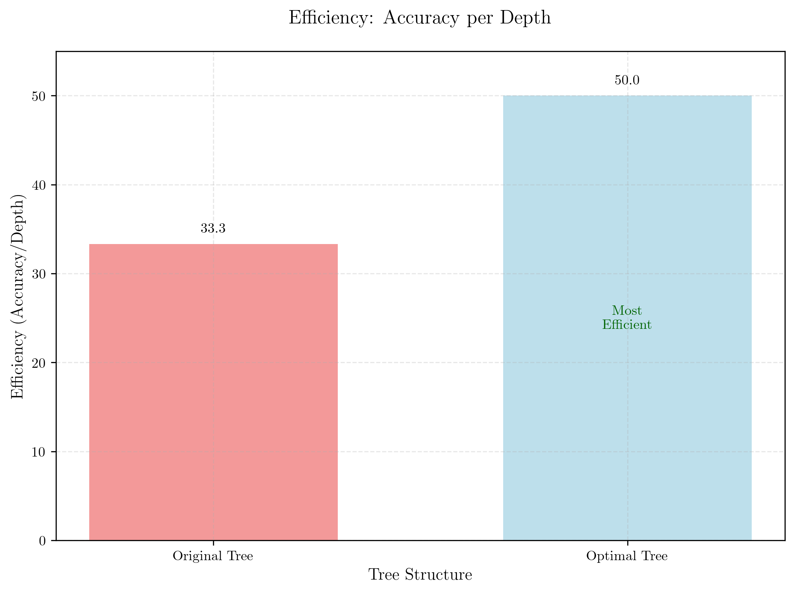

This visualization shows the efficiency ratio (accuracy per depth), clearly demonstrating that the optimal tree structure is more efficient than the original approach.

#### Feature Usage Comparison
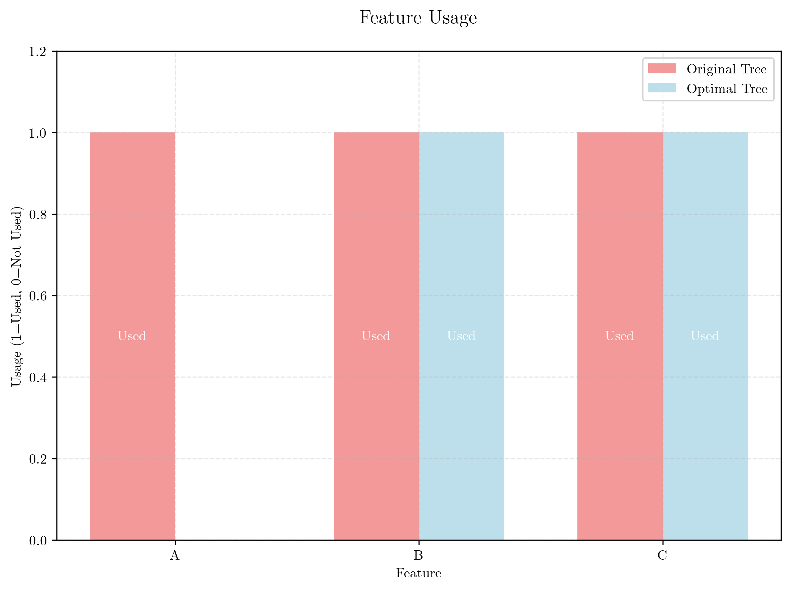

This comparison shows which features are utilized in each tree structure, highlighting that the optimal tree eliminates the need for feature A entirely.

#### Algorithm Comparison
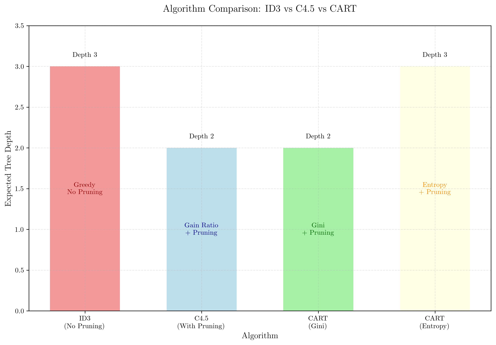

This visualization compares how different decision tree algorithms (ID3, C4.5, CART) would approach the dataset, showing expected tree depths and highlighting the benefits of pruning and different splitting criteria.

### Depth and Performance Metrics

#### Depth Comparison


This comprehensive depth comparison includes the original tree, optimal tree, and analysis of tree structure without feature A, with visual indicators marking optimal versus suboptimal approaches.

#### Performance Metrics
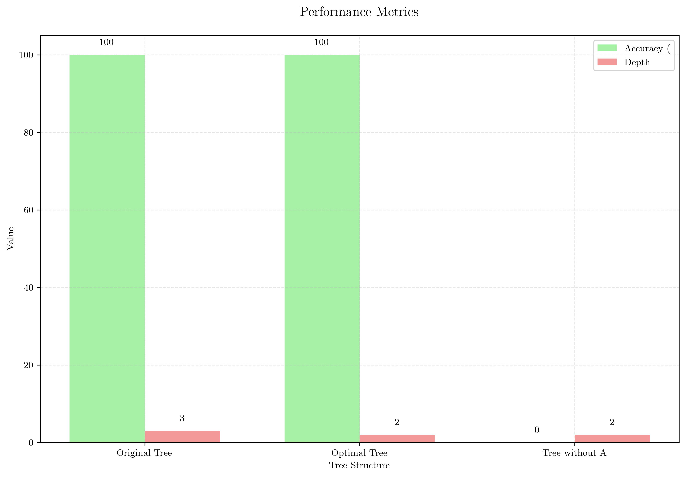

This detailed performance analysis compares accuracy and depth across different tree construction approaches, providing a complete view of the trade-offs involved.

## Key Insights

### Theoretical Foundations
- **Entropy**: Maximum entropy (1.0) indicates perfectly balanced classes, making this the most difficult binary classification scenario
- **Information Gain**: Feature A has higher information gain than B or C when used as root, but B and C together create more efficient tree structures when used in alternative configurations
- **Tree Optimality**: Tree optimality depends on finding the minimal structure that achieves the required performance - this example shows that depth 2 is achievable despite the greedy approach finding depth 3
- **Greedy vs Global Optimization**: Local information gain maximization may miss globally optimal tree structures - this dataset demonstrates that alternative tree topologies can be more efficient

### Practical Applications
- **Tree Structure Search**: This example shows that multiple tree structures can achieve the same performance - exploring alternative structures may find more efficient solutions
- **Overfitting**: The deeper tree (depth 3) might generalize worse than the more compact alternative (depth 2) despite achieving the same training accuracy
- **Interpretability**: Different tree structures can provide different insights about the data, even when achieving the same classification performance
- **Algorithm Comparison**: Different decision tree algorithms (ID3, C4.5, CART) may find different optimal structures for the same dataset

### Common Pitfalls
- **Greedy Splitting**: The standard top-down approach might not find the globally optimal tree structure - this dataset demonstrates that alternative structures can be more efficient
- **Information Gain Misleading**: High information gain at the root doesn't guarantee the overall optimal tree - alternative structures may exist
- **Feature Independence**: The assumption that features can be evaluated independently may miss more efficient tree structures
- **Perfect Classification**: Achieving zero training error doesn't guarantee good generalization

### Extensions
- **Post-Pruning**: The tree could be pruned to improve generalization while maintaining training performance
- **Alternative Metrics**: Using Gini impurity instead of entropy might produce different splits
- **Ensemble Methods**: Combining multiple trees could improve robustness

## Conclusion
- We calculated the entropy of the dataset as 1.0000, indicating maximum classification difficulty
- Feature A has information gain of 0.3113, while B and C have 0.0000, but this doesn't guarantee the optimal tree structure
- The original decision tree (depth 3) achieves zero training error but is not optimal
- An alternative tree structure exists: B as root with C in both subtrees (depth 2), which also achieves zero error
- The minimum possible depth is 2, achieved by the alternative tree structure
- This demonstrates that greedy information gain maximization doesn't always find the globally optimal tree
- **Algorithm Comparison**: ID3 would likely find the original tree structure, while C4.5's pruning might discover the more compact alternative. CART offers flexibility with both Gini impurity and entropy measures
- **Interpretability**: The optimal tree (depth 2) is more interpretable and efficient than the original tree (depth 3)
- **Practical Implications**: This example highlights the importance of exploring alternative tree structures and the benefits of pruning algorithms in finding more efficient solutions
