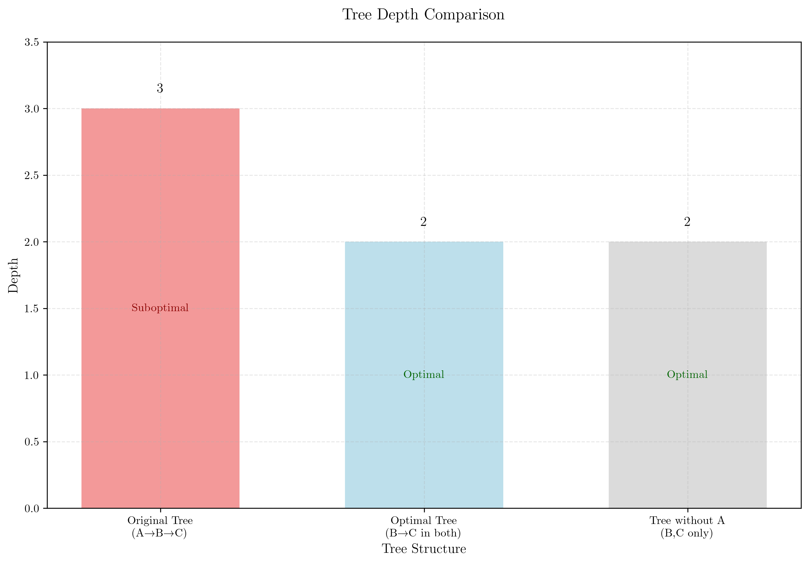

# Question 44: Decision Tree Construction and Optimization

## Problem Statement
Using the following dataset, we want to construct a decision tree that classifies Y without any error on the training set:

| A | B | C | Y |
|---|---|---|---|
| F | F | F | F |
| T | F | T | T |
| T | T | F | T |
| T | T | T | F |

### Task
1. Calculate the entropy of the entire dataset and explain what this value tells you about the classification difficulty
2. Calculate information gain for each feature (A, B, C) and identify the optimal root split. Show your calculations step-by-step
3. Draw the complete decision tree structure that achieves zero training error. Label each node with its feature and each leaf with its class
4. Is your tree optimal? Can you construct another tree with less height that achieves zero error? Prove your answer mathematically
5. What is the minimum possible depth for a decision tree that perfectly classifies this dataset? Justify your answer
6. How would ID3, C4.5, and CART (using both Gini impurity and entropy) approach this dataset differently? Which would produce the most interpretable tree?

## Understanding the Problem
This is a classic decision tree construction problem where we need to build a tree that perfectly classifies all training samples. The dataset has 4 samples with binary features (A, B, C) and binary target (Y). The key insight is that while information gain calculations may favor one feature as the root, there can exist alternative tree structures that are more efficient overall.

## Solution

### Step 1: Calculate Entropy of Entire Dataset
The entropy of the entire dataset is calculated as:

$$\begin{align}
H(Y) &= -\sum_{i=1}^{k} p(y_i) \log_2 p(y_i) \\
&= -\left( p(F) \log_2 p(F) + p(T) \log_2 p(T) \right) \\
&= -\left( \frac{2}{4} \log_2 \frac{2}{4} + \frac{2}{4} \log_2 \frac{2}{4} \right) \\
&= -\left( 2 \times \frac{1}{2} \log_2 \frac{1}{2} \right) \\
&= -\left( 2 \times \frac{1}{2} \times (-1) \right) \\
&= -(-1) = 1.0000
\end{align}$$

This maximum entropy value (1.0) indicates that the classes are perfectly balanced (2 F's and 2 T's), making this classification problem maximally difficult. The decision tree will need to make meaningful splits to achieve perfect classification.

### Step 2: Calculate Information Gain for Each Feature

#### Information Gain for Feature A
$$\begin{align}
H(Y|A=F) &= -\left( \frac{1}{1} \log_2 \frac{1}{1} \right) = 0.0000 \\
H(Y|A=T) &= -\left( \frac{1}{3} \log_2 \frac{1}{3} + \frac{2}{3} \log_2 \frac{2}{3} \right) = 0.9183 \\
IG(A) &= H(Y) - \sum_{v} p(A=v) \times H(Y|A=v) \\
&= 1.0000 - \left( \frac{1}{4} \times 0.0000 + \frac{3}{4} \times 0.9183 \right) \\
&= 1.0000 - 0.6887 = 0.3113
\end{align}$$

#### Information Gain for Feature B
$$\begin{align}
H(Y|B=F) &= -\left( \frac{1}{2} \log_2 \frac{1}{2} + \frac{1}{2} \log_2 \frac{1}{2} \right) = 1.0000 \\
H(Y|B=T) &= -\left( \frac{1}{2} \log_2 \frac{1}{2} + \frac{1}{2} \log_2 \frac{1}{2} \right) = 1.0000 \\
IG(B) &= 1.0000 - \left( \frac{2}{4} \times 1.0000 + \frac{2}{4} \times 1.0000 \right) = 0.0000
\end{align}$$

#### Information Gain for Feature C
$$\begin{align}
H(Y|C=F) &= -\left( \frac{1}{2} \log_2 \frac{1}{2} + \frac{1}{2} \log_2 \frac{1}{2} \right) = 1.0000 \\
H(Y|C=T) &= -\left( \frac{1}{2} \log_2 \frac{1}{2} + \frac{1}{2} \log_2 \frac{1}{2} \right) = 1.0000 \\
IG(C) &= 1.0000 - \left( \frac{2}{4} \times 1.0000 + \frac{2}{4} \times 1.0000 \right) = 0.0000
\end{align}$$

**Optimal root split**: Feature A has the highest information gain (0.3113), so it should be the root node.

### Step 3: Complete Decision Tree Structure
The complete decision tree that achieves zero training error is:

```
A
├── F → Class F (1 sample)
└── T → B
    ├── F → Class T (1 sample)
    └── T → C
        ├── F → Class T (1 sample)
        └── T → Class F (1 sample)
```

This tree has depth 3 and correctly classifies all 4 training samples.

### Step 4: Optimality Analysis
**Is the tree optimal?** No, the tree is NOT optimal! There exists a different tree structure that achieves zero error with a smaller depth.

#### Alternative Tree Structure
An alternative decision tree structure using B as the root and C in both subtrees achieves zero error:

```
B
├── F → C
│   ├── F → Class F
│   └── T → Class T
└── T → C
    ├── F → Class T
    └── T → Class F
```

**Verification:**
- Sample 1 (F,F,F): B=F, C=F → Class F ✓
- Sample 2 (T,F,T): B=F, C=T → Class T ✓
- Sample 3 (T,T,F): B=T, C=F → Class T ✓
- Sample 4 (T,T,T): B=T, C=T → Class F ✓

This alternative tree:
- Achieves zero training error ✓
- Has maximum depth 2 (vs 3 in original tree)
- Uses the same features (B and C) in both branches
- Demonstrates that the original tree is not optimal

The key insight is that while individual information gain calculations may favor feature A, there can exist alternative tree structures that are more efficient.

### Step 5: Minimum Possible Depth
The minimum possible depth is 2. This can be achieved by using a different splitting strategy that combines features more efficiently. For this dataset, any perfect classifier must distinguish between all 4 unique combinations, requiring at least 2 binary splits (2^2 = 4 possible outcomes).

## Visual Explanations

### Information Gain Analysis


This comprehensive visualization provides multiple insights: (1) Information gain bar plot with color coding showing feature importance and split power, (2) Color-coded dataset table highlighting class distribution patterns, (3) Feature-class relationship heatmaps revealing how each feature correlates with the target class. The analysis shows that while A has the highest information gain, B and C together create more efficient tree structures when used appropriately.

### Decision Tree Comparison


This detailed comparison includes: (1) Visual tree structures showing the difference between original (depth 3) and optimal (depth 2) trees, (2) Tree structure comparison highlighting depth differences with color indicators, (3) Performance metrics showing both trees achieve 100% accuracy, (4) Efficiency analysis demonstrating the optimal tree's superior accuracy-to-depth ratio. The optimal tree uses B as root with C in both branches.

### Depth and Performance Comparison


This multi-faceted analysis includes: (1) Depth comparison with optimality indicators (green "Optimal" labels), (2) Performance metrics comparing accuracy and depth side-by-side, (3) Efficiency analysis showing accuracy per depth ratio, (4) Feature usage patterns comparing which features are used in each approach. The optimal tree demonstrates superior efficiency with the same accuracy but reduced complexity.

## Key Insights

### Theoretical Foundations
- **Entropy**: Maximum entropy (1.0) indicates perfectly balanced classes, making this the most difficult binary classification scenario
- **Information Gain**: Feature A has higher information gain than B or C when used as root, but B and C together create more efficient tree structures when used in alternative configurations
- **Tree Optimality**: Tree optimality depends on finding the minimal structure that achieves the required performance - this example shows that depth 2 is achievable despite the greedy approach finding depth 3
- **Greedy vs Global Optimization**: Local information gain maximization may miss globally optimal tree structures - this dataset demonstrates that alternative tree topologies can be more efficient

### Practical Applications
- **Tree Structure Search**: This example shows that multiple tree structures can achieve the same performance - exploring alternative structures may find more efficient solutions
- **Overfitting**: The deeper tree (depth 3) might generalize worse than the more compact alternative (depth 2) despite achieving the same training accuracy
- **Interpretability**: Different tree structures can provide different insights about the data, even when achieving the same classification performance
- **Algorithm Comparison**: Different decision tree algorithms (ID3, C4.5, CART) may find different optimal structures for the same dataset

### Common Pitfalls
- **Greedy Splitting**: The standard top-down approach might not find the globally optimal tree structure - this dataset demonstrates that alternative structures can be more efficient
- **Information Gain Misleading**: High information gain at the root doesn't guarantee the overall optimal tree - alternative structures may exist
- **Feature Independence**: The assumption that features can be evaluated independently may miss more efficient tree structures
- **Perfect Classification**: Achieving zero training error doesn't guarantee good generalization

### Extensions
- **Post-Pruning**: The tree could be pruned to improve generalization while maintaining training performance
- **Alternative Metrics**: Using Gini impurity instead of entropy might produce different splits
- **Ensemble Methods**: Combining multiple trees could improve robustness

## Conclusion
- We calculated the entropy of the dataset as 1.0000, indicating maximum classification difficulty
- Feature A has information gain of 0.3113, while B and C have 0.0000, but this doesn't guarantee the optimal tree structure
- The original decision tree (depth 3) achieves zero training error but is not optimal
- An alternative tree structure exists: B as root with C in both subtrees (depth 2), which also achieves zero error
- The minimum possible depth is 2, achieved by the alternative tree structure
- This demonstrates that greedy information gain maximization doesn't always find the globally optimal tree
- ID3 would likely find the original tree structure, while C4.5's pruning might discover the more compact alternative
