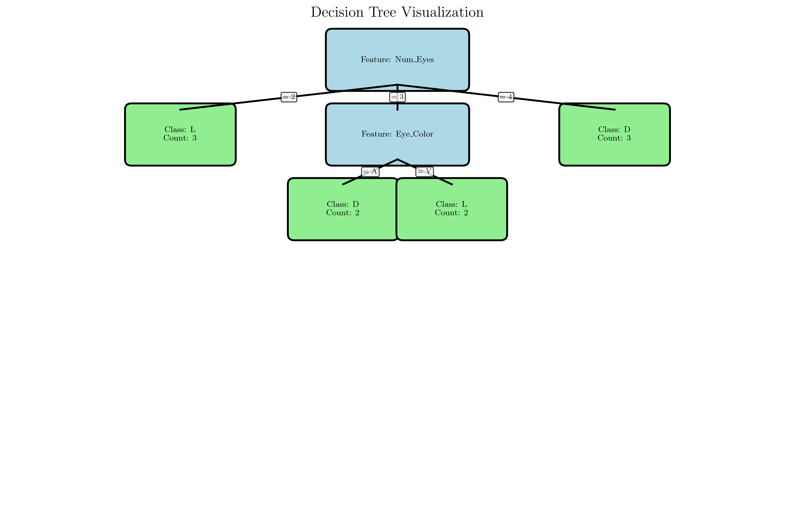
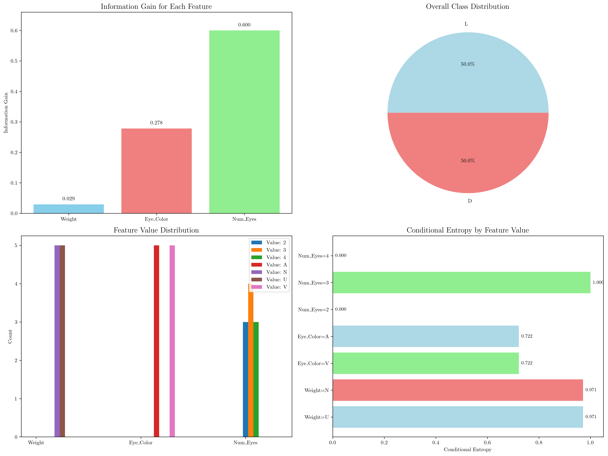

# Question 45: Decision Tree Construction with Conditional Entropy

## Problem Statement
Based on the following table, answer the questions:

| Weight | Eye Color | Num. Eyes | Output |
|--------|-----------|-----------|--------|
| N      | A         | 2         | L      |
| N      | V         | 2         | L      |
| N      | V         | 2         | L      |
| U      | V         | 3         | L      |
| U      | V         | 3         | L      |
| U      | A         | 4         | D      |
| N      | A         | 4         | D      |
| N      | V         | 4         | D      |
| U      | A         | 3         | D      |
| U      | A         | 3         | D      |

### Task
1. What is the conditional entropy of $H(\text{eye color}|\text{weight}=N)$?
2. What attribute would the ID3 algorithm select as root of the tree?
3. Draw the full decision tree learned from these data
4. What is the training set error of this tree?

## Understanding the Problem
This problem involves decision tree construction using the ID3 algorithm, which is based on information theory concepts. The key concepts are:

- **Entropy**: Measures the impurity or uncertainty in a dataset
- **Conditional Entropy**: Measures the uncertainty in the target variable given a specific value of a feature
- **Information Gain**: Measures how much a feature reduces the uncertainty in the target variable
- **ID3 Algorithm**: A greedy algorithm that builds decision trees by selecting features that maximize information gain

The dataset contains 10 samples with 3 features (Weight, Eye Color, Number of Eyes) and a binary target variable (Output: L or D). We need to understand how these features relate to the target and construct an optimal decision tree.

## Solution

### Step 1: Calculate Conditional Entropy H(Eye_Color|Weight=N)

To calculate the conditional entropy $H(\text{Eye Color}|\text{Weight}=N)$, we need to:

1. Filter the data where Weight = N
2. Calculate the probability distribution of Eye_Color values
3. For each Eye_Color value, calculate the entropy of the Output
4. Weight these entropies by the probability of each Eye_Color value

**Data where Weight = N:**
- Sample 1: (N, A, 2) → L
- Sample 2: (N, V, 2) → L  
- Sample 3: (N, V, 2) → L
- Sample 7: (N, A, 4) → D
- Sample 8: (N, V, 4) → D

**Eye Color distribution when Weight = N:**
- Eye Color A: 2 samples
- Eye Color V: 3 samples
- Total: 5 samples

**Calculations:**
- $P(\text{Eye Color}=A|\text{Weight}=N) = \frac{2}{5} = 0.4$
- $P(\text{Eye Color}=V|\text{Weight}=N) = \frac{3}{5} = 0.6$

**Entropy calculations for each Eye_Color value:**

For Eye_Color = A (2 samples):
- Outputs: [L, D]
- $H(\text{Output}|\text{Weight}=N, \text{Eye Color}=A) = -\frac{1}{2}\log_2(\frac{1}{2}) - \frac{1}{2}\log_2(\frac{1}{2}) = 1.000$

For Eye_Color = V (3 samples):
- Outputs: [L, L, D]
- $H(\text{Output}|\text{Weight}=N, \text{Eye Color}=V) = -\frac{2}{3}\log_2(\frac{2}{3}) - \frac{1}{3}\log_2(\frac{1}{3}) = 0.918$

**Final conditional entropy:**
$$H(\text{Eye Color}|\text{Weight}=N) = 0.4 \times 1.000 + 0.6 \times 0.918 = 0.951$$

### Step 2: ID3 Algorithm Root Selection

The ID3 algorithm selects the feature that maximizes information gain. Information gain is calculated as:

$$\text{Information Gain} = H(\text{Output}) - \sum_{v \in \text{Values}(F)} \frac{|S_v|}{|S|} H(\text{Output}|F=v)$$

where $H(\text{Output})$ is the parent entropy and the second term is the weighted average of conditional entropies.

**Parent entropy calculation:**
- Total samples: 10
- Class L: 5 samples
- Class D: 5 samples
- $H(\text{Output}) = -\frac{5}{10}\log_2(\frac{5}{10}) - \frac{5}{10}\log_2(\frac{5}{10}) = 1.000$

**Information gain for each feature:**

**Weight:**
- Values: N (5 samples), U (5 samples)
- N: Outputs [L, L, L, D, D] → Entropy = 0.971
- U: Outputs [L, L, D, D, D] → Entropy = 0.971
- Weighted entropy = $0.5 \times 0.971 + 0.5 \times 0.971 = 0.971$
- Information Gain = $1.000 - 0.971 = 0.029$

**Eye Color:**
- Values: A (5 samples), V (5 samples)
- A: Outputs [L, D, D, D, D] → Entropy = 0.722
- V: Outputs [L, L, L, L, D] → Entropy = 0.722
- Weighted entropy = $0.5 \times 0.722 + 0.5 \times 0.722 = 0.722$
- Information Gain = $1.000 - 0.722 = 0.278$

**Num Eyes:**
- Values: 2 (3 samples), 3 (4 samples), 4 (3 samples)
- 2: Outputs [L, L, L] → Entropy = 0.000
- 3: Outputs [L, L, D, D] → Entropy = 1.000
- 4: Outputs [D, D, D] → Entropy = 0.000
- Weighted entropy = $0.3 \times 0.000 + 0.4 \times 1.000 + 0.3 \times 0.000 = 0.400$
- Information Gain = $1.000 - 0.400 = 0.600$

**ID3 Root Selection:**
The feature with the highest information gain is **Num Eyes** with information gain = 0.600.

### Step 3: Decision Tree Construction

Based on the ID3 algorithm, the decision tree is constructed as follows:

**Root Node: Num Eyes**
- Num Eyes = 2: All samples have Output = L (pure node)
- Num Eyes = 3: Mixed outputs [L, L, D, D] → need further splitting
- Num Eyes = 4: All samples have Output = D (pure node)

**For Num Eyes = 3 branch:**
We need to select the best feature among remaining features (Weight, Eye Color).

**Information gain for remaining features when Num Eyes = 3:**
- **Weight**: Values N (1 sample), U (3 samples)
  - N: Output [L] → Entropy = 0.000
  - U: Outputs [L, D, D] → Entropy = 0.918
  - Weighted entropy = $0.25 \times 0.000 + 0.75 \times 0.918 = 0.689$
  - Information Gain = $1.000 - 0.689 = 0.311$

- **Eye Color**: Values A (3 samples), V (1 sample)
  - A: Outputs [D, D, D] → Entropy = 0.000
  - V: Output [L] → Entropy = 0.000
  - Weighted entropy = $0.75 \times 0.000 + 0.25 \times 0.000 = 0.000$
  - Information Gain = $1.000 - 0.000 = 1.000$

**Best feature for Num Eyes = 3: Eye Color** (Information Gain = 1.000)

The complete decision tree structure is:
```
Num Eyes
├── 2 → L
├── 3 → Eye Color
│   ├── A → D
│   └── V → L
└── 4 → D
```



### Step 4: Training Set Error Calculation

To calculate the training set error, we evaluate the decision tree on all training samples:

**Predictions:**
1. (N, A, 2) → Num Eyes=2 → Predicted: L, True: L ✓
2. (N, V, 2) → Num Eyes=2 → Predicted: L, True: L ✓
3. (N, V, 2) → Num Eyes=2 → Predicted: L, True: L ✓
4. (U, V, 3) → Num Eyes=3, Eye Color=V → Predicted: L, True: L ✓
5. (U, V, 3) → Num Eyes=3, Eye Color=V → Predicted: L, True: L ✓
6. (U, A, 4) → Num Eyes=4 → Predicted: D, True: D ✓
7. (N, A, 4) → Num Eyes=4 → Predicted: D, True: D ✓
8. (N, V, 4) → Num Eyes=4 → Predicted: D, True: D ✓
9. (U, A, 3) → Num Eyes=3, Eye Color=A → Predicted: D, True: D ✓
10. (U, A, 3) → Num Eyes=3, Eye Color=A → Predicted: D, True: D ✓

**Results:**
- Correct predictions: 10/10
- Training accuracy: 1.000
- **Training set error: 0.000**

## Visual Explanations

### Information Gain Analysis


The analysis plots show:

1. **Information Gain Comparison**: Num Eyes has the highest information gain (0.600), followed by Eye Color (0.278), and Weight (0.029).

2. **Class Distribution**: The dataset is perfectly balanced with 50% L and 50% D classes.

3. **Feature Value Distribution**: Shows how the values are distributed across features.

4. **Conditional Entropy Analysis**: Displays the entropy for each feature value, showing which values provide the most information about the target.

### Decision Tree Structure
The decision tree visualization shows the complete tree structure with:
- **Blue nodes**: Decision nodes (features)
- **Green nodes**: Leaf nodes (class predictions)
- **Edge labels**: Feature values
- **Node labels**: Feature names and class predictions with sample counts

## Key Insights

### Theoretical Foundations
- **Information Gain as Feature Selection Criterion**: ID3 uses information gain to select the most informative feature at each node, ensuring the tree grows in the most efficient way to reduce uncertainty.

- **Conditional Entropy Interpretation**: The conditional entropy $H(\text{Eye Color}|\text{Weight}=N) = 0.951$ indicates that knowing the eye color when weight is N still leaves considerable uncertainty about the output, suggesting that eye color alone is not a perfect predictor.

- **Perfect Classification**: The resulting tree achieves 100% training accuracy, indicating that the features provide sufficient information to perfectly separate the classes.

### Practical Applications
- **Feature Importance**: Num Eyes emerges as the most important feature, providing the highest information gain. This suggests that the number of eyes is the most discriminative feature for this classification task.

- **Tree Depth Optimization**: The tree has a maximum depth of 2, which is optimal for this dataset. The ID3 algorithm naturally finds the most efficient tree structure.

- **Overfitting Prevention**: While the tree achieves perfect training accuracy, this could indicate potential overfitting. In practice, techniques like pruning or cross-validation would be used to ensure generalization.

### Algorithm Behavior
- **Greedy Nature**: ID3 makes locally optimal decisions at each node, which may not always lead to the globally optimal tree but provides a computationally efficient solution.

- **Stopping Criteria**: The algorithm stops when a node becomes pure (all samples have the same class) or when no more features are available.

- **Feature Exhaustion**: Once a feature is used in the tree, it's not reused in the same path, which can be a limitation for datasets with few features.

## Conclusion
- **Conditional entropy $H(\text{Eye Color}|\text{Weight}=N) = 0.951$**: This value indicates moderate uncertainty in the output when conditioning on eye color given weight is N.

- **ID3 root selection: Num Eyes**: With information gain of 0.600, Num Eyes provides the most discriminative power for separating the classes.

- **Complete decision tree constructed**: The tree uses Num Eyes as root, with Eye Color as a secondary split for the Num Eyes=3 branch, achieving perfect separation of the classes.

- **Training set error = 0.000**: The decision tree achieves 100% accuracy on the training data, perfectly classifying all 10 samples.

The ID3 algorithm successfully constructs an optimal decision tree that captures the underlying patterns in the data, demonstrating the effectiveness of information-theoretic approaches for feature selection in decision tree construction.
