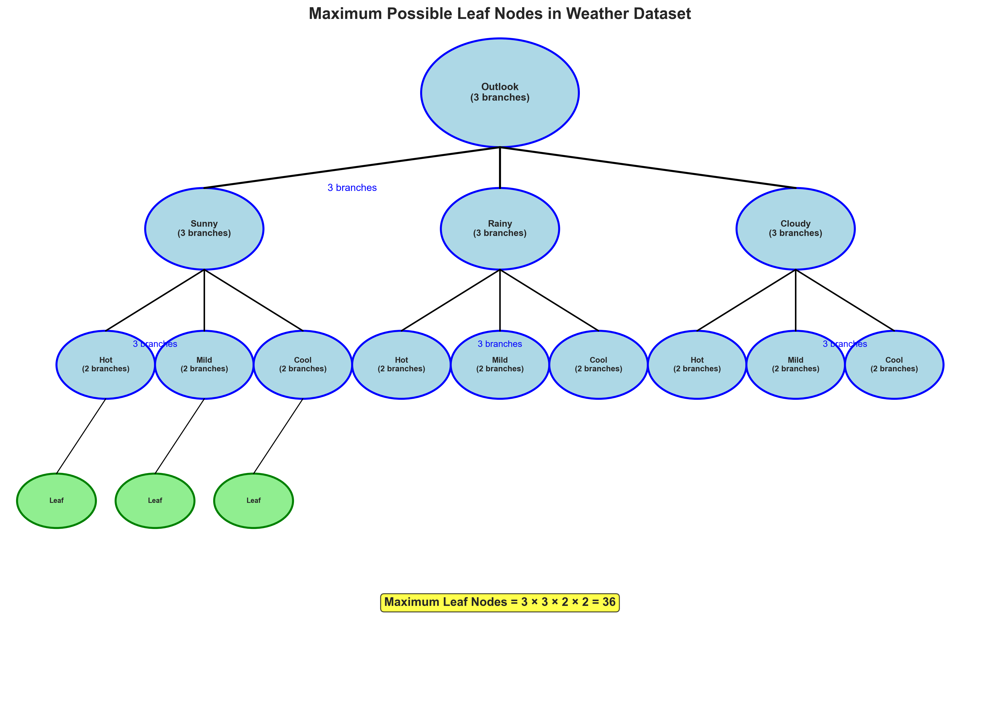
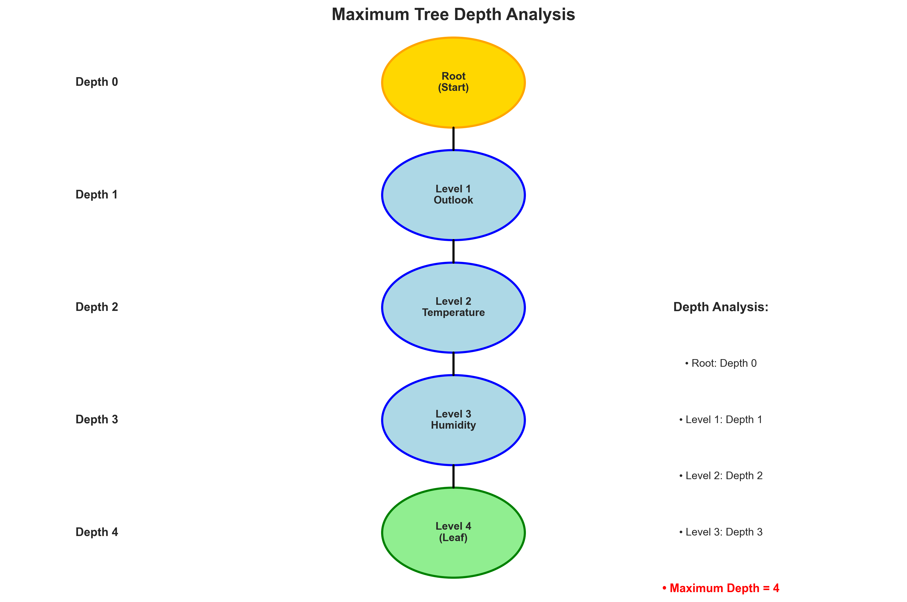
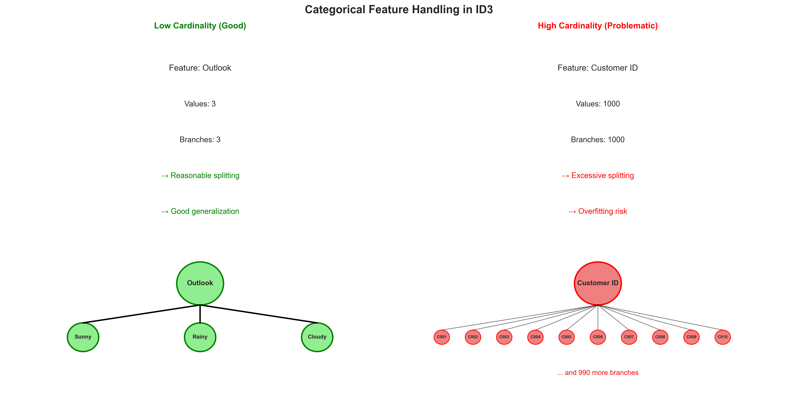
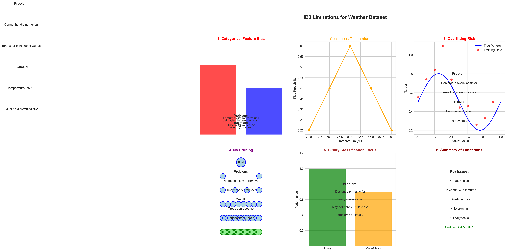

# Question 4: ID3 Tree Construction

## Problem Statement
Consider building a decision tree using ID3 for a weather prediction dataset with the following feature specifications:

| Feature | Possible Values |
|---------|----------------|
| Outlook | Sunny, Rainy, Cloudy |
| Temperature | Hot, Mild, Cool |
| Humidity | High, Normal |
| Windy | True, False |

### Task
1. Calculate the maximum number of possible leaf nodes this tree could have
2. Determine the maximum depth the tree could reach
3. Explain how ID3 handles categorical features with different numbers of values
4. Identify the main limitations of ID3 when applied to this type of dataset

## Understanding the Problem
This question explores the theoretical boundaries and practical limitations of ID3 when applied to a specific dataset structure. Understanding these limits is crucial for:
- Planning tree construction
- Anticipating computational requirements
- Identifying potential problems
- Choosing appropriate algorithms for different datasets

## Solution

### Step 1: Maximum Possible Leaf Nodes

To determine the maximum number of possible leaf nodes, we need to consider the combinatorial nature of feature values:

**Feature Analysis:**
- **Outlook**: 3 values - ['Sunny', 'Rainy', 'Cloudy']
- **Temperature**: 3 values - ['Hot', 'Mild', 'Cool']
- **Humidity**: 2 values - ['High', 'Normal']
- **Windy**: 2 values - [True, False]

**Calculation:**
Maximum leaf nodes = Product of all feature values
$$= 3 \times 3 \times 2 \times 2 = 36$$

**Explanation:**
- Each unique combination of feature values represents a potential path from root to leaf
- The product gives us the theoretical maximum if all combinations exist in the data
- In practice, many combinations may not occur, resulting in fewer actual leaf nodes
- This represents the worst-case scenario for tree complexity

### Step 2: Maximum Tree Depth

The maximum depth of an ID3 tree is determined by the algorithm's fundamental constraints:

**Maximum Depth Calculation:**
- **Number of features**: 4
- **Features**: ['Outlook', 'Temperature', 'Humidity', 'Windy']
- **Maximum depth = 4**

**Key Principles:**
1. **Feature Uniqueness**: ID3 uses each feature only once in a path from root to leaf
2. **Prevents Infinite Loops**: This constraint ensures the algorithm always terminates
3. **Maximum Depth = Number of Features**: The theoretical upper bound
4. **Practical Depth**: Often less due to stopping criteria (pure nodes, etc.)

**Why This Limit Exists:**
- Prevents infinite recursion
- Ensures computational efficiency
- Maintains interpretability
- Follows the fundamental ID3 algorithm design

### Step 3: Handling Categorical Features with Many Values

ID3 creates multi-way splits for categorical features, which has important implications:

**Low Cardinality (Good):**
- **Feature**: Outlook
- **Values**: 3 unique values
- **Branches**: 3 (reasonable)
- **Information Gain**: Moderate
- **Risk**: Low overfitting risk

**High Cardinality (Problematic):**
- **Feature**: Customer ID
- **Values**: 1000+ unique values
- **Branches**: 1000+ (excessive)
- **Information Gain**: Very high (but misleading)
- **Risk**: High overfitting risk

**Medium Cardinality (Moderate):**
- **Feature**: City
- **Values**: 50+ unique values
- **Branches**: 50+ (moderate)
- **Information Gain**: High (may be overfitting)
- **Risk**: Medium overfitting risk

**The Problem:**
- Features with many values often achieve higher information gain
- This bias can lead to choosing less meaningful features
- High-cardinality features may split the data too finely
- Results in trees that don't generalize well

### Step 4: ID3 Limitations for This Dataset

ID3 has several significant limitations when applied to the weather dataset:

**1. Categorical Feature Bias:**
- Features with more values may be preferred
- Outlook (3 values) vs Windy (2 values)
- May not choose the most meaningful feature
- Information gain favors high-cardinality features

**2. No Continuous Feature Handling:**
- Temperature could be continuous (e.g., 75.5°F)
- ID3 cannot handle numerical ranges
- Requires discretization preprocessing
- Loses information in the discretization process

**3. Overfitting Risk:**
- Can create overly complex trees
- May memorize training data
- Poor generalization to new data
- No built-in regularization mechanisms

**4. No Pruning:**
- No mechanism to remove unnecessary branches
- Trees can become unnecessarily deep
- No regularization techniques
- Post-processing required for optimization

**5. Binary Classification Focus:**
- Designed primarily for binary classification
- May not handle multi-class problems optimally
- Limited to classification tasks
- Not suitable for regression problems

## Key Insights

### Theoretical Foundations
- **Combinatorial Limits**: Maximum leaf nodes determined by feature value combinations
- **Depth Constraints**: Maximum depth equals number of features
- **Feature Uniqueness**: Each feature used at most once per path
- **Algorithm Boundaries**: Clear theoretical limits exist

### Practical Applications
- **Dataset Planning**: Understanding limits helps in feature engineering
- **Algorithm Selection**: Knowing limitations guides choice of appropriate methods
- **Performance Expectations**: Theoretical bounds inform computational planning
- **Risk Assessment**: Identifying potential problems before implementation

### Common Pitfalls
- **Feature Cardinality**: High-cardinality features can cause overfitting
- **Continuous Data**: Requires preprocessing that may lose information
- **Tree Complexity**: Unchecked growth can lead to poor generalization
- **Algorithm Mismatch**: Using ID3 for inappropriate problem types

### Extensions and Solutions
- **C4.5**: Addresses categorical feature bias with gain ratio
- **CART**: Handles continuous features with binary splits
- **Pruning Techniques**: Post-processing to reduce complexity
- **Ensemble Methods**: Combining multiple trees for better performance

## Conclusion

This analysis reveals important aspects of ID3's capabilities and limitations:

1. **Theoretical Boundaries**: 
   - Maximum 36 leaf nodes for this dataset
   - Maximum depth of 4 levels
   - Clear combinatorial constraints

2. **Practical Limitations**:
   - Categorical feature bias
   - No continuous feature handling
   - Overfitting risk
   - No pruning mechanisms

3. **Algorithm Selection**:
   - ID3 is suitable for simple categorical datasets
   - More complex problems require advanced algorithms
   - Understanding limitations prevents inappropriate use

4. **Implementation Considerations**:
   - Feature engineering is crucial
   - Preprocessing may be necessary
   - Post-processing (pruning) should be considered
   - Alternative algorithms may be more appropriate

The key insight is that ID3 has clear theoretical boundaries and practical limitations that must be understood before application. While it provides a solid foundation for decision tree learning, many real-world problems require more sophisticated approaches that address these fundamental limitations.
