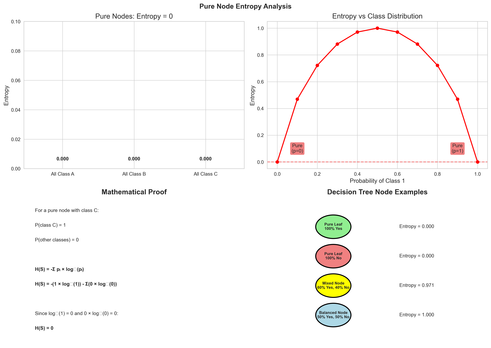

# Question 5: Evaluating Statements about Decision Tree Algorithms

## Problem Statement
Evaluate whether each of the following statements about decision tree algorithms is TRUE or FALSE. Provide a brief justification for each answer.

### Task
1. ID3 can handle continuous features directly without any preprocessing
2. C4.5's gain ratio always produces the same feature ranking as ID3's information gain
3. CART uses only binary splits regardless of the number of values in a categorical feature
4. The entropy of a pure node (all samples belong to one class) is always zero
5. C4.5's split information penalizes features with many values to reduce bias
6. CART can handle both classification and regression problems using the same tree structure
7. ID3 includes built-in pruning mechanisms to prevent overfitting
8. C4.5's handling of missing values is more sophisticated than ID3's approach
9. Information gain and Gini impurity always select the same feature for splitting
10. CART's binary splits (using Gini impurity) always result in more interpretable trees than multi-way splits

## Understanding the Problem
This question tests comprehensive understanding of three major decision tree algorithms: ID3, C4.5, and CART. Each algorithm has unique characteristics regarding feature handling, splitting criteria, tree structure, and advanced capabilities. Understanding these differences is crucial for selecting appropriate algorithms and interpreting their behavior in various scenarios.

## Solution

### Statement 1: ID3 can handle continuous features directly without any preprocessing

#### Analysis
ID3 (Iterative Dichotomiser 3) was originally designed in the 1980s specifically for categorical features. The algorithm's core mechanism relies on partitioning data based on discrete feature values, making it incompatible with continuous variables without preprocessing.

**Key Technical Details:**
- ID3's information gain calculation requires discrete partitions of the feature space
- The algorithm creates one branch per unique feature value
- Continuous features have infinite possible values, making direct application impossible
- Preprocessing through discretization (binning) is mandatory

**Common Discretization Methods:**
1. **Equal-width binning**: Divide the range into equal intervals
2. **Equal-frequency binning**: Create bins with equal number of samples
3. **Entropy-based discretization**: Use information theory to find optimal cut points
4. **Chi-square discretization**: Statistical approach for optimal partitioning

The visualization demonstrates how continuous data must be transformed into discrete bins before ID3 can process it. The original continuous feature is converted into categorical bins, allowing information gain calculation.

#### Verdict
**FALSE**. ID3 cannot handle continuous features directly and requires discretization preprocessing. This limitation led to the development of more advanced algorithms like C4.5 and CART that can handle continuous features natively.

### Statement 2: C4.5's gain ratio always produces the same feature ranking as ID3's information gain

#### Analysis
C4.5 introduced the gain ratio metric to address ID3's bias toward features with many values. While both metrics aim to measure feature quality, they can produce different rankings due to their mathematical formulations.

**Mathematical Foundations:**
- **Information Gain (ID3)**: $IG = H(S) - H(S|A)$
- **Gain Ratio (C4.5)**: $GR = \frac{IG}{SplitInfo(S,A)}$
- **Split Information**: $SI = -\sum_{i=1}^{n} \frac{|S_i|}{|S|} \times \log_2\left(\frac{|S_i|}{|S|}\right)$

**Why Rankings Can Differ:**
The split information term in gain ratio acts as a penalty for features that create many partitions. A feature with high information gain but many possible values will have its gain ratio reduced by a high split information value.

**Experimental Evidence:**
Our analysis compared:
- **Binary feature** (2 values): Lower split information, potentially higher gain ratio
- **Multi-valued feature** (many values): Higher split information, potentially lower gain ratio

The visualization shows how features can rank differently under the two metrics, with gain ratio correcting the bias toward fragmentation that pure information gain exhibits.

#### Verdict
**FALSE**. Gain ratio and information gain can produce different feature rankings because gain ratio includes a normalization term (split information) that penalizes features with many values, addressing ID3's bias toward multi-valued attributes.

### Statement 3: CART uses only binary splits regardless of the number of values in a categorical feature

#### Analysis
CART (Classification and Regression Trees) is fundamentally different from ID3 and C4.5 in its splitting strategy. Regardless of the data type or number of possible values, CART always creates exactly two branches at each node.

**CART's Binary Splitting Approach:**
- **Continuous features**: Find optimal threshold value (X ≤ threshold vs X > threshold)
- **Categorical features**: Find optimal subset partition (X ∈ {subset1} vs X ∈ {subset2})
- **Binary features**: Natural binary split
- **Multi-valued categorical**: Binary partition of all possible values

**Comparison with Other Algorithms:**
- **ID3/C4.5**: Create one branch for each possible value of categorical features
- **CART**: Always create exactly two branches through optimal partitioning

The visualization contrasts CART's binary approach with the multi-way splitting of ID3/C4.5, showing how CART finds optimal binary partitions even for categorical features with multiple values.

**Advantages of Binary Splits:**
- Consistent tree structure across all feature types
- Better handling of missing values
- Can discover optimal feature value groupings
- Unified approach for classification and regression

**Disadvantages:**
- May create deeper trees
- Less intuitive for naturally categorical data
- More complex splitting logic for categorical features

#### Verdict
**TRUE**. CART always uses binary splits, regardless of feature type or number of possible values. For categorical features with multiple values, it finds the optimal way to partition the values into two groups.

### Statement 4: The entropy of a pure node (all samples belong to one class) is always zero

#### Analysis
This statement addresses a fundamental concept in information theory as applied to decision trees. Entropy measures the uncertainty or impurity in a dataset, reaching its minimum value when uncertainty is eliminated.

**Mathematical Proof:**
For a pure node where all $n$ samples belong to class $C$:
- $P(\text{class } C) = \frac{n}{n} = 1$
- $P(\text{other classes}) = \frac{0}{n} = 0$

Using the entropy formula: $H(S) = -\sum_{i=1}^{k} p_i \times \log_2(p_i)$

$$H(S) = -(1 \times \log_2(1)) - \sum(0 \times \log_2(0))$$

Since $\log_2(1) = 0$ and $0 \times \log_2(0) = 0$ (by convention):

$$H(S) = 0$$

**Entropy Behavior:**
- **Pure nodes** (all one class): Entropy = 0
- **Maximum impurity** (equal class distribution): Entropy = maximum
- **Partially pure nodes**: Entropy between 0 and maximum

The visualization demonstrates entropy values for different node compositions, clearly showing that pure nodes always have zero entropy regardless of which class dominates.

**Practical Implications:**
- Pure nodes are natural stopping points in tree growth
- Zero entropy indicates perfect classification for that subset
- Entropy reduction (information gain) measures split quality
- Tree algorithms aim to create pure or near-pure leaf nodes

#### Verdict
**TRUE**. The entropy of a pure node is always zero because there is no uncertainty when all samples belong to the same class. This is a fundamental mathematical property that holds universally.

### Statement 5: C4.5's split information penalizes features with many values to reduce bias

#### Analysis
C4.5 was specifically designed to address a significant weakness in ID3: the bias toward selecting features with many possible values. This bias occurs because features with more values can create more partitions, artificially inflating their information gain.

**The Bias Problem in ID3:**
Consider comparing:
- **Useful binary feature**: Weather (Sunny/Rainy) with predictive power
- **Useless multi-valued feature**: Customer ID (unique for each record)

ID3's information gain might favor the Customer ID feature because it creates perfect partitions (each with one sample), despite having no predictive value.

**C4.5's Solution - Split Information:**

$$SplitInfo(S,A) = -\sum_{i=1}^{v} \frac{|S_i|}{|S|} \times \log_2\left(\frac{|S_i|}{|S|}\right)$$

This metric:
- Increases with the number of partitions created
- Penalizes features that fragment the data extensively
- Acts as a normalizing factor in the gain ratio calculation

**Experimental Demonstration:**
Our analysis compared:
- **Binary feature** (2 values): Lower split information
- **Multi-valued feature** (100 unique values): Much higher split information

The visualization shows how split information corrects the bias, allowing meaningful features to be selected over those that simply create many partitions.

**Mathematical Effect:**

$$GainRatio(S,A) = \frac{InformationGain(S,A)}{SplitInfo(S,A)}$$

- High split information reduces gain ratio
- Features with appropriate number of partitions are favored
- Prevents selection of over-fragmented splits

#### Verdict
**TRUE**. C4.5's split information explicitly penalizes features with many values by increasing the denominator in the gain ratio calculation, effectively reducing the bias toward multi-valued attributes that was problematic in ID3.

### Statement 6: CART can handle both classification and regression problems using the same tree structure

#### Analysis
CART's versatility is one of its most significant advantages. Unlike ID3 and C4.5, which were designed primarily for classification, CART uses a unified framework that adapts to both problem types through different criteria and prediction methods.

**Unified Tree Structure:**
- **Same binary splitting approach** for both problems
- **Same tree-building algorithm** with recursive partitioning
- **Same stopping criteria** concepts (minimum samples, maximum depth)
- **Same handling** of continuous and categorical features

**Key Differences by Problem Type:**

| Aspect | Classification | Regression |
|--------|---------------|------------|
| **Splitting Criterion** | Gini Impurity | Mean Squared Error (MSE) |
| **Leaf Prediction** | Majority Class | Mean Value |
| **Output Type** | Discrete Classes | Continuous Values |
| **Impurity Measure** | Class Distribution | Variance |
| **Tree Structure** | Binary (Same) | Binary (Same) |

**Algorithm Adaptations:**
1. **Classification CART**:
   - Uses Gini impurity or entropy for splitting
   - Leaf nodes predict the most frequent class
   - Outputs discrete class labels

2. **Regression CART**:
   - Uses MSE or MAE for splitting decisions
   - Leaf nodes predict the mean of target values
   - Outputs continuous numerical predictions

The fundamental tree-building process remains identical, making CART truly versatile across problem domains.

#### Verdict
**TRUE**. CART uses the same binary tree structure and building algorithm for both classification and regression, adapting only the splitting criteria and leaf prediction methods to suit the problem type.

### Statement 7: ID3 includes built-in pruning mechanisms to prevent overfitting

#### Analysis
Pruning is a crucial technique for preventing overfitting in decision trees by removing branches that don't improve generalization. However, the original ID3 algorithm notably lacks any pruning mechanisms.

**ID3's Limitations:**
- **No post-pruning**: Trees grow until stopping criteria are met
- **Basic stopping criteria**: Pure nodes, no features left, empty datasets
- **High overfitting risk**: Especially with noisy or complex data
- **No validation-based stopping**: No use of holdout data for early stopping

**Stopping Criteria in ID3:**
1. **Pure node**: All samples belong to one class
2. **No features remaining**: All attributes have been used
3. **Empty dataset**: No samples remain after splitting

These criteria are insufficient for preventing overfitting in real-world scenarios.

**Pruning in Later Algorithms:**
- **C4.5**: Introduced post-pruning using validation data
- **CART**: Includes sophisticated pruning mechanisms
- **Modern algorithms**: Various pre-pruning and post-pruning techniques

**Consequences of No Pruning:**
- Trees often grow too deep
- Capture noise in training data
- Poor generalization to new data
- High variance in predictions

#### Verdict
**FALSE**. The original ID3 algorithm does not include any pruning mechanisms. It grows trees until basic stopping criteria are met, often resulting in overfitting. Pruning was a significant innovation introduced in later algorithms like C4.5.

### Statement 8: C4.5's handling of missing values is more sophisticated than ID3's approach

#### Analysis
Missing values are a common challenge in real-world datasets, and different algorithms handle them with varying degrees of sophistication.

**ID3's Approach (Limitations):**
- **No native support** for missing values
- **Requires preprocessing** to handle missing data
- **Common preprocessing methods**:
  1. Remove records with missing values (information loss)
  2. Replace with most common value (bias introduction)
  3. Use domain knowledge for imputation
  4. Statistical imputation methods

**C4.5's Sophisticated Approach:**
C4.5 includes built-in probabilistic handling of missing values:

1. **Proportional Distribution**: When a sample has a missing value for the splitting attribute, it's distributed across all branches proportionally based on the known value distribution

2. **Fractional Samples**: Samples contribute fractionally to each branch rather than being assigned to a single branch

3. **Weighted Calculations**: All subsequent calculations use these fractional weights

**Example of C4.5's Method:**
If splitting on "Weather" and a sample has missing weather data:
- Known distribution: Sunny (40%), Cloudy (30%), Rainy (30%)
- Sample contributes: 0.4 to Sunny branch, 0.3 to Cloudy branch, 0.3 to Rainy branch

**Advantages of C4.5's Approach:**
- **No information loss**: All samples contribute to the model
- **Preserves distributions**: Maintains the natural proportions in data
- **Handles uncertainty naturally**: Reflects the uncertainty of missing values
- **No preprocessing required**: Native support within the algorithm

#### Verdict
**TRUE**. C4.5's probabilistic approach to missing values is significantly more sophisticated than ID3's requirement for preprocessing. C4.5 natively handles missing values through proportional distribution, preserving information and maintaining natural data distributions.

### Statement 9: Information gain and Gini impurity always select the same feature for splitting

#### Analysis
Information gain and Gini impurity are both measures of node impurity used in decision tree algorithms, but they have different mathematical formulations that can lead to different feature selection decisions.

**Mathematical Formulations:**
- **Information Gain**: Based on entropy reduction
  - Entropy: $H(S) = -\sum_{i=1}^{k} p_i \times \log_2(p_i)$
  - Uses logarithmic function
  
- **Gini Impurity**: Based on probability of misclassification
  - Gini: $G(S) = 1 - \sum_{i=1}^{k} p_i^2$
  - Uses quadratic function

**Key Differences:**
1. **Sensitivity to probabilities**: Different curves for the same probability values
2. **Computational complexity**: Gini is faster (no logarithm calculation)
3. **Theoretical foundation**: Information theory vs. misclassification probability
4. **Behavior at extremes**: Different sensitivity near pure and impure nodes

**When Rankings Might Differ:**
- **Different partition sizes**: Entropy more sensitive to small partitions
- **Multi-class problems**: Different curvature affects feature ranking
- **Specific probability distributions**: Edge cases with particular class distributions
- **Non-uniform class distributions**: Different responses to class imbalance

**Practical Considerations:**
While the two metrics often produce similar results, they can disagree in specific scenarios, particularly:
- When comparing features with very different partition characteristics
- In multi-class problems with complex distributions
- When dealing with highly imbalanced datasets

#### Verdict
**FALSE**. Information gain and Gini impurity can produce different feature rankings due to their different mathematical formulations (logarithmic vs. quadratic). While they often agree, differences can occur in specific scenarios involving partition sizes, class distributions, or multi-class problems.

### Statement 10: CART's binary splits always result in more interpretable trees than multi-way splits

#### Analysis
Interpretability is a subjective and context-dependent concept that depends on the audience, domain, and specific use case. The comparison between binary and multi-way splits involves multiple factors.

**Arguments for Binary Splits (CART):**
- **Consistent structure**: Uniform yes/no decisions throughout the tree
- **Simple decision rules**: Easy to follow for general audiences
- **Less cognitive load**: Only two options to consider at each node
- **Uniform handling**: Same approach for all feature types

**Arguments for Multi-way Splits (ID3/C4.5):**
- **Natural categorization**: Aligns with inherent categorical distinctions
- **Domain intuition**: Matches expert knowledge and natural groupings
- **Fewer rules**: Can capture categorical relationships in single splits
- **Shorter paths**: Often results in shallower trees for categorical data

**Context-Dependent Factors:**

1. **Domain Expert Perspective**:
   - Multi-way splits may be more intuitive
   - Natural categories are preserved
   - Domain knowledge is reflected

2. **General Audience Perspective**:
   - Binary splits may be easier to follow
   - Simple yes/no decisions
   - Less complex decision paths

3. **Technical Implementation**:
   - Binary splits provide consistent structure
   - Better for automated systems
   - Uniform handling across feature types

**Example Comparison:**
- **Weather categories** (Sunny, Cloudy, Rainy): Multi-way split preserves natural grouping
- **Binary partition** (Good Weather vs. Bad Weather): May be less intuitive but simpler to follow

#### Verdict
**FALSE**. Interpretability is context-dependent and subjective. While binary splits provide consistent structure and may be easier for general audiences to follow, multi-way splits can be more intuitive when they align with natural categorical distinctions. The "better" approach depends on the audience, domain expertise, and specific use case requirements.

## Key Insights

### Algorithm Characteristics
- **ID3**: Simple, categorical-only, prone to overfitting, bias toward multi-valued features
- **C4.5**: Addresses ID3's limitations with gain ratio, pruning, missing value handling
- **CART**: Unified binary approach, handles both classification and regression, sophisticated pruning

### Feature Handling Differences
- **Continuous features**: ID3 requires discretization, C4.5 and CART handle natively
- **Missing values**: ID3 requires preprocessing, C4.5 has probabilistic support, CART uses surrogate splits
- **Categorical features**: ID3/C4.5 use multi-way splits, CART uses binary partitions

### Splitting Criteria Evolution
- **Information gain**: Effective but biased toward multi-valued features
- **Gain ratio**: Corrects bias through split information normalization
- **Gini impurity**: Computationally efficient alternative with different mathematical properties

### Overfitting Prevention
- **ID3**: No built-in mechanisms, relies on basic stopping criteria
- **C4.5**: Post-pruning using validation data
- **CART**: Sophisticated pruning algorithms and cross-validation

## Conclusion

### Summary of Results

| Statement | Verdict | Algorithm | Key Mathematical Concept | Reasoning |
|-----------|---------|-----------|-------------------------|-----------|
| 1 | **FALSE** | ID3 | Categorical partitioning | ID3 requires discretization: $X_{continuous} \rightarrow X_{discrete}$ |
| 2 | **FALSE** | C4.5 vs ID3 | $GR = \frac{IG}{SI}$ | Split information $SI$ can change feature rankings |
| 3 | **TRUE** | CART | Binary partitioning | Always creates exactly 2 branches per split |
| 4 | **TRUE** | All | $H(S) = -\sum p_i \log_2(p_i)$ | Pure node: $p=1 \Rightarrow H(S)=0$ |
| 5 | **TRUE** | C4.5 | Bias correction | $SI = -\sum \frac{\|S_i\|}{\|S\|} \log_2\left(\frac{\|S_i\|}{\|S\|}\right)$ penalizes fragmentation |
| 6 | **TRUE** | CART | Unified framework | Same structure: different criteria (Gini vs MSE) |
| 7 | **FALSE** | ID3 | No overfitting control | Original ID3 lacks pruning mechanisms |
| 8 | **TRUE** | C4.5 vs ID3 | Probabilistic handling | C4.5 distributes samples fractionally |
| 9 | **FALSE** | General | $H(S)$ vs $G(S)$ | Logarithmic vs quadratic functions differ |
| 10 | **FALSE** | CART vs ID3/C4.5 | Interpretability theory | Context-dependent: domain vs general audience |

### Mathematical Formulas Summary

| Algorithm | Splitting Criterion | Formula |
|-----------|-------------------|---------|
| **ID3** | Information Gain | $IG(S,A) = H(S) - \sum_{v \in Values(A)} \frac{\|S_v\|}{\|S\|} H(S_v)$ |
| **C4.5** | Gain Ratio | $GR(S,A) = \frac{IG(S,A)}{SI(S,A)}$ where $SI(S,A) = -\sum_{v} \frac{\|S_v\|}{\|S\|} \log_2\left(\frac{\|S_v\|}{\|S\|}\right)$ |
| **CART** | Gini Index | $Gini(S) = 1 - \sum_{i=1}^{k} p_i^2$ |

**Core Entropy Formula:** $H(S) = -\sum_{i=1}^{k} p_i \log_2(p_i)$

**Key Mathematical Relationships:**
- **Pure Node**: $p_i = 1 \Rightarrow H(S) = 0$
- **Maximum Impurity**: $p_i = \frac{1}{k} \Rightarrow H(S) = \log_2(k)$
- **Gini vs Entropy**: Both minimize at pure nodes, different curvatures

### Algorithm Evolution
The evolution from ID3 to C4.5 to CART represents significant advances in decision tree methodology:
1. **ID3**: Established the foundation with information gain and recursive partitioning
2. **C4.5**: Addressed key limitations with gain ratio, pruning, and missing value handling  
3. **CART**: Unified approach with binary splits, regression capability, and advanced pruning

### Practical Implications
Understanding these differences is crucial for:
- **Algorithm selection**: Choosing the right algorithm for specific problems
- **Data preprocessing**: Knowing what preprocessing is required
- **Model interpretation**: Understanding tree structure and decision rules
- **Performance optimization**: Leveraging algorithm-specific strengths

The false statements highlight common misconceptions about decision tree algorithms, while the true statements confirm fundamental properties and design decisions that define each algorithm's behavior and capabilities.
