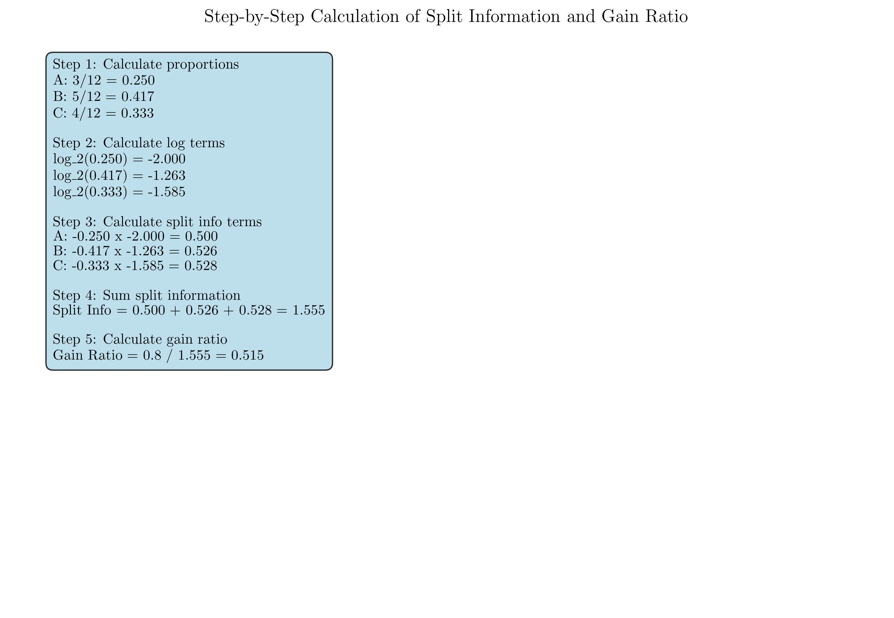
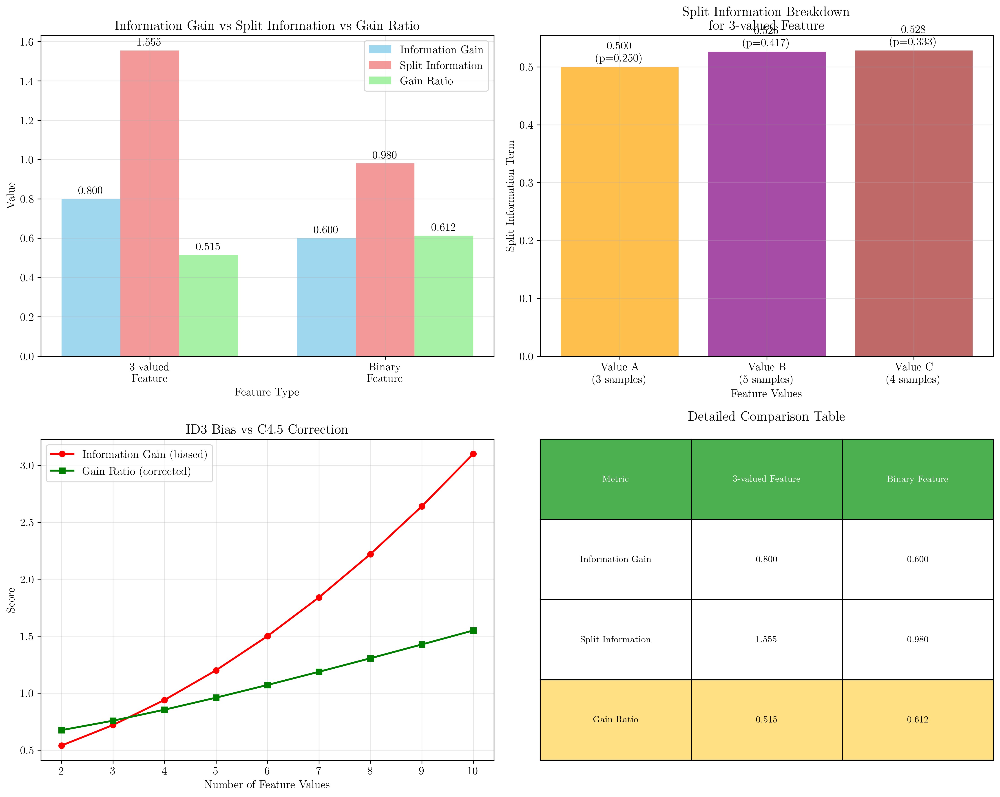

# Question 6: C4.5 Gain Ratio Analysis

## Problem Statement
Consider C4.5's improvement over ID3 in handling feature selection bias.

### Task
1. What is the main problem with ID3's information gain regarding features with many values?
2. For a feature with values $\{A, B, C\}$ splitting a dataset of $12$ samples into subsets of size $\{3, 5, 4\}$, calculate the split information using:
   $$\text{Split Info} = -\sum_{i=1}^{k} \frac{|S_i|}{|S|} \log_2\left(\frac{|S_i|}{|S|}\right)$$
3. If the information gain for this split is $0.8$, calculate the gain ratio using:
   $$\text{Gain Ratio} = \frac{\text{Information Gain}}{\text{Split Information}}$$
4. Explain in one sentence why split information corrects the bias
5. Calculate gain ratio for a binary feature splitting the same dataset into $\{7, 5\}$ with information gain $0.6$. Which feature would C4.5 prefer?

## Understanding the Problem
ID3's information gain metric has a systematic bias toward features with many unique values. This occurs because features with more values tend to create smaller, more homogeneous subsets, artificially inflating their information gain scores. C4.5 addresses this bias by introducing the gain ratio, which normalizes information gain by the split information - essentially the entropy of the split itself.

The split information measures how much information is used to divide the data based on the feature values. Features that create many small subsets will have high split information, which then penalizes their gain ratio. This correction is crucial for building robust decision trees that generalize well rather than overfitting to features with high cardinality.

## Solution

We will systematically calculate the split information and gain ratio for both the 3-valued feature and the binary feature, then compare them to understand C4.5's bias correction mechanism.

### Step 1: Analyze ID3's Bias Problem
ID3's information gain has a fundamental bias toward features with many values because:

- Features with more unique values tend to create smaller, purer subsets
- This gives them artificially high information gain scores  
- Features with many values may not generalize well (overfitting)
- Example: A unique ID feature would have perfect information gain but zero predictive value

This bias can lead to decision trees that overfit to high-cardinality features that may not actually be the most informative for prediction.

### Step 2: Calculate Split Information for 3-valued Feature
Given:
- Feature values: $\{A, B, C\}$
- Dataset size: $|S| = 12$
- Subset sizes: $|S_A| = 3$, $|S_B| = 5$, $|S_C| = 4$

The split information formula is:
$$\text{Split Info} = -\sum_{i=1}^{k} \frac{|S_i|}{|S|} \log_2\left(\frac{|S_i|}{|S|}\right)$$

Step-by-step calculation:

For value A: $\frac{|S_A|}{|S|} = \frac{3}{12} = 0.250$
$$-0.250 \times \log_2(0.250) = -0.250 \times (-2.000) = 0.500$$

For value B: $\frac{|S_B|}{|S|} = \frac{5}{12} = 0.417$
$$-0.417 \times \log_2(0.417) = -0.417 \times (-1.263) = 0.526$$

For value C: $\frac{|S_C|}{|S|} = \frac{4}{12} = 0.333$
$$-0.333 \times \log_2(0.333) = -0.333 \times (-1.585) = 0.528$$

Therefore:
$$\text{Split Info} = 0.500 + 0.526 + 0.528 = 1.555$$

### Step 3: Calculate Gain Ratio for 3-valued Feature
Given:
- Information Gain = $0.8$
- Split Information = $1.555$

The gain ratio is calculated as:
$$\text{Gain Ratio} = \frac{\text{Information Gain}}{\text{Split Information}} = \frac{0.8}{1.555} = 0.515$$

### Step 4: Why Split Information Corrects Bias
Split information penalizes features that create many small subsets by measuring the entropy of the split itself, thus normalizing information gain.

The split information acts as a normalizing factor that increases with the number of subsets created. Features that split the data into many small pieces will have high split information, which reduces their gain ratio relative to their raw information gain.

### Step 5: Binary Feature Comparison
For the binary feature:
- Subset sizes: $\{7, 5\}$
- Information gain: $0.6$

Calculate split information for binary feature:

For subset 1: $\frac{7}{12} = 0.583$
$$-0.583 \times \log_2(0.583) = -0.583 \times (-0.778) = 0.454$$

For subset 2: $\frac{5}{12} = 0.417$
$$-0.417 \times \log_2(0.417) = -0.417 \times (-1.263) = 0.526$$

Binary split information: $0.454 + 0.526 = 0.980$

Binary gain ratio: $\frac{0.6}{0.980} = 0.612$

**Comparison:**
- 3-valued feature: Gain Ratio = $0.515$
- Binary feature: Gain Ratio = $0.612$

**C4.5 would prefer the binary feature** with the higher gain ratio of $0.612$.

## Visual Explanations

### Split Information Calculation Breakdown

This visualization shows the detailed step-by-step calculation of split information for the 3-valued feature. Each step in the calculation is clearly laid out, from calculating proportions to computing logarithmic terms and finally summing to get the split information.

### Gain Ratio Analysis and Comparison

This comprehensive visualization demonstrates:
- Comparison of information gain, split information, and gain ratio for both features
- How ID3's bias increases with the number of feature values
- The corrective effect of C4.5's gain ratio
- A detailed comparison table showing all metrics

The bias illustration clearly shows how information gain increases with more feature values (the red line), while gain ratio (green line) corrects this bias by normalizing with split information.

## Key Insights

### Theoretical Foundations
- Split information measures the intrinsic information of a split based on how the data is divided
- Gain ratio provides a normalized measure that accounts for both predictive power and split complexity
- The correction is most significant for features with many values relative to the dataset size
- C4.5's approach leads to more balanced feature selection that considers both information content and generalizability

### Practical Applications
- Gain ratio prevents overfitting to high-cardinality features like customer IDs or postal codes
- The metric is particularly valuable in datasets with mixed feature types and varying cardinalities
- C4.5's bias correction makes it more suitable for real-world applications where features may have vastly different numbers of unique values
- The approach maintains the interpretability of decision trees while improving their robustness

### Computational Considerations
- Split information adds minimal computational overhead to the tree construction process
- The ratio calculation requires one additional division per feature evaluation
- The benefits in model quality typically outweigh the small computational cost
- Modern implementations efficiently compute both metrics during the same pass through the data

## Conclusion
- Split information for the 3-valued feature is $1.555$, leading to a gain ratio of $0.515$
- The binary feature achieves a higher gain ratio of $0.612$ despite lower raw information gain
- C4.5's gain ratio successfully corrects ID3's bias by penalizing features that create excessive fragmentation
- This correction mechanism enables C4.5 to make more principled feature selection decisions that balance predictive power with generalizability
- The binary feature preference demonstrates how gain ratio can lead to different (and often better) splitting decisions compared to raw information gain
