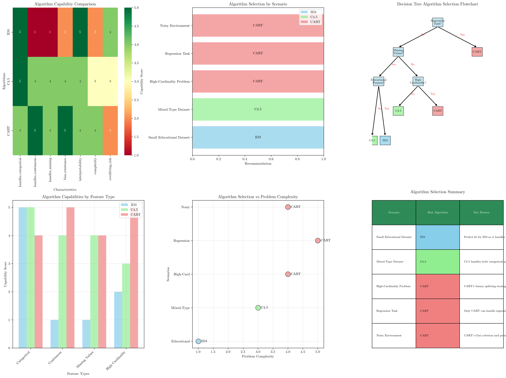
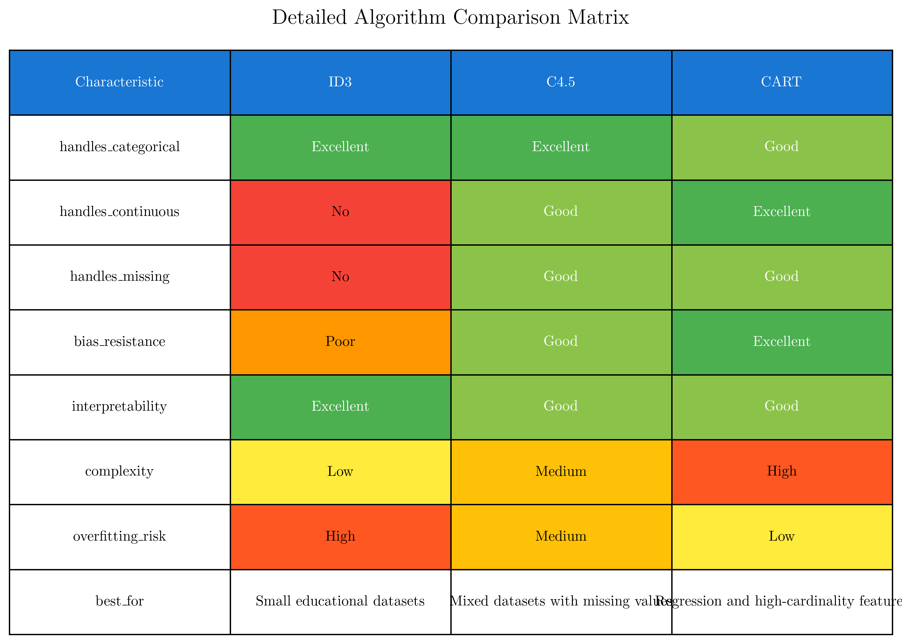

# Question 7: Algorithm Selection Strategy

## Problem Statement
Design a simple "Algorithm Selection Game" where you must choose the most appropriate decision tree algorithm for different scenarios.

### Task
For each scenario below, select the most suitable algorithm (ID3, C4.5, or CART) and explain your reasoning in 1-2 sentences:

1. **Small educational dataset**: $50$ samples, $4$ categorical features ($2$-$3$ values each), no missing data, interpretability is crucial
2. **Mixed-type dataset**: $1000$ samples, $6$ categorical features, $4$ continuous features, $15\%$ missing values
3. **High-cardinality problem**: $500$ samples, features include customer ID, zip code, and product category with $50+$ unique values
4. **Regression task**: Predicting house prices using both categorical (neighborhood, style) and continuous (size, age) features
5. **Noisy environment**: Dataset with many irrelevant features and some measurement errors

## Understanding the Problem
Selecting the appropriate decision tree algorithm requires understanding the unique strengths and limitations of ID3, C4.5, and CART. Each algorithm was designed to address specific challenges in decision tree construction:

- **ID3** (Iterative Dichotomiser 3) is the foundational algorithm that works excellently with categorical data but has limitations with continuous features, missing values, and high-cardinality features.
- **C4.5** is an evolution of ID3 that addresses many of its limitations by adding support for continuous features, missing value handling, and bias correction through gain ratio.
- **CART** (Classification and Regression Trees) takes a different approach with binary splitting, supports both classification and regression, and provides robust handling of various data challenges.

The key is to match algorithm capabilities with dataset characteristics and task requirements.

## Solution

We will analyze each scenario systematically, considering the dataset characteristics, task requirements, and algorithm capabilities to make optimal selections.

### Step 1: Small Educational Dataset Analysis
**Scenario:** 50 samples, 4 categorical features (2-3 values each), no missing data, interpretability crucial

**Selected Algorithm: ID3**

**Reasoning:** This scenario perfectly matches ID3's strengths. With only categorical features and no missing data, ID3's limitations don't apply. The small dataset size means the bias toward high-cardinality features isn't a concern since all features have only 2-3 values. Most importantly, ID3 produces the most interpretable trees with clear, intuitive multi-way splits that are ideal for educational purposes where understanding the decision process is paramount.

### Step 2: Mixed-Type Dataset Analysis
**Scenario:** 1000 samples, 6 categorical + 4 continuous features, 15% missing values

**Selected Algorithm: C4.5**

**Reasoning:** C4.5 is specifically designed for this type of heterogeneous dataset. It handles both categorical and continuous features natively through its discretization capabilities, and includes built-in mechanisms for dealing with missing values during both tree construction and prediction. The gain ratio also helps with any potential bias issues that might arise from the mixed feature types.

### Step 3: High-Cardinality Problem Analysis
**Scenario:** 500 samples, features include customer ID, zip code, product category with 50+ unique values

**Selected Algorithm: CART**

**Reasoning:** CART's binary splitting strategy is the key advantage here. Unlike ID3 and C4.5, which would create many branches for high-cardinality features (leading to overfitting and bias), CART considers all possible binary partitions and selects the optimal one. This approach avoids the bias toward high-cardinality features that affects information gain and gain ratio methods.

### Step 4: Regression Task Analysis
**Scenario:** Predicting house prices using categorical and continuous features

**Selected Algorithm: CART**

**Reasoning:** This is the only scenario where algorithm choice is deterministic - only CART can handle regression problems natively. ID3 and C4.5 are designed exclusively for classification tasks with categorical targets. CART uses mean squared error (MSE) for regression splits and predicts the mean value of target variables in leaf nodes, making it the natural choice for predicting continuous outcomes like house prices.

### Step 5: Noisy Environment Analysis
**Scenario:** Dataset with many irrelevant features and measurement errors

**Selected Algorithm: CART**

**Reasoning:** CART's combination of Gini impurity criterion and robust pruning mechanisms make it more resistant to noise and irrelevant features compared to entropy-based methods. The binary splitting approach is also less susceptible to spurious patterns that might emerge from noisy data, and CART's built-in cross-validation pruning helps prevent overfitting to noise.

## Practical Implementation

### Algorithm Selection Decision Framework

1. **Task Type Check**
   - Regression required → Choose CART
   - Classification → Continue evaluation

2. **Data Quality Assessment**
   - Missing values present → Prefer C4.5 or CART
   - High noise levels → Prefer CART
   - Clean data → All algorithms viable

3. **Feature Characteristics**
   - High-cardinality features → Choose CART
   - Mixed data types → Choose C4.5 or CART
   - Pure categorical → ID3 or C4.5 acceptable

4. **Requirements Analysis**
   - Maximum interpretability → Choose ID3
   - Robust performance → Choose CART
   - Balanced approach → Choose C4.5

### Decision Rules Summary
- **REGRESSION TASK** → Always choose CART
- **MISSING VALUES** → C4.5 or CART (avoid ID3)
- **HIGH CARDINALITY** → CART (best bias resistance)
- **SMALL EDUCATIONAL DATASET** → ID3 (maximum interpretability)
- **MIXED DATA TYPES** → C4.5 or CART
- **NOISE/ROBUSTNESS NEEDED** → CART

## Visual Explanations

### Algorithm Capability Comparison

This comprehensive visualization shows:
- Algorithm capability comparison across different characteristics
- Scenario-specific recommendations with reasoning
- Decision flowchart for systematic algorithm selection
- Feature type compatibility analysis
- Problem complexity vs algorithm suitability mapping

The heatmap clearly illustrates where each algorithm excels, with darker colors indicating stronger capabilities. The decision flowchart provides a systematic approach to algorithm selection based on key dataset and task characteristics.

### Detailed Comparison Matrix

This matrix provides a detailed breakdown of algorithm characteristics:
- Categorical and continuous feature handling capabilities
- Missing value support
- Bias resistance levels
- Interpretability scores
- Computational complexity
- Overfitting risk assessment

The color coding helps identify at a glance which algorithm is best suited for specific requirements.

## Key Insights

### Algorithm Strengths and Specializations
- **ID3**: Unmatched interpretability for categorical data, perfect for educational settings
- **C4.5**: Versatile handling of mixed data types with bias correction capabilities
- **CART**: Robust performance across diverse scenarios with unique regression support
- Each algorithm represents a different philosophy in tree construction and optimization

### Data-Driven Selection Criteria
- **Data type composition** is often the primary determining factor
- **Missing value prevalence** can eliminate ID3 from consideration
- **Feature cardinality distribution** strongly influences algorithm performance
- **Noise levels** favor algorithms with robust splitting criteria and pruning

### Practical Considerations
- **Development timeline** may favor simpler algorithms like ID3 for prototyping
- **Production requirements** often favor CART's robustness and versatility
- **Stakeholder interpretability needs** may override technical optimality
- **Computational resources** can influence choice for very large datasets

## Conclusion
- **Small educational dataset**: ID3 provides optimal interpretability for categorical data
- **Mixed-type dataset**: C4.5 handles heterogeneous data and missing values effectively
- **High-cardinality problem**: CART's binary splitting avoids bias toward many-valued features
- **Regression task**: CART is the only viable option for continuous target prediction
- **Noisy environment**: CART's robustness and pruning capabilities handle noise best

The selection process demonstrates that no single algorithm is universally superior - each has specific use cases where it excels. Understanding these distinctions enables practitioners to make informed decisions that optimize both model performance and practical requirements. The key is matching algorithm capabilities with dataset characteristics and project constraints rather than defaulting to any single approach.
