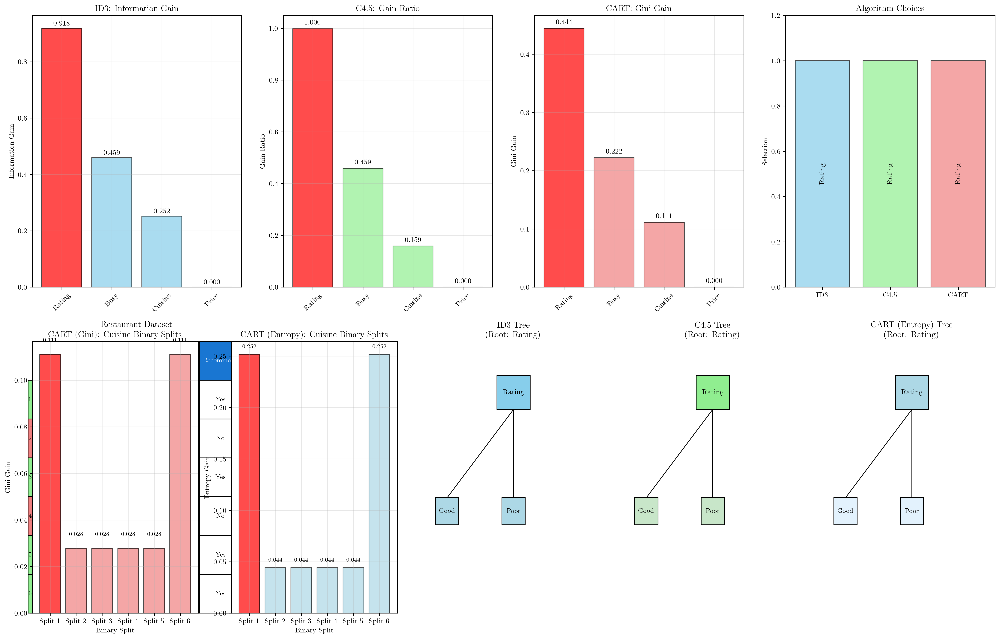
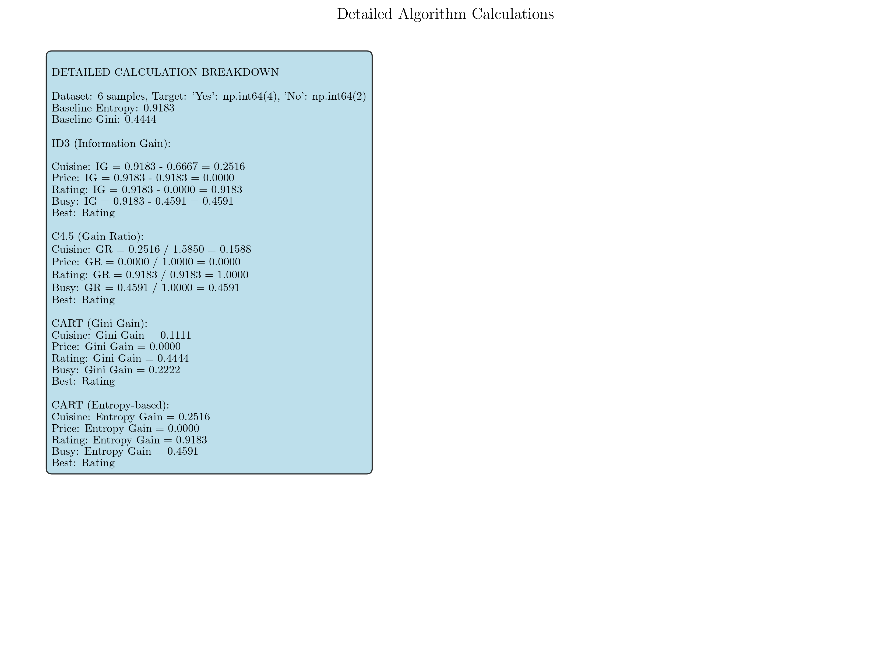

# Question 8: Multi-Algorithm Construction Trace

## Problem Statement
Create a "Decision Tree Construction Race" where you manually trace through the first split decision for all three algorithms on the same tiny dataset.

**Dataset: Restaurant Recommendation**

| Cuisine | Price | Rating | Busy | Recommend |
|---------|-------|--------|------|-----------|
| Italian | Low   | Good   | No   | Yes       |
| Chinese | High  | Poor   | Yes  | No        |
| Italian | High  | Good   | No   | Yes       |
| Mexican | Low   | Poor   | Yes  | No        |
| Chinese | Low   | Good   | Yes  | Yes       |
| Mexican | High  | Good   | No   | Yes       |

### Task
1. **ID3 approach**: Calculate information gain for each feature and identify the best split
2. **C4.5 approach**: Calculate gain ratio for each feature and compare with ID3's choice
3. **CART approach (using Gini impurity)**: For the Cuisine feature, evaluate all possible binary splits using Gini impurity
4. **CART approach (using Entropy)**: For the Cuisine feature, evaluate all possible binary splits using entropy-based information gain
5. Which feature would each algorithm choose as the root? Explain any differences
6. Draw the first level of the decision tree that each algorithm would construct

## Understanding the Problem
This exercise demonstrates how different splitting criteria and methodologies can lead to different tree structures, even when applied to the same dataset. By tracing through each algorithm's decision-making process step-by-step, we can understand the nuances that distinguish ID3's information gain, C4.5's gain ratio, CART's binary splitting with Gini impurity, and CART's binary splitting with entropy-based information gain.

The dataset contains 6 samples with 4 features and a binary target. The small size allows us to perform complete manual calculations while illustrating the key differences between algorithms. Each algorithm will evaluate all features but may arrive at different conclusions about which provides the best initial split.

## Solution

We will systematically apply each algorithm's criteria to every feature, showing detailed calculations and comparing the results to understand how different approaches can lead to different tree structures.

### Step 1: Dataset Analysis and Baseline Metrics
**Dataset:** 6 samples, Target distribution: {Yes: 4, No: 2}

**Baseline Entropy:** $$H(S) = -\frac{4}{6}\log_2\left(\frac{4}{6}\right) - \frac{2}{6}\log_2\left(\frac{2}{6}\right) = 0.918$$

**Baseline Gini:** $$Gini(S) = 1 - \left(\frac{4}{6}\right)^2 - \left(\frac{2}{6}\right)^2 = 0.444$$

### Step 2: ID3 Approach - Information Gain

**Feature: Cuisine**
- Italian: $[Yes, Yes]$ → Entropy = 0.000
- Chinese: $[No, Yes]$ → Entropy = 1.000  
- Mexican: $[No, Yes]$ → Entropy = 1.000

Weighted entropy = $$\frac{2}{6} \times 0.000 + \frac{2}{6} \times 1.000 + \frac{2}{6} \times 1.000 = 0.667$$

**Information Gain = $0.918 - 0.667 = 0.252$**

**Feature: Price**
- Low: $[Yes, No, Yes]$ → Entropy = 0.918
- High: $[No, Yes, Yes]$ → Entropy = 0.918

Weighted entropy = $$\frac{3}{6} \times 0.918 + \frac{3}{6} \times 0.918 = 0.918$$

**Information Gain = $0.918 - 0.918 = 0.000$**

**Feature: Rating**
- Good: $[Yes, Yes, Yes, Yes]$ → Entropy = 0.000
- Poor: $[No, No]$ → Entropy = 0.000

Weighted entropy = $$\frac{4}{6} \times 0.000 + \frac{2}{6} \times 0.000 = 0.000$$

**Information Gain = $0.918 - 0.000 = 0.918$**

**Feature: Busy**
- No: $[Yes, Yes, Yes]$ → Entropy = 0.000
- Yes: $[No, No, Yes]$ → Entropy = 0.918

Weighted entropy = $$\frac{3}{6} \times 0.000 + \frac{3}{6} \times 0.918 = 0.459$$

**Information Gain = $0.918 - 0.459 = 0.459$**

**ID3 Results:** Rating ($0.918$) > Busy ($0.459$) > Cuisine ($0.252$) > Price ($0.000$)
**ID3 Choice: Rating**

### Step 3: C4.5 Approach - Gain Ratio

For each feature, we calculate both information gain (from Step 2) and split information.

**Feature: Cuisine**
- Split Information = $$-\left[\frac{2}{6}\log_2\left(\frac{2}{6}\right) + \frac{2}{6}\log_2\left(\frac{2}{6}\right) + \frac{2}{6}\log_2\left(\frac{2}{6}\right)\right] = 1.585$$
- **Gain Ratio = $0.252 / 1.585 = 0.159$**

**Feature: Price**
- Split Information = $$-\left[\frac{3}{6}\log_2\left(\frac{3}{6}\right) + \frac{3}{6}\log_2\left(\frac{3}{6}\right)\right] = 1.000$$
- **Gain Ratio = $0.000 / 1.000 = 0.000$**

**Feature: Rating**
- Split Information = $$-\left[\frac{4}{6}\log_2\left(\frac{4}{6}\right) + \frac{2}{6}\log_2\left(\frac{2}{6}\right)\right] = 0.918$$
- **Gain Ratio = $0.918 / 0.918 = 1.000$**

**Feature: Busy**
- Split Information = $$-\left[\frac{3}{6}\log_2\left(\frac{3}{6}\right) + \frac{3}{6}\log_2\left(\frac{3}{6}\right)\right] = 1.000$$
- **Gain Ratio = $0.459 / 1.000 = 0.459$**

**C4.5 Results:** Rating ($1.000$) > Busy ($0.459$) > Cuisine ($0.159$) > Price ($0.000$)
**C4.5 Choice: Rating**

### Step 4: CART Approach - Binary Splits with Entropy

CART considers all possible binary partitions for each feature using entropy-based information gain.

**Feature: Cuisine (Detailed Analysis)**
Possible binary splits:
1. {Italian} vs {Chinese, Mexican}
2. {Chinese} vs {Italian, Mexican}  
3. {Mexican} vs {Italian, Chinese}
4. {Italian, Chinese} vs {Mexican}
5. {Italian, Mexican} vs {Chinese}
6. {Chinese, Mexican} vs {Italian}

**Split 1: {Italian} vs {Chinese, Mexican}**
- Left: $[Yes, Yes]$ → Entropy = $0.000$
- Right: $[No, No, Yes, Yes]$ → Entropy = $1.000$
- Weighted Entropy = $$\frac{2}{6} \times 0.000 + \frac{4}{6} \times 1.000 = 0.667$$
- **Entropy Gain = $0.918 - 0.667 = 0.252$**

**Split 2: {Chinese} vs {Italian, Mexican}**
- Left: $[No, Yes]$ → Entropy = $1.000$
- Right: $[Yes, Yes, No, Yes]$ → Entropy = $0.811$
- Weighted Entropy = $$\frac{2}{6} \times 1.000 + \frac{4}{6} \times 0.811 = 0.874$$
- **Entropy Gain = $0.918 - 0.874 = 0.044$**

**Split 3: {Mexican} vs {Italian, Chinese}**
- Left: $[No, Yes]$ → Entropy = $1.000$
- Right: $[Yes, No, Yes, Yes]$ → Entropy = $0.811$
- Weighted Entropy = $$\frac{2}{6} \times 1.000 + \frac{4}{6} \times 0.811 = 0.874$$
- **Entropy Gain = $0.918 - 0.874 = 0.044$**

**Split 4: {Italian, Chinese} vs {Mexican}**
- Left: $[Yes, No, Yes, Yes]$ → Entropy = $0.811$
- Right: $[No, Yes]$ → Entropy = $1.000$
- Weighted Entropy = $$\frac{4}{6} \times 0.811 + \frac{2}{6} \times 1.000 = 0.874$$
- **Entropy Gain = $0.918 - 0.874 = 0.044$**

**Split 5: {Italian, Mexican} vs {Chinese}**
- Left: $[Yes, Yes, No, Yes]$ → Entropy = $0.811$
- Right: $[No, Yes]$ → Entropy = $1.000$
- Weighted Entropy = $$\frac{4}{6} \times 0.811 + \frac{2}{6} \times 1.000 = 0.874$$
- **Entropy Gain = $0.918 - 0.874 = 0.044$**

**Split 6: {Chinese, Mexican} vs {Italian}**
- Left: $[No, No, Yes, Yes]$ → Entropy = $1.000$
- Right: $[Yes, Yes]$ → Entropy = $0.000$
- Weighted Entropy = $$\frac{4}{6} \times 1.000 + \frac{2}{6} \times 0.000 = 0.667$$
- **Entropy Gain = $0.918 - 0.667 = 0.252$**

**Best Cuisine entropy split:** {Italian} vs {Chinese, Mexican} with Entropy Gain = $0.252$

**Other Features (Best Binary Splits):**
- **Rating:** Good vs Poor → Entropy Gain = $0.918$
- **Busy:** No vs Yes → Entropy Gain = $0.459$  
- **Price:** Low vs High → Entropy Gain = $0.000$

**CART (Entropy) Results:** Rating ($0.918$) > Busy ($0.459$) > Cuisine ($0.252$) > Price ($0.000$)
**CART (Entropy) Choice: Rating**

### Step 5: CART Approach - Binary Splits with Gini

CART considers all possible binary partitions for each feature using Gini impurity.

**Feature: Cuisine (Detailed Analysis)**
Possible binary splits:
1. {Italian} vs {Chinese, Mexican}
2. {Chinese} vs {Italian, Mexican}  
3. {Mexican} vs {Italian, Chinese}
4. {Italian, Chinese} vs {Mexican}
5. {Italian, Mexican} vs {Chinese}
6. {Chinese, Mexican} vs {Italian}

**Split 1: {Italian} vs {Chinese, Mexican}**
- Left: $[Yes, Yes]$ → Gini = $0.000$
- Right: $[No, No, Yes, Yes]$ → Gini = $0.500$
- Weighted Gini = $$\frac{2}{6} \times 0.000 + \frac{4}{6} \times 0.500 = 0.333$$
- **Gini Gain = $0.444 - 0.333 = 0.111$**

**Split 2: {Chinese} vs {Italian, Mexican}**
- Left: $[No, Yes]$ → Gini = $0.500$
- Right: $[Yes, Yes, No, Yes]$ → Gini = $0.375$
- Weighted Gini = $$\frac{2}{6} \times 0.500 + \frac{4}{6} \times 0.375 = 0.417$$
- **Gini Gain = $0.444 - 0.417 = 0.028$**

**Split 3: {Mexican} vs {Italian, Chinese}**
- Left: $[No, Yes]$ → Gini = $0.500$
- Right: $[Yes, No, Yes, Yes]$ → Gini = $0.375$
- Weighted Gini = $$\frac{2}{6} \times 0.500 + \frac{4}{6} \times 0.375 = 0.417$$
- **Gini Gain = $0.444 - 0.417 = 0.028$**

**Split 4: {Italian, Chinese} vs {Mexican}**
- Left: $[Yes, No, Yes, Yes]$ → Gini = $0.375$
- Right: $[No, Yes]$ → Gini = $0.500$
- Weighted Gini = $$\frac{4}{6} \times 0.375 + \frac{2}{6} \times 0.500 = 0.417$$
- **Gini Gain = $0.444 - 0.417 = 0.028$**

**Split 5: {Italian, Mexican} vs {Chinese}**
- Left: $[Yes, Yes, No, Yes]$ → Gini = $0.375$
- Right: $[No, Yes]$ → Gini = $0.500$
- Weighted Gini = $$\frac{4}{6} \times 0.375 + \frac{2}{6} \times 0.500 = 0.417$$
- **Gini Gain = $0.444 - 0.417 = 0.028$**

**Split 6: {Chinese, Mexican} vs {Italian}**
- Left: $[No, No, Yes, Yes]$ → Gini = $0.500$
- Right: $[Yes, Yes]$ → Gini = $0.000$
- Weighted Gini = $$\frac{4}{6} \times 0.500 + \frac{2}{6} \times 0.000 = 0.333$$
- **Gini Gain = $0.444 - 0.333 = 0.111$**

**Best Cuisine Gini split:** {Italian} vs {Chinese, Mexican} with Gini Gain = $0.111$

**Other Features (Best Binary Splits):**
- **Rating:** Good vs Poor → Gini Gain = $0.444$
- **Busy:** No vs Yes → Gini Gain = $0.222$  
- **Price:** Low vs High → Gini Gain = $0.000$

**CART (Gini) Results:** Rating ($0.444$) > Busy ($0.222$) > Cuisine ($0.111$) > Price ($0.000$)
**CART (Gini) Choice: Rating**

### Step 6: Algorithm Comparison and Tree Construction

**Unanimous Decision:** All four algorithms choose **Rating** as the root feature!

This unanimity occurs because Rating provides perfect class separation:
- Good Rating → Always Recommend (4/4 samples)
- Poor Rating → Never Recommend (0/2 samples)

**First Level Tree Structure (All Algorithms):**
```
           Rating
          /      \
       Good      Poor
      /            \
    Yes             No
   (4/4)          (0/2)
```

The tree immediately achieves perfect classification with Rating as the root, making further splits unnecessary for this particular dataset.

## Visual Explanations

### Multi-Algorithm Comparison


This visualization shows:
- Side-by-side comparison of information gain, gain ratio, Gini gain, and entropy-based binary splitting for each feature
- Algorithm choices highlighted for easy identification
- Dataset visualization with class distributions
- CART's binary split analysis for the Cuisine feature (both Gini and Entropy approaches)
- The resulting tree structure that all four algorithms would construct

### Detailed Calculations


This detailed breakdown shows:
- Step-by-step calculations for all four algorithms
- Complete mathematical derivations including CART's entropy-based binary splitting
- Intermediate results for transparency
- Comparison of weighted impurity measures across all algorithms

## Key Insights

### Algorithm Convergence
- Despite different splitting criteria, all four algorithms identified the same optimal feature
- Perfect class separation by Rating made it the obvious choice regardless of methodology
- This demonstrates that when data has clear structure, different algorithms often converge
- The unanimity validates the quality of the Rating feature for this classification task

### Splitting Criteria Differences
- **Information Gain** focuses purely on entropy reduction without normalization: $IG(S,A) = H(S) - \sum_{v \in Values(A)} \frac{|S_v|}{|S|} H(S_v)$
- **Gain Ratio** penalizes features that create many subsets through split information normalization: $GR(S,A) = \frac{IG(S,A)}{SplitInfo(S,A)}$
- **Gini Gain** uses a different impurity measure but often correlates highly with entropy-based methods: $GiniGain(S,A) = Gini(S) - \sum_{v \in Values(A)} \frac{|S_v|}{|S|} Gini(S_v)$
- **CART Entropy** uses binary splitting with entropy-based information gain, similar to ID3 but with binary partitions
- Binary splitting (CART) vs multi-way splitting (ID3/C4.5) can lead to different tree structures

### Dataset Characteristics Impact
- Small dataset size ($n = 6$) reduces the impact of bias correction mechanisms
- Perfect separability ($H(S_{split}) = 0$) minimizes differences between splitting criteria
- In real-world scenarios with larger, noisier data, algorithm differences become more pronounced
- The choice of algorithm matters more when features have similar discriminative power ($IG_{similar} \approx IG_{different}$)

## Conclusion
- All four algorithms unanimously selected **Rating** as the root feature due to its perfect class separation ($H(S_{Rating}) = 0$)
- Information gain ($IG = 0.918$), gain ratio ($GR = 1.000$), Gini gain ($GiniGain = 0.444$), and entropy-based binary splitting ($IG_{binary} = 0.918$) all identified Rating as significantly superior to other features
- The resulting decision tree achieves 100% accuracy with just one split level ($Accuracy = \frac{6}{6} = 1.0$)
- This example demonstrates algorithm convergence when data has clear, strong patterns ($\Delta H \gg \epsilon$)
- In practice, algorithm differences become more important with complex, ambiguous datasets where no single feature provides perfect separation

The exercise illustrates that while algorithms may use different mathematical frameworks ($f_{ID3} \neq f_{C4.5} \neq f_{CART}$), they often identify the same optimal solutions when the data structure is clear. However, understanding their differences remains crucial for handling more challenging real-world scenarios where the optimal choice is less obvious.
