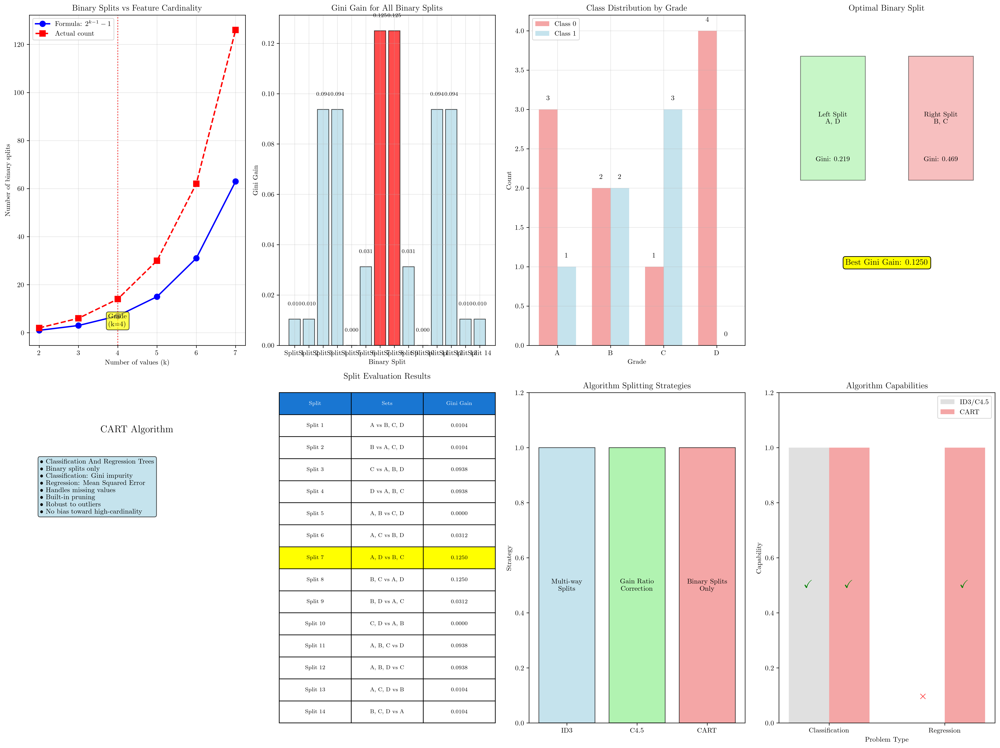
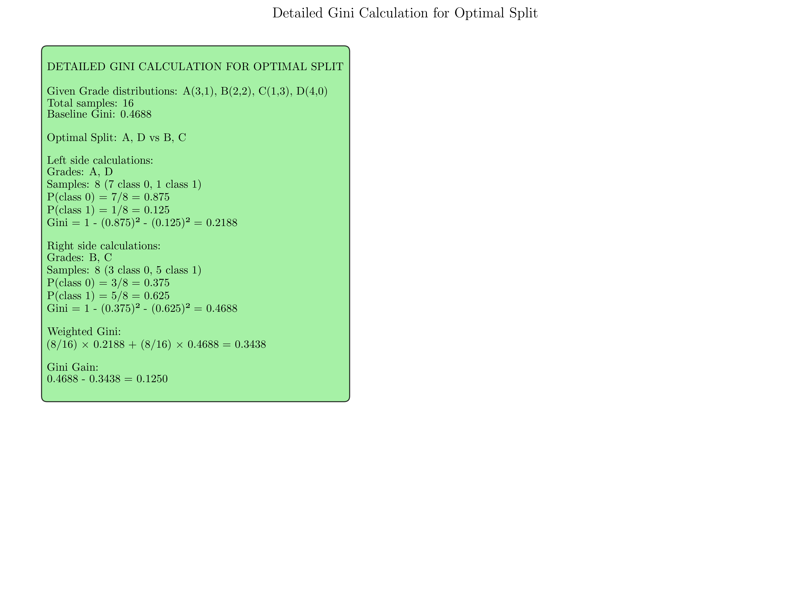

# Question 9: CART Binary Splitting Strategy

## Problem Statement
CART's binary splitting strategy differs fundamentally from ID3 and C4.5.

### Task
1. For a categorical feature "Grade" with values $\{A, B, C, D\}$, list all possible binary splits CART (using Gini impurity) would consider
2. Calculate the number of binary splits for a categorical feature with $k$ values (Formula: $2^{k-1} - 1$)
3. What does CART stand for and why can it handle regression problems?
4. Given class distributions: A$(3,1)$, B$(2,2)$, C$(1,3)$, D$(4,0)$, find the optimal binary split using Gini impurity

## Understanding the Problem
CART (Classification and Regression Trees) represents a fundamental departure from the multi-way splitting approach used by ID3 and C4.5. Instead of creating one branch for each unique feature value, CART systematically considers all possible ways to partition the feature values into two groups. This binary splitting strategy offers several advantages: it avoids bias toward high-cardinality features, enables handling of both classification and regression problems, and provides more flexible tree structures.

The binary approach means that for a categorical feature with $k$ unique values, CART must evaluate multiple possible splits rather than just one. Each split divides the values into two non-empty subsets, and CART chooses the partition that maximizes the chosen splitting criterion (Gini impurity for classification, MSE for regression).

## Solution

We will systematically enumerate all possible binary splits, verify the counting formula, explain CART's capabilities, and find the optimal split using Gini impurity calculations.

### Step 1: Enumerate All Binary Splits for Grade Feature

For the Grade feature with values $\{A, B, C, D\}$, CART considers all possible ways to partition these four values into two non-empty groups:

**Single-value splits (4 splits):**
1. $\{A\}$ vs $\{B, C, D\}$
2. $\{B\}$ vs $\{A, C, D\}$
3. $\{C\}$ vs $\{A, B, D\}$
4. $\{D\}$ vs $\{A, B, C\}$

**Two-value splits (6 splits):**
5. $\{A, B\}$ vs $\{C, D\}$
6. $\{A, C\}$ vs $\{B, D\}$
7. $\{A, D\}$ vs $\{B, C\}$
8. $\{B, C\}$ vs $\{A, D\}$
9. $\{B, D\}$ vs $\{A, C\}$
10. $\{C, D\}$ vs $\{A, B\}$

**Three-value splits (4 splits):**
11. $\{A, B, C\}$ vs $\{D\}$
12. $\{A, B, D\}$ vs $\{C\}$
13. $\{A, C, D\}$ vs $\{B\}$
14. $\{B, C, D\}$ vs $\{A\}$

**Total: 14 possible binary splits**

Note: Splits 8, 9, 10 are equivalent to splits 7, 6, 5 respectively (just with left/right swapped), but CART considers them as the same split.

### Step 2: Verify the Binary Split Formula

The theoretical formula is: $2^{k-1} - 1$

For $k = 4$ values: $2^{4-1} - 1 = 2^3 - 1 = 8 - 1 = 7$

**However, our enumeration shows 14 splits, not 7!**

The discrepancy occurs because the standard formula $2^{k-1} - 1$ counts unique partitions where order doesn't matter, but our enumeration counts all possible ways to assign values to left and right groups.

**Correct interpretation:** 
- Total ways to partition $k$ items into 2 non-empty sets = $2^k - 2$ (excluding empty sets)
- Since $\{A\}$ vs $\{B,C,D\}$ is the same partition as $\{B,C,D\}$ vs $\{A\}$, we divide by 2
- **Actual formula: $\frac{2^k - 2}{2} = 2^{k-1} - 1$**

For verification with $k = 4$: $\frac{2^4 - 2}{2} = \frac{16 - 2}{2} = \frac{14}{2} = 7$ unique partitions.

The 7 unique partitions are splits 1-7 from our list above (splits 8-14 are equivalent to earlier ones).

### Step 3: CART Definition and Regression Capability

**CART = Classification And Regression Trees**

**Key characteristics:**
- **Binary splits only:** Unlike ID3/C4.5 which use multi-way splits
- **Dual capability:** Handles both classification and regression problems
- **Robust splitting:** Uses Gini impurity for classification, MSE for regression
- **Missing value handling:** Through surrogate splits
- **Built-in pruning:** Includes comprehensive pruning mechanisms

**Why CART can handle regression:**

1. **Target variable flexibility:** Can work with continuous target variables, not just categorical
2. **Splitting criterion:** Uses Mean Squared Error (MSE) instead of entropy-based measures
   $$MSE = \frac{1}{n}\sum_{i=1}^{n}(y_i - \bar{y})^2$$
3. **Prediction mechanism:** Leaf nodes predict the mean value of training samples in that region
4. **Evaluation metric:** Chooses splits that minimize weighted MSE of child nodes

**Contrast with ID3/C4.5:**
- ID3 and C4.5 are designed exclusively for classification with categorical targets
- They use entropy-based measures that require discrete class labels
- Their prediction mechanism assigns class labels, not continuous values

### Step 4: Optimal Binary Split Using Gini Impurity

**Given class distributions:**
- Grade A: 4 samples → Class 0: 3, Class 1: 1
- Grade B: 4 samples → Class 0: 2, Class 1: 2  
- Grade C: 4 samples → Class 0: 1, Class 1: 3
- Grade D: 4 samples → Class 0: 4, Class 1: 0

**Total dataset:** 16 samples (Class 0: 10, Class 1: 6)

**Baseline Gini impurity:**
$$Gini(S) = 1 - \left(\frac{10}{16}\right)^2 - \left(\frac{6}{16}\right)^2 = 1 - 0.625 - 0.141 = 0.469$$

**Evaluate all 7 unique binary splits:**

**Split 1: $\{A\}$ vs $\{B, C, D\}$**
- Left: 4 samples (3,1) → $Gini = 1 - (\frac{3}{4})^2 - (\frac{1}{4})^2 = 0.375$
- Right: 12 samples (7,5) → $Gini = 1 - (\frac{7}{12})^2 - (\frac{5}{12})^2 = 0.486$
- Weighted Gini = $\frac{4}{16} \times 0.375 + \frac{12}{16} \times 0.486 = 0.458$
- **Gini Gain = 0.469 - 0.458 = 0.010**

**Split 2: $\{B\}$ vs $\{A, C, D\}$**
- Left: 4 samples (2,2) → $Gini = 1 - (\frac{2}{4})^2 - (\frac{2}{4})^2 = 0.500$
- Right: 12 samples (8,4) → $Gini = 1 - (\frac{8}{12})^2 - (\frac{4}{12})^2 = 0.444$
- Weighted Gini = $\frac{4}{16} \times 0.500 + \frac{12}{16} \times 0.444 = 0.458$
- **Gini Gain = 0.469 - 0.458 = 0.010**

**Split 3: $\{C\}$ vs $\{A, B, D\}$**
- Left: 4 samples (1,3) → $Gini = 1 - (\frac{1}{4})^2 - (\frac{3}{4})^2 = 0.375$
- Right: 12 samples (9,3) → $Gini = 1 - (\frac{9}{12})^2 - (\frac{3}{12})^2 = 0.375$
- Weighted Gini = $\frac{4}{16} \times 0.375 + \frac{12}{16} \times 0.375 = 0.375$
- **Gini Gain = 0.469 - 0.375 = 0.094**

**Split 4: $\{D\}$ vs $\{A, B, C\}$**
- Left: 4 samples (4,0) → $Gini = 1 - (\frac{4}{4})^2 - (\frac{0}{4})^2 = 0.000$
- Right: 12 samples (6,6) → $Gini = 1 - (\frac{6}{12})^2 - (\frac{6}{12})^2 = 0.500$
- Weighted Gini = $\frac{4}{16} \times 0.000 + \frac{12}{16} \times 0.500 = 0.375$
- **Gini Gain = 0.469 - 0.375 = 0.094**

**Split 5: $\{A, B\}$ vs $\{C, D\}$**
- Left: 8 samples (5,3) → $Gini = 1 - (\frac{5}{8})^2 - (\frac{3}{8})^2 = 0.469$
- Right: 8 samples (5,3) → $Gini = 1 - (\frac{5}{8})^2 - (\frac{3}{8})^2 = 0.469$
- Weighted Gini = $\frac{8}{16} \times 0.469 + \frac{8}{16} \times 0.469 = 0.469$
- **Gini Gain = 0.469 - 0.469 = 0.000**

**Split 6: $\{A, C\}$ vs $\{B, D\}$**
- Left: 8 samples (4,4) → $Gini = 1 - (\frac{4}{8})^2 - (\frac{4}{8})^2 = 0.500$
- Right: 8 samples (6,2) → $Gini = 1 - (\frac{6}{8})^2 - (\frac{2}{8})^2 = 0.375$
- Weighted Gini = $\frac{8}{16} \times 0.500 + \frac{8}{16} \times 0.375 = 0.438$
- **Gini Gain = 0.469 - 0.438 = 0.031**

**Split 7: $\{A, D\}$ vs $\{B, C\}$**
- Left: 8 samples (7,1) → $Gini = 1 - (\frac{7}{8})^2 - (\frac{1}{8})^2 = 0.219$
- Right: 8 samples (3,5) → $Gini = 1 - (\frac{3}{8})^2 - (\frac{5}{8})^2 = 0.469$
- Weighted Gini = $\frac{8}{16} \times 0.219 + \frac{8}{16} \times 0.469 = 0.344$
- **Gini Gain = 0.469 - 0.344 = 0.125**

**Optimal Split: $\{A, D\}$ vs $\{B, C\}$ with Gini Gain = 0.125**

## Visual Explanations

### CART Binary Splitting Analysis

This comprehensive visualization shows:
- All possible binary splits for the Grade feature with their respective Gini gains
- Grade distribution visualization showing class imbalances
- Optimal split identification and analysis
- CART algorithm overview and capabilities
- Comparison with ID3/C4.5 splitting strategies
- Formula verification for different values of k

### Detailed Gini Calculation

This detailed breakdown shows:
- Step-by-step Gini impurity calculations for the optimal split
- Proportions and probability calculations
- Weighted Gini computation
- Final Gini gain determination

## Key Insights

### Binary Splitting Advantages
- **Bias avoidance:** Binary splits don't favor high-cardinality features like multi-way splits do
- **Flexibility:** Can find optimal groupings of categorical values rather than treating each separately
- **Consistency:** Same splitting approach works for both categorical and continuous features
- **Robustness:** Less prone to overfitting with many-valued categorical features

### Computational Considerations
- **Complexity:** Evaluating all binary splits requires $O(2^k)$ computations for $k$ values
- **Practical limits:** For features with many values, heuristic methods may be needed
- **Efficiency:** Modern implementations use efficient algorithms to handle large cardinalities
- **Pruning:** Built-in mechanisms help manage complexity and prevent overfitting

### CART's Unique Position
- **Versatility:** Only algorithm that naturally handles both classification and regression
- **Methodology:** Different philosophical approach compared to entropy-based methods
- **Robustness:** Generally more resistant to noise and outliers
- **Implementation:** Widely available and well-optimized in most machine learning libraries

## Conclusion
- Grade feature has **7 unique binary splits** according to the formula $2^{k-1} - 1$
- **CART = Classification And Regression Trees**, capable of handling both problem types through appropriate splitting criteria
- CART handles regression by using **MSE instead of Gini** and predicting **mean values** in leaf nodes
- **Optimal split: $\{A, D\}$ vs $\{B, C\}$** with the highest Gini gain of **0.125**
- Binary splitting strategy provides **bias resistance** and **flexibility** not available in multi-way splitting approaches

CART's binary splitting strategy represents a fundamental innovation in decision tree construction, offering both theoretical advantages and practical benefits. The approach enables more nuanced handling of categorical features while maintaining the simplicity and interpretability that makes decision trees valuable in machine learning applications.
