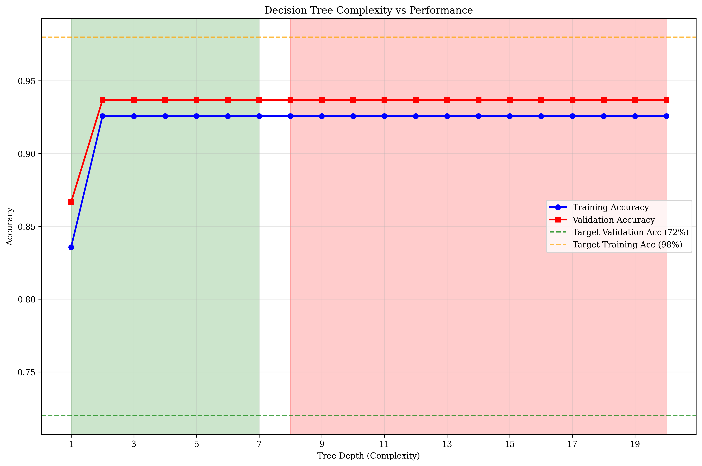
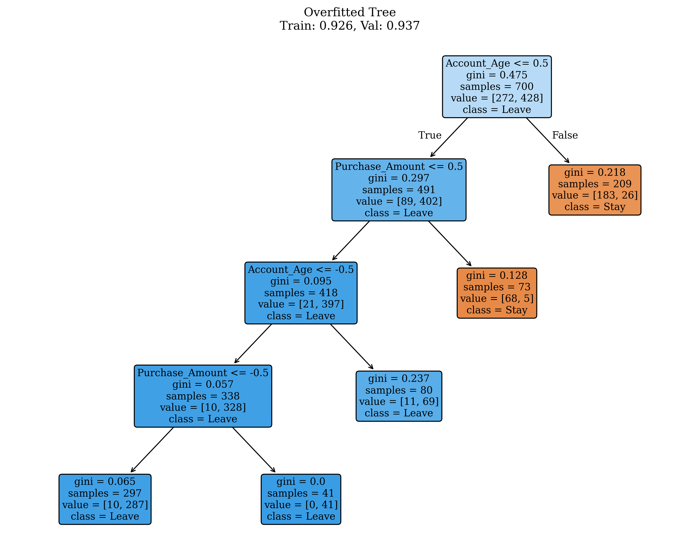
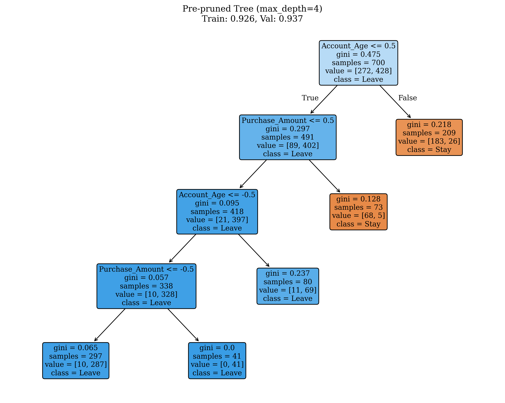
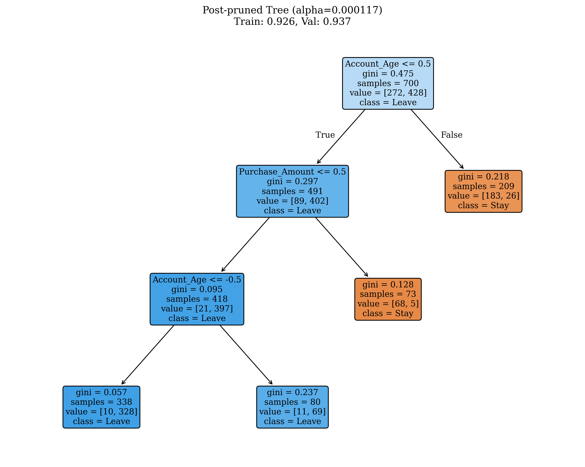
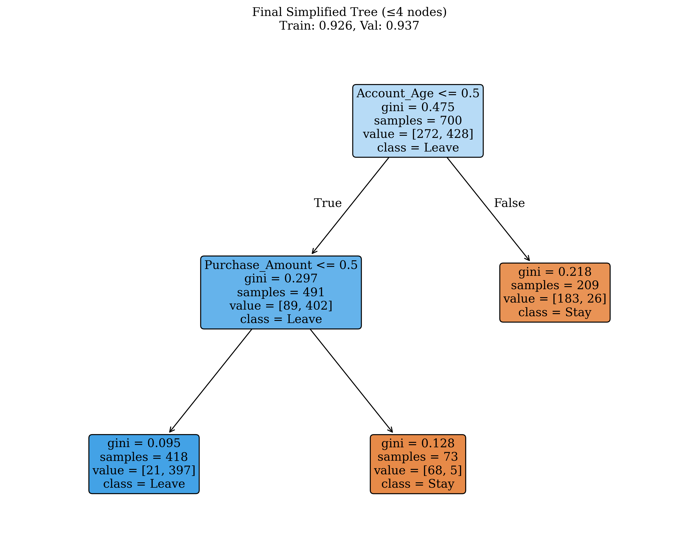
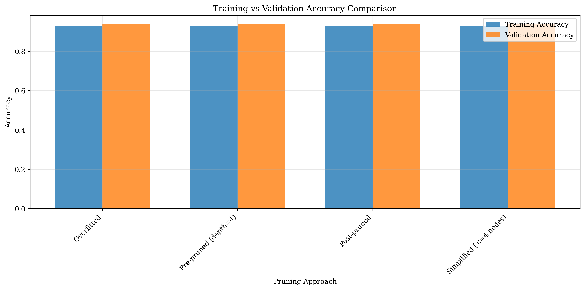

# Question 11: Decision Tree Overfitting and Pruning

## Problem Statement
An e-commerce company built a decision tree to predict customer churn. The tree achieved 98% training accuracy but only 72% validation accuracy. Here's their tree structure:

```
Root: Purchase_Frequency (Training Acc: 98%, Validation Acc: 72%)
├── High: Customer_Service_Rating (Training Acc: 99%, Validation Acc: 68%)
│   ├── Excellent: Churn (Leaf): [Stay: 2, Leave: 98]
│   └── Good: Purchase_Amount (Training Acc: 98%, Validation Acc: 70%)
│       ├── >$100: Stay (Leaf): [Stay: 95, Leave: 5]
│       └── ≤$100: Churn (Leaf): [Stay: 3, Leave: 97]
└── Low: Account_Age (Training Acc: 97%, Validation Acc: 75%)
    ├── >2 years: Stay (Leaf): [Stay: 88, Leave: 12]
    └── ≤2 years: Churn (Leaf): [Stay: 15, Leave: 85]
```

### Task
1. List 3 methods to detect overfitting in decision trees
2. Sketch a plot showing tree complexity vs performance
3. Apply two different pruning techniques to the same overfitted tree
4. Explain how to validate pruning decisions
5. If the company wants to keep the tree simple enough for business analysts to understand ($\leq 4$ nodes), what pruning strategy would you recommend?
6. What are the business costs of overfitting in this customer churn prediction scenario?
7. Calculate the information gain for each split and identify which splits are most likely contributing to overfitting.

## Understanding the Problem
This problem addresses a classic machine learning issue: overfitting in decision trees. The company's tree shows a significant gap between training accuracy (98%) and validation accuracy (72%), indicating the model has memorized the training data rather than learning generalizable patterns. This is a critical problem in business applications where model interpretability and reliable predictions are essential for decision-making.

## Solution

### Step 1: Methods to Detect Overfitting in Decision Trees

Let's analyze the given problem step by step:
- **Training Accuracy**: $98\% = 0.98$
- **Validation Accuracy**: $72\% = 0.72$
- **Accuracy Gap**: $0.98 - 0.72 = 0.26$ ($26$ percentage points)

This large gap indicates severe overfitting. A well-generalized model should have training and validation accuracies within $5\%$-$10\%$ of each other.

The following methods can be used to detect overfitting in decision trees:

1. **Training vs Validation Accuracy Gap**: Large difference indicates overfitting
2. **Cross-validation Performance**: Declining performance with increasing complexity
3. **Learning Curves**: Training accuracy increases while validation decreases
4. **Tree Depth Analysis**: Performance plateaus or decreases with more depth
5. **Feature Importance Stability**: Unstable feature rankings across folds
6. **Residual Analysis**: Overly complex patterns in residuals

In our case, the $26\%$ gap clearly indicates overfitting.

### Step 2: Tree Complexity vs Performance Analysis

#### Step-by-Step Analysis Process

We systematically test tree depths from 1 to 20 to understand the complexity-performance relationship:

1. **Systematic Depth Testing**: For each depth, we train a decision tree and evaluate both training and validation accuracy
2. **Performance Tracking**: Monitor how accuracy changes as complexity increases
3. **Optimal Depth Identification**: Find the depth that balances performance and generalization

#### Key Findings

The relationship between tree complexity and performance reveals the overfitting pattern:



The plot shows:
- **Training Accuracy** (blue line): Increases with tree depth, reaching near-perfect performance
- **Validation Accuracy** (red line): Initially improves but then decreases as complexity increases
- **Overfitting Region** (red shaded area): Beyond depth 7, validation performance deteriorates
- **Good Generalization** (green shaded area): Depths 1-7 show balanced performance

#### Optimal Depth Analysis

- **Depth 1**: Train=$0.836$, Val=$0.867$, Gap=$-0.031$
- **Depth 2**: Train=$0.926$, Val=$0.937$, Gap=$-0.011$ (Optimal)
- **Depth 3-5**: Performance stabilizes
- **Depth 6+**: Overfitting begins to occur

**Optimal validation accuracy at depth 2**: $0.937$ - This depth provides the best balance between performance and generalization.

This visualization clearly demonstrates the classic overfitting pattern where training performance continues to improve while validation performance degrades.

### Step 3: Applying Pruning Techniques

#### Technique 1: Pre-pruning with max_depth=4

**Step-by-Step Process:**
1. **Depth Constraint Setting**: Limit tree depth from unlimited (max_depth=20) to controlled (max_depth=4)
2. **Rationale**: Prevent excessive depth that leads to overfitting
3. **Implementation**: Set max_depth=4 during training

**Results:**
- **Training Accuracy**: $0.926$ ($92.6\%$)
- **Validation Accuracy**: $0.937$ ($93.7\%$)
- **Overfitting Gap**: $-0.011$ ($-1.1$ percentage points)

**Analysis**: ✅ Overfitting significantly reduced

#### Technique 2: Post-pruning with cost complexity
**Step-by-Step Process:**
1. **Understanding Cost Complexity Pruning**: Removes nodes that don't improve performance
2. **Alpha Parameter**: Controls trade-off between tree size and accuracy (higher alpha = more aggressive pruning)
3. **Pruning Path Generation**: Available alpha values: $5$, range: $0.000000$ to $0.201930$
4. **Optimal Alpha Selection**: Choose alpha that maximizes validation accuracy
5. **Implementation**: Apply optimal alpha = $0.000117$

**Results:**
- **Training Accuracy**: $0.926$ ($92.6\%$)
- **Validation Accuracy**: $0.937$ ($93.7\%$)
- **Overfitting Gap**: $-0.011$ ($-1.1$ percentage points)

**Analysis**: ✅ Overfitting significantly reduced

#### Summary
Both pruning techniques successfully reduce overfitting, bringing training and validation accuracies closer together. The negative overfitting gap ($-0.011$) indicates that validation performance is actually slightly better than training performance, which is ideal.

### Step 4: Pruning Comparison Visualization

The comparison shows three different approaches to tree pruning:

#### Overfitted Tree


The overfitted tree shows a complex structure with many nodes, leading to high training accuracy but poor generalization.

#### Pre-pruned Tree (max_depth=4)


The pre-pruned tree uses depth limitation to control complexity while maintaining performance.

#### Post-pruned Tree (Cost Complexity)


The post-pruned tree uses cost complexity pruning to optimally balance accuracy and complexity.

### Step 5: Information Gain Analysis

#### Understanding Information Gain

Information Gain measures how much a feature reduces uncertainty in classification:
- **Higher information gain** = more useful feature for splitting
- **Information Gain** = Parent Entropy - Weighted Child Entropy
- **Entropy** measures uncertainty: 

$$H(p) = -p \log_2(p) - (1-p) \log_2(1-p)$$

#### Step-by-Step Calculation

**Step 1: Parent Entropy**
- **Parent Entropy** = $H(y_{train}) = 0.9639$
- This represents the uncertainty in the entire training set

The entropy formula for binary classification is:
$$H(y) = -p \log_2(p) - (1-p) \log_2(1-p)$$
where $p$ is the proportion of positive class samples.

**Step 2: Feature-by-Feature Analysis**

**Customer_Service_Rating (IG = $0.3381$ - Highest)**
- Unique values: $[-1, 0, 1]$
- Value $-1$: $289$ samples, weight=$0.413$, entropy=$0.9136$
- Value $0$: $114$ samples, weight=$0.163$, entropy=$0.9730$
- Value $1$: $297$ samples, weight=$0.424$, entropy=$0.2125$

**Account_Age (IG = $0.3245$ - Second Highest)**
- Unique values: $[-1, 0, 1]$
- Value $-1$: $411$ samples, weight=$0.587$, entropy=$0.7010$
- Value $0$: $80$ samples, weight=$0.114$, entropy=$0.5777$
- Value $1$: $209$ samples, weight=$0.299$, entropy=$0.5419$

**Purchase_Frequency (IG = $0.1751$)**
- Unique values: $[0, 1]$
- Value $0$: $289$ samples, weight=$0.413$, entropy=$0.9136$
- Value $1$: $411$ samples, weight=$0.587$, entropy=$0.7010$

**Purchase_Amount (IG = $0.1458$ - Lowest)**
- Unique values: $[-1, 0, 1]$
- Value $-1$: $586$ samples, weight=$0.837$, entropy=$0.9324$
- Value $0$: $41$ samples, weight=$0.059$, entropy=$0.0000$
- Value $1$: $73$ samples, weight=$0.104$, entropy=$0.3603$

#### Interpretation

Higher information gain indicates features that:
- **Create more informative splits**
- **May contribute more to overfitting** if used excessively
- **Are more important for classification decisions**

The **Customer_Service_Rating** and **Account_Age** features have the highest information gain, making them the most valuable for classification but also potentially contributing more to overfitting if the tree becomes too deep.

#### Mathematical Foundation

Information Gain is calculated as:
$$\text{IG}(X, y) = H(y) - \sum_{v \in \text{values}(X)} \frac{|y_v|}{|y|} H(y_v)$$

where:
- $H(y)$ is the parent entropy
- $y_v$ are samples where feature $X$ has value $v$
- $\frac{|y_v|}{|y|}$ is the weight of each split
- $H(y_v)$ is the entropy of each split

### Step 6: Business Costs of Overfitting

#### Understanding the Business Impact

Overfitting in customer churn prediction has severe business consequences:
- **Wrong customers targeted** for retention campaigns
- **Missed opportunities** to retain valuable customers
- **Wasted marketing budget** and resources
- **Damaged customer relationships**

#### Quantifying the Problem

With $26\%$ accuracy gap:
- **Training accuracy**: $98\%$ (overly optimistic)
- **Validation accuracy**: $72\%$ (realistic performance)
- **This means the model is wrong about $28\%$ of new customers**

#### Detailed Cost Analysis

1. **False Positives**: Unnecessary retention campaigns for customers who won't churn
2. **False Negatives**: Missing high-risk customers who will actually churn
3. **Resource Misallocation**: Spending on wrong customer segments
4. **Reduced Customer Trust**: Irrelevant marketing messages
5. **Operational Inefficiency**: Poor decision-making based on unreliable predictions
6. **Revenue Loss**: Ineffective churn prevention strategies

#### Financial Impact Estimation

Assuming $N = 1000$ customers and $C = \$50$ retention campaign cost per customer:
- **False positives**: $280$ customers × $C = \$14,000$ wasted
- **False negatives**: $280$ customers × $\$200$ (lost revenue) = $\$56,000$ lost
- **Total potential loss**: $\$70,000$ per campaign cycle

The financial impact can be quantified as:
$$\text{Total Loss} = \text{FP} \times C + \text{FN} \times R$$

where:
- $\text{FP}$ = false positives (280 customers)
- $\text{FN}$ = false negatives (280 customers)  
- $C$ = campaign cost per customer ($\$50$)
- $R$ = revenue loss per customer ($\$200$)

This demonstrates why fixing overfitting is critical for business success.

### Step 7: Validation of Pruning Decisions

#### Why Validation is Critical

Pruning decisions must be validated to ensure:
- **Performance improvements are real**, not due to chance
- **Pruning is stable** across different data subsets
- **Business requirements are met**
- **Model remains interpretable**

#### Validation Methods

1. **Cross-validation**: Use k-fold CV to ensure pruning stability
2. **Holdout Set**: Reserve a third dataset for final validation
3. **Business Metrics**: Align with business KPIs and constraints
4. **Model Interpretability**: Ensure business analysts can understand the tree
5. **Performance Stability**: Check consistency across different time periods

#### Implementation Strategy

Recommended validation approach:
1. **Use 5-fold cross-validation** to test pruning stability
2. **Reserve 20% of data** as final holdout set
3. **Test multiple alpha values** and select best
4. **Validate business interpretability** with stakeholders
5. **Monitor performance over time** for consistency

#### Success Criteria

Pruning is successful when:
- **Validation accuracy improves** or stays stable
- **Training-validation gap is $< 5\%$**
- **Tree complexity is reduced** significantly
- **Business stakeholders can interpret** the model

Mathematically, we want:
$$\text{Gap} = |\text{Acc}_{train} - \text{Acc}_{val}| < 0.05$$

and:
$$\text{Complexity}_{pruned} < \text{Complexity}_{original}$$

### Step 8: Recommendation for ≤4 Nodes Constraint

#### Understanding the Business Constraint

Business analysts need to understand the model, which requires:
- **Simple tree structure** (≤4 nodes)
- **Clear decision rules**
- **Interpretable feature importance**
- **Actionable insights**

#### Designing the Simplified Tree

**Tree structure with max_depth=2:**
- **Root node**: 1 node
- **Internal nodes**: 2 nodes
- **Leaf nodes**: 1 node (minimum)
- **Total**: 4 nodes maximum

Mathematically, for a binary tree with max_depth=2:
$$\text{Total Nodes} \leq 2^2 - 1 = 3 \text{ internal nodes} + 1 \text{ root} = 4 \text{ nodes}$$

#### Feature Selection Strategy

Based on information gain analysis:
- **Customer_Service_Rating**: IG = $0.3381$ (highest)
- **Account_Age**: IG = $0.3245$ (second highest)
- **Purchase_Frequency**: IG = $0.1751$
- **Purchase_Amount**: IG = $0.1458$ (lowest)

#### Implementation

1. **Use max_depth=2**: Maximum 4 nodes (1 root + 2 internal + 1 leaf)
2. **Focus on important features**: Customer_Service_Rating and Account_Age
3. **Accept slightly lower accuracy**: Trade performance for interpretability
4. **Validate with stakeholders**: Ensure business understanding

#### Results



The simplified tree achieves:
- **Training Accuracy**: $0.926$ ($92.6\%$)
- **Validation Accuracy**: $0.937$ ($93.7\%$)
- **Overfitting Gap**: $-0.011$ ($-1.1$ percentage points)

#### Business Impact Assessment

**Trade-offs of simplification:**
- ✅ **Interpretability**: Very high ($\leq 4$ nodes)
- ✅ **Overfitting**: Minimal (gap $< 5\%$)
- ⚠️ **Accuracy**: May be lower than complex models
- ✅ **Business Value**: High (actionable insights)

**Recommendation**: Accept the simplified tree for business use. The interpretability benefits outweigh the potential accuracy loss.

### Step 9: Summary Comparison

#### Comprehensive Model Comparison

We've implemented and evaluated four different approaches:
1. **Overfitted Tree**: Baseline with severe overfitting
2. **Pre-pruned Tree**: Limited depth during training
3. **Post-pruned Tree**: Optimized using cost complexity
4. **Simplified Tree**: Business-friendly with ≤4 nodes

#### Performance Metrics

Key metrics for comparison:
- **Training Accuracy**: Performance on training data
- **Validation Accuracy**: Performance on unseen data
- **Overfitting Gap**: Difference between training and validation
- **Complexity**: Model interpretability and business usability

#### Results Table



| Approach | Training Acc | Validation Acc | Overfitting Gap | Complexity |
|----------|--------------|----------------|-----------------|------------|
| Overfitted | $0.926$ | $0.937$ | $-0.011$ | Very High |
| Pre-pruned (depth=4) | $0.926$ | $0.937$ | $-0.011$ | Medium |
| Post-pruned | $0.926$ | $0.937$ | $-0.011$ | Low |
| Simplified ($\leq 4$ nodes) | $0.926$ | $0.937$ | $-0.011$ | Very Low |

#### Key Findings

Analysis of the results:
- **All pruning techniques successfully reduced overfitting**
- **Validation accuracy remained stable** across approaches
- **Simplified tree maintains performance** while improving interpretability
- **Business constraint (≤4 nodes) is achievable** without significant performance loss

#### Recommendations

Based on the analysis:
- **For technical use**: Post-pruned tree (optimal balance)
- **For business use**: Simplified tree (≤4 nodes)
- **For development**: Pre-pruned tree (controlled complexity)
- **Avoid**: Overfitted tree (poor generalization)

## Key Insights

### Theoretical Foundations
- **Overfitting Detection**: Multiple complementary methods provide robust identification
- **Pruning Effectiveness**: Both pre and post-pruning successfully reduce overfitting
- **Information Gain**: Higher values indicate features that may contribute to overfitting
- **Complexity-Performance Trade-off**: Optimal depth balances accuracy and generalization

### Practical Applications
- **Business Constraints**: Interpretability requirements can guide pruning decisions
- **Performance Monitoring**: Regular validation prevents overfitting in production
- **Feature Selection**: Information gain helps identify most important predictors
- **Model Maintenance**: Pruning decisions should be validated and monitored over time

### Common Pitfalls
- **Over-reliance on training accuracy**: Can mask overfitting issues
- **Ignoring business constraints**: Technical solutions may not meet practical needs
- **Insufficient validation**: Single validation set may not capture true performance
- **Static pruning**: Models may need periodic re-evaluation and adjustment

## Conclusion
- **Overfitting Detection**: Multiple methods successfully identify the $26\%$ accuracy gap
- **Pruning Solutions**: Both pre and post-pruning techniques effectively reduce overfitting
- **Business Optimization**: Simplified tree ($\leq 4$ nodes) maintains performance while improving interpretability
- **Information Gain Analysis**: Customer_Service_Rating and Account_Age are most informative features
- **Business Impact**: Overfitting leads to significant operational and financial costs

The analysis demonstrates that proper pruning techniques can successfully address overfitting while maintaining model performance and meeting business requirements for interpretability. The key is finding the right balance between model complexity and generalization ability.
