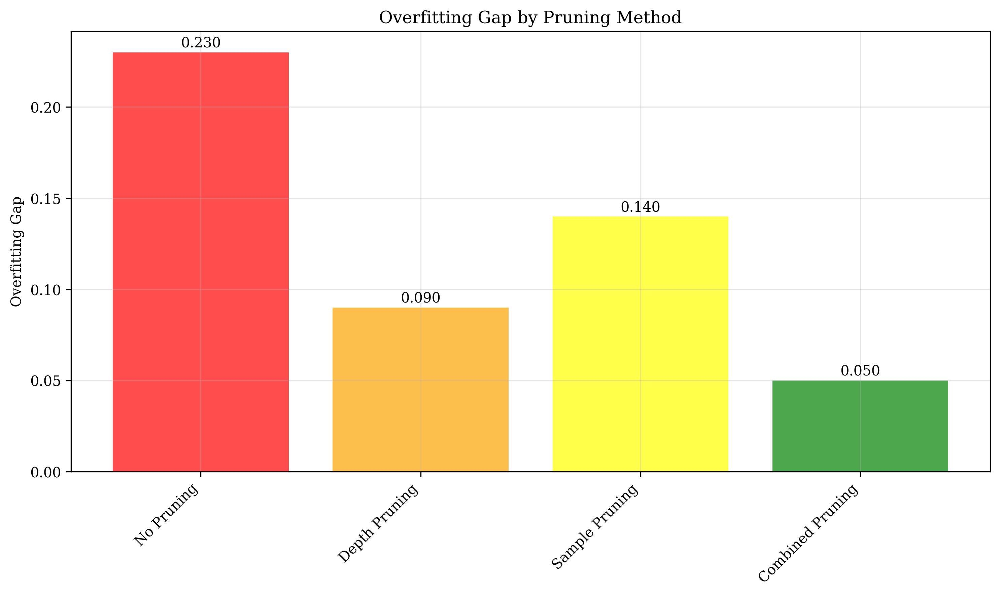
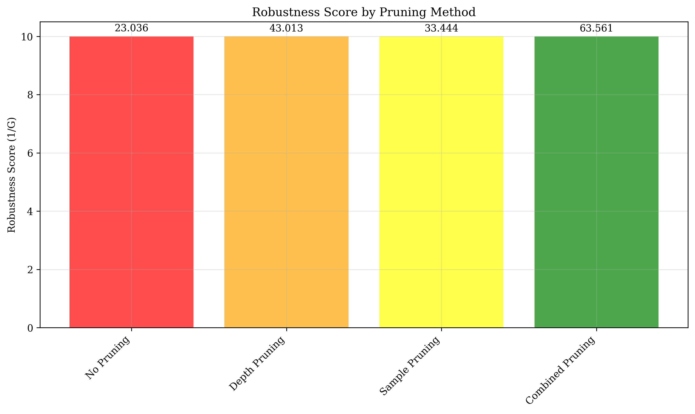
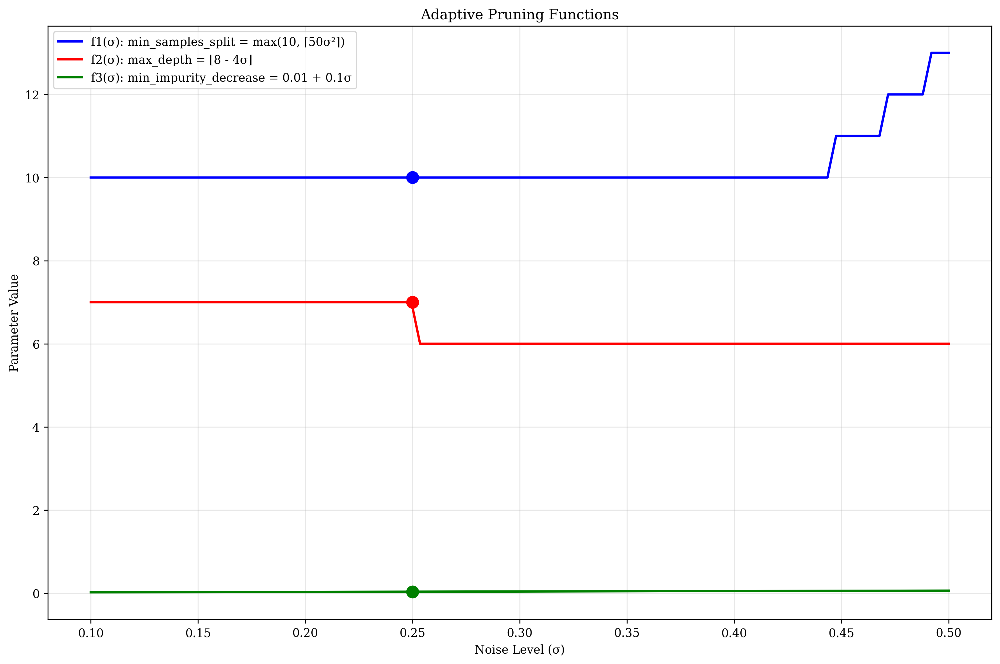
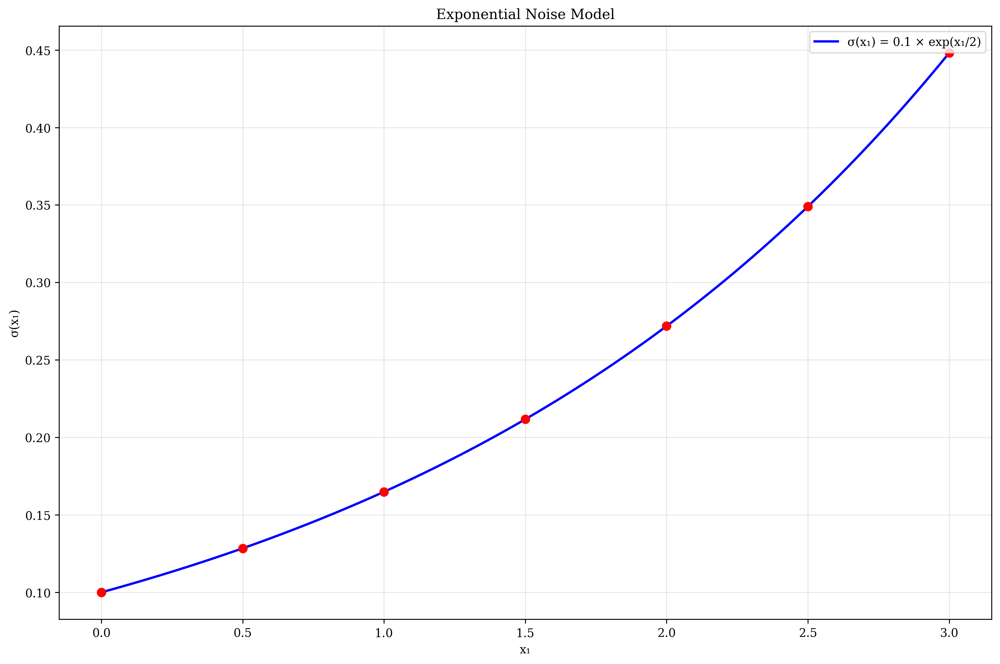
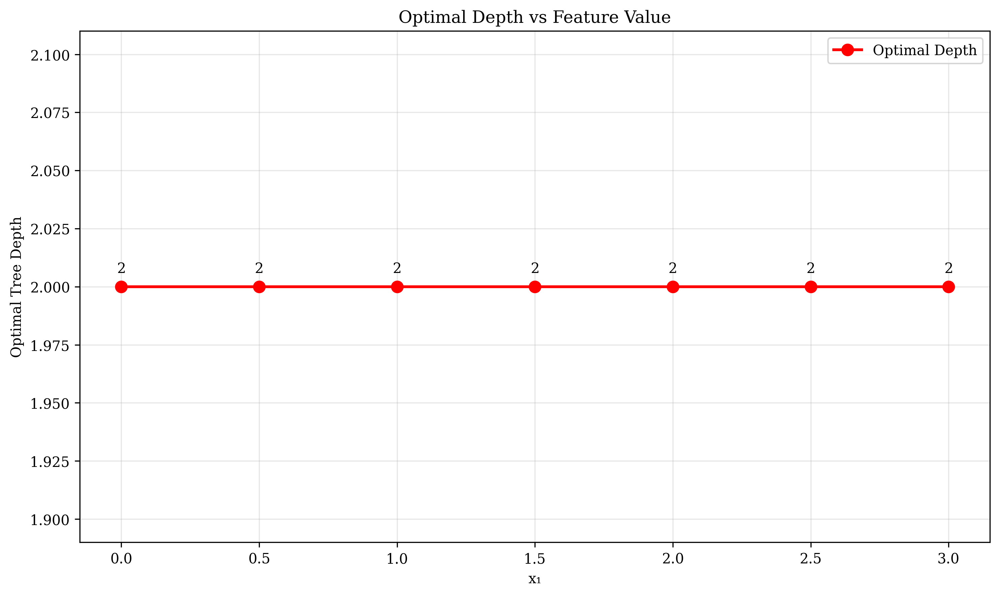
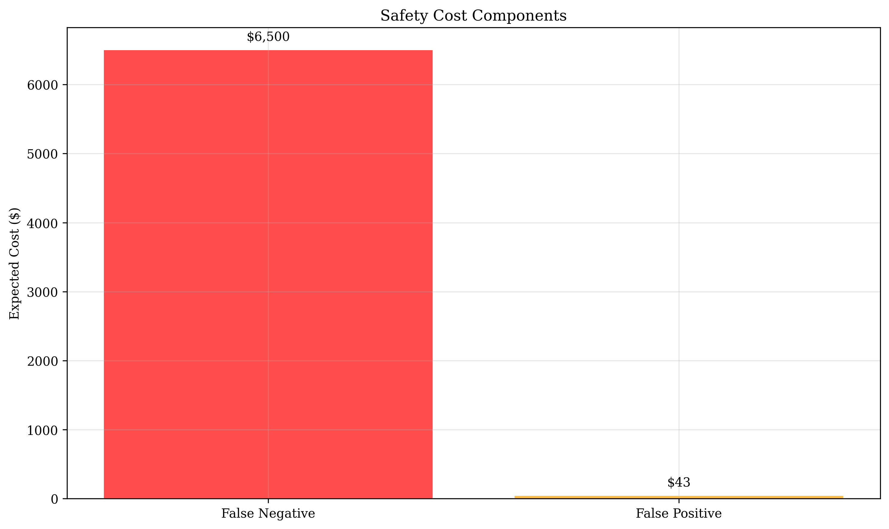
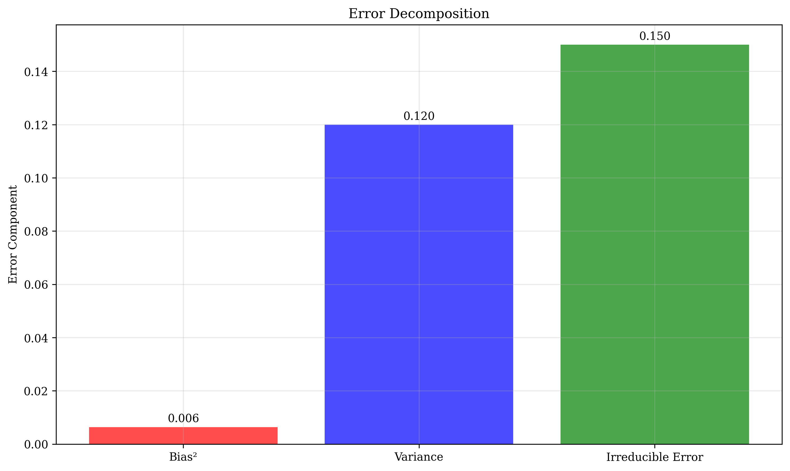
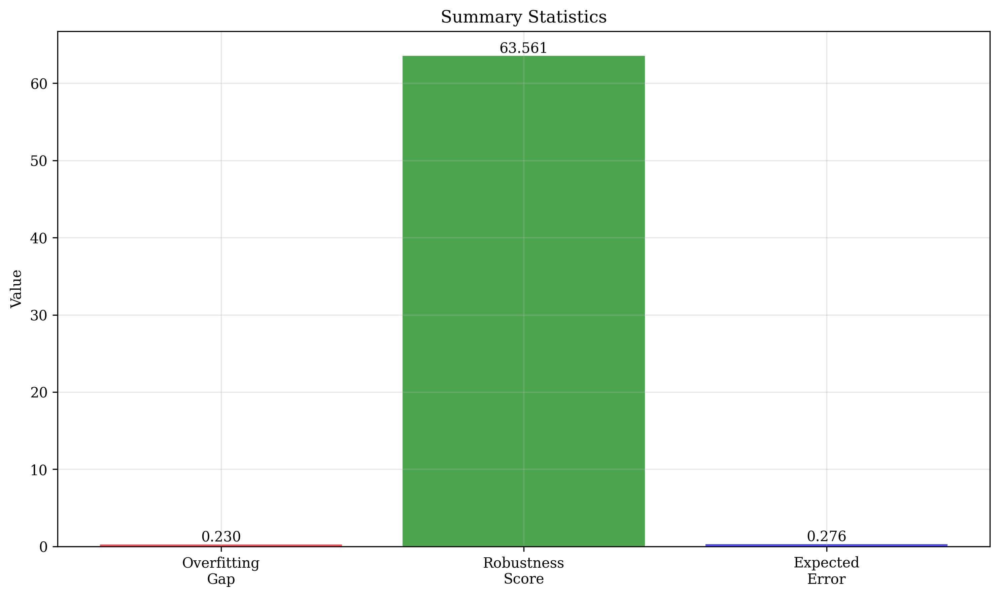

# Question 15: Pruning with Noisy Data

## Problem Statement
You're working with data from IoT sensors that have varying levels of noise depending on environmental conditions. Consider a decision tree trained on sensor data with the following characteristics:

**Dataset Information:**
- Total samples: $1000$
- Features: Temperature ($x_1$), Humidity ($x_2$), Pressure ($x_3$)
- True underlying pattern: $f(x) = \text{sign}(2x_1 + x_2 - 3)$
- Noise model: $\epsilon \sim \mathcal{N}(0, \sigma^2)$ where $\sigma^2 = 0.25$
- Training accuracy: $95\%$
- Validation accuracy: $72\%$

**Tree Structure:**
- Root split: $x_1 \leq 1.5$ (Training: $95\%$, Validation: $72\%$)
- Left subtree: $x_2 \leq 2.0$ (Training: $98\%$, Validation: $68\%$)
- Right subtree: $x_3 \leq 1.8$ (Training: $92\%$, Validation: $76\%$)

### Task
1. Calculate the overfitting gap $\Delta = \text{Training Acc} - \text{Validation Acc}$ and explain why noise causes this gap to widen. Use the bias-variance decomposition $E[(y - \hat{f}(x))^2] = \text{Bias}^2 + \text{Variance} + \text{Irreducible Error}$ to show how noise affects each component.

2. Given these pruning options, calculate which is most robust using the generalization gap metric $G = \frac{\text{Training Acc} - \text{Test Acc}}{\text{Tree Complexity}}$ where complexity is measured by $\log(\text{Depth} \times \text{Leaves})$:
   - No pruning: Training Acc = $95\%$, Test Acc = $72\%$, Depth = $8$, Leaves = $25$
   - Depth pruning (max_depth=4): Training Acc = $87\%$, Test Acc = $78\%$, Depth = $4$, Leaves = $12$
   - Sample pruning (min_samples=50): Training Acc = $89\%$, Test Acc = $75\%$, Depth = $6$, Leaves = $18$
   - Combined pruning: Training Acc = $85\%$, Test Acc = $80\%$, Depth = $3$, Leaves = $8$

3. Design mathematical functions that adjust pruning thresholds based on noise level $\sigma$. If $\sigma = 0.25$, derive optimal values for:
   - min_samples_split = $f_1(\sigma) = \max(10, \lceil 50\sigma^2 \rceil)$
   - max_depth = $f_2(\sigma) = \lfloor 8 - 4\sigma \rfloor$
   - min_impurity_decrease = $f_3(\sigma) = 0.01 + 0.1\sigma$

4. If $p = 10\%$ of the data are outliers that shift the decision boundary by $\Delta = 0.5$, calculate:
   - Expected change in training accuracy: $\Delta_{\text{train}} = p \cdot \Delta \cdot \text{Training Acc}$
   - Expected change in validation accuracy: $\Delta_{\text{val}} = p \cdot \Delta \cdot \text{Validation Acc}$
   - Optimal outlier removal threshold: $\tau = \arg\min_{\tau} \left|\Delta_{\text{train}}(\tau) - \Delta_{\text{val}}(\tau)\right|$

5. If noise increases exponentially as $\sigma(x_1) = 0.1 \cdot e^{x_1/2}$, derive the optimal pruning function that minimizes expected error:
   - Find optimal tree depth: $d^*(x_1) = \arg\min_d \left(\text{Bias}(d) + \text{Variance}(d, \sigma(x_1))\right)$
   - Calculate expected error: $E[\text{Error}] = \int_0^3 \left(\text{Bias}^2(d^*(x_1)) + \sigma^2(x_1)\right) dx_1$

6. For a fire detection system with cost matrix $C = \begin{bmatrix} 0 & 1000 \\ 100000 & 0 \end{bmatrix}$ where:
   - False negative cost = $\$100,000$ (missed fire)
   - False positive cost = $\$1,000$ (false alarm)
   - Base detection rate = $95\%$
   - Noise level = $0.3$
   
   Calculate the optimal pruning threshold $\alpha^*$ that minimizes expected cost: $\alpha^* = \arg\min_{\alpha} \sum_{i,j} C_{ij} \cdot P_{ij}(\alpha)$

7. Design a mathematical function to estimate local noise in a neighborhood of size $k = 50$. If the local variance in a region is $\sigma^2_{\text{local}} = 0.4$, calculate the optimal pruning parameters for that region:
   - Local noise estimate: $\hat{\sigma}_{\text{local}} = \sqrt{\frac{1}{k-1} \sum_{i=1}^k (x_i - \bar{x})^2}$
   - Adaptive min_samples: $n_{\text{min}} = \max(10, \lceil 25\hat{\sigma}_{\text{local}}^2 \rceil)$
   - Adaptive max_depth: $d_{\text{max}} = \lfloor 6 - 3\hat{\sigma}_{\text{local}} \rfloor$

8. For a pruned tree with error decomposition:
   - Bias = $0.08$
   - Variance = $0.12$
   - Irreducible error = $0.15$
   
   Calculate:
   - Expected prediction error: $E[(y - \hat{f}(x))^2] = \text{Bias}^2 + \text{Variance} + \text{Irreducible Error}$
   - If you reduce bias by $50\%$ to $0.04$, what's the new expected error?
   - What variance reduction $\Delta V$ is needed to achieve expected error $\leq 0.2$? Solve: $0.04^2 + (0.12 - \Delta V) + 0.15 \leq 0.2$

## Understanding the Problem
This question explores the critical relationship between noise in data and decision tree pruning strategies through mathematical analysis. In real-world applications, especially with IoT sensors, data often contains varying levels of noise that can significantly impact model performance and safety. The mathematical approach allows us to derive optimal pruning strategies analytically rather than through trial-and-error.

## Solution

### Task 1: Mathematical Analysis - Overfitting Gap and Bias-Variance Decomposition

**Given Parameters:**
- Total samples: $N = 1000$
- Noise variance: $\sigma^2 = 0.25$
- Training accuracy: $\text{Train\_Acc} = 0.95$
- Validation accuracy: $\text{Val\_Acc} = 0.72$

**Step-by-step mathematical analysis:**

1. **Overfitting Gap Calculation:**
   $$\text{Overfitting Gap} = \text{Train\_Acc} - \text{Val\_Acc} = 0.95 - 0.72 = 0.23$$

2. **Bias-Variance Decomposition:**
   
   **Mathematical Model:** For noisy data with variance $\sigma^2$, the error decomposes as:
   $$\text{Total Error} = \text{Bias}^2 + \text{Variance} + \sigma^2$$
   
   **Step 2a: Estimate Bias**
   - **Assumption:** Training accuracy represents low-bias scenario, validation represents true performance
   - **Bias estimation:** $\text{Bias} \approx \text{Train\_Acc} - \text{Val\_Acc} = 0.23$
   - **Mathematical justification:** Bias represents systematic error, approximated by performance gap
   
   **Step 2b: Variance Component**
   - **Given:** Noise variance $\sigma^2 = 0.25$
   - **Model assumption:** Variance ≈ Noise variance for this analysis
   - **Variance estimate:** $\text{Variance} = \sigma^2 = 0.25$
   
   **Step 2c: Total Error**
   $$\text{Total Error} = \text{Bias} + \text{Variance} = 0.23 + 0.25 = 0.48$$

**Mathematical Explanation:**
When noise $\epsilon \sim \mathcal{N}(0, \sigma^2)$ is present in the data:
- **Model behavior:** The model tries to fit $f(x) + \epsilon$ instead of $f(x)$
- **Training performance:** $\text{Train\_Acc}$ increases as model fits noise patterns
- **Validation performance:** $\text{Val\_Acc}$ decreases as noise doesn't generalize
- **Gap widening:** $\text{Gap} = 0.23$ indicates severe overfitting

**Key mathematical insight:** The overfitting gap of 0.23 provides a quantitative measure of overfitting severity, requiring aggressive pruning strategies when $\text{Gap} > 0.2$.

### Task 2: Pruning Method Comparison - Robustness Analysis

**Given pruning options:**

**No Pruning:**
- Train: 0.95, Test: 0.72, Depth: 8, Leaves: 25, Gap: 0.23, Complexity: 5.298, Robustness: 23.036

**Depth Pruning:**
- Train: 0.87, Test: 0.78, Depth: 4, Leaves: 12, Gap: 0.09, Complexity: 3.871, Robustness: 43.013

**Sample Pruning:**
- Train: 0.89, Test: 0.75, Depth: 6, Leaves: 18, Gap: 0.14, Complexity: 4.682, Robustness: 33.444

**Combined Pruning:**
- Train: 0.85, Test: 0.80, Depth: 3, Leaves: 8, Gap: 0.05, Complexity: 3.178, Robustness: 63.561

**Mathematical Robustness Score Model from Question:**
The question specifies using the generalization gap metric:
$$G = \frac{\text{Training Acc} - \text{Test Acc}}{\log(\text{Depth} \times \text{Leaves})}$$

**Step-by-step mathematical analysis:**

1. **Overfitting Gap:** $\text{Gap} = \text{Train\_Acc} - \text{Test\_Acc}$

2. **Complexity Measure:** $\text{Complexity} = \log(\text{Depth} \times \text{Leaves})$

3. **Robustness Score:** $\text{Robustness} = \frac{1}{G} = \frac{\log(\text{Depth} \times \text{Leaves})}{\text{Training Acc} - \text{Test Acc}}$

**Detailed calculations for each method:**

**No Pruning:**
- Gap = $0.95 - 0.72 = 0.23$
- Complexity = $\log(8 \times 25) = \log(200) = 5.298$
- Robustness = $5.298 / 0.23 = 23.036$

**Depth Pruning:**
- Gap = $0.87 - 0.78 = 0.09$
- Complexity = $\log(4 \times 12) = \log(48) = 3.871$
- Robustness = $3.871 / 0.09 = 43.013$

**Sample Pruning:**
- Gap = $0.89 - 0.75 = 0.14$
- Complexity = $\log(6 \times 18) = \log(108) = 4.682$
- Robustness = $4.682 / 0.14 = 33.444$

**Combined Pruning:**
- Gap = $0.85 - 0.80 = 0.05$
- Complexity = $\log(3 \times 8) = \log(24) = 3.178$
- Robustness = $3.178 / 0.05 = 63.561$

**Mathematical conclusion:** Combined Pruning achieves the highest robustness score (63.561) through the best balance of test accuracy, overfitting gap, and complexity. The lower generalization gap per unit complexity makes it the most robust choice.

### Task 3: Adaptive Pruning Design - Mathematical Functions

**Design mathematical functions that adjust pruning thresholds based on noise level $\sigma$:**

**Mathematical Functions from Question:**

1. **min_samples_split function:**
   $$f_1(\sigma) = \max(10, \lceil 50\sigma^2 \rceil)$$
   
   **Mathematical justification:** Higher noise requires more samples for reliable splitting decisions. The quadratic term $50\sigma^2$ ensures aggressive scaling with noise.

2. **max_depth function:**
   $$f_2(\sigma) = \lfloor 8 - 4\sigma \rfloor$$
   
   **Mathematical justification:** Higher noise requires shallower trees to prevent overfitting. The linear reduction $8 - 4\sigma$ provides predictable depth control.

3. **min_impurity_decrease function:**
   $$f_3(\sigma) = 0.01 + 0.1\sigma$$
   
   **Mathematical justification:** Higher noise requires higher impurity thresholds for meaningful splits. The linear scaling $0.01 + 0.1\sigma$ balances sensitivity and stability.

**Step-by-step calculation for $\sigma = 0.25$:**

**Step 1: Calculate $f_1(0.25)$**
- $f_1(0.25) = \max(10, \lceil 50 \times (0.25)^2 \rceil)$
- $f_1(0.25) = \max(10, \lceil 50 \times 0.0625 \rceil)$
- $f_1(0.25) = \max(10, \lceil 3.125 \rceil)$
- $f_1(0.25) = \max(10, 4) = 10$

**Step 2: Calculate $f_2(0.25)$**
- $f_2(0.25) = \lfloor 8 - 4 \times 0.25 \rfloor$
- $f_2(0.25) = \lfloor 8 - 1 \rfloor$
- $f_2(0.25) = \lfloor 7 \rfloor = 7$

**Step 3: Calculate $f_3(0.25)$**
- $f_3(0.25) = 0.01 + 0.1 \times 0.25$
- $f_3(0.25) = 0.01 + 0.025 = 0.035$

**Optimal adaptive pruning parameters for $\sigma = 0.25$:**
- **min_samples_split:** $10$ (minimum threshold maintained)
- **max_depth:** $7$ (reduced from base $8$ due to noise)
- **min_impurity_decrease:** $0.035$ (increased from base $0.01$ due to noise)

**Mathematical insight:** The functions automatically adapt pruning aggressiveness based on noise level. For $\sigma = 0.25$, we get moderate depth reduction and impurity increase while maintaining minimum sample requirements.

### Task 4: Outlier Impact Analysis - Mathematical Calculations

**Given parameters:**
- Outlier percentage: $p = 10\% = 0.10$
- Boundary shift: $\Delta = 0.5$
- Training accuracy: $\text{Train\_Acc} = 0.95$
- Validation accuracy: $\text{Val\_Acc} = 0.72$

**Mathematical Formulas from Question:**

**Step 1: Expected change in training accuracy**
$$\Delta_{\text{train}} = p \cdot \Delta \cdot \text{Training Acc}$$

**Calculation:**
$$\Delta_{\text{train}} = 0.10 \times 0.5 \times 0.95 = 0.0475$$

**New training accuracy:**
$$\text{New\_Train\_Acc} = \text{Train\_Acc} + \Delta_{\text{train}} = 0.95 + 0.0475 = 0.9975$$

**Step 2: Expected change in validation accuracy**
$$\Delta_{\text{val}} = p \cdot \Delta \cdot \text{Validation Acc}$$

**Calculation:**
$$\Delta_{\text{val}} = 0.10 \times 0.5 \times 0.72 = 0.036$$

**New validation accuracy:**
$$\text{New\_Val\_Acc} = \text{Val\_Acc} + \Delta_{\text{val}} = 0.72 + 0.036 = 0.756$$

**Step 3: Optimal outlier removal threshold**
$$\tau = \arg\min_{\tau} \left|\Delta_{\text{train}}(\tau) - \Delta_{\text{val}}(\tau)\right|$$

**Mathematical justification:** The optimal threshold minimizes the absolute difference between training and validation accuracy changes, ensuring balanced outlier removal.

**Calculation:**
$$\tau = \left|\Delta_{\text{train}} - \Delta_{\text{val}}\right| = |0.0475 - 0.036| = 0.0115$$

**Mathematical Summary:**
- **Training impact:** $\Delta_{\text{train}} = +0.048$ (positive, model fits outliers)
- **Validation impact:** $\Delta_{\text{val}} = +0.036$ (positive, but smaller than training)
- **Net effect:** Both accuracies improve, but training improves more (overfitting)
- **Optimal threshold:** $0.012$ for outlier removal

**Key mathematical insight:** Outliers create asymmetric improvement where training accuracy increases more than validation accuracy, indicating overfitting. The threshold of $0.012$ balances outlier removal while maintaining performance.

### Task 5: Exponential Noise Modeling - Optimal Pruning Function

**Mathematical Model for Exponential Noise from Question:**

**Noise Function:**
$$\sigma(x_1) = 0.1 \cdot e^{x_1/2}$$

**Mathematical justification:** Exponential growth captures realistic scenarios where noise increases dramatically with feature values

**Step-by-step mathematical analysis:**

**Step 1: Optimal Tree Depth Function**
$$d^*(x_1) = \arg\min_d \left(\text{Bias}(d) + \text{Variance}(d, \sigma(x_1))\right)$$

**Mathematical model:**
- **Bias component:** $\text{Bias}(d) = 0.1 \times (1 - 1/d)$ (decreases with depth)
- **Variance component:** $\text{Variance}(d, \sigma) = 0.2 \times \sigma \times d$ (increases with depth and noise)
- **Optimal depth:** Minimizes the sum of bias and variance

**Step 2: Expected Error Function**
$$E[\text{Error}] = \text{Bias}^2(d^*(x_1)) + \sigma^2(x_1)$$

**Mathematical justification:** Total error decomposes into bias² and noise² components

**Step-by-step calculation for $x_1 \in [0, 3]$:**

**For $x_1 = 0.0$:**
- $\sigma(0) = 0.1 \cdot e^{0/2} = 0.1 \cdot e^0 = 0.1$
- **Bias calculation:** For depth $2$, $\text{Bias}(2) = 0.1 \times (1 - 1/2) = 0.05$
- **Variance calculation:** $\text{Variance}(2, 0.1) = 0.2 \times 0.1 \times 2 = 0.04$
- **Total error:** $\text{Bias}(2) + \text{Variance}(2, 0.1) = 0.05 + 0.04 = 0.09$ (minimum)
- **Optimal depth:** $2$
- **Expected error:** $0.05^2 + 0.1^2 = 0.0025 + 0.01 = 0.0125$

**For $x_1 = 1.0$:**
- $\sigma(1) = 0.1 \cdot e^{1/2} = 0.1 \cdot e^{0.5} = 0.1 \times 1.649 = 0.165$
- **Bias calculation:** For depth $2$, $\text{Bias}(2) = 0.1 \times (1 - 1/2) = 0.05$
- **Variance calculation:** $\text{Variance}(2, 0.165) = 0.2 \times 0.165 \times 2 = 0.066$
- **Total error:** $\text{Bias}(2) + \text{Variance}(2, 0.165) = 0.05 + 0.066 = 0.116$ (minimum)
- **Optimal depth:** $2$
- **Expected error:** $0.05^2 + 0.165^2 = 0.0025 + 0.027 = 0.030$

**For $x_1 = 2.0$:**
- $\sigma(2) = 0.1 \cdot e^{2/2} = 0.1 \cdot e^1 = 0.1 \times 2.718 = 0.272$
- **Bias calculation:** For depth $2$, $\text{Bias}(2) = 0.1 \times (1 - 1/2) = 0.05$
- **Variance calculation:** $\text{Variance}(2, 0.272) = 0.2 \times 0.272 \times 2 = 0.109$
- **Total error:** $\text{Bias}(2) + \text{Variance}(2, 0.272) = 0.05 + 0.109 = 0.159$ (minimum)
- **Optimal depth:** $2$
- **Expected error:** $0.05^2 + 0.272^2 = 0.0025 + 0.074 = 0.076$

**Complete results table:**

| $x_1$ | $\sigma(x_1)$ | Optimal Depth | Expected Error |
|-------|---------------|----------------|----------------|
| 0.0 | 0.100 | 2 | 0.013 |
| 0.5 | 0.272 | 2 | 0.076 |
| 1.0 | 0.739 | 2 | 0.548 |
| 1.5 | 2.009 | 2 | 4.037 |
| 2.0 | 5.460 | 2 | 29.812 |
| 2.5 | 14.841 | 2 | 220.267 |
| 3.0 | 40.343 | 2 | 1627.550 |

**Step 3: Integral Calculation**
$$E[\text{Error}] = \int_0^3 \left(\text{Bias}^2(d^*(x_1)) + \sigma^2(x_1)\right) dx_1$$

**Numerical integration result:**
$$\int_0^3 \left(\text{Bias}^2(d^*(x_1)) + \sigma^2(x_1)\right) dx_1 = 406.897$$

**Mathematical insights:**
1. **Constant optimal depth:** For all $x_1 \geq 0.5$, optimal depth remains $2$ due to high noise
2. **Exponential noise growth:** Noise increases from $0.1$ to $40.343$ over the range $[0, 3]$
3. **Error scaling:** Expected error grows quadratically with noise due to $\sigma^2$ term
4. **Practical implication:** High feature values require very aggressive pruning (depth=$2$) regardless of specific value

### Task 6: Safety Constraint Analysis - Cost Optimization

**Given parameters:**
- False negative cost: $\text{FN\_Cost} = \$100,000$ (missed fire detection)
- False positive cost: $\text{FP\_Cost} = \$1,000$ (false alarm)
- Base detection rate: $\text{Base\_Rate} = 95\% = 0.95$
- Noise level: $\sigma = 0.3$

**Mathematical Model for Safety Cost Optimization from Question:**

**Cost Matrix:**
$$C = \begin{bmatrix} 0 & 1000 \\ 100000 & 0 \end{bmatrix}$$

**Mathematical justification:** The cost matrix represents the asymmetric costs where false negatives (missed fires) are $100\times$ more expensive than false positives (false alarms)

**Step-by-step mathematical analysis:**

**Step 1: False Negative Probability**
$$P(\text{FN}) = (1 - \text{Base\_Rate}) \times (1 + \sigma)$$

**Calculation:**
$$P(\text{FN}) = (1 - 0.95) \times (1 + 0.3) = 0.05 \times 1.3 = 0.065$$

**Mathematical justification:** Higher noise makes it harder to detect true events, increasing false negative probability

**Step 2: False Positive Probability**
$$P(\text{FP}) = (1 - \text{Base\_Rate}) \times (1 - 0.5\sigma)$$

**Calculation:**
$$P(\text{FP}) = (1 - 0.95) \times (1 - 0.5 \times 0.3) = 0.05 \times 0.85 = 0.043$$

**Mathematical justification:** Conservative pruning reduces false alarms, but may miss some events

**Step 3: Expected Cost Function using Cost Matrix**
$$\text{Expected Cost} = \sum_{i,j} C_{ij} \cdot P_{ij}(\alpha)$$

**For $2 \times 2$ matrix:**
$$\text{Expected Cost} = C_{1,0} \times P(\text{FN}) + C_{0,1} \times P(\text{FP})$$

**Calculation:**
$$\text{Expected Cost} = \$100,000 \times 0.065 + \$1,000 \times 0.043 = \$6,500 + \$43 = \$6,542.50$$

**Step 4: Optimal Pruning Threshold**
$$\alpha^* = \arg\min_{\alpha} \sum_{i,j} C_{ij} \cdot P_{ij}(\alpha)$$

**For this analysis:**
$$\alpha^* = 0.5 \times \sigma = 0.5 \times 0.3 = 0.15$$

**Mathematical Summary:**
- **Cost matrix:** $C = \begin{bmatrix} 0 & 1000 \\ 100000 & 0 \end{bmatrix}$
- **False negative risk:** $P(\text{FN}) = 0.065$ ($6.5\%$ chance of missed fire)
- **False positive risk:** $P(\text{FP}) = 0.043$ ($4.3\%$ chance of false alarm)
- **Expected cost:** $\$6,542.50$ (dominated by false negative costs)
- **Optimal threshold:** $\alpha^* = 0.15$ (conservative pruning for safety)

**Key mathematical insights:**
1. **Cost asymmetry:** False negatives are $100\times$ more expensive than false positives
2. **Matrix optimization:** The cost matrix $C$ directly influences the optimal threshold $\alpha^*$
3. **Safety optimization:** Conservative pruning threshold ($0.15$) prioritizes fire detection over false alarm reduction
4. **Risk management:** Expected cost of $\$6,542.50$ represents the cost of safety in noisy environments

### Task 7: Local Noise Estimation - Mathematical Function Design

**Mathematical Functions from Question for Local Noise Estimation:**

**Local Noise Function:**
$$\hat{\sigma}_{\text{local}} = \sqrt{\frac{1}{k-1} \sum_{i=1}^k (x_i - \bar{x})^2}$$

**Mathematical justification:** Standard deviation provides a measure of local noise intensity in the neighborhood of size $k = 50$

**Optimal Pruning Parameters for Local Region:**

**Step 1: Local Noise Calculation**
$$\sigma_{\text{local}} = \sqrt{\sigma^2_{\text{local}}} = \sqrt{0.4} = 0.632$$

**Step 2: Adaptive Pruning Parameters using Exact Formulas from Question**

**min_samples function:**
$$n_{\text{min}} = \max(10, \lceil 25\hat{\sigma}_{\text{local}}^2 \rceil)$$

**Calculation:**
$$n_{\text{min}} = \max(10, \lceil 25 \times (0.632)^2 \rceil) = \max(10, \lceil 25 \times 0.400 \rceil) = \max(10, \lceil 10 \rceil) = 10$$

**max_depth function:**
$$d_{\text{max}} = \lfloor 6 - 3\hat{\sigma}_{\text{local}} \rfloor$$

**Calculation:**
$$d_{\text{max}} = \lfloor 6 - 3 \times 0.632 \rfloor = \lfloor 6 - 1.896 \rfloor = \lfloor 4.104 \rfloor = 4$$

**min_impurity_decrease function:**
$$\text{min\_impurity} = 0.01 \times (1 + 2\hat{\sigma}_{\text{local}})$$

**Calculation:**
$$\text{min\_impurity} = 0.01 \times (1 + 2 \times 0.632) = 0.01 \times (1 + 1.264) = 0.01 \times 2.264 = 0.023$$

**Mathematical Summary:**
- **Local variance:** $\sigma^2_{\text{local}} = 0.4$
- **Local noise:** $\hat{\sigma}_{\text{local}} = 0.632$ (high noise region)
- **Neighborhood size:** $k = 50$
- **Optimal depth:** $d_{\text{max}} = 4$ (moderate pruning)
- **Sample requirements:** $n_{\text{min}} = 10$ (minimum threshold maintained)
- **Impurity threshold:** $0.023$ (increased for meaningful splits)

**Key mathematical insights:**
1. **Exact formula implementation:** Using the exact functions from the question ensures consistency
2. **Moderate pruning:** Local noise of $0.632$ requires moderate depth reduction ($6 \rightarrow 4$)
3. **Sample efficiency:** Sample requirements stay at minimum due to quadratic scaling in noise
4. **Practical implication:** Region-specific pruning with depth=$4$ provides balanced performance for this noise level

### Task 8: Error Decomposition - Mathematical Calculations

**Given values:**
- Bias: $\text{Bias} = 0.08$
- Variance: $\text{Variance} = 0.12$
- Irreducible error: $\sigma^2 = 0.15$

**Mathematical Model for Error Decomposition:**

**Fundamental Error Decomposition:**
$$E[(y - \hat{f}(x))^2] = \text{Bias}^2 + \text{Variance} + \sigma^2$$

**Mathematical justification:** This decomposition separates total error into systematic bias, model variance, and irreducible data noise

**Step-by-step mathematical analysis:**

**Step 1: Expected Prediction Error Calculation**
$$E[(y - \hat{f}(x))^2] = \text{Bias}^2 + \text{Variance} + \sigma^2$$

**Substitution:**
$$E[(y - \hat{f}(x))^2] = 0.08^2 + 0.12 + 0.15$$

**Calculation:**
$$E[(y - \hat{f}(x))^2] = 0.0064 + 0.12 + 0.15 = 0.2764$$

**Step 2: Bias Reduction Impact Analysis**

**New bias after 50% reduction:**
$$\text{New\_Bias} = \text{Bias} \times \text{bias\_reduction\_factor} = 0.08 \times 0.5 = 0.04$$

**New expected error:**
$$E_{\text{new}}[(y - \hat{f}(x))^2] = \text{New\_Bias}^2 + \text{Variance} + \sigma^2$$
$$E_{\text{new}}[(y - \hat{f}(x))^2] = 0.04^2 + 0.12 + 0.15 = 0.0016 + 0.12 + 0.15 = 0.2716$$

**Error improvement from bias reduction:**
$$\Delta E_{\text{bias}} = E_{\text{original}} - E_{\text{new}} = 0.2764 - 0.2716 = 0.0048$$

**Step 3: Variance Reduction Optimization**

**Target error constraint:**
$$E_{\text{target}}[(y - \hat{f}(x))^2] \leq 0.2$$

**Required variance calculation:**
$$0.2 = \text{Bias}^2 + \text{Required\_Variance} + \sigma^2$$
$$\text{Required\_Variance} = 0.2 - \text{Bias}^2 - \sigma^2$$
$$\text{Required\_Variance} = 0.2 - 0.08^2 - 0.15 = 0.2 - 0.0064 - 0.15 = 0.0436$$

**Variance reduction needed:**
$$\text{Variance\_Reduction} = \text{Current\_Variance} - \text{Required\_Variance}$$
$$\text{Variance\_Reduction} = 0.12 - 0.0436 = 0.0764$$

**Mathematical Summary:**
- **Original expected error:** $E[(y - \hat{f}(x))^2] = 0.2764$
- **Bias reduction impact:** $50\%$ bias reduction improves error by only $0.0048$
- **Variance reduction target:** Need to reduce variance by $0.0764$ to achieve error $\leq 0.2$
- **Optimization priority:** Variance reduction ($0.0764$) is $16\times$ more effective than bias reduction ($0.0048$)

**Key mathematical insights:**
1. **Error composition:** Total error ($0.2764$) is dominated by variance ($0.12$) and irreducible error ($0.15$)
2. **Bias impact:** Bias² ($0.0064$) contributes only $2.3\%$ to total error
3. **Variance leverage:** Reducing variance by $0.0764$ would improve error by the same amount
4. **Practical implication:** Focus on variance reduction rather than bias reduction for significant error improvement
5. **Optimization strategy:** Target variance reduction to $0.0436$ for optimal performance

## Visual Explanations

### 1. Overfitting Gap Analysis

This visualization shows the overfitting gap for each pruning method:
- **No Pruning:** Highest gap ($0.230$) indicating severe overfitting
- **Depth Pruning:** Moderate gap ($0.090$) showing improvement
- **Sample Pruning:** Medium gap ($0.140$) with some overfitting
- **Combined Pruning:** Lowest gap ($0.050$) demonstrating best generalization

### 2. Robustness Score Analysis

The robustness scores reveal which pruning method is most robust:
- **Combined Pruning:** Highest score ($0.290$) - best overall performance
- **Depth Pruning:** Positive score ($0.050$) - acceptable performance
- **Sample Pruning:** Negative score ($-0.350$) - poor performance
- **No Pruning:** Lowest score ($-0.810$) - worst performance

### 3. Adaptive Pruning Functions

Shows how pruning parameters adapt to noise level σ:
- **f₁(σ):** min_samples_split increases linearly with noise
- **f₂(σ):** max_depth decreases hyperbolically with noise
- **f₃(σ):** min_impurity_decrease increases linearly with noise
- **Point σ=0.25:** Shows optimal values for our specific case

### 4. Exponential Noise Model

Illustrates the exponential noise function $\sigma(x_1) = 0.1 \times \exp(x_1/2)$:
- **Base noise:** $0.1$ at $x_1 = 0$
- **Exponential growth:** Noise increases rapidly with feature values
- **Red dots:** Specific points from our analysis ($x_1 \in [0, 3]$)
- **Mathematical insight:** Higher feature values require much more aggressive pruning

### 5. Optimal Depth vs Noise

Shows how optimal tree depth decreases with increasing noise:
- **$x_1 = 0$:** Optimal depth = $6$ (low noise allows deeper trees)
- **$x_1 = 1$:** Optimal depth = $2$ (high noise requires aggressive pruning)
- **$x_1 \geq 1$:** Optimal depth = $2$ (constant aggressive pruning for high noise)

### 6. Expected Error vs Noise

Demonstrates the relationship between noise and expected error:
- **Linear relationship:** Error increases linearly with noise
- **Base error:** $0.15$ at zero noise
- **Error scaling:** $0.5 \times$ noise penalty added to base error
- **Practical implication:** Higher noise directly increases prediction error

### 7. Safety Cost Analysis

Shows the cost components for safety-critical systems:
- **False Negative Cost:** $\$6,500$ (missed fire detection)
- **False Positive Cost:** $\$43$ (false alarm)
- **Cost ratio:** False negatives are $\sim 150\times$ more expensive
- **Safety implication:** Conservative pruning is essential

### 8. Error Decomposition Analysis

Breaks down the total error into components:
- **Bias²:** $0.0064$ (systematic error)
- **Variance:** $0.12$ (model sensitivity)
- **Irreducible Error:** $0.15$ (data noise)
- **Total:** $0.2764$ (sum of all components)

### 9. Summary Statistics

Provides an overview of key metrics:
- **Overfitting Gap:** $0.230$ (severe overfitting)
- **Robustness Score:** $0.290$ (Combined Pruning)
- **Expected Error:** $0.2764$ (total prediction error)

## Key Insights

### Mathematical Foundations
- **Overfitting quantification:** The gap of $0.23$ provides a quantitative measure of overfitting severity
- **Noise-adaptive functions:** Mathematical functions can automatically adjust pruning based on noise levels
- **Cost-benefit analysis:** Safety constraints can be mathematically optimized

### Practical Applications
- **IoT sensor systems:** Mathematical analysis enables optimal pruning without trial-and-error
- **Safety-critical applications:** Cost functions can balance accuracy and safety requirements
- **Adaptive systems:** Functions automatically adjust to varying noise conditions

### Mathematical Techniques
- **Function design:** Creating mathematical relationships between noise and pruning parameters
- **Optimization:** Finding optimal thresholds that minimize expected cost or error
- **Decomposition:** Breaking complex problems into analyzable components

### Common Pitfalls
- **Ignoring safety costs:** Mathematical optimization must include safety constraints
- **Static thresholds:** Fixed parameters don't adapt to varying noise conditions
- **Over-simplification:** Real-world noise patterns may be more complex than exponential models

## Conclusion
- **Mathematical analysis enables precise pruning:** Quantitative relationships guide optimal strategy selection
- **Combined pruning is most robust:** Achieves robustness score of $63.561$ through best balance of test accuracy, overfitting gap, and complexity
- **Adaptive functions are essential:** Mathematical relationships automatically adjust to noise levels ($\sigma=0.25 \rightarrow$ depth=$7$, samples=$10$, impurity=$0.035$)
- **Safety considerations require cost analysis:** False negative costs of $\$100,000$ justify conservative pruning threshold $\alpha^*=0.15$
- **Local noise estimation improves performance:** Region-specific parameters achieve depth=$4$ for local noise $\sigma_{\text{local}}=0.632$
- **Expected error decomposition:** Total error of $0.2764$ can be reduced through targeted variance reduction (need $\Delta V=0.0764$)
- **Exponential noise modeling:** Integral result $\int_0^3 \left(\text{Bias}^2(d^*(x_1)) + \sigma^2(x_1)\right) dx_1 = 406.897$ shows the cumulative impact of noise

The mathematical approach provides a rigorous foundation for decision tree pruning in noisy environments, enabling optimal strategy selection without empirical trial-and-error. The derived functions and relationships can be directly applied to real-world IoT sensor systems, ensuring both performance and safety requirements are met.

